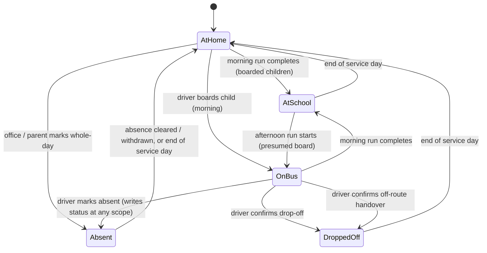

# Status Lifecycle Consistency — Requirements

## Summary

One consistent status lifecycle across students, buses and runs: every event writes a status, nothing is manufactured by a sweep, and the only hand-maintained values left are the office's delay flag and its record of which buses are available. Runs cannot close with unaccounted children, bus state becomes derived rather than a dropdown, and admin, driver and parent views read the same truth through one shared label vocabulary. Delivered in two stages — flow and vocabulary fixes for the pilot, a per-run participation record after.

## Problem Frame

The platform is entering a pilot with a real school. Four defect classes run through the current status handling, and two of them produce statements that are not true.

**The app manufactures safety claims nobody made.** Ending a run sweeps every non-absent child on the roster to a terminal status — `at-school` in the morning, `dropped-off` in the afternoon. A child who never boarded, and whom nobody marked absent, is recorded as safely at school. A child the driver never confirmed off the bus is recorded as dropped off. The driver sees a warning dialog listing unconfirmed children and may proceed regardless; the office and the parent see no trace of that ambiguity. Deleting an in-progress run performs the same bulk assignment through a second path nobody is watching. Separately, the "arrived at school safely" notification fires at gate arrival while the child's card still reads "On the bus" — two surfaces of the same app contradicting each other on a safety assertion.

**State that should be live is hand-maintained.** Bus status is never written by any event. Starting a run does not make a bus active; ending one does not return it to idle. The only writes come from an admin dropdown, so a bus mid-route reads "Idle" until someone remembers otherwise — and the Dashboard's headline fleet tiles count that hand-maintained field. Run status is half-wired: start and end are event-driven, but `delayed` has no detection behind it anywhere.

**The same status means different things in different places.** Three views define three independent label maps with no shared source. The parent app says "At School" where the admin says "At school", "On the bus" where the admin says "On bus", "Absent" where the admin says "Absent today". The driver has no label map at all and renders raw slugs. The admin Dashboard counts the raw status column while the Students page beside it shows the derived one, so the two disagree for stale and unassigned children. The published parent guide has already codified the capitalization inconsistency.

**The office has no run lifecycle in its alert feed.** Nothing tells the office a route has started or ended. Completion is visible only on the Runs page, which nobody is watching during a route. In the morning the school-gate arrival alert happens to double as a finished signal; in the afternoon there is no equivalent, so a route ends and the office learns nothing.

The structural root of the first class is that participation has no record. Boarding exists only in `live_students.status` — a single mutable column with no history — so a run cannot reconstruct who was actually on it. That is why ending a run must sweep, why the run-end path snapshots boarded children into memory before the sweep just to address notifications, and why a read-time staleness derivation exists at all.

## Key Decisions

**Two stages, not one.** The flow and vocabulary fixes ship for the pilot; the per-run participation record follows. The pilot cannot wait for the larger migration, and real pilot data will sharpen what participation needs to capture. Stage 1 is designed so stage 2 replaces its compensations rather than reworking them.

**A run cannot close with unaccounted children.** The operating assumption is that every child boarded onto an afternoon route will be dropped off, and the driver or driver assistant confirms each one. Ending the run is gated on that being true, in both periods. This is what removes the manufactured claims: with the gate in place, no sweep is needed, because every child already has an individually recorded outcome.

**The driver resolves children; the office resolves runs.** Marking absent and confirming an off-route handover are the driver's releases — self-sufficient, no office round-trip. But a driver whose phone dies or whose shift ends cannot release anything, and a run left open locks that bus out of its next route for the day. So the office holds a force-close that records every unaccounted child as unaccounted rather than assigning them an outcome. The gate's guarantee is that no child gets a status nobody observed; "unaccounted" honours that, where a sweep does not.

**A driver can correct their own mistake while the run is open.** The gate makes a mis-tap consequential: a drop-off confirmed on the wrong child sends that family a false assurance, and an absence marked in error both misrecords the child and blocks their real drop-off from ever being confirmed. Reversal is scoped to the driver's own action on the still-open run and always notifies the affected parents. This does not reopen general un-boarding, which stays deferred — the objection there was to silently retracting an assertion, and an explicit correction is its opposite.

**An afternoon non-boarding is an afternoon-scoped absence, and so is a morning one.** Recording either as a whole-day absence falsifies the period the driver did not witness. A whole-day morning mark is worse than a bookkeeping error: it drops the child's afternoon stop, so a forgotten boarding tap costs a child their ride home. Whole-day coverage now requires the driver to say so explicitly.

**Notification and status change together.** The "arrived at school" message moves from gate arrival to run completion so the message and the status transition are one event. The alternative — snapshotting who boarded at gate arrival, then flipping status there and notifying immediately — is smaller than it first appears, since the codebase already snapshots per-run absences and already computes a boarded list before the end-of-run sweep. It is worth planning weighing that against the cost this decision imposes: parents of children who are already safely at school wait on an unrelated child's resolution before they hear anything.

**Bus status stops being stored, but availability does not.** Status becomes a read-time derivation, the same treatment student display status already has, and the dropdown is retired — a field that must be manually maintained to stay true cannot back a fleet metric. Availability is different: whether a bus is in the workshop is not a function of its runs and no derivation can produce it, so it stays an explicit office-set attribute and the retired column's `offline` value moves there rather than disappearing.

**Delay stays a human judgement, recorded once.** No delay detection exists and none is being invented — the office sets delay on the run, where they already have an edit control, and the bus inherits it from its active run. The office knows about traffic and breakdowns before any signal the system could derive would fire. Progress is tracked separately and automatically (R34), so a driver who stops recording arrivals surfaces without anyone judging anything.

### Student status lifecycle after stage 1

Every arrow is an event that writes a status. No arrow is a sweep over children the event did not individually account for. Clearing an absence returns the child to a pre-boarding state — never straight to at school, which would assert an arrival nobody recorded.

## Actors

- A1. **Office / admin** — marks and clears absences, monitors the fleet, records which buses are available, sets run delay, receives run-lifecycle and blocked-closure alerts, and force-closes a run the driver cannot.
- A2. **Driver (and driver assistant)** — starts and ends runs, boards children, confirms drop-offs and off-route handovers, marks children absent, and corrects their own mistakes while the run is open.
- A3. **Parent** — receives notifications, reads their child's live status, cancels rides.
- A4. **System** — derives presentation state from stored events; never invents an outcome for a child no actor accounted for.

## Requirements

### Student status lifecycle

- R1. Every event that changes where a child is writes that child's status individually. No status is assigned by a bulk operation over children the event did not account for. The afternoon presumed board (R7) is the single declared exception.
- R2. Gate arrival on a morning run is not a status-changing event for children.
- R3. The "arrived at school" parent notification fires once per run, at run completion, only for children recorded as having boarded.
- R4. A child is never recorded as being at school without a recorded boarding. Clearing or withdrawing an absence returns the child to a pre-boarding state, never directly to at school.
- R5. A child whose afternoon drop-off was never confirmed is never recorded as dropped off.
- R6. A child's status is scoped to the current service day. With no participation and no absence recorded for today the child reads as at home — including a child whose last recorded state was at school on an earlier day. No scheduled reset runs.
- R7. The afternoon board at run start is a declared presumption, not an observation. A presumed child reads to parents as expected on the bus rather than as confirmed riding, until the driver confirms or corrects.

### Run closure

- R8. A run cannot be completed while any child on its roster is unaccounted for. Accounted for means boarded (morning), drop-off confirmed or off-route handover recorded (afternoon), or marked absent.
- R9. The rule is identical for morning and afternoon runs.
- R10. Marking absent and confirming an off-route handover are the only driver-side releases. No forced end is available to the driver.
- R11. The absent mark is available for any unaccounted roster child at any point in the run, including children whose stop the driver has not recorded arriving at.
- R12. An off-route handover records the child as accounted for, with a driver-supplied note and no absence row. It never asserts the child was not on the bus.
- R13. A driver may reverse their own drop-off confirmation or absence mark while the run is still open. Reversal returns the child to the blocking set and sends the affected parents a correction.
- R14. The driver sees which children are blocking closure, by name, both while the run is in progress and when closure is refused.
- R15. Attempting to close a blocked run produces an explanation naming the blocking children, not a generic failure.
- R16. A refused closure raises an admin alert naming the run and the blocking children, distinct from the no-progress flag.
- R17. The office can force-close a run. A force-close records every unaccounted child explicitly as unaccounted; it assigns no terminal status and asserts no outcome.
- R18. A force-close sends the "arrived at school" notification only to parents of children recorded as boarded, and only when the bus's arrival at the school gate was itself recorded. Absent that record, no arrival notification is sent to anyone.
- R19. A force-close sends no automated notification to the parents of an unaccounted child. It raises an office obligation to contact those parents directly, naming each child, and the office records that the contact was made.
- R20. No run remains in progress across a service-day boundary.
- R21. Deleting a non-completed run assigns no child a terminal status; roster children return to the state they held before the run started. Deletion is a recovery path for a mistakenly started run, not a route around the gate.

### Absence scoping

- R22. A driver absence mark on an afternoon run records an afternoon-scoped absence.
- R23. A driver-sourced period-scoped absence writes the child's status despite its partial scope, and the child displays as at home rather than on the bus. Clearing or withdrawing it resets the status exactly as a whole-day clear does.
- R24. A driver absence mark on a morning run records a morning-scoped absence by default. Whole-day coverage applies only when the driver explicitly confirms the child is out for the day.
- R25. A morning-scoped absence never removes the child's afternoon stop.
- R26. When an absence already exists for that child and day, a new mark widens coverage to the union of the existing and new scopes and never narrows it. The row records which period was individually marked, and by whom, alongside its coverage.
- R27. Precedence across actors is office, then parent, then driver. A record established by a higher-precedence actor is not re-attributed by a later mark from a lower one, though coverage still widens per R24.
- R28. Parent-facing absence wording states the period the absence covers and does not assert facts outside it.
- R29. The run report and the admin absence list distinguish an afternoon non-boarding from a morning no-show, by the period individually marked rather than by the row's coverage scope.

### Bus and run status

- R30. Bus status is derived at read time from the bus's current run. The stored bus status column and its admin dropdown are retired.
- R31. Bus availability — in service or out of service — remains an explicitly office-set attribute, separate from the derived status and overriding it on every fleet surface. The retired column's out-of-service value moves here rather than disappearing.
- R32. Derived bus status distinguishes at minimum: on an active run, not on a run, and delayed — the last inherited from its active run.
- R33. Run status remains stored. In progress and completed are event-written. Delayed is set by the office and is the only manually maintained status value in the system.
- R34. A run is flagged as making no progress when more than 15 minutes elapse between consecutive stop arrivals. The flag applies only while stops remain unarrived and is suppressed once every stop has been recorded, so the pre-closure resolution window never trips it. It clears on the next arrival and is distinct from the office-set delay.
- R35. Admin metrics count derived state, for children as well as for buses and runs. The office-set run delay and the office-set availability flag are the only manual values any metric may count.
- R36. A child, a bus and a run are never described by conflicting state on two admin surfaces at the same moment. Counts and the lists they summarise read the same derived value.

### Shared vocabulary and labels

- R37. One shared label vocabulary exists per status domain — student, bus, run. No view defines its own label map.
- R38. No view renders a raw status slug to any user, in any role.
- R39. Status labels and notification labels within a role's surfaces follow one casing convention.
- R40. The driver receives the same derived student status the admin and parent receive.
- R41. Every view has a defined label for every status value it can receive, including values it rarely sees.
- R42. The user manual's status vocabulary matches the shipped labels for all three roles.

### Admin run-lifecycle alerts

- R43. Run completion raises an admin alert naming the bus, route and period, for both morning and afternoon runs.
- R44. Run start raises an admin alert on the same terms.
- R45. Run-lifecycle alerts are distinguishable from stop-arrival alerts.
- R46. Run start, run completion, refused closure and force-close alerts are office-only. They never appear in the parent alerts feed and never fan out as parent push notifications.
- R47. Every alert type the admin feed can display has a label; none render as a raw type string.

### Stage 2 — per-run participation record

- R48. Each run records per-child participation: whether the child boarded and when, and whether their drop-off was confirmed and when.
- R49. Student status becomes a derived presentation of participation and absence rather than an independently mutable value.
- R50. Run reports report recorded participation rather than a tally recounted from current status.
- R51. Read-time staleness compensation is retired once participation is authoritative.
- R52. The closure gate (R8) evaluates recorded participation directly.

## Key Flows

- F1. **Morning run, normal.** **Trigger:** driver starts a morning route. Stale absences on the roster heal. Driver boards each child at their stop; each boarding notifies that child's parents. Children who do not appear are marked absent, which notifies their parents and raises an office alert. At the school gate the bus position updates and the office is alerted to the arrival; child statuses do not change. The driver ends the run: closure is checked, boarded children move to at school, their parents are notified of safe arrival, and the office is alerted that the run completed.

- F2. **Afternoon run, normal.** **Trigger:** driver starts an afternoon route. Every roster child not covered by an absence is presumed aboard and parents are notified the run is under way; those children read as expected on the bus rather than confirmed riding. At each stop the driver confirms the drop-off, notifying that child's parents at tap time. The driver ends the run: closure is checked, and the office is alerted that the run completed.

- F3. **Afternoon non-boarding.** **Trigger:** a child presumed aboard at run start was never actually on the bus. The driver marks them absent. An afternoon-scoped absence is recorded, the child displays as at home, their parents are told the child was not on the bus home, the office is alerted, and the child no longer blocks closure. That morning's attendance record is untouched.

- F4. **Blocked closure.** **Trigger:** the driver attempts to end a run with children unaccounted for. Closure is refused, the blocking children are named, and the office is alerted. The driver resolves each one — confirming the drop-off, recording an off-route handover, or marking them absent — and closure then succeeds. No run state changes on a refused attempt.

- F5. **Driver correction.** **Trigger:** the driver realises they confirmed or marked the wrong child. While the run is still open they reverse their own action. The child returns to the blocking set, the affected parents receive a correction, and the driver records the correct outcome.

- F6. **Office force-close.** **Trigger:** a run is still open with no driver able to act — phone dead, shift ended, run about to cross the service-day boundary. The office force-closes it. Every unaccounted child is recorded as unaccounted rather than given an outcome, the run completes, and the bus is free for its next route.

- F7. **Fleet state read.** **Trigger:** the office opens the Dashboard, Buses page or Fleet Map. Each bus's state is derived from its current run at read time, with the office-set availability flag overriding it. All three surfaces show the same state for the same bus, and the tiles count what the lists show.

- F8. **Stalled run.** **Trigger:** a driver stops recording stop arrivals mid-route with stops still unarrived. Once the gap passes the threshold the run is flagged as making no progress and the office sees it. The driver records the next arrival and the flag clears on its own. Nothing about the run's status or any child's status changes as a result of the flag.

## Acceptance Examples

- AE1. **Covers R4, R8, R15.** A morning roster has eight children. Seven board; the eighth does not appear and the driver does not mark them absent. Ending the run is refused and names the eighth child. The seven boarded children remain on the bus, the run remains in progress, and no parent receives an arrival notification.

- AE2. **Covers R2, R3.** A morning bus reaches the school gate. The office is alerted to the arrival. No child's status changes and no parent receives an arrival notification. The driver ends the run: boarded children move to at school and their parents are notified at that moment.

- AE3. **Covers R3, R4.** In the run from AE1, the driver marks the eighth child absent and ends the run. Seven parents receive the arrival notification; the eighth receives an absence notification and never receives an arrival notification.

- AE4. **Covers R11.** In the run from AE1, the driver never recorded arriving at the eighth child's stop. The absent mark is still available for that child, and using it releases the closure gate.

- AE5. **Covers R5, R8.** An afternoon roster has six children, five with confirmed drop-offs. Ending the run is refused and names the sixth. No child is recorded as dropped off by the attempt.

- AE6. **Covers R13.** A driver confirms the drop-off of the wrong child, then reverses it before ending the run. That child's parents receive a correction, the child returns to the blocking set, and the run cannot close until their real outcome is recorded.

- AE7. **Covers R12.** A road closure means a child is handed to their guardian away from their stop. The driver records an off-route handover with a note. The child counts as accounted for, closure succeeds, and no absence is recorded and no parent is told the child was not on the bus.

- AE8. **Covers R17, R19, R20.** A driver's phone dies mid-afternoon and the run is never ended. The office force-closes it. The children with confirmed drop-offs keep that outcome and their parents were already notified at tap time; the rest are recorded as unaccounted, not as dropped off, and none of their parents receives an automated message. The office is given those children by name to contact, and records having done so. The bus is free to start its next route.

- AE9. **Covers R18.** A morning run is force-closed after the bus's arrival at the school gate was recorded. Parents of children the driver confirmed aboard receive the arrival notification; nobody else does. In a second run force-closed before any gate arrival was recorded, no arrival notification is sent at all.

- AE10. **Covers R46.** A run starts and later completes. Both raise office alerts. No parent's app shows either one, and no parent receives a push for them.

- AE11. **Covers R7.** An afternoon run starts and a child on the roster is collected from school by their parent instead. Until the driver acts, that child reads to their parents as expected on the bus, not as confirmed riding — the app never states the child is aboard on the strength of the run starting.

- AE12. **Covers R16.** A driver's attempt to end a run is refused. The office sees an alert naming the run and the blocking children, before any parent notices a missing arrival message.

- AE13. **Covers R22, R23, R28, R29.** A child rides the morning bus, reaches school, and is collected by a parent that afternoon. The driver marks them absent on the afternoon run. An afternoon-scoped absence is recorded and the child displays as at home, not on the bus. Their parents are told the child was not on the bus home — not that they were absent from school. The morning run's record still shows them as having ridden, and the run report shows the mark as an afternoon non-boarding.

- AE14. **Covers R24, R25.** A driver misses one boarding tap on a morning run and marks that child absent to release the gate, without confirming the child is out for the day. A morning-scoped absence is recorded. The child's afternoon stop is still on that afternoon's route.

- AE15. **Covers R26, R27.** A parent has cancelled only the morning ride. The driver marks the same child absent on the afternoon run. Coverage widens to the whole day, the row still records that the afternoon was the period the driver marked, and the parent's cancellation is not re-attributed to the driver.

- AE16. **Covers R4.** A child is marked absent in error and the office clears it. The child does not become recorded as at school; reaching at school still requires a recorded boarding.

- AE17. **Covers R35, R36.** A child is on a route with no assignment, and another is carrying a stale on-bus value with no run today. The Dashboard's children-on-bus tile counts neither, matching what the Students page shows for both — the two surfaces agree.

- AE18. **Covers R30, R35, R36.** A bus is mid-route on an in-progress run. The Dashboard's active-bus count includes it, the Buses page shows it as on a run, and the Fleet Map agrees — with no admin having set anything.

- AE19. **Covers R31.** A bus is in the workshop with no run scheduled. Every admin surface shows it as out of service, distinguishable from a bus that simply has no run today, and the office set that explicitly.

- AE20. **Covers R32, R33.** The office marks a run delayed. Its bus reads as delayed on every admin surface. The run ends; the bus reads as not on a run, without anyone clearing the delay by hand.

- AE21. **Covers R34.** A driver records a stop arrival with stops still remaining, then records nothing for twenty minutes. The run is flagged as making no progress. The driver records the next arrival and the flag clears. The run's status stayed in progress throughout and no child's status changed.

- AE22. **Covers R34.** A driver records the final stop arrival and then spends twenty minutes resolving blocking children before closure. The run is not flagged as making no progress.

- AE23. **Covers R37, R38, R40.** The same child in the same state is opened in the admin students list, the driver's board screen and the parent app. All three show the same wording. None shows a hyphenated identifier.

- AE24. **Covers R43, R45.** An afternoon run completes. An admin alert states that the route has ended, naming bus, route and period, and is distinguishable from the alert raised on arriving at the last stop.

- AE25. **Covers R6.** A child is dropped off on Friday afternoon and another is left at school by a morning run with no afternoon route. On Monday morning, before any run starts, both read as at home in the admin list and the parent app — with no overnight job having run.

- AE26. **Covers R21.** An admin deletes a run started by mistake while children are aboard. No child is recorded as at school or dropped off; each returns to the state they held before the run started.

## Scope Boundaries

**Deferred for later**

- Collapsing the derived bus state and the existing position-derived state into a single vocabulary. Deriving bus status (R30) leaves both in place, so the Fleet Map and Buses page may still describe a bus along different dimensions.
- Automatic delay detection. Delay stays an office judgement (R33); deriving it from scheduled stop times waits until route schedules are trustworthy enough to measure against.
- General un-boarding for drivers, outside the same-run correction in R13. R13 covers a driver reversing their own action on a still-open run with an explicit parent correction; retracting an assertion after the run has closed remains excluded.

**Not in scope**

- Redesigning the parent notification taxonomy. Notification types are reviewed only where they contradict a status, lack a label, or are required by a new outcome this document introduces.
- Route, school, and driver-account status vocabularies.
- Attendance reporting beyond what the run report and absence list already provide.

## Dependencies / Assumptions

- Every child boarded onto an afternoon route is dropped off by that route, and the driver or driver assistant confirms each drop-off. This is the school's stated operating rule and the closure gate depends on it.
- Drivers can and will mark a child absent when the child is not present. This is the primary driver-side release for the closure gate; R11 removes the current condition that hides the action for unreached stops, and R17 covers the case where no driver is available to act at all.
- Afternoon runs continue to board the whole roster at start, so an afternoon absence mark is a correction of a declared presumption rather than a record of a child who was never expected.
- Absence scoping by period already exists and is load-bearing for R22, R24 and R26.
- **There is no GPS.** A bus's position is the coordinates of the stop the driver last recorded arriving at, so the only signal of movement is the driver tapping through stops. R34 is a progress check on those taps, not a device-connectivity check, and no requirement here assumes live location data.
- Route stop schedules are free-text and not currently validated, which is why R34 uses a fixed threshold rather than measuring against the scheduled interval.
- Stage 1 requires four schema changes, all landing together: widening the alert type constraint for run-lifecycle and blocked-closure alerts; retiring the stored bus status and adding the availability attribute; persisting an arrival timestamp per stop, since stop records carry only an order today and nothing timestamps a non-gate arrival; and adding a period column to the run-absence snapshot so R29's distinction reaches the run report.
- R13's reversal requires relaxing the guard that currently refuses to clear a today-dated absence while a covered run is active, scoped to driver-sourced marks on the same open run.
- A run left in progress becomes invisible to the driver's own actions once the service day rolls over, which is why R20 bounds run lifetime rather than relying on the driver.
- Stage 2 assumes stage 1's closure gate is in place, so that participation is complete for every closed run from the moment it is recorded.

## Outstanding Questions

**Deferred to planning**

- Whether the shared label vocabulary lives in one module per domain or one module for all three.
- Whether run-lifecycle alerts reuse the existing alert feed or warrant their own channel, given they are informational rather than exceptional.
- Whether the closure gate is enforced only at the closure request or also surfaced continuously as the driver progresses through stops.
- Whether the no-progress flag (R34) raises an admin alert or only shows as a state on the fleet surfaces.

## Sources / Research

Code locations that establish the current behaviour and constrain the proposal:

- `backend/db/migrations/004_live_model.sql` — the stored status vocabularies for students, buses and runs, the alert type constraint with no run-lifecycle value, and the stop table that carries no arrival timestamp.
- `backend/db/migrations/006_absence_and_run_uniqueness.sql` — the one-absence-row-per-child-per-day constraint and the partial unique index that blocks a second run for a bus while one is open.
- `backend/db/migrations/007_spec_refinement.sql` — the run-absence snapshot table read by the run report, which carries no period column.
- `backend/db/migrations/008_ops_refinement.sql` — the decision that partial absence scopes gate rosters but never write the displayed status.
- `backend/app/dao/status_sql.py` — the read-time staleness derivation, its day-scope-only absent branch, and the absence of any decay branch for at-school.
- `backend/app/dao/absence_dao.py` — the clear-absence guard that refuses while a covered run is active, and the day-scope-only status reset.
- `backend/app/dao/run_dao.py` — run start, gate arrival, boarding, drop-off, driver absence marking, the end-of-run sweep, the run-deletion sweep, and the date-scoped active-run lookup.
- `backend/app/dao/fleet_dao.py` — bus status writes (admin CRUD only) and the parallel position-derived state.
- `backend/app/dao/parent_live_dao.py` — the parent alerts query that reads the shared alert store with no type filter.
- `backend/app/services/push_service.py` — the notification catalogue, the wording that asserts arrival and absence, and the gate-arrival carve-out.
- `backend/app/api/runs_live.py` — which notification fires from which driver action.
- `frontend/src/features/driver/DriverBoardingPage.tsx` — the condition that hides the absent action for unreached stops, and the raw-slug status badges.
- `frontend/src/features/admin/StudentsPage.tsx`, `frontend/src/features/parent/ParentHomePage.tsx`, `frontend/src/features/admin/DashboardPage.tsx`, `frontend/src/features/admin/BusesPage.tsx`, `frontend/src/features/admin/AlertsPage.tsx` — the independent label maps, the unmapped alert type, and the tile that counts the raw status column.
- `docs/user-manual/parent-guide.md`, `docs/user-manual/driver-guide.md`, `docs/user-manual/admin-guide.md` — the published vocabulary that must move with the labels, including the out-of-service badge.
