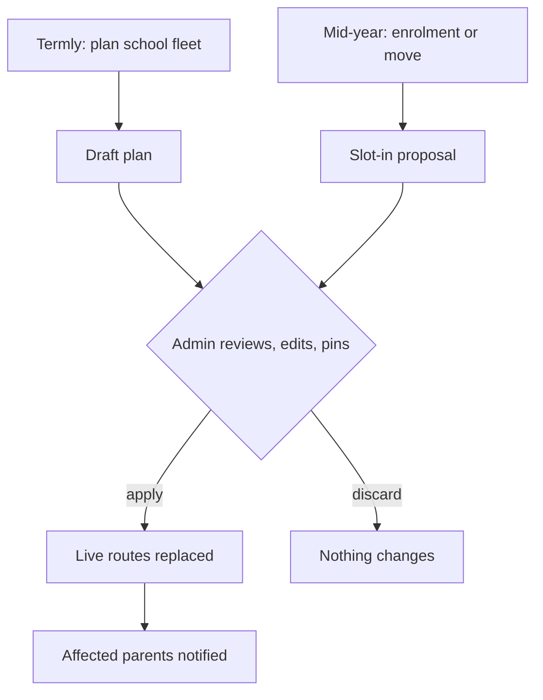

# Fleet Route Planning — Requirements

## Summary

Route planning inverts to students-first. The system drafts a complete fleet plan for a school — who rides which bus, stop order, depot-aware timing, mirrored morning/afternoon pairs — and the admin reviews, edits, and applies it as one act. Mid-year changes arrive as one-line slot-in proposals; a full re-plan happens only on explicit request; plans change between days, never during a run.

---

## Problem Frame

Creating routes today takes one of two flows, and both leak manual work and errors.

The route-first flow builds a route, assigns a bus and a type, then hand-assigns students. Nothing tells the admin which student belongs on which route — the route's shape depends on who is assigned, and who should be assigned depends on the route's shape. Stops regenerate from assigned students ordered by pickup time, not by road efficiency.

The planner-first flow uploads a CSV of addresses and computes an optimised route. The rows enter as free text with no student identity, so saved stops are born unlinked; geocoding replaces familiar address names with strings the admin cannot match back to the Students page. The flow takes two passes and still ends in hand-assignment.

Under both, the depot is set per bus on the Fleet Map but shapes only geometry and ETAs — never the stop order — and is silently ignored when unset. The gap beneath everything: deciding who rides which bus is entirely manual, and every downstream pain follows from it.

---

## Key Decisions

- **Students are the source; routes are derived.** Planning consumes enrolled students, whose homes are already geocoded at enrolment. Free-text addresses never enter the primary path, so stop-to-student identity exists from birth rather than being reconstructed.
- **Draft → review → apply.** The optimiser's output is a draft. Nothing touches live routes until the admin applies it as one explicit act. This makes "system proposes, admin approves" structural rather than habitual.
- **Objective hierarchy.** Hard constraints: the given fleet, bus capacity, the per-route stop cap, arrival by school start. Primary objective: the worst child's ride time. Then total ride time across all children, then total driving. The fleet is fixed, so planning partitions within what exists — it never assumes another bus.
- **Stability beats optimality mid-year.** Enrolments and moves slot into existing routes with minimal disruption. A full re-optimisation happens only when the admin asks for one.
- **Mirrored AM/PM pairs per bus.** Morning and afternoon are planned as one pair — same children, reversed direction — with per-child exceptions: a one-way rider travels only one leg, and a split rider uses different buses for the morning and afternoon legs.
- **Door-to-door, with multi-child stops first-class.** Every child is picked up at home. A stop can serve several children, so shared pickup points can arrive later without a rebuild.
- **Planning is per school.** A plan covers one school's students and that school's buses; a bus never serves two schools within a plan.
- **Enrolment is the front door.** The bulk student upload replaces the planner's address CSV: rows are students, so identity exists before planning ever runs. Confidently geocoded homes are plannable immediately; ambiguous or failed ones leave that student unplaceable until an admin resolves the pin on a map. The import's existing route-name column is retired as an assignment path: rows carrying one still import as students, and the route assignment is ignored and surfaced as informational (R17).

---

## Actors

- A1. Transport admin — starts plans, reviews drafts, edits, applies; owns exceptions.
- A2. Planner (system) — drafts fleet plans, proposes slot-ins, computes per-child ride times.
- A3. Parents — are told when a change materially moves their child's stop, or leaves them without a route.
- A4. Drivers — consume the resulting routes; no new driver-facing behaviour.

---

## Key Flows

- F1. Termly plan
  - **Trigger:** Admin starts a plan for a school.
  - **Steps:** Confirm the fleet (buses, capacities, depots) → system drafts routes: partition across buses, stop order, times, mirrored pairs → admin edits the draft → applies.
  - **Outcome:** The school's routes are replaced in one act; affected parents are notified.
- F2. Mid-year slot-in
  - **Trigger:** A student enrols or changes address.
  - **Steps:** System proposes a placement in an existing route, stated with its effect ("Bus 2, between stop 3 and 4, +4 minutes for two children") → admin accepts or adjusts.
  - **Outcome:** One route gains a stop; only affected families hear about it.
- F3. Road event
  - **Trigger:** A closure or temporary obstacle.
  - **Steps:** Admin reorders or removes stops on the live route; the manual order stays frozen until released or re-planned.
  - **Outcome:** Affected families are notified (R15); a child whose stop is removed is explicitly unserved and stays flagged until restored.
- F4. Full re-plan
  - **Trigger:** Explicit admin request (typically at term boundaries).
  - **Steps:** New draft against current enrolment → same review and apply as F1.
- F5. Bulk enrolment
  - **Trigger:** The school provides its student list.
  - **Steps:** Admin uploads rows (identity, parent contacts, home address) → each row is geocode-triaged → confident rows become plannable students at once → flagged rows are fixed by placing the student's pin on a map.
  - **Outcome:** Planning can run against the whole intake; flagged students stay visibly unplaceable until fixed.

---

## Requirements

**Planning and optimisation**

- R1. The system drafts a complete fleet plan for a school from its enrolled students' home locations and its buses; no address entry or file upload sits in the primary path.
- R2. Every stop in a draft is linked to the students it serves, and a stop may serve several students.
- R3. Depots shape the plan: a morning route begins at its bus's depot, an afternoon route ends there, and stop order accounts for both.
- R4. The plan respects hard constraints: the given fleet, each bus's capacity, each route's stop cap, and arrival at school by its start time.
- R5. The optimiser minimises the worst child's ride time first, total ride time across all children second, and total driving third — so no child pays for the route with an outsized ride, and children below the worst ride stay protected once one outlier fixes it.
- R6. Morning and afternoon are planned as mirrored pairs per bus, with per-child exceptions for one-way riders (one leg only) and split riders (a different bus per leg).
- R7. A student who cannot be placed within the constraints — seats or stop cap — is surfaced as unplaceable with the binding constraint named, rather than silently overloading a bus or a route.
- R20. Each child's ridership pattern — both ways, one-way, or split — is an input to planning, seeded from current route membership and editable during review; a student with no current membership — a bulk-imported intake or a previously unassigned student — defaults to riding both ways, with exceptions set during review. Drafts and slot-ins honour the pattern.

**Review and apply**

- R8. A draft never alters live routes; applying it is one explicit act that replaces the school's routes. Every apply is audit-logged — acting admin, timestamp, affected school — for the same reason R19 logs the aggregate map: one act touching every enrolled child is a higher-value target than any single record.
- R9. During review the admin can move a child between buses, reorder stops, pin a child to a bus or a stop order, and adjust a child's ridership pattern (R20); the draft recomputes its times after each edit, and an edit that would violate a hard constraint is blocked with the violated constraint named.
- R10. Each drafted route shows every child's ride time, each bus's capacity use, and the plan's total driving, so review is judged on what the optimiser optimises.
- R11. Applying a plan never alters a run already in progress.
- R21. Applying a plan preserves the plan it replaced, and the admin can restore that previous plan in one explicit act, taking effect from the next run. A restore passes the same gates as applying a draft, re-validated against current enrolment and fleet: it surfaces every enrolment, address change, and accepted slot-in made since that plan was last live (R22), and requires by-name acknowledgment of any student the restored plan leaves without a route (R23). Restores are audit-logged like applies (R8).
- R22. Applying surfaces any enrolment, address change, or accepted slot-in made since the draft was generated, and requires explicit confirmation before overwriting or excluding them; applying never silently drops them.
- R23. Applying a draft that still lists unplaceable students requires the admin to acknowledge each of them by name; Apply is never silent about a child left without a route.
- R24. When live routes exist, draft review shows the changes against them: each child changing bus, each stop time moving five minutes or more (R15's threshold), each child newly unplaceable, and the count of families the apply would notify — so disruption is judged before applying, not discovered after.

**Mid-year changes**

- R12. When a student enrols or changes address, the system proposes a slot-in to an existing route with minimal disruption, stated with its position and its effect on other children's times.
- R13. A full re-optimisation happens only on explicit admin request.

**Editing and exceptions**

- R14. A manually arranged stop order stays frozen until the admin releases it or applies a new plan. A manual edit to a live route is held to the same hard constraints as review: an edit that would violate capacity or the stop cap is blocked with the violated constraint named (R9).

**Communication**

- R15. Any change to a live route — an applied plan or a manual edit — that changes a child's stop place, moves their stop time by five minutes or more from the time last communicated to that family, or leaves them unplaceable notifies that child's parents. Measuring against the last-communicated time stops successive small changes from accumulating silent drift; movement below the threshold does not notify, so the signal stays trustworthy.

**Getting students in**

- R16. Bulk student upload is the primary entry for a school's enrolment; a row carries identity, parent contacts, and a home address.
- R17. Route membership and pickup times are outputs of planning, never import inputs.
- R18. A confidently geocoded address is plannable immediately; an ambiguous or failed one leaves the student unplaceable until resolved. An ambiguous pin is confirmed with one action against the system's proposed location; a failed one is placed by hand. Either way the fix is made against the student's name on a map, never a text string.
- R19. Imported pins are viewable together on one map, so a geocode that landed in the wrong place is caught by eye; access to this aggregate view is audit-logged, because one screen showing every child's home is a higher-value target than any single record.

---

## Acceptance Examples

- AE1. **Covers R1, R4, R5, R6.** A school with two buses and thirty students requests a plan. The draft shows two mirrored AM/PM pairs, neither bus over capacity, every child at school before start time, and each child's ride time listed.
- AE2. **Covers R12, R15.** A student enrols in March. The system proposes "Bus 2, between stop 3 and 4, +4 minutes for two children." The admin accepts. Only the families of the new child and the two delayed children are notified.
- AE3. **Covers R6.** A child rides mornings only. The morning route carries their stop; the afternoon roster excludes them; the pair stays mirrored for everyone else.
- AE4. **Covers R3.** Two stop orders are equal from first pickup to the gate. The draft picks the one whose first pickup is nearer the bus's depot.
- AE5. **Covers R8, R11.** The admin applies a new plan while a morning run is active. The active run is untouched; the new routes take effect from the next run.
- AE6. **Covers R7.** A thirty-first student cannot fit within two fifteen-seat buses. The draft lists them as unplaceable with the binding constraint named, and no bus exceeds capacity.
- AE7. **Covers R13, R14.** An admin reorders stops around a road closure, and a student enrols the same week. The slot-in proposal respects the frozen order; nothing re-optimises until the admin asks.
- AE8. **Covers R7, R16, R18, R19.** An upload of thirty rows triages as twenty-seven confident, two ambiguous, one failed. Twenty-seven students are plannable at once; the other three appear as unplaceable in any draft — the two ambiguous pins confirmed in one action each, the failed one placed by hand on the map.

---

## Scope Boundaries

- Shared pickup points — deferred. Multi-child stops (R2) keep the door open without a rebuild.
- Continuous auto-assignment with no approval step — rejected; it contradicts the draft/apply contract and stable pickup times.
- Buses shared across schools within one plan — out; planning is per school.
- Mid-run rerouting — out; plans change between days, never during a run.
- Absence handling — untouched on purpose. Absent children already drop off a run's roster automatically, so absences never trigger route changes.
- Driver surface — unchanged; drivers receive the resulting routes as today.
- Multi-trip chains — out of drafting scope. A plan schedules one AM/PM pair per bus; a plan for a bus that currently runs multiple trips per period says so instead of silently flattening it.
- The bulk import's route-name column as an assignment path — retired; route membership is a planning output (R17).

---

## Dependencies / Assumptions

- Depot locations are set per bus via the existing Fleet Map editor; a plan for a bus with no depot proceeds but says so rather than silently ignoring it.
- Student home geocoding at enrolment is the sole source of location and identity for planning. The bulk import and its geocode triage (confident / ambiguous / failed) already exist server-side; this work re-points and surfaces them rather than building import anew.
- The shipped single-route optimiser and its cap of 24 stops per route remain as routing infrastructure; partitioning students across buses is the new layer on top. The planning layer owns the plan-level objectives: the per-child promise is enforced chiefly through partitioning — who shares a bus — and the planning layer may evaluate alternative stop orderings against R5 rather than treating the optimiser's single answer as authoritative. Door-to-door, the cap bounds a route at roughly two dozen children.
- Buses are school-agnostic today — the data model holds no bus-to-school association — so the fleet-confirmation step in F1 must establish which buses serve the school (mechanism decided at planning), and a bus claimed by one school's applied plan is unavailable to another school's plan for overlapping periods.
- Scale target: one school at a time; the pilot fleet is two buses, and the design should stay comfortable through low tens of buses and a few hundred students per school.

---

## Outstanding Questions

**Deferred to planning**

- What becomes of the CSV upload — retired, or kept as a niche "plan from file" for prospective students not yet enrolled. Not load-bearing either way.
- Which existing notification channel carries the stop-change notice (R15), and its exact wording.
- How a slot-in proposal ages: does it wait indefinitely for the admin, or expire with the enrolment still unassigned and visible.
- Whether the review surface lives inside the existing Fleet Map planner or as its own page.

**From the 2026-07-30 document review**

- Should automated slot-in proposals (R12) move to a later phase, with mid-year placements made manually through the review surface (R9) until then? Two reviewers judged the proposal engine the most complex piece and the least needed at 2-bus scale — but deferring it revises scope confirmed during the brainstorm, so it is a product call, not a review edit.
- When an admin leaves a draft mid-review — navigation, interruption — does the draft persist and resume, or discard? Determines whether drafts need persistence and how the review surface communicates unsaved state.
- **Releasing a frozen stop order has no defined effect** — Editing and exceptions / R14 (P1, design-lens, confidence 75)

  Implementers won't know whether releasing a frozen order triggers an immediate re-ordering of the route or simply clears the freeze with no visible change until the next re-plan. An immediate reflow acts like the ad-hoc re-optimisation R13 reserves for explicit admin request; a no-visible-effect release risks confusing admins who expect the action to do something.
- **Map-only pin placement and drag-reorder have no accessible alternative** — Requirements R9, R18 (P2, design-lens, confidence 75)

  The document commits to map-click pin placement and drag-style stop reordering as the only interaction paths, and R18 forecloses a text-entry fallback. Without a stated keyboard or non-pointer alternative, an admin who can't use a mouse has no defined path to resolve a flagged geocode or reorder stops during review.
- **Multi-trip bus warning names no mechanism or blocking behaviour** — Scope Boundaries (P2, design-lens, confidence 75)

  The boundary rules out one bad outcome — silently flattening the bus's schedule — without saying what happens instead: the bus excluded from the plan, the admin blocked until it's resolved, or a dismissible warning. An implementer hitting a multi-trip bus during F1's fleet confirmation has no defined behaviour to build against.
