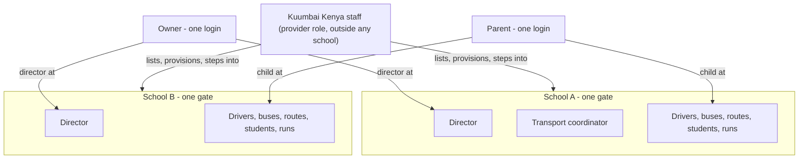

# Multi-Tenant Schools — Requirements

## Summary

Each customer school becomes its own walled space on the one SafeRide deployment, with two staff roles — director and transport coordinator — and a school switcher for people who hold a role at more than one school. Kuumbai Kenya gets a provider role that lists every school, sets new ones up with their first director, and can step into any school with full powers. Msingi Bora's live data becomes school #1.

---

## Problem Frame

SafeRide is in a live pilot with Msingi Bora. The school's owner runs a second school that is expected to pilot next, and unrelated schools will be approached after that. Today the platform has one unscoped admin role: any admin account sees every record in the database, so a second school cannot be onboarded onto the shared deployment without seeing the first school's students, drivers and runs.

Inside the pilot, the director and the transport coordinator share one login. There is no record of which of them did what, and the only way to remove someone's access is to change the director's password. Each school coming on board expects at least two levels of access.

Kuumbai Kenya, as the provider, has no way to see across schools from the app: onboarding a school or fixing its data today means SQL against production.

The original Lovable/Supabase version of the product was school-scoped — one school per admin profile, enforced on every table. That isolation was lost in the migration to the current stack and was flagged as the top security regression in the migration gap analysis.

---

## Key Decisions

- **The existing school record is the tenant, with one gate.** A school already carries the gate location and bell times the planner works from; every bus, driver, route, student, run, fleet plan, alert, absence and notification now belongs to exactly one school. Today's Schools page becomes the school's own settings. This supersedes the per-plan bus claim the fleet planner introduced: a bus is created inside a school and never released to another, fleet confirmation offers only that school's buses, and the "claimed by another school" path and release-on-deselect behaviour are removed. *Why:* it extends what exists instead of introducing a parallel "tenant" concept, and the pilot schools are single-site. Multi-campus waits for a customer who needs it. A tenant layer above schools (the 2026-08-22 architecture proposal) was weighed and not adopted: the owner's schools do not share a fleet, and per-school memberships already give one login across both.

- **One identity, a role per school, one active school at a time.** A person has one login and may hold a role at several schools; the console always works inside one active school, chosen from a switcher that appears only for people with more than one. *Why:* the owner of Msingi Bora also owns the second school and wants one login, and the same mechanism gives the provider its way into any school. A merged cross-school view was rejected as more work on every screen for little pilot value.

- **Two staff roles: director and transport coordinator.** The director holds every power inside the school, including staff accounts. The coordinator sees everything and can add and edit, but cannot delete routes, alerts, drivers, buses, students or completed runs, and cannot manage staff accounts. Operational removals — clearing an absence, taking a student off a route, force-closing a stale run, deleting a run that is still open because a driver started the wrong one, applying or restoring a fleet plan — count as edits and stay with the coordinator. No one deletes a school in this version. *Why:* this is the split the pilot school asked for; the deletes are the actions that cannot be undone (an open run has recorded nothing about any child yet), and the edits are the coordinator's daily job.

- **Every staff action is attributed.** Each create, change or removal inside a school is recorded with the acting person and the school, extending the admin audit the fleet planner already writes for plan apply/restore and pin-map views; the screens that show a result name who did it. *Why:* separate logins make attribution possible, but only a recorded actor answers "who did what" — the pilot's stated pain.

- **The provider steps in; it never bypasses.** Kuumbai staff hold a provider role that exists outside any school. It lists all schools with basic health, creates a school and its first director, and enters any school with director powers — scoped exactly like a director once inside. There is no "see everything" mode. A step-in names a reason, shows a persistent support banner inside the school with an explicit exit, and is always the provider's own identity — never a customer's. Provider accounts carry a second sign-in factor — enrolled once at account creation, with a second provider able to reset a locked-out peer — because one compromised provider password would reach every school. The school list is the provider's home surface and stays reachable from inside any school. *Why:* a provider override that switches scoping off is the classic cross-tenant leak shape; stepping in reuses the switcher and gives the server one rule for every request.

- **Provider actions are logged provider-side only.** Every step-in and every action Kuumbai takes inside a school lands in the same audit as staff actions, flagged as provider-originated; the staff member's identity is readable only by the provider, and school screens that must name an actor show a neutral "SafeRide" label. *Why:* the provider keeps its support activity on its side; the school still sees the effect of the action, never a Kuumbai name — and one audit means the school-facing label and the provider-side identity are two views of one record.

- **Parents follow their children; drivers belong to a school.** A parent is one account across the platform and sees every child linked to it, even when the children are at different schools. A link to a child at a school where the parent has no child yet waits for the parent to accept it — at self-signup too, when the email matches students at more than one school; within a school the parent already belongs to, or when a sign-up matches exactly one school, matching stays automatic. A pending link shows only the school's name and can be declined as not my child, which clears it and tells the school. A school sees and manages a shared parent only through its own students. A driver belongs to the school whose staff created them, so driver self-signup is removed; parent self-signup stays. *Why:* siblings at the owner's two schools are a real case, a mistyped email must not hand a child to an unrelated adult at another customer, and a self-signed driver would belong to no school.

- **Staff accounts are created by the director with a temporary password.** The director adds a coordinator (or a second director) by entering their email and a temporary password, the same way drivers are created today; an email that already has an account is offered the role, which takes effect when its holder accepts it at their next sign-in, with the password untouched. A temporary password must be replaced on first sign-in, any staff member can change their own password from the console, and a director (or the provider stepped in) can issue a locked-out staff member a fresh temporary password. Every school keeps at least one director; removing someone's role ends their access at once. *Why:* it mirrors an existing flow, and without a forced change the director would keep a working credential into every account they created — the shared login one level down.

- **Isolation is enforced on the server for every request.** Every school-scoped request names the school it acts on; the server refuses it unless the person's access key reaches that school — a staff role, a driver's membership, or a parent's accepted child links — or the provider is stepping in, never acts on a school other than the one named, and never trusts the name without checking the key. The server may also remember a person's active school, but the request still names its school and a mismatch is refused. *Why:* hidden buttons are not a permission system; a request that names its school also keeps a stale browser tab acting on the school it displays rather than on whichever school was switched to last.

- **Isolation is layered, with a database backstop.** Staff data access cannot run without a school scope; the database rejects any relationship that would cross schools; and row-level security under a runtime database role that is not the database owner is in place before the second school is activated. A request for another school's record is answered as not found, never as forbidden. *Why:* one forgotten filter must not be enough to leak a child's data — the original product enforced scope in the database and losing that was the regression. The API connects as the database owner today, which bypasses row-level policies, so the backstop needs its own role.

- **Msingi Bora's production data becomes school #1 at rollout.** Every existing record moves under the pilot school with no data loss and no re-entry. The director receives a director identity under their own email; the seeded admin account Kuumbai operations hold today is disabled; Kuumbai staff use provider accounts from day one. The second school is activated only after isolation is certified, and once it holds data an unscoped release is never deployed again. *Why:* the pilot cannot pause for the change, and the attribution model has to be true from the first day rather than after a later clean-up.

The membership model in one picture — people hold roles at schools, the provider sits outside all of them, and parents reach across schools only through their own children:

---

## Actors

- A1. **Director** — a school's owner or head. Full control of their school, including staff accounts. May be a director at more than one school.
- A2. **Transport coordinator** — runs the school's daily operations: routes, students, absences, runs, drivers, buses, fleet plans. Cannot delete completed records or manage staff.
- A3. **Kuumbai provider** — Kuumbai Kenya staff. Lists and provisions schools; steps into any school with director powers.
- A4. **Driver** — belongs to one school; signs in by PIN; sees only that school's buses, routes and runs.
- A5. **Parent** — one account; sees their own children wherever they are enrolled.

---

## Key Flows

- F1. Kuumbai onboards a new school
  - **Trigger:** A school agrees to pilot.
  - **Actors:** A3, A1
  - **Steps:** The provider creates the school (name, address, gate, bell times) and its first director (email, temporary password). If the email already has an account — the owner's second school — the director role is offered to it; the owner accepts it at their next sign-in and then sees the new school in their switcher. Otherwise the director signs in, sets a new password before anything else, and lands in their school. The director adds the transport coordinator and the drivers, then buses, students and routes as today.
  - **Outcome:** A second school runs on the same deployment and neither school can see the other.
  - **Covered by:** R1, R2, R11, R12, R21

- F2. The coordinator's day
  - **Trigger:** The coordinator signs in with their own account.
  - **Actors:** A2
  - **Steps:** They see the same console as the director minus the delete actions and the staff page. They mark absences, move a student between routes, force-close yesterday's stale run, delete a run a driver started on the wrong route, draft and apply a fleet plan, message a route's parents. A delete of a completed record they attempt by any means is refused.
  - **Outcome:** Daily work continues without the director's password; every action is recorded against the coordinator's name.
  - **Covered by:** R7, R8, R9, R14

- F3. The owner switches schools
  - **Trigger:** The owner, director at both schools, signs in.
  - **Actors:** A1
  - **Steps:** They land in the school they last used and see a switcher naming their two schools. Switching replaces everything on screen with the other school's data; nothing from the first school remains visible.
  - **Outcome:** One login, two fully separate schools.
  - **Covered by:** R15, R16, R17, R18

- F4. Kuumbai steps into a school
  - **Trigger:** A school asks for help fixing its routes.
  - **Actors:** A3, A1
  - **Steps:** The provider opens the school list, picks the school, gives a reason, and works inside it with director powers under a persistent support banner; the step-in and its exit are recorded, and the school list stays one click away. Every action is written to the audit as provider-originated, with the staff member's name readable only by the provider. The school's fleet plan page shows the fleet plan as applied by "SafeRide".
  - **Outcome:** The school is fixed; the provider keeps its own record; the school sees no Kuumbai name.
  - **Covered by:** R22, R25, R26

- F5. A parent with children at two schools
  - **Trigger:** School B enters a student whose parent email already has an account from school A.
  - **Actors:** A5
  - **Steps:** A pending card naming school B — not the child — appears on the parent's home screen with Accept and Not my child. Once the parent accepts, their home screen lists both children with each one's bus and alerts; declining clears the link and tells school B. The same happens when a parent signs up after both schools have entered the email. School B sees only its own student on that parent.
  - **Outcome:** One parent login across schools; each school still sees only its own student.
  - **Covered by:** R30, R31, R32, R33

---

## Requirements

**Tenancy and isolation**

- R1. Every bus, driver, route, student, run, fleet plan, alert, absence and notification belongs to exactly one school.
- R2. A person can read or change a school's data only through an access key that reaches it: staff through a role at that school, a driver through membership of the school that created them, a parent through accepted links to children at that school.
- R3. Every school-scoped request names the school it acts on; the server refuses it unless the person's access key (R2) reaches that school or the provider is stepping in, never acts on a school other than the one named, and never trusts the name without checking the key. A request for a record that belongs to another school is answered as if the record did not exist, never as forbidden.
- R4. A school record carries its single gate location, bell times, name, address and phone, edited from the school's own settings.

**Staff roles**

- R5. A school has two staff roles: director and transport coordinator.
- R6. A director holds every power inside their school, including creating, changing and removing staff accounts.
- R7. A coordinator can view everything in the school and add or edit any record, including clearing absences, moving students between routes, force-closing runs, deleting a run that is still open because it was started in error, drafting, applying and restoring fleet plans, and messaging parents.
- R8. A coordinator cannot delete routes, alerts, drivers, buses, students or completed runs, and cannot manage staff accounts.
- R9. Role limits are enforced on the server; hiding a control in the interface is never the only barrier.
- R10. A school always keeps at least one director; the last director's role cannot be removed.
- R11. A director creates a staff account with an email and a temporary password, the same way drivers are created today; if the email already belongs to an account, the role at this school is offered to that account and takes effect only when its holder accepts it at their next sign-in; the password is left unchanged and no temporary password is issued.
- R12. A signed-in director or coordinator can set a new password from the console without email; an account created with a temporary password must change it on first sign-in before acting in the school, after which the temporary password works for no one. A director, or the provider stepped in, can issue any staff member of that school a new temporary password; it ends that person's sessions and must be replaced at their next sign-in in the same way.
- R13. Removing a person's role at a school ends their access to that school immediately, including sessions already signed in.
- R14. Every create, change or removal by a staff member inside a school is recorded with the acting person and the school, extending the existing admin audit beyond plan apply/restore and pin-map views; the screens that show the result — fleet plan apply and restore, force-closed runs, acknowledged alerts, absences — name who did it.

**People at more than one school**

- R15. A person may hold a role at more than one school, with the role chosen per school.
- R16. The console works inside one active school at a time.
- R17. A switcher listing the person's schools appears only when they hold a role at more than one.
- R18. Switching schools removes everything from the previous school from the screen before the new school's data appears.

**Provider (Kuumbai Kenya)**

- R19. Provider accounts exist outside any school and are never created through the app's sign-up: the first is created at rollout, a provider account can create and remove other provider accounts, and removal ends access immediately, including signed-in sessions, as R13 does for school roles. The platform always keeps at least one provider account — the last one cannot be removed — and at least two exist from rollout.
- R20. The provider sees a list of all schools with basic health: setup state, students, buses, drivers, today's runs, and the latest change made by school staff (provider visits and reads do not count as activity); this list is the provider's home surface and stays reachable from inside any school, separate from the per-school switcher.
- R21. The provider creates a school together with its first director; an email that already has an account is offered the director role, accepted at next sign-in, as in R11.
- R22. The provider can step into any school and act with director powers, scoped to that school like any director; a step-in names a reason, shows a persistent support banner inside the school with an explicit exit, and acts as the provider's own identity, never as a customer's.
- R23. No one can delete a school in this version; a school created by mistake is removed operationally by Kuumbai, and deletion, retention and export rules are decided later.
- R24. There is no merged cross-school data view for anyone, including the provider.
- R25. Every provider step-in — who, which school, the reason, start and end — and every provider action inside a school is recorded in the same audit as staff actions (R14), flagged as provider-originated; the staff member's identity is readable only by the provider.
- R26. Where a school-facing screen names the person who did something, provider actions show a neutral "SafeRide" label.
- R27. Provider accounts sign in with a second factor — an authenticator-app code — in addition to their password; the authenticator secret is shown once when the account is created, and another provider account can clear a locked-out peer's second factor so they enrol again at next sign-in.

**Drivers and parents**

- R28. A driver belongs to the school whose staff created them and sees only that school's buses, routes and runs.
- R29. Driver self-signup is removed; the sign-up form offers the parent role only.
- R30. A parent has one account and sees every child linked to it, even across schools.
- R31. Parent-to-child linking by email match stays automatic within a school where the parent already has a child, and at self-signup when the email matches students at exactly one school; a link to a child at any other school — including every match when a sign-up spans more than one school — shows as pending on the parent's home screen and attaches only when the parent accepts it.
- R32. A pending link shows only the school's name, never the child's details, and offers Not my child, which clears the link and notifies that school of the mismatched email.
- R33. A school's staff can attach or detach a parent only from its own students and see only its own students on that parent; changing or deleting the parent account itself is allowed only while every child linked to it belongs to that school.
- R34. Driver PIN sign-in is unchanged for the pilots: the PIN identifies the driver, the school follows from their membership, and a PIN already in use anywhere on the platform is refused at creation as today — acceptable only while every school belongs to one owner. Before the first unrelated school is onboarded, the school-safe mechanism chosen in planning must remove both that create-time disclosure and any way to reach another school's driver by PIN alone.

**Rollout**

- R35. All existing production data moves under Msingi Bora as school #1 with no data loss; the director receives a director identity under their own email with a temporary password, the seeded `admin@test.com` account is disabled and its ops-held password removed, and Kuumbai staff use provider accounts from day one.

**Isolation assurance**

- R36. Staff data access cannot run without a school scope, and the database rejects any relationship that would cross schools.
- R37. Row-level security under a runtime database role that is not the database owner is in place before the second school is activated; once a second school holds data, an unscoped release is never deployed again.

---

## Acceptance Examples

- AE1. **Covers R2, R3.** A director at school A requests school B's student list by any means. The server answers as if school B's students do not exist; nothing from B is returned.
- AE2. **Covers R8, R9.** A coordinator with the delete control hidden sends a delete-student request directly. The server refuses it and the student remains.
- AE3. **Covers R7.** A coordinator force-closes yesterday's stale run, clears an absence, and applies a fleet plan. All three succeed.
- AE4. **Covers R10.** A school has one director, who tries to remove their own director role. The removal is refused until another director exists.
- AE5. **Covers R13.** A coordinator is signed in on their phone when the director removes their role. Their next request is rejected and they are signed out.
- AE6. **Covers R17.** A coordinator at one school sees no switcher; the owner sees two schools; the provider sees every school.
- AE7. **Covers R18.** The owner is viewing school A's fleet map and switches to school B. No bus, student or alert from A is visible after the switch.
- AE8. **Covers R22, R25, R26.** A Kuumbai staff member steps into school A and applies a fleet plan. The audit records their name and the school, readable only by the provider; school A's fleet plan page shows "Applied by SafeRide".
- AE9. **Covers R24.** A provider account asks for all students across schools in one request. No such view exists; the provider must step into a school.
- AE10. **Covers R30, R31.** A parent with a child at school A signs in after school B enters a second child with the same email. The second child shows as pending; after the parent accepts, both children appear, and no other student from either school does.
- AE11. **Covers R28, R34.** A driver signs in by PIN and sees only their school's bus and routes; a run at another school never appears.
- AE12. **Covers R35.** After rollout, every pre-existing bus, route, student, run and alert shows under Msingi Bora; the director signs in with their own credentials, and the seeded admin account no longer signs in.
- AE13. **Covers R3.** The owner switches to school B in one tab and submits an edit from a tab still showing school A. The edit lands in school A, never in school B.
- AE14. **Covers R14.** A coordinator force-closes a stale run. The run's history names the coordinator as the person who closed it, and the director can see it.
- AE15. **Covers R11, R21.** The provider creates the owner's second school and enters the owner's existing email as its first director. No new account or password is created; at the owner's next sign-in they accept the role, and both schools appear in the switcher.
- AE16. **Covers R12.** A new coordinator signs in with the temporary password the director set. They must set a new password before any page loads; the temporary password then fails for the director too.
- AE17. **Covers R19.** A Kuumbai staff member leaves and another provider account removes theirs. Their next request from an already signed-in session is rejected.
- AE18. **Covers R33.** A parent has children at schools A and B. School A's Parents page shows only A's child on that parent, and A's director cannot delete the parent account while B's child remains linked.
- AE19. **Covers R27.** A provider signs in with the correct password but no second-factor code. Sign-in is refused.
- AE20. **Covers R2, R3.** A parent requests tracking or alerts for a student not linked to them, at any school. The server answers as if the student does not exist.
- AE21. **Covers R31.** A parent signs up after schools A and B have both entered their email. Nothing attaches automatically; both children show as pending and attach one by one as the parent accepts.
- AE22. **Covers R32.** A pending card from school B reaches the wrong parent. They tap Not my child: the link clears, no child detail was ever shown, and school B sees a mismatched-email alert.
- AE23. **Covers R12.** A coordinator forgets their password. The director issues a new temporary password; the coordinator's open sessions end, and they must set their own password at next sign-in.
- AE24. **Covers R19.** The only remaining provider account is asked to remove itself. The removal is refused.
- AE25. **Covers R3.** A request scoped to school A assigns school B's bus to one of A's routes. The server refuses it and nothing changes in either school.
- AE26. **Covers R25.** A provider steps into school A and changes nothing. The audit still records the provider, the school and the time.
- AE27. **Covers R7, R8.** A driver starts a run on the wrong route and no child has been recorded on it. The coordinator deletes it and the route can run again; the same coordinator's attempt to delete yesterday's completed run is refused.
- AE28. **Covers R3.** A director at school A requests one of school B's students by its ID. The answer is "not found", identical to the answer for an ID that never existed.
- AE29. **Covers R22, R25.** A provider tries to step into school A without a reason and is refused; with a reason, the console shows a support banner until they exit, and both the start and the exit are recorded.
- AE30. **Covers R36, R37.** With two schools holding data, a direct database write linking school B's bus to school A's route is rejected, and the application's runtime database role cannot read school B's rows while scoped to A.

---

## Success Criteria

- Two schools run on the one production deployment with nothing of one visible to the other, proven by automated tests for every request that returns school-scoped data or accepts a school-scoped record ID, not by inspection.
- The Msingi Bora director and coordinator each sign in with their own account; the shared login is retired.
- Kuumbai onboards the second school from the app, with no SQL against production.
- The pilot is not interrupted by the rollout: no re-entry of data and no change to how drivers and parents sign in.
- Every route is classified by scope and has an isolation test; a route without a classification fails the build.
- The second school is created only after the isolation certification passes, and once it holds data an unscoped release is never deployed again.

---

## Scope Boundaries

- **Organization layer above schools** — deferred. Roles that flow down to sibling schools, or a bus-operator customer serving several schools, wait for a chain or an operator to sign. The per-school membership model grows into it without change; the tenant-above-schools model in the 2026-08-22 architecture proposal was weighed and not adopted for this version.
- **Multi-campus schools** — deferred until a customer runs buses to more than one site.
- **Merged cross-school views for the provider** (one live map, one roster) — deferred; the school list with basic health is the only cross-school surface.
- **Email invitations for staff** — deferred; temporary passwords match the existing driver flow, and because the existing reset-link flow is not delivered in production, in-console password change (R12) is the only path for now.
- **Roles beyond director and coordinator**, custom permissions, or a read-only role — deferred until a school asks.
- **Deleting a school** — not in this version (R23); Kuumbai removes a mistaken school operationally, and deletion, retention and export rules come with the first real need.
- **Self-serve school sign-up, billing, subscription limits, suspending a school, per-school branding** — not part of this version; Kuumbai provisions every school.
- **Changes to what drivers and parents can do** — none beyond scoping and the cross-school link acceptance; their flows are otherwise untouched.

---

## Dependencies / Assumptions

- Production is one deployment with one database; isolation is by school inside that database, not by separate deployments.
- Msingi Bora is the only live customer and its data is the whole of production today; the rollout turns that data into school #1.
- The owner's two schools do not share buses; a driver belongs to the school that created them (R28), so no driver serves both either. R1's one-school-per-bus ownership therefore fits both pilots.
- The production admin account today is the seeded `admin@test.com`, whose password Kuumbai operations hold; it is not the director's identity and is retired at rollout (R35).
- Driver PINs stay unique across the whole platform. The shared four-digit space is acceptable while every school on the platform belongs to the Msingi Bora owner, and must be made school-safe before the first unrelated school is onboarded (R34); the mechanism is left to planning.
- Parent email matching is platform-wide. Within a school where the parent already has a child, and at a sign-up that matches exactly one school, it links automatically as today; across schools it links only once the parent accepts (R31), because a mistyped email would otherwise expose a child to an unrelated adult at another customer.
- The system handles children's personal data; provider access to any school's data is logged (R25) so it can be accounted for.
- The backend deploy ships the API before running migrations, so schema changes land additively ahead of the code that needs them; the data move to school #1 aborts if production does not match the one-customer assumption.
- The API connects to the database as its owner today; the database backstop (R37) needs a separate runtime role.

---

## Outstanding Questions

**Resolve Before Planning**

- None.

**Deferred to Planning**

- Where the per-request school check sits so no data path can skip it, how the request names its school, and whether the server also keeps the active school in the session (allowed, as long as a mismatch is refused).
- Where the provider-side view of the audit lives: stored and queryable at minimum; a simple page in the provider area if cheap.
- Rollout mechanics for turning existing production data into school #1, including whether production still holds demo-snapshot identities or more than one school row, which existing driver and parent accounts become members of school #1, and verification before and after.
- Whether records with no school can still be created anywhere after rollout, and the guard that prevents it.
- Which school receives the existing parent auto-link alert when the link crosses schools.
- Whether one identity can hold a staff role and also be a parent — the one-identity model implies yes; confirm the role storage allows it.
- Test coverage shape: an isolation test per data-returning request and per ID-carrying write (submitting another school's ID expects refusal), and a second school in the local seed.
- Seeding the second school safely: the migrate handler applies every seed file not yet marked to production, so the second school must live in the already-applied local seed or behind an explicit local-only path.
- Release staging — additive schema, data move, scoped code, then constraints and row-level security — each behind its own gate, following the repo's existing release pattern.
- Provider audit retention and export: retained for the life of the school and exportable by Kuumbai unless a retention rule says otherwise.

---

## Sources

- `backend/app/core/auth.py` — the only guard today is a role check; no school scoping.
- `backend/app/api/auth.py` — no change-password endpoint; the reset link is surfaced only on local stacks.
- `backend/db/migrations/004_live_model.sql` — one role per user, the school record with its gate, nullable school links on routes, students and runs.
- `backend/db/migrations/011_fleet_plans.sql` — the nullable per-plan bus claim (released on deselect and on school delete) that R1 supersedes, and the admin audit (actor, action, school) written by plan apply/restore and the pin-map view that R14 extends.
- `backend/db/migrations/012_rotate_demo_admin.sql` — the production admin is the seeded account whose password was rotated into an ops-held secret.
- `backend/supabase-legacy/migrations/0001_initial_schema.sql` — the original per-school model: admin profiles with owner/admin roles and row-level policies on every table.
- `docs/live-app-reference/10-gap-analysis-vs-ridesafe-main.md` — flags the lost tenant isolation as the top security regression.
- `docs/user-manual/admin-guide.md` — admin accounts are provisioned by the operations team; drivers are created by the admin with a PIN.
- `infra/README.md` — one Lambda, one RDS, one deployment.
- `infra/scripts/deploy-backend.sh` — the API is deployed before migrations run.
- `infra/backend/template.yaml` — the API and migrate functions connect as the database master user.
- `backend/app/migrate_handler.py` — applies every unmarked migration and seed file to production.
- `frontend/src/app/layouts/AdminLayout.tsx` — the console shell hard-codes one school name and one role.
- `docs/ideation/2026-08-22-multi-tenant-schools-architecture-proposal.html` — the tenant-above-schools proposal; its isolation mechanics (scoped data access, relational constraints, row-level security under a runtime role, route inventory), support sessions and health definition are adopted here, its tenant layer and email invitations are not.
