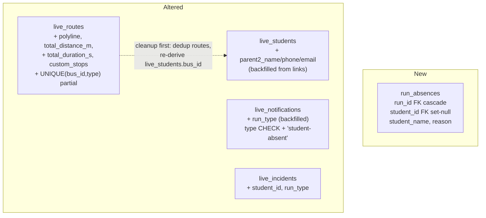
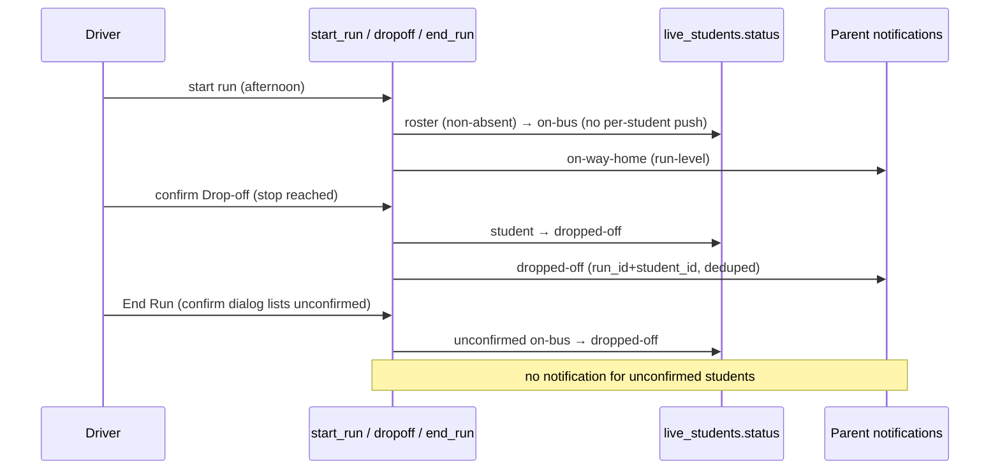
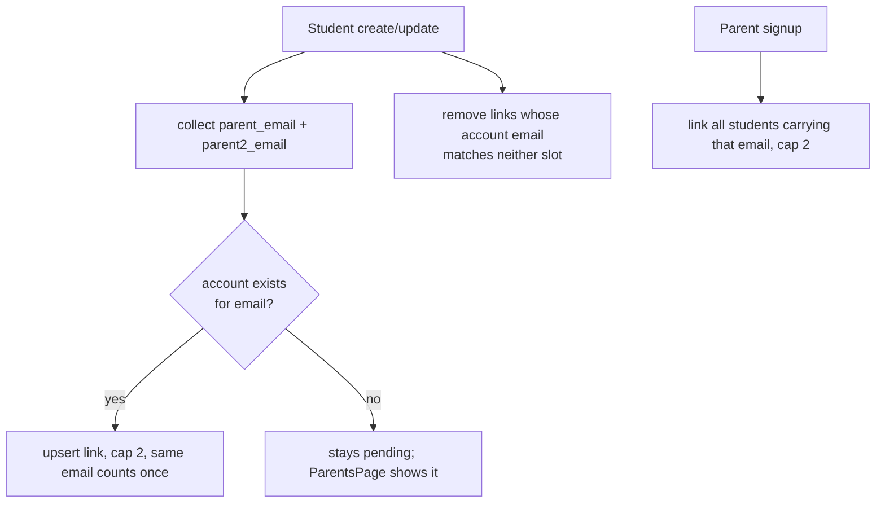

# feat: Spec refinement across Admin, Driver, and Parent views

## Summary

Implement the 14-item customer spec (R1–R36 plus R25b/R28b in the origin doc): route/bus conflict prevention, student form + two-parent rework with account auto-linking, auditable run reports, planner save/reset/CSV with route map previews, driver absent flow with parent+school notifications, start-run gating, confirmed board/drop-off with real afternoon drop-off semantics, and parent notification filters, lifecycle windows, and derived child status. One migration (007) carries every schema change; 17 implementation units span backend, admin, driver, and parent surfaces, closing with full certification.

---

## Problem Frame

The platform works but has trust and workflow gaps the paying school flagged: buses can be double-booked with routes, admin edits silently corrupt live student status, parents assignment is a detached page, runs aren't auditable, planner output is ephemeral, drivers can mis-tap irreversible actions, afternoon runs mislabel drop-offs as boarding, and parents can't filter or trust the feed. The origin document resolves all product ambiguity; this plan sequences the build.

---

## Requirements

Traceability to origin (docs/brainstorms/2026-07-01-spec-refinement-requirements.md). Grouped by capability; the origin doc is authoritative for exact wording.

- **Routes/scheduling** — R1–R5: one route per (bus, type) with dual-layer enforcement and data cleanup incl. `live_students.bus_id` re-derivation; friendly conflict on run edits; today-scoped polled Active Runs via server filter.
- **Students** — R6–R8: status field removed from the dialog and from the update write path; pin↔address two-way sync via reverse geocoding and autocomplete.
- **Parents** — R9–R13: two parent slots; ≥1 phone AND ≥1 email invariant (form + bulk); email-driven account link sync capped at 2 with pre-activation backfill of email slots from existing links; assignment page removed.
- **Run reports** — R14–R16: clickable runs open a report (students, stops, absent names, start/end); `run_absences` snapshot with denormalized names; `students_boarded` recounted per run type.
- **Planner & previews** — R17–R23, R28b: save selected option as a route (custom stops, polyline, totals); `custom_stops` routes skip regeneration until students arrive; reset button; CSV import capped at 24 stops; per-card map previews with key-less fallback.
- **Driver** — R24–R32: absent button with parent (`student-absent`) + school (student-stamped incident, hidden from parent feed) notifications; absence clearing blocked during active runs; explicit route selection with completed-today gating; confirmation dialogs (board, drop-off, end-run) and no undo; afternoon auto-board with tap-time drop-off notifications and a notification-suppressed sweep.
- **Parent** — R33–R36: type + period filters over a persisted `run_type`; 24h main window and 7-day History tab (display-only, no deletion); derived `display_status` covering absence, stale dropped-off, and stale on-bus.

---

## Key Technical Decisions

- **One migration (007) carries all schema changes and backfills.** Ordered: additive columns → data cleanup (route dedup, bus re-derivation, email-slot backfill, `run_type` backfill) → constraints (route partial unique index, widened notification type CHECK). Matches the repo's numbered-migration + marker-table runner; a single artifact deploys atomically via the existing migrate handler.
- **`parent_phone2` is reused as Parent 2's phone.** The schema already has `live_students.parent_phone2` ("Second phone", wired through payload, form, and bulk template) and in practice it holds the second parent's number. Migration 007 adds only `parent2_name` and `parent2_email`; the two-parent form groups `parent_phone2` under Parent 2; the ≥1-phone invariant counts (`parent_phone`, `parent_phone2`). No rename, no data copy, no competing columns.
- **Rosters are run-scoped, never bus-scoped.** Afternoon auto-board, drop-off eligibility, `students_boarded` recounts, and the end-run sweep all operate on the run's `run_stops` student set; the run-report absence snapshot intersects today's absences with the route's `live_student_routes` membership. `live_students.bus_id` (derived, morning-preferring, drifts) is never used as a roster — seeded data already contains a student whose afternoon route rides a different bus than his derived `bus_id`.
- **Dual-layer conflict enforcement.** App-level pre-checks give friendly 409 messages; partial unique indexes give the race-proof guarantee — the exact pattern migration 006 set for runs (`live_runs_active_bus_date_key`).
- **`run_absences` snapshots denormalize `student_name`.** `run_stops.student_id` is `ON DELETE SET NULL`; a name-less snapshot would rot. Names captured at write time keep reports auditable after student deletion.
- **`display_status` is computed at read time, never stored.** The `live_students.status` CHECK stays untouched; the parent children query derives `absent`/`at-home` from today's absences and today's runs. No new writers, no sweep changes, admin keeps raw operational status.
- **Notifications persist `run_type` instead of joining `live_runs`.** `run_id` is `ON DELETE SET NULL`, so join-derivation silently loses the period when admins delete runs. Incidents get the same treatment (`run_id` + `run_type` + `student_id`).
- **The school channel is the incidents feed.** Absent events insert `live_incidents` rows (type `student`, `student_id` set) surfacing on the existing admin Alerts page with its unread badge; `ParentLiveDao.list_alerts` excludes student-stamped incidents so no other parent sees a named child's absence. No parent fan-out via `notify_incident` for this path.
- **Afternoon lifecycle: auto-board → tap-time drop-off → suppressed sweep.** Auto-board at `start_run` writes statuses directly (bypassing `notify_student_boarded`); confirmed drop-offs notify at tap time with `run_id`+`student_id` so the dedup index suppresses any duplicate; the end-run sweep normalizes stragglers' status but sends nothing — preserving the codebase's "no false safety assertion" invariant (`push_service.notify_reached_school` docstring).
- **Planner routes use a `custom_stops` flag with self-healing handover.** `regenerate_route_stops` skips flagged routes; assigning a student flips the flag, regenerates student stops, and clears the stored polyline. `start_run` rejects flagged routes (no boardable students). No merge semantics to maintain.
- **Counters recomputed, never incremented.** `students_boarded` is recounted inside the tap transaction (morning: on-bus count; afternoon: dropped-off count), so mobile retries can't drift it.
- **Parent feed filtering is client-side over server-windowed data.** New `window_hours` + `limit` params on the notifications and alerts endpoints (24h main / 168h history, cap 200); type/period chips filter in the page. No rows are ever deleted — no scheduler exists on Lambda, and the feed is the audit trail.
- **Reverse geocoding is a thin server proxy.** `POST /api/fleet/reverse-geocode` wraps Google Geocoding with the same graceful degradation as the existing `geocode`/`places` proxies; a failed lookup leaves the address untouched.

---

## High-Level Technical Design

### Schema delta (migration 007)

### Afternoon run lifecycle (R32)

### Parent-link synchronization (R11)

---

## Implementation Units

Phases group units for ordering; units in the same phase touching disjoint files can run in parallel. Hot files that force sequencing: `backend/app/dao/run_dao.py` (U3 → U5 → U6), `frontend/src/features/admin/StudentsPage.tsx` (U8 only), `frontend/tests/e2e/admin-crud.spec.ts` (U8, U9, U10 coordinate), `backend/tests/integration/test_live_api.py` and the e2e specs (U18 first, then feature units touch their own sections). U18 precedes everything.

### Phase A — Foundations

### U18. Baseline suite reconciliation against seed 003

- **Goal:** Establish a green baseline before any feature work — the suites currently assert seed-002 fixtures (`Brian Achieng`, `Grace Njeri`, bus `Express 1`) that `backend/db/seeds/003_local_snapshot.sql` truncates and replaces (students Faith Achieng / Happiness Kenesa / Kevin Mwangi, buses Simba / Twiga / Mamba).
- **Requirements:** precondition for every unit whose verification requires green suites.
- **Dependencies:** none — runs first.
- **Files:** `backend/tests/integration/test_live_api.py`, `frontend/tests/e2e/helpers.ts`, `frontend/tests/e2e/parent-flow.spec.ts`, `frontend/tests/e2e/notifications.spec.ts`, `frontend/tests/e2e/driver-flow.spec.ts`, `frontend/tests/e2e/admin-driver-parent.spec.ts`, `backend/db/seeds/003_local_snapshot.sql` (only if an asserted entity class is missing).
- **Approach:** Reset the DB, run all suites, and repoint fixture assertions at the 003 snapshot entities — centralize seeded names in `helpers.ts` constants so future drift is one-line. Tests follow prod reality; extend seed 003 only where an asserted entity *class* no longer exists (e.g. a bus-less student for parent-flow's empty-state assertion).
- **Test scenarios:** none — this unit repairs the suites themselves.
- **Verification:** `scripts/certify.sh` exits 0 on the unmodified feature codebase.

### U1. Migration 007: schema changes, cleanup, backfills

- **Goal:** All schema for the feature set lands in one ordered migration.
- **Requirements:** R1, R2, R9, R11, R15, R17, R26, R34.
- **Dependencies:** U18.
- **Files:** `backend/db/migrations/007_spec_refinement.sql`.
- **Approach:** In order: (1) add `live_routes.polyline text`, `total_distance_m int`, `total_duration_s int`, `custom_stops boolean not null default false`; (2) add `live_students.parent2_name text` and `parent2_email text` only — the existing `parent_phone2` becomes Parent 2's phone (see KTDs); (3) create `run_absences (id, run_id FK live_runs on delete cascade, student_id FK live_students on delete set null, student_name text not null, reason text, created_at)` with an index on `run_id` and `unique(run_id, student_id)`; (4) add `live_notifications.run_type text check (run_type in ('morning','afternoon'))`, backfill from `live_runs` via surviving `run_id`; recreate the type CHECK including `student-absent`; (5) add `live_incidents.student_id uuid FK set null` and `run_type` with the same CHECK; (6) route dedup: for each (bus_id, type) with >1 route keep the earliest `created_at`, null the rest's `bus_id`; then `create unique index live_routes_bus_type_key on live_routes (bus_id, type) where bus_id is not null`; (7) re-derive `live_students.bus_id` mirroring `_derive_student_bus` exactly (`student_live_dao.py`): among the student's routes with `bus_id is not null`, prefer morning then `created_at`; NULL only when no route has a bus — a morning-only join would strand afternoon-only students; (8) backfill empty parent-email slots from `live_parent_students` joined to `app_users`: emails only (`parent2_name` stays empty until first form edit; R10 is enforced on saves, not at migration), fill `parent_email` first then `parent2_email`, ordered by `app_users.created_at` then `live_parent_students.id` (the link table has no `created_at`), skipping case-insensitive duplicates, cap 2.
- **Patterns to follow:** `backend/db/migrations/006_absence_and_run_uniqueness.sql` (partial unique index + guard comment style); CHECK-constraint recreation as in 005.
- **Test scenarios:** Rehearsal against seeded data: reset with migrations 001–006 + seeds (temporarily holding 007 aside), apply `007_spec_refinement.sql` directly via psql, then spot-check — no (bus, type) pair has two routes; every student on an affected route has `bus_id` matching the `_derive_student_bus` rule; one-linked-account student with empty `parent_email` gets it filled (first slot), a two-link student fills both slots in order, a three-link student fills only two, a student with `parent_email` already set gets only `parent2_email` filled; every surviving `live_parent_students` row's account email matches one of the student's slots case-insensitively (emit a drift report listing any that don't); notifications with surviving runs carry `run_type`. From-scratch check: `scripts/reset-local-db.sh` (which applies 007 to an empty DB before seeding) completes.
- **Verification:** Both rehearsal and from-scratch procedures pass; backend unit suite still green.

### U2. Notification and incident plumbing

- **Goal:** The pipeline can express `student-absent`, stamps `run_type` everywhere, and keeps student-stamped incidents out of the parent feed.
- **Requirements:** R26, R34; AE13.
- **Dependencies:** U1.
- **Files:** `backend/app/dao/push_dao.py`, `backend/app/services/push_service.py`, `backend/app/dao/incident_dao.py`, `backend/app/api/incidents.py`, `backend/app/dao/parent_live_dao.py`, `backend/tests/services/test_push_service.py`.
- **Approach:** `insert_notification` gains `run_type`; every `notify_*` entry point passes the run's type (incl. the deprecated `notify_bus_position` path while it exists). New `notify_student_absent(student, run, reason)` targeting only that student's parents with run-scoped dedup. `create_driver_incident` accepts and stamps `run_id`/`run_type`/`student_id` (driver's active run resolved via `PushDao.active_run_for_driver`). `list_alerts` excludes incidents with `student_id is not null` — and because the parent feed is not the only reader, `GET /api/incidents` and the unread-count endpoint are restricted to admin (the admin AlertsPage is their only frontend consumer); otherwise any parent/driver token could read named absence incidents. The absent flow inserts its incident directly (no `notify_incident` parent fan-out).
- **Patterns to follow:** FakePushDao unit-test pattern in `backend/tests/services/test_push_service.py`; dedup semantics from `push_dao.insert_notification` (ON CONFLICT DO NOTHING skips push).
- **Test scenarios:** `notify_student_absent` notifies exactly the linked parents of that student and no other bus parent; second call for same run+student is dedup-suppressed; inserted rows carry `run_type`; incident with `student_id` set is absent from `list_alerts` output while a plain breakdown incident still appears; a parent token gets 403 from `GET /api/incidents`; deprecated position path inserts with `run_type` without raising.
- **Verification:** `cd backend && ../.venv/bin/python -m pytest -q` green with new tests.

### Phase B — Admin backend

### U3. Route/bus conflict enforcement and active-runs filter

- **Goal:** Friendly conflict errors on route and run writes; dashboard-grade active-runs query.
- **Requirements:** R1, R3, R5; AE1.
- **Dependencies:** U1.
- **Files:** `backend/app/dao/fleet_dao.py`, `backend/app/dao/run_dao.py`, `backend/app/api/runs_live.py`, `backend/tests/integration/test_live_api.py`.
- **Approach:** `create_route`/`update_route` pre-check for another route with the same `bus_id`+`type` (excluding self) and raise `ConflictError` naming the conflicting route and bus; `update_route` re-derives `live_students.bus_id` for the route's students when the bus changes. `update_run` re-runs the active-run conflict check when the resulting state is non-completed. `GET /api/runs` gains `active=true` (today Nairobi + `status <> 'completed'`), reusing the `find_active_run_today` predicate shape.
- **Test scenarios:** Covers AE1. Creating a second morning route on a bus 409s with the route name in the message; editing a route to a taken bus 409s; editing the *same* route (no bus change) succeeds; `PUT /api/runs/{id}` moving a completed run back to in-progress on a bus with an active run 409s with the friendly message; `GET /api/runs?active=true` returns today's in-progress runs only (a prior-date in-progress run from the snapshot seed is excluded).
- **Verification:** Integration suite green (`RUN_INTEGRATION=1`), including the existing duplicate-active-run test.

### U4. Students/parents backend: invariant, link sync, reverse geocode

- **Goal:** Two-parent payloads with the phone/email invariant, email-driven link sync everywhere, no status writes on update, reverse geocoding.
- **Requirements:** R7, R9–R13; AE4, AE5.
- **Dependencies:** U1.
- **Files:** `backend/app/api/students_live.py`, `backend/app/dao/student_live_dao.py`, `backend/app/dao/account_dao.py`, `backend/app/services/auth_service.py`, `backend/app/api/accounts.py`, `backend/app/services/geo_service.py`, `backend/app/api/fleet.py`, `backend/tests/integration/test_live_api.py`, `backend/tests/services/test_auth_service.py`.
- **Approach:** `StudentPayload` gains `parent2_name`/`parent2_email` (`parent_phone2` already exists and is now Parent 2's phone); create/update validate: `parent_name` present, ≥1 of (`parent_phone`, `parent_phone2`), ≥1 of (`parent_email`, `parent2_email`) — reusing `clean_phone`/`clean_email`. `update_student` drops `status` from its SQL entirely. A `sync_parent_links(student)` helper (called from create/update/bulk) upserts links for accounts matching either email (case-insensitive, same email once), removes links whose account email matches neither — pruning only when an email slot's value actually changed, so unrelated edits can't sever drifted links — caps at 2 with slot-order precedence. Signup (`auth_service.signup`) auto-links new parents to students carrying their email, honoring the cap. `list_parents` pending derivation reads both email columns. Bulk rows enforce the invariant per-row with existing error-collection. The `/api/accounts/parent-students` endpoints stay untouched here — their removal ships with the page in U9. Add `geo_service.reverse_geocode(lat, lng)` (Google, graceful None) + `POST /api/fleet/reverse-geocode`.
- **Test scenarios:** Covers AE4: create with phone-only fails 400 naming the email requirement; with email in either slot succeeds. Covers AE5: signup with a matching email links the account (visible via parent portal children). Update that changes `parent_email` to a different registered account's email swaps the link; unrelated edit (grade) preserves links (post-backfill state); same email in both slots yields one link; third matching account is not linked (cap). Update payload containing `status` does not alter the student's live status. Bulk row missing both emails errors that row only. Reverse-geocode returns a label for Nairobi coords and `found: false` on failure/no key.
- **Verification:** Backend unit + integration suites green; manual smoke via seeded stack.

### U5. Run report backend: absence snapshot, counters, report endpoint

- **Goal:** Auditable per-run data and the report endpoint.
- **Requirements:** R14–R16; AE6 (data side).
- **Dependencies:** U1, U3 (run_dao sequencing).
- **Files:** `backend/app/dao/run_dao.py`, `backend/app/dao/absence_dao.py`, `backend/app/api/runs_live.py`, `backend/tests/integration/test_live_api.py`.
- **Approach:** `start_run` inserts `run_absences` rows (with names) for today's absences intersected with the route's `live_student_routes` membership — never the bus roster (see KTDs). `toggle_boarding` recounts `students_boarded` in-transaction over the run's `run_stops` student set (morning: on-bus count). `end_run` persists the final count (afternoon: dropped-off count pre-sweep, same set). `GET /api/runs/{run_id}/report` returns the run row + bus/route/driver names + absent list (snapshot; fallback: `live_student_absences` on run date ∩ route roster for legacy runs, flagged `approximate: true`).
- **Test scenarios:** Start a run with one absent student → report lists them by name; deleting that student afterwards keeps the name in the report; boarding two students then re-fetching the run shows `students_boarded = 2` (recount, not drift, after a repeated tap); report for an admin-created run (no route) returns zeros/nulls without erroring; legacy run (no snapshot) returns the fallback list flagged approximate.
- **Verification:** Integration tests green; report payload spot-checked against seeded runs.

### U6. Driver lifecycle backend: gating, afternoon semantics, absent

- **Goal:** Server-side rules for explicit starts, confirmed finality, real afternoon drop-offs, and driver absences.
- **Requirements:** R24, R25, R25b, R26, R27, R28, R28b, R30, R32; AE6, AE8, AE12 (server side).
- **Dependencies:** U2, U5 (run_dao sequencing).
- **Files:** `backend/app/dao/run_dao.py`, `backend/app/dao/absence_dao.py`, `backend/app/api/runs_live.py`, `backend/app/api/students_live.py`, `backend/app/services/push_service.py`, `backend/tests/integration/test_live_api.py`, `backend/tests/services/test_push_service.py`.
- **Approach:** `start_run` rejects: routes with a completed run today (any creator, 409 "already completed today"), `custom_stops` routes (409 "no students assigned"). The auto-board / drop-off / sweep population is the run's `run_stops` student set (see KTDs). Afternoon `start_run` sets that set's non-absent students `on-bus` directly (no notifications). `start_run` (both types) also self-heals stale `absent` statuses: roster students whose status is `absent` with no today-absence reset to `at-school` (morning) or join the auto-board set (afternoon) — absences are per-date and nothing else clears the status. Driver context: include `completed_route_ids_today`; keep today-absent students' stops visible with an `absent` flag on the student entry (drop the current hide-filter). `toggle_boarding` rejects afternoon runs and `on_bus=false` (copy: refresh the app). New `POST /api/runs/driver/dropoff {student_id}`: afternoon-only, stop-reached gate, on-bus → dropped-off, recount, then a new `notify_student_dropped_off(run, student_id)` in push_service (mirror `notify_student_boarded`; type `dropped-off` with run+student ids so the dedup index suppresses the sweep duplicate). New `POST /api/runs/driver/absent {student_id}`: active-run ownership; single transaction writing `live_student_absences` (marked_by driver), `run_absences` append (`on conflict (run_id, student_id) do nothing` — `mark_absent` is an upsert and a reason edit must not 500), status `absent`; post-commit BackgroundTasks fire `notify_student_absent` + student-stamped incident. Absence mark/clear status side-effects apply only when `absence_date` = today (Nairobi): mark sets `absent`; clear resets to `at-school` only when the current status is `absent`; clear rejects while the student's bus has an active run. `delete_run` on a non-completed run resets its `run_stops` students still `on-bus` back to `at-school` in the same transaction — R28's recovery path (delete the mistaken run) must not strand an auto-boarded roster. `notify_run_ended` on afternoon no longer notifies anyone (tap-time covered); morning behavior unchanged.
- **Test scenarios:** Covers AE8: completed-today route start 409s — using a throwaway route/bus the test creates itself, never the shared seeded route. Covers AE12: afternoon end with one unconfirmed student sweeps their status but produces no dropped-off notification for them (poll-assert absence). Custom-stops route start 409s. Afternoon start sets the run_stops roster on-bus with zero `student-boarded` rows; a student on the route but riding a different derived bus is still auto-boarded (run-scoped roster). Dropoff on a not-yet-reached stop 409s; on reached stop flips status and notifies once (dedup on retry). Boarding endpoint on afternoon run 409s; `on_bus=false` 409s. Driver absent: absence row + run_absences + status all present after the call, parent notification and admin incident appear (poll), other parent sees nothing (scoping). Marking an absence dated tomorrow leaves today's status untouched; clearing a past-dated absence for an on-bus student leaves status untouched; double-marking mid-run leaves one snapshot row and no error. Clearing today's absence during the active run 409s; after end_run it succeeds and resets status. Deleting an in-progress afternoon run restores its auto-boarded students to `at-school`. Stale-absent self-heal: student left `absent` from yesterday with no today-absence boards normally after start_run. Suite hygiene: the integration `no_active_run` fixture and e2e cleanup delete today's runs for the shared bus (end, then `DELETE /api/runs/{id}`) so completed-today gating never blocks repeated lifecycle tests.
- **Verification:** Full backend suite + targeted integration lifecycle test green.

### Phase C — Admin frontend

### U7. Dashboard active runs

- **Goal:** Active Runs card is today-scoped and self-refreshing.
- **Requirements:** R4, R5; AE2.
- **Dependencies:** U3.
- **Files:** `frontend/src/lib/queries.ts`, `frontend/src/features/admin/DashboardPage.tsx`.
- **Approach:** New `useActiveRuns` hook hitting `GET /api/runs?active=true` with `refetchInterval: POLL_ADMIN`; DashboardPage consumes it for the card (other stats keep their sources).
- **Test scenarios:** Covers AE2 (e2e, in U17 sweep): ending a run removes it from the card within the poll interval without reload.
- **Verification:** `npx tsc --noEmit`; manual check on seeded stack.

### U8. Student dialog rework

- **Goal:** The dialog loses status, gains two parents and pin↔address sync; bulk template matches.
- **Requirements:** R6, R8–R10; AE3, AE4 (UI side).
- **Dependencies:** U4.
- **Files:** `frontend/src/features/admin/StudentsPage.tsx`, `frontend/src/features/admin/components/MapPicker.tsx`, `frontend/src/features/admin/components/BulkUploadDialog.tsx`, `frontend/src/lib/validation.ts`, `frontend/tests/e2e/admin-crud.spec.ts`.
- **Approach:** Remove the status Select and `form.status`; list column/filter untouched. Parent section becomes two labeled groups: Parent 1 (name required, `parent_phone`, `parent_email`), Parent 2 optional (`parent2_name`, `parent_phone2` relabeled "Phone", `parent2_email`) — the standalone "Second phone" input moves into the Parent 2 group, no new phone column. Client mirrors of the invariant. Replace the address Input+Locate with `AddressAutocomplete` (suggestion sets address + pin); `MapPicker` gains an `onPick` callback that calls `POST /api/fleet/reverse-geocode` and fills the address field (editable). Bulk template + header mapping gain `parent2_name`/`parent2_email` (keeping the existing `parent_phone2` header); client-side row validation mirrors the invariant. Update the student CRUD e2e (fills parent fields now; no status select).
- **Test scenarios:** e2e: create a student via dialog with parent 1 phone + parent 2 email succeeds; omitting both emails shows inline error and blocks save; picking a map point fills the address input (mock-free: assert non-empty after click, guarded by maps availability); edit dialog shows no status select.
- **Verification:** `npm test`, `npx tsc --noEmit`, targeted e2e spec green against the stack.

### U9. Remove Parent Assignments page

- **Goal:** Assignment happens only in the student form.
- **Requirements:** R12.
- **Dependencies:** U4.
- **Files:** `frontend/src/app/routes.tsx`, `frontend/src/app/layouts/AdminLayout.tsx`, `frontend/src/features/admin/ParentAssignmentsPage.tsx` (delete), `frontend/src/lib/queries.ts`, `frontend/src/features/admin/ParentsPage.tsx`, `frontend/tests/e2e/admin-crud.spec.ts`, `frontend/tests/e2e/role-access.spec.ts`.
- **Approach:** Delete the page + `useParentStudents`; `/parent-assignments` becomes a `Navigate` redirect to `/students`; nav entry removed. Remove the `GET/POST /api/accounts/parent-students` and `DELETE .../{link_id}` routes here, together with the page (backend + frontend land as one unit so no intermediate state has a broken nav entry or orphaned endpoints). ParentsPage keeps working (backend already returns both-email pending rows). Replace the link/unlink e2e with an in-form assignment assertion (create student with a registered parent email → that parent's row lists the student); update `ADMIN_ROUTES`.
- **Test scenarios:** e2e: navigating to `/parent-assignments` lands on `/students`; sidebar has no Parent Assignments entry; ParentsPage still lists the seeded parent with children.
- **Verification:** e2e role-access + admin-crud green.

### U10. Run report UI

- **Goal:** Clickable run rows opening the audit report.
- **Requirements:** R14; AE6 (UI side).
- **Dependencies:** U5.
- **Files:** `frontend/src/features/admin/RunsPage.tsx`, `frontend/src/lib/queries.ts`, `frontend/tests/e2e/admin-crud.spec.ts`.
- **Approach:** Row `onClick` opens a Run Report dialog fetching `/api/runs/{id}/report`; Pencil/Trash get `stopPropagation`. Dialog shows route/bus/driver/type/date/status header, start–end times, students, stops (completed/total), boarded (labeled per type), absent names (with an "approximate" tag when flagged); dashes for nulls.
- **Test scenarios:** e2e: clicking a seeded completed run opens the dialog with its route name and start time; clicking the edit icon still opens the edit dialog (not the report).
- **Verification:** e2e green; visual check.

### U11. Planner persistence backend

- **Goal:** A calculated option can be saved as a real route without being clobbered.
- **Requirements:** R17, R18; AE7.
- **Dependencies:** U1, U3.
- **Files:** `backend/app/api/fleet.py`, `backend/app/dao/fleet_dao.py`, `backend/tests/integration/test_live_api.py`.
- **Approach:** `RoutePayload` gains optional `stops` (label/lat/lng/pickup_time/is_school), `polyline`, `total_distance_m`, `total_duration_s`. When stops are present the DAO writes them as `live_route_stops` (student_id NULL), sets `custom_stops = true`, and skips regeneration. `regenerate_route_stops` early-returns for flagged routes; the student route-sync path (`_sync_routes`) flips the flag off, clears polyline/totals, then regenerates. School updates skip flagged routes. Bus conflict check from U3 applies on save.
- **Test scenarios:** Covers AE7: save a custom route, then assign a student → stops regenerate from students, flag and polyline cleared. Save with a bus already holding a same-type route 409s. School update leaves the custom route's stops intact. Route list payload includes polyline/totals for the saved route.
- **Verification:** Integration tests green.

### U12. Planner UI: save, reset, CSV

- **Goal:** The planner can persist, clear, and bulk-load.
- **Requirements:** R17, R19–R21.
- **Dependencies:** U11.
- **Files:** `frontend/src/features/admin/FleetMapPage.tsx`, `frontend/src/features/admin/components/PlannerCsvDialog.tsx` (new), `frontend/tests/e2e/admin-crud.spec.ts`.
- **Approach:** "Save to Routes" button (disabled while busy/unresolved) opens a dialog (name prefilled "Planned route YYYY-MM-DD", school required, bus optional); it snapshots the selected option at click time and POSTs the route; 409 keeps the dialog open with the message; success toasts with a Routes link and resets the planner. Reset button restores initial state and bumps a request-generation counter so in-flight `plan()`/`reorder()` responses are dropped. CSV dialog: header-row file (`address` required, `pickup_time` HH:MM optional, `lat`/`lng` optional) parsed with the existing `xlsx` dependency, template download, appends to non-empty rows, per-row errors listed, rejects rows past the 24-stop cap with a count message.
- **Test scenarios:** e2e: calculate → Save → route appears on Routes page with its stops; Reset clears rows and results; CSV with 2 valid + 1 bad-time row loads 2 and lists 1 error. Unit: CSV parser maps headers case-insensitively and enforces the cap.
- **Verification:** vitest for the parser, e2e for the flows, tsc/build green.

### U13. Routes page map previews

- **Goal:** Every route card shows its shape at a glance.
- **Requirements:** R22, R23.
- **Dependencies:** U1 (columns flow through existing `list_routes`).
- **Files:** `frontend/src/features/admin/RoutesPage.tsx`, `frontend/src/components/map/MapPrimitives.tsx`, `frontend/src/lib/googleMaps.ts`.
- **Approach:** New `RouteMapPreview` (compact `h-40` Map): dedupe stops by `stop_order`, filter null coords, `FitBounds`, numbered `StopGlyph` markers (reuse pattern from FleetMapPage), `RoutePolyline` with the stored encoded polyline or path fallback. `hasMapsKey === false` or <1 located stop renders a placeholder card instead of a Map mount.
- **Test scenarios:** e2e: seeded route card contains a `.gm-style` map; a route without located stops shows the placeholder text. Manual: planner-saved route renders road-shaped polyline.
- **Verification:** e2e + visual check at desktop width.

### Phase D — Driver frontend

### U14. Driver UI rework

- **Goal:** Explicit starts, confirmations, absent flow, afternoon drop-off language.
- **Requirements:** R24, R27–R31; AE8, AE9 (UI side).
- **Dependencies:** U6.
- **Files:** `frontend/src/features/driver/DriverHomePage.tsx`, `frontend/src/features/driver/DriverRunPage.tsx`, `frontend/src/features/driver/DriverBoardingPage.tsx`, `frontend/tests/e2e/driver-flow.spec.ts`.
- **Approach:** Home Start Run tile navigates to `/driver/run`. Run page: no auto-select, placeholder "Choose route", options for `completed_route_ids_today` disabled with "Completed today", Start disabled until selection; End Run wrapped in `useConfirm` (afternoon copy lists unconfirmed names from context). Boarding page: morning shows Board, afternoon shows Drop-off (counters "Dropped off"/"Remaining"); both actions and Absent wrapped in `useConfirm` naming the student; after success a static badge, no Off button; absent-flagged students render an Absent tag with actions disabled; Absent shown per R24 gating (morning: stop reached & not on bus; afternoon: on-bus & not dropped); helper copy "Contact the office to undo an absence."
- **Test scenarios:** e2e rewrite of driver-flow: start requires selecting the route from the dropdown; Board fires a confirm dialog and after confirm the Off button is absent; second run start on the completed route is blocked in UI (disabled option). Afternoon path (new spec section): start afternoon route → students show Drop-off → confirm → badge "Dropped off". Absent path: confirm → student tagged Absent, run report (via API) lists them.
- **Verification:** Playwright driver-flow + new afternoon spec green; mobile-width manual pass per repo protocol.

### Phase E — Parent

### U15. Parent feeds backend: windows and display status

- **Goal:** Windowed feeds and a trustworthy derived child status.
- **Requirements:** R35, R36; AE10, AE11 (data side).
- **Dependencies:** U1, U2.
- **Files:** `backend/app/api/push.py`, `backend/app/dao/push_dao.py`, `backend/app/api/parent_portal.py`, `backend/app/dao/parent_live_dao.py`, `backend/tests/integration/test_live_api.py`.
- **Approach:** `GET /api/push/notifications` and `GET /api/parent-portal/alerts` accept `window_hours` (rolling, `created_at > now() - interval`) and `limit` (default 50, cap 200). `list_children`/profile add `display_status` in SQL: today-absence → `absent`; stale `absent` (status `absent`, no today-absence) → `at-home`; `on-bus` with no run today whose `run_stops` contain the student and whose status is `<> 'completed'` (the codebase's active-run convention — `delayed` stays active, and membership goes through `run_stops`, never `live_students.bus_id`) → `at-home`; `dropped-off` with no afternoon run today containing the student (via `run_stops`) → `at-home`; else raw status. Mark-read stays global (documented).
- **Test scenarios:** Tests construct their own fixtures — the seed has no dropped-off/stale-on-bus children and its notifications are weeks old: insert back-dated notification rows (`created_at` is insertable) for the window assertions, and set child statuses via SQL or run lifecycle. Covers AE10: a row older than 24h absent with `window_hours=24`, present with 168. Covers AE11: a child set `dropped-off` with no run today reports `display_status = at-home`; marking today's absence flips it to `absent`. A child `on-bus` whose run is marked `delayed` stays `on-bus` (active-run convention); a child on-bus during a run on a bus other than their derived `bus_id` stays `on-bus` (run_stops membership); limit caps at 200.
- **Verification:** Integration tests green.

### U16. Parent UI: filters, history, status badges

- **Goal:** Filterable 24h feed, 7-day History, highlighted child status.
- **Requirements:** R33, R35, R36; AE10, AE11 (UI side).
- **Dependencies:** U15.
- **Files:** `frontend/src/features/parent/ParentAlertsPage.tsx`, `frontend/src/features/parent/ParentHomePage.tsx`, `frontend/src/features/parent/ParentProfilePage.tsx`, `frontend/src/features/parent/parentHooks.ts`, `frontend/tests/e2e/notifications.spec.ts`, `frontend/tests/e2e/parent-flow.spec.ts`.
- **Approach:** Alerts page: segmented Recent (24h) / History (7d) fed by `window_hours`; period toggle (All/Morning/Afternoon on `run_type`, null only under All) and a type Select over the merged labeled taxonomy (+ `student-absent` label, `custom` omitted); client-side filtering. Home cards: badge renders `display_status` (new `at-home` label/variant, emphasized filled style); Profile My Children gains the same badge. Keep mock ETA.
- **Test scenarios:** e2e: notification generated by a run appears under Recent and under its period filter, disappears under the other period; History tab renders (seeded old rows if present, else empty-state); home badge shows the seeded child's derived status; profile card shows a status badge.
- **Verification:** notifications + parent-flow e2e green; mobile-width manual pass.

### Phase F — Certification

### U17. Full certification and suite reconciliation

- **Goal:** Every suite green, seed restored, protocol satisfied.
- **Requirements:** all; AE1–AE13 covered across suites.
- **Dependencies:** U1–U16, U18.
- **Files:** `frontend/tests/e2e/*.spec.ts`, `backend/tests/integration/test_live_api.py`, `scripts/certify.sh` (consume only).
- **Approach:** Run `scripts/certify.sh`; reconcile every failure (pinned flows changed by design: driver one-tap start, bare Board button, parent-assignment CRUD, students-without-parents fixtures, removed link endpoints). Run-lifecycle cleanups must delete today's runs (not just end them) per U6's suite-hygiene rule. Extend the e2e beforeAll sweep for any new entities. Reseed at the end.
- **Test scenarios:** none — this unit is the execution of the suites themselves.
- **Verification:** `scripts/certify.sh` exits 0; `curl localhost:9001/api/health` ok; seeded credentials work for all three roles.

---

## Assumptions

Carried from the origin doc plus plan-time bets made without user input:

- "Call History" is delivered as the notification History tab; renaming is a one-line change if the customer wants the literal label.
- Status removal applies to the shared Add/Edit dialog; admins accept losing the manual override because the end-run sweep, the start-run stale-`absent` self-heal (U6), and today-scoped absence toggling cover the correction cases.
- Reusing `parent_phone2` as Parent 2's phone accepts that some legacy rows hold Parent 1's genuine second number there; the form relabel makes the semantics visible and editable.
- The `/api/accounts/parent-students` endpoints are removed rather than kept as an internal mechanism; email-slot sync is the sole link path after the U1 backfill.
- Straight-line previews are acceptable for student-derived routes; only planner-saved routes carry road geometry.
- CSV parsing is client-side only; no server bulk-geocode endpoint (the calculate call reports unresolved rows).
- Playwright stays `workers=1`; the new afternoon e2e coverage respects the one-active-run invariant via the shared `endActiveRun` cleanup.

---

## Scope Boundaries

Carried from origin: no wall-clock route cutoffs or run auto-expiry; no offline tap queue or undo window; no notification deletion jobs; no parent-table normalization or admin create-parent flow; mock ETA stays; no websockets; legacy migrations untouched.

### Deferred to Follow-Up Work

- Fixing the pre-existing ignored `BulkRow.route_name` in students bulk upload (latent bug noted during research; adjacent, not in the confirmed spec).
- Consolidating the duplicated smoke suite `frontend/tests/e2e/admin-driver-parent.spec.ts` into the newer specs.
- CI workflow mirroring `scripts/certify.sh` (tracked in agent-implementation-instructions.md Remaining).

---

## Risks & Dependencies

- **Migration on prod snapshot data** — route dedup and email backfill run against `backend/db/seeds/003_local_snapshot.sql`-shaped data; U1's verification on the seeded DB is the rehearsal. Rollback is re-running from the prior migration set (no destructive drops).
- **Baseline suites are red today** — seed 003 (prod snapshot) truncates the demo fixtures several suites assert; U18 exists precisely to repair this before feature work, and no unit's "suite green" gate is meaningful until it lands.
- **e2e churn** — four spec files pin flows this plan changes by design; U8/U9/U14/U16 own their updates and U17 sweeps stragglers. Serial workers keep run-lifecycle determinism; lifecycle cleanups delete today's runs so completed-today gating can't poison later tests.
- **Google-dependent tests** — planner/preview e2e require the real key already used by existing specs; previews fall back gracefully key-less (R23).
- **BackgroundTasks delivery gap** — notification assertions must poll (existing 10s pattern); the absent flow inherits the known commit-then-notify gap (documented, unchanged).
- **Deploy artifact staleness** — `infra/backend/.aws-sam/build` holds stale copies of `backend/app`; source of truth is `backend/app` only.

---

## Sources & Research

- Origin requirements: `docs/brainstorms/2026-07-01-spec-refinement-requirements.md`.
- Verified mechanics: `backend/app/dao/run_dao.py` (snapshot/sweep/toggle), `backend/app/dao/fleet_dao.py` (`regenerate_route_stops` triggers), `backend/app/services/push_service.py` (type semantics, no-false-assertion docstring), `backend/db/migrations/004–006` (schema + guard patterns), `backend/app/dao/account_dao.py` (pending derivation, link upsert), `frontend/tests/e2e/helpers.ts` (suite conventions).
- Verification protocol and credentials: `agent-implementation-instructions.md`.
