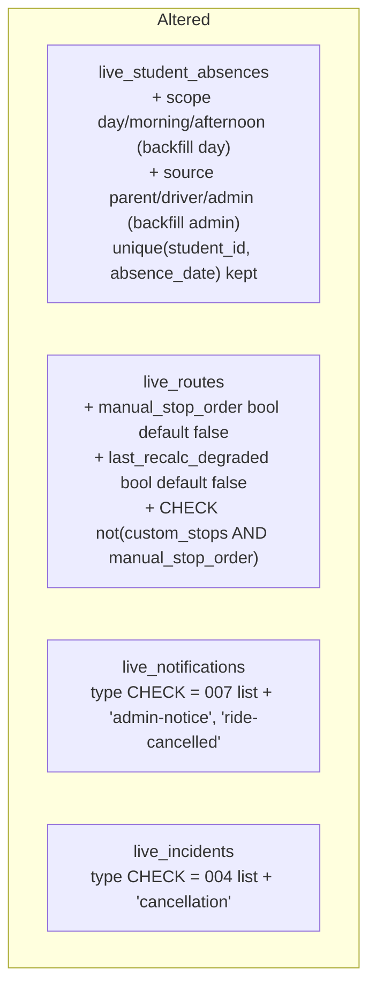
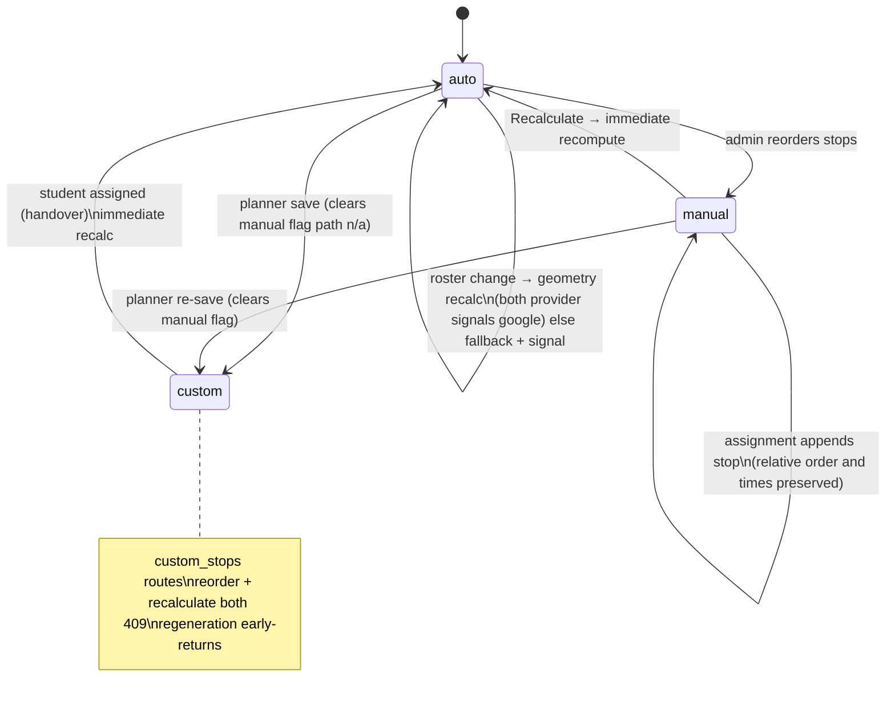

# feat: Ops refinement — status, feeds, stop ordering, Cancel-a-Ride, broadcast

## Summary

Implement the 7-item customer spec (R1–R23 in the origin doc): derived real-time status on the admin Students page with an Unassigned state, a disjoint Recent/History parent feed, geometry-based stop order and pickup-time recalculation with a per-route manual ordering mode, a parent Cancel-a-Ride flow built on scoped absences, and an admin route broadcast. One migration (008) carries every schema change; 15 implementation units close with full certification.

---

## Problem Frame

The office cannot see where a child actually is, parents see stale events mixed into today's feed, stop order is hand-typed and unfixable during road works, ride cancellations travel by phone call, and there is no way to message a route's parents. The origin doc resolves all product ambiguity; this plan sequences the build.

---

## Requirements

Traceability to origin (docs/brainstorms/2026-07-06-ops-refinement-requirements.md, authoritative for exact wording).

- **Admin status** — R1–R4: derived day-scoped status on the Students list, Unassigned for route-less students, filter over derived values. → U3, U4 (scope filter), U10.
- **Feed lifecycle** — R5–R7: Recent strictly <24h, History 24h–7d, disjoint, both feeds, nothing deleted. → U9, U12.
- **Stop ordering** — R8–R13: auto/manual mode per route, geometry recalculation with observable fallback, manual reorder UI, in-progress runs untouched. → U2, U6, U7, U11.
- **Cancel-a-Ride** — R14–R19: scoped same-day cancellation, guards, admin alert + parent confirmation, withdrawal, driver-list effects. → U2, U4, U5, U13, U14.
- **Broadcast** — R20–R23: route-scoped free-text message, per-parent dedup, own label, period-filter exempt, length-capped. → U2, U8, U11, U12, U14.

Acceptance examples AE1–AE6 from the origin are enforced in the unit test scenarios (tagged `Covers AE<N>`).

---

## Key Technical Decisions

- **Migration 008 carries all schema changes**, ordered additive → backfill → constraints: `live_student_absences.scope` (`day`/`morning`/`afternoon`, default and backfill `day`) and `live_student_absences.source` (`parent`/`driver`/`admin`, default and backfill `admin`); `live_routes.manual_stop_order boolean not null default false` plus a `not (custom_stops and manual_stop_order)` CHECK; `live_routes.last_recalc_degraded boolean not null default false` (the durable R10 signal — a transient mutation response cannot survive a page reload); `live_notifications.type` and `live_incidents.type` CHECKs recreated as the **verbatim union** of the current lists (007's nine + `admin-notice` + `ride-cancelled`; 004's six + `cancellation`) — a list copied from an older migration passes local rehearsal (seeds hold no `student-absent` rows) and fails only on live. `unique (student_id, absence_date)` stays: scope and source are transitions on the single row, never a second row.
- **Every absence writer states its transition rule; provenance is a one-way ratchet enforced atomically.** Single-row merging erases who wrote what, so each writer is explicit. Parent `set_scope`: merge (`morning`+`afternoon`→`day`), idempotent on same scope, never overwrites a staff row, records `marked_by` = acting parent. The ratchet lives **inside** the upsert — a single `INSERT … ON CONFLICT DO UPDATE … WHERE source = 'parent'`, zero rows on a staff-sourced conflict mapping to the friendly 409 — never a read-then-write, which the parent-cancels-while-driver-marks race (correlated timing, not random) would break. Staff writers (`mark_absent`, driver `mark_student_absent`): the ON CONFLICT branch escalates `scope` to `day` and sets their `source` — today it updates only reason/marked_by, which would leave a parent's `morning` scope under a school's sick-day mark and board an absent child in the afternoon. Withdrawal: allowed only on `source='parent'` rows, and only while no covered-type run row exists today (`status <> 'completed'` is the wrong predicate — it reopens after completion and rewrites history); withdrawing one half of a merged `day` downgrades to the other half; **any exit from `day`** — downgrade or full delete — resets `status` `'absent'` → `'at-school'` (the same reset `clear_absence` uses), otherwise the stale status contradicts the display rule below.
- **Partial-scope absences gate rosters but never the displayed status.** `status='absent'` writes and the display absent-override fire only for `day` scope. The scope predicate on the shared derivation is **owned by U4** (U3 extracts the fragment before the column exists). Roster consumers match scope to run type (`day` always; partials to their run type): start_run filter, afternoon auto-board, stale-absent heal, driver flags, run_absences snapshots, and the legacy run-report fallback (`backend/app/dao/run_dao.py:173-184` — today scope-blind, would report a morning-cancelled child absent on the afternoon run).
- **Admin status reuses the parent derivation via a shared SQL fragment.** A leaf module (`backend/app/dao/status_sql.py`) imported by both DAOs — a method on either DAO would invert layering and court the existing `student_live_dao`↔`fleet_dao` cycle. The admin list wraps it with `unassigned` (no `live_student_routes` rows, overriding everything). Parity is asserted per CASE branch, not on one student.
- **History disjointness is server-side (`min_age_hours`, bounded `le=8760`).** Client-side filtering of the 168h query would starve History whenever the last 24h fills the 200-row cap. Both endpoints gain the parameter; the same bound is retrofitted to `window_hours`, whose unbounded interval arithmetic 500s today (SQLSTATE 22015 is not in `BAD_REQUEST_SQLSTATES`).
- **One ordering authority per route: `custom_stops` > `manual_stop_order` > auto.** Planner re-save on a manual route would otherwise strand `custom ∧ manual` (regeneration early-returns on custom; the assignment handover clears only custom and would resurface planner stops as "manual" with nothing to preserve). Planner save paths clear `manual_stop_order` in the same UPDATE; the 008 CHECK is the race-proof backstop; reorder **and** recalculate both 409 on custom routes; the student-assignment handover always lands in auto and recalculates immediately.
- **`scheduled_time` ownership by mode; the anchor splits by route type.** Auto+google: computed from leg ETAs. **Morning** routes anchor on the earliest assigned student `pickup_time` (read before the delete-and-rebuild, else every recalc resets to the default); **afternoon** routes always anchor on the 15:30 type default — `pickup_time` is a morning-clock attribute (seeds: 06:40/06:48 on students riding both routes), and `next_departure('06:40', default='15:30')` never reaches the default, so an earliest-pickup afternoon anchor would write dawn-clock drop-off times that look derived. The school-gate row gets the computed school arrival (morning) / departure (afternoon) time. Auto+degraded and manual regeneration behave identically: surviving location groups keep **both their previous relative order and their previous `scheduled_time`** (preserving times while re-sorting by pickup-time would pair Monday's google-order times with a different order — stop 1 scheduled after stop 2), new groups append with the student's `pickup_time`, gate stays as-is. This is a deliberate, recorded delta from origin R10's literal "falls back to the pickup-time order" wording — the fallback order applies to never-computed routes; previously-computed routes preserve their last good order. Manual-mode pickup-time edit writes through to that stop only; auto-mode edit re-anchors morning routes (its only effect when geometry owns times).
- **Geometry writes are gated on two provider signals, not one, and degradation is persisted.** `optimized_order` swallows failures and returns nearest-neighbour order with no signal; `route_geometry` reports provider `'google-routes'` (not `'google'`). U6 adds a thin geo_service wrapper (unconditional, not optional) so order and geometry each carry provider; both must be Google or the route takes the fallback above, sets `last_recalc_degraded = true` (cleared on the next google success), returns `stops_recalculated: false`, and logs a WARNING. The persisted flag is what survives a page reload and drives the route card's durable warning badge — silent degradation is banned (geo-escape lesson), and a 5-second toast is not a signal.
- **Cancel-a-Ride lives in the parent portal; ownership is the sole boundary and evaluates first.** Student UUIDs are harvestable by any authenticated token (`GET /api/fleet/routes` embeds `student_id`), so both verbs check `_child_ids()` **before any guard** and return 404 (`NotFoundError("Child not found for this parent")`, matching `get_track`) for non-existent and non-linked alike — a 409 fired first would leak another child's live on-bus state. One shared per-account `SlidingWindowLimiter` covers POST+DELETE (10/hour — the in-process limiter is per-Lambda-container best-effort; the (student,date) unique row plus no-op suppression is the durable bound).
- **Cancellation side effects fire only on actual scope transitions, and the incident never touches `notify_incident`.** `set_scope` returns whether stored scope changed; unchanged → no incident, no confirmation (the `run_id NULL` dedup exemption means every emission is a real row). The `cancellation` incident is inserted via a new DAO-direct `create_cancellation_incident` — not `create_driver_incident`, whose bus lookup keys on `driver_id` and would stamp NULL bus context or render the parent's name in the driver slot — carrying `bus_id`/`bus_name` from the child's covered route (earliest still-affected type), `driver_*` NULL, scope-mapped `run_type`, and the acting parent named only in the description. `notify_incident` fans out to every family on the bus and has no `student_id` guard; U5 adds the defense-in-depth early-return for student-stamped incidents. Parent confirmations (`ride-cancelled`) carry `run_type` mapped from scope (`morning`/`afternoon`; `day` → NULL) — a NULL-run_type row is visible only under the feed's "All" period chip, and the parent who cancelled the afternoon ride will look under Afternoon.
- **Broadcast recipients come from assignments, never `bus_id`.** New `parents_of_route(route_id)` joins `live_student_routes` → `live_parent_students`, distinct by parent. Endpoint lives in `backend/app/api/fleet.py` (route-scoped-ness picks the router; push.py has no admin precedent and is a pure consumer surface) under the module-level `admin_only` dependency, per-admin limiter (12/hour), body trimmed / non-empty / C0-control-stripped (newline kept) / 500-char cap, composed title length-bounded (web-push rejects ~4KB payloads). Fan-out is a new `notify_admin_broadcast` dispatched via BackgroundTasks like incidents; `run_type NULL`; one insert per parent. The success response carries the distinct recipient count, and a route whose assigned students have **zero linked parent accounts** is a 409 with its own message — students-assigned-but-nobody-linked would otherwise return 200 with nothing sent, the silent-degradation shape this plan bans. Rendering stays on the existing text-only React path — that invariant is what keeps admin free text XSS-inert.
- **No new infrastructure or env vars.** Geometry uses the wired `GOOGLE_MAPS_API_KEY` (SSM `/saferide/google-maps-api-key`); push uses the existing optional FIREBASE_*/VAPID config. `infra/backend/template.yaml` and `infra/scripts/deploy-backend.sh` are untouched; post-release verification is behavioral only.

---

## High-Level Technical Design

### Schema delta (migration 008)



### Route ordering authority



### Cancel-a-Ride lifecycle

```mermaid
sequenceDiagram
  participant P as Parent app
  participant API as parent_portal
  participant A as live_student_absences
  participant I as Alerts (incidents)
  participant D as Driver context

  P->>API: cancel(child, scope=afternoon)
  API->>API: ownership FIRST (404) → guards (409):\ntoday, covered run not completed, child not on-bus,\nstaff-sourced row untouched
  API->>A: set_scope (merge rule, marked_by=parent, source=parent)
  alt scope actually changed
    API->>I: DAO-direct student-stamped 'cancellation' incident\n(never notify_incident)
    API-->>P: 'ride-cancelled' confirmation to linked parents
  else no-op transition
    API-->>P: 200, no side effects
  end
  Note over A,D: pre-run → start_run/auto-board exclude child\nmid-run (not boarded) → absent flag + run_absences append
  P->>API: withdraw (source=parent AND no covered run row today)
  API->>A: downgrade or delete; any exit from day resets status
```

---

## System-Wide Impact

Consequences outside the obvious feature surfaces, each owned by a unit:

- **Legacy run-report fallback** (`run_dao.py:173-184`) joins absences date-only; gains the scope filter in U4 or a morning-cancelled child reports absent on afternoon runs (path is live for admin-created runs — `test_run_report.py:273-310`).
- **Mid-run cancellations must append to `run_absences`** for the active covered run (mirroring `mark_absent`), else completed-run reports omit a child who never boarded. U5.
- **Admin StudentsPage absence toggle** is binary today (instant DELETE, no confirm) — on a partial row it would silently destroy a parent's cancellation. U10 gives it scope-aware semantics.
- **`get_profile` reuses `list_children`** — the cancellation key and display rules reach the Profile page automatically; no extra unit.
- **Driver context pre-run branch** flags `absent` on any today-absence; U4 pins the pre-run rule to `day`-only (partials are per-run and no run exists yet).
- **Migration atomicity differs by environment**: live applies 008 as one implicit transaction (migrate handler simple-query); local `psql <` is per-statement autocommit — a failed rehearsal can leave the local DB with no type CHECK. U2 notes it so a half-applied rehearsal isn't mistaken for success.
- **Push executor contention**: broadcast bursts share the 4-worker push pool with safety notifications (10s per-send timeout) — accepted, noted in Risks.
- **e2e positional selector** on StudentsPage action buttons (`admin-crud.spec.ts:188`) assumes button order; U10 preserves order or U14 migrates the selector.

---

## Implementation Units

Phases group units for ordering; units in the same phase touching disjoint files can run in parallel. Hot files forcing sequence: `backend/app/dao/run_dao.py` and `backend/app/dao/absence_dao.py` (U4 → U5), `backend/app/dao/status_sql.py` (U3 creates → U4 adds the scope predicate), `backend/app/dao/fleet_dao.py` (U6 → U7), `frontend/src/features/admin/RoutesPage.tsx` (U11 only), `frontend/src/features/parent/ParentAlertsPage.tsx` (U12 only), `backend/tests/integration/test_parent_feeds.py` (U9 extends in place). E2E spec files: feature units add their own sections in U14; U15 reconciles the whole suite.

### Phase A — Foundations

### U1. Baseline verification

- **Goal:** Prove the suites are green on unmodified main before feature work.
- **Requirements:** precondition for every unit's verification.
- **Dependencies:** none.
- **Files:** none (verification only).
- **Approach:** Start the local stack (`scripts/start-local.sh`), health-check `localhost:9001/api/health`, run `scripts/certify.sh`. If the Docker registry is still stalled on this machine, refresh the API container first (`docker compose -f docker-compose.local.yml cp backend/app api:/app/ && docker compose -f docker-compose.local.yml restart api`) — a stale container invalidates integration results.
- **Test scenarios:** none — this unit runs the suites, it does not add tests.
- **Verification:** `scripts/certify.sh` exits 0; record baseline counts.

### U2. Migration 008: scope, source, ordering flag, type CHECKs

- **Goal:** All schema for the feature set lands in one ordered migration.
- **Requirements:** R8, R14, R15, R17, R18, R20, R22.
- **Dependencies:** U1.
- **Files:** `backend/db/migrations/008_ops_refinement.sql`.
- **Approach:** In order: (1) `alter table live_student_absences add column scope text not null default 'day'`, `add column source text not null default 'admin'`, then their CHECKs — defaults double as backfills; keep `unique (student_id, absence_date)`. (2) `alter table live_routes add column manual_stop_order boolean not null default false`, `add column last_recalc_degraded boolean not null default false`, then `check (not (custom_stops and manual_stop_order))`. (3) Recreate the `live_notifications` type CHECK as the verbatim union of migration 007's nine values plus `admin-notice`, `ride-cancelled`. (4) Recreate `live_incidents_type_check` as 004's six values plus `cancellation`. State both lists in full in the SQL — do not copy from 005.
- **Patterns to follow:** CHECK recreation as in `backend/db/migrations/007_spec_refinement.sql:58-71`; guard-comment style from 006.
- **Test scenarios:** Rehearsal: reset with 001–007 + seeds, apply 008 via psql; then insert one row of **each pre-existing** notification type (including `student-absent` — the seeds lack it, which is exactly how a wrong union would pass locally and fail on live) and each incident type, using seeded user/bus ids as FK targets; existing absence rows read `scope='day', source='admin'`; a second absence row for the same (student, date) still conflicts; `admin-notice`/`ride-cancelled`/`cancellation` insert; unknown values fail; setting both route flags true fails. From scratch: `scripts/reset-local-db.sh` applies 008 clean. Note: local psql is per-statement autocommit — on any rehearsal failure, reset before retrying rather than trusting the half-applied state (live applies the file as one transaction).
- **Verification:** Both rehearsal and from-scratch procedures pass; backend unit suite green.

### Phase B — Backend

### U3. Derived status on the admin students list

- **Goal:** `GET /api/students` returns a `display_status` per student — the parent derivation plus `unassigned`.
- **Requirements:** R1–R4; AE1.
- **Dependencies:** U1 (U2 not required; U4 revisits the fragment for scope).
- **Files:** `backend/app/dao/status_sql.py` (new), `backend/app/dao/parent_live_dao.py`, `backend/app/dao/student_live_dao.py`, `backend/tests/integration/test_students_parents.py`.
- **Approach:** Extract the display_status CASE (`parent_live_dao.py:51-73`) into a leaf module (imports nothing from `app.dao`) parameterized by column aliases; `parent_live_dao.list_children` consumes it unchanged. `student_live_dao.list_students` adds the same expression wrapped by the unassigned rule: `not exists (select 1 from live_student_routes lsr where lsr.student_id = s.id)` → `'unassigned'`. Raw `status` stays in the payload. U4 adds the scope predicate to this fragment — leave a pointer comment.
- **Patterns to follow:** run-membership subqueries from the parent derivation (roster via `run_stops`, never `bus_id`).
- **Test scenarios:** Covers AE1. One assertion per CASE branch, not one student: stale dropped-off → `at-home`; stale on-bus → `at-home`; stale absent → `at-home`; route-less with stored `at-school` → `unassigned`; today-absent (`day`) with stored `on-bus` → `absent`; on-bus on an active run today → `on-bus`; parity: parent children endpoint and admin list agree per branch.
- **Verification:** Backend unit + integration green (`RUN_INTEGRATION=1`).

### U4. Scoped absences through the roster machinery

- **Goal:** Every absence reader and writer respects scope and source; existing flows behave exactly as before (all rows `day`).
- **Requirements:** R2 (scope predicate), R15, R16 (roster half), R19; AE4 groundwork.
- **Dependencies:** U2, U3 (fragment exists).
- **Files:** `backend/app/dao/absence_dao.py`, `backend/app/dao/run_dao.py`, `backend/app/dao/status_sql.py`, `backend/app/api/students_live.py` (absence payload), `backend/tests/integration/test_driver_lifecycle.py`, `backend/tests/integration/test_run_report.py`.
- **Approach:** `absent_student_ids(conn, date=None, run_type=None)` — `run_type=None` keeps today's behavior; a run type matches `scope in ('day', run_type)`. Scope-aware callers: start_run stop filter and `run_absences` snapshot (`run_dao.py:334-341, 424-441`), afternoon auto-board (`382-395`), morning stale-absent heal (`396-413` — heal only when no covering absence), the **legacy run-report fallback** (`173-184`), and the driver-context flags (active run's type; the pre-run branch pins to `day`-only). Writers state their transitions: staff upserts (`mark_absent`, `mark_student_absent`) escalate `scope='day'` and set `source` in the ON CONFLICT branch; new `set_scope(student, scope, actor)` implements parent transitions as a **single atomic upsert** — `INSERT … ON CONFLICT DO UPDATE … WHERE source = 'parent'` with the merge logic in the DO UPDATE expression; zero rows back on a staff-sourced conflict is the refusal signal (no read-then-write; the parent-vs-driver concurrent write must lose to the ratchet, not race it). Returns changed/unchanged. Only `day` writes `status='absent'`; any exit from `day` (downgrade **or** withdrawal delete) resets `'absent'` → `'at-school'` (clear_absence's reset); `clear_absence`'s active-run guard becomes scope-aware. Add `scope`/`source` to `list_absences`' explicit column list. Add the `scope='day'` predicate to the absent-override branch in `status_sql.py`.
- **Test scenarios:** Afternoon-scoped absence: morning start_run includes the child, afternoon auto-board excludes and snapshots (covers AE4 first half); morning-scoped: excluded morning, boards afternoon; `day` regression-identical to today (existing driver-absent tests untouched); **staff mark over parent partial escalates to day** and the afternoon boards nobody; merge morning+afternoon→day; downgrade day−morning→afternoon resets status; withdrawal delete of a day row resets status; a staff mark committed between a parent's check and write still wins (upsert WHERE clause, simulated race); partial scope leaves status and display untouched — child with afternoon cancellation shows `at-school` on BOTH parent and admin surfaces; run_report legacy fallback excludes a morning-cancelled child from an afternoon run's absent list; stale-absent heal ignores covering partials.
- **Verification:** Full integration suite green — driver-lifecycle and run-report modules are the regression net.

### U5. Cancel-a-Ride API

- **Goal:** Parents submit, see, and withdraw same-day scoped cancellations; admin and the household are notified exactly once per real transition.
- **Requirements:** R14, R16–R19; AE4.
- **Dependencies:** U4.
- **Files:** `backend/app/api/parent_portal.py`, `backend/app/dao/parent_live_dao.py`, `backend/app/dao/incident_dao.py`, `backend/app/services/push_service.py`, `backend/tests/integration/test_cancel_ride.py` (new; own RUN_INTEGRATION skipif gate — no conftest exists).
- **Approach:** `POST /api/parent-portal/cancel-ride` `{student_id, scope}` and `DELETE` `{student_id, scope}`. Ownership first, both verbs: `_child_ids()`, 404 `NotFoundError("Child not found for this parent")` for non-existent and non-linked alike — guards run after (a guard-first 409 would leak another child's on-bus state to harvested UUIDs). Guards (409, parent-readable), completion evaluated **per scope**: `morning` blocked once the morning run completed; `afternoon` once the afternoon completed; `day` only when both completed — a `day` cancel after a completed morning is accepted and records `afternoon` (the parent means "not riding the rest of today"; the dialog copy says so). Also: not today; child on-bus on an active covered run; parent cancel over a staff-sourced row. Withdraw guard: `source='parent'` AND no covered-type run row exists today (not the active-run predicate — that reopens after completion); merged-`day` withdrawal offers downgrading the not-yet-started half. One shared per-account limiter for POST+DELETE (20/hour — a 3-child household cycling cancel/withdraw legitimately approaches 10). `set_scope` returns changed/unchanged: unchanged → 200 with no side effects; changed → student-stamped `cancellation` incident via new `create_cancellation_incident` (bus_id/bus_name from the child's covered route, driver_* NULL, scope-mapped `run_type`, acting account named in the description; `create_driver_incident` would stamp NULL bus context or the parent's name in the driver slot; never `push_service.notify_incident` — bus-wide fan-out, no student_id guard; also add the early-return for student-stamped incidents there as defense in depth), plus `notify_ride_cancelled(student, scope)` to linked parents (`run_id NULL`, `run_type` mapped from scope: morning/afternoon; day → NULL). Mid-run cancel (not boarded): append `run_absences` for the active covered run, mirroring `mark_absent`. `list_children` gains per-row `cancellation: {scope, withdrawable} | null` (reaches Profile free via `get_profile`), `withdrawable` computed from the same source+run rule.
- **Patterns to follow:** `get_track` 404 semantics (`parent_portal.py:19-26`); `create_driver_incident` DAO-direct contract (`incident_dao.py:53-59`); limiter construction (`auth.py:30-37`).
- **Test scenarios:** Covers AE4. Afternoon cancel after completed morning succeeds, auto-board excludes; morning cancel with child on-bus → 409; cancel AND withdraw for a non-linked child → 404 with the fixed message, and no guard 409 ever fires for non-owned students; duplicate cancel → 200, absence row unchanged, **exactly one incident and one confirmation exist**; cancel over office-marked `day` (sick) → 409/no-op, no confirmation; withdraw after covered run completed → 409; withdraw staff-sourced row → 409; mid-run not-boarded cancel appends `run_absences` and the completed report lists the child; `day` cancel after completed morning succeeds and records `afternoon`; confirmation rows carry scope-mapped `run_type`; the incident carries the covered route's bus and NULL driver; confirmation reaches both linked parents and no other bus parent — assert **zero** `incident`-typed notifications for non-linked parents; incident/absence rows carry the acting parent; 21st call in the hour → 429.
- **Verification:** New integration module green; incidents + parent-feed exclusion tests green.

### U6. Geometry recalculation in auto mode

- **Goal:** Roster changes on auto routes rewrite stop order and per-stop times from route geometry, observably degrading to today's behavior.
- **Requirements:** R9, R10, R12; AE3 (auto half), AE6.
- **Dependencies:** U2.
- **Files:** `backend/app/dao/fleet_dao.py`, `backend/app/services/geo_service.py` (provider-signalling wrapper — required, not optional), `backend/app/api/students_live.py` + `backend/app/api/fleet.py` (surface `stops_recalculated`), `backend/tests/integration/test_route_ordering.py` (new; own skipif gate).
- **Approach:** `regenerate_route_stops` opens by reading the route row with `select … for update` — every stop-rewrite path (assignment, pickup-time edit, school edit, handover, recalculate) must contend on the same lock U7's reorder takes, or a concurrent rebuild interleaves with a renumber and the admin's order is silently lost under a "Manual order" chip. Read the anchor **before** the stop delete: morning = earliest assigned student `pickup_time` else 07:00 default; afternoon = always the 15:30 default (never student pickup times — they are morning-clock values), through `next_departure`. If the route is auto, all groups have coordinates, and **both** signals are Google — `optimized_order` via the new wrapper that exposes its provider (today it silently falls back to nearest-neighbour), and `route_geometry` whose provider string is `'google-routes'` — write optimizer order (afternoon: gate first, reversed drop sequence per existing semantics) and per-group `scheduled_time` from cumulative leg ETAs; the gate row gets the computed school arrival (morning) / departure (afternoon); clear `last_recalc_degraded`. Otherwise: surviving location groups keep their previous relative order **and** `scheduled_time` (rebuilt from the pre-delete snapshot — re-sorting by pickup-time would pair preserved google-order times with a contradictory order); never-computed routes and new groups take pickup-time-then-name with student `pickup_time`; set `last_recalc_degraded = true`, WARNING log, `stops_recalculated: false` threaded through `_sync_routes` to the mutation response. `pickup_time` becomes input-only on auto+google routes (morning anchor + fallback); document in the response note. In-progress runs untouched by construction (run_stops snapshot immutability).
- **Patterns to follow:** planner anchor/departure semantics (`backend/app/api/fleet.py:212-309`); geo_service best-effort shape.
- **Test scenarios:** Covers AE3 (auto), AE6. Fake provider returning known order + legs: assignment reorders seeded Express 1 — Morning and writes anchored times, gate row carries the school time; afternoon route: gate-first, reversed, **gate departure and drop times anchored at 15:30 even with seeded 06:40/06:48 pickup times present**; student without coordinates → degraded path preserves surviving groups' previous order AND times, `stops_recalculated: false`, `last_recalc_degraded` set, WARNING; next google success clears the flag; order-optimizer failure with geometry success (mixed signals) → fallback, not a partial write; provider `none` → fallback; anchor read pre-delete: second recalc keeps the same morning anchor, not the default; concurrent assignment vs reorder serialize on the route lock; run started before reassignment keeps its snapshot.
- **Verification:** New module green with the offline provider; no live Google calls in tests.

### U7. Manual ordering mode

- **Goal:** Admin-persisted stop order that survives assignments, with an explicit return to auto.
- **Requirements:** R11–R13; AE3 (manual half).
- **Dependencies:** U6.
- **Files:** `backend/app/dao/fleet_dao.py`, `backend/app/api/fleet.py`, `backend/tests/integration/test_route_ordering.py`.
- **Approach:** `PUT /api/fleet/routes/{route_id}/stop-order` takes the full ordered list of location-group keys; validate **set-equality against server-derived current keys** — reject missing, extra, duplicate, or foreign keys (400); renumber positionally (never use a client key to target a row); run read-groups + renumber + set-flag in one transaction with `select … for update` on the route row (regeneration acquires the same lock — U6 — so both sides actually contend); set `manual_stop_order = true`. Manual-mode regeneration preserves surviving groups' relative order **and their `scheduled_time`**, removes departed students, appends new groups before the gate (morning) / last (afternoon) with the student's `pickup_time`, renumbers contiguously, never calls geometry. `POST /api/fleet/routes/{route_id}/recalculate` clears the flag and runs U6's path. Both reorder and recalculate 409 on `custom_stops` routes (recalculate would otherwise silently no-op — regeneration early-returns on custom). Planner save paths (`create_route`/`update_route` custom branches) clear `manual_stop_order` in the same UPDATE (ordering-authority invariant). `set_student_pickup_time` in manual mode updates that stop's `scheduled_time` only.
- **Test scenarios:** Covers AE3 (manual). Reorder persists, flips the flag; missing/extra/duplicate key → 400; a `student:<uuid>` key from another route → 400; concurrent reorder vs assignment serialize (no lost update); assignment appends without disturbing order or surviving times; unassignment preserves order; recalculate returns to auto and recomputes; recalculate on custom route → 409; planner re-save of a manual route clears the manual flag; pickup-time edit in manual mode changes only that stop; started run keeps its snapshot (R12).
- **Verification:** Route-ordering module green; existing fleet tests green.

### U8. Route broadcast API

- **Goal:** Admin sends a validated free-text message to every parent with a child assigned to the route.
- **Requirements:** R20, R21, R23; AE5.
- **Dependencies:** U2.
- **Files:** `backend/app/api/fleet.py` (pinned — push.py is a consumer surface with no admin precedent), `backend/app/dao/push_dao.py`, `backend/app/services/push_service.py`, `backend/tests/integration/test_route_broadcast.py` (new; own skipif gate).
- **Approach:** `POST /api/fleet/routes/{route_id}/broadcast` `{body}` under the module-level `admin_only` dependency; body validation: trim, reject empty (400), strip C0 control chars except newline, 500-char cap; composed title `f"School notice — {route.name}"` truncated to a fixed length (web-push services reject ~4KB payloads). Per-admin limiter (12/hour) keyed on `user["id"]`. `PushDao.parents_of_route(route_id)`: distinct parents via `live_student_routes` → `live_parent_students`. `notify_admin_broadcast(route, body)` dispatched via BackgroundTasks (incidents.py:59 pattern): per parent, `insert_notification(type='admin-notice', run_id=None, student_id=None, run_type=None, bus_id=route.bus_id)` + existing `send_to_user`. Body is stored as raw text by design (no HTML stripping) — the sole rendering path is the confirmed text-only React path; any future consumer of `live_notifications.body` must re-verify that invariant. Responses: 404 unknown route; 409 route with no assigned students; 409 (distinct message) when the students have zero linked parent accounts; 200 carries `{recipients: n}`.
- **Patterns to follow:** `notify_incident` per-parent dedup-set fan-out; `admin_only` at `fleet.py:12-14`.
- **Test scenarios:** Covers AE5. Parent with two children on the route gets exactly one row and the response reports the distinct count; parent on another route gets none; students assigned but zero linked parents → 409, nothing inserted; 501-char body → 400; whitespace-only body → 400; body with control chars stored stripped; **parent token → 403 AND driver token → 403**; two identical sends → two rows; route with no students → 409; row carries `run_type NULL`, type `admin-notice`; 13th send in the hour → 429.
- **Verification:** New module green; push-service unit tests green.

### U9. Disjoint feed windows

- **Goal:** Server-side `min_age_hours` so History excludes the Recent window before the cap applies.
- **Requirements:** R5–R7; AE2.
- **Dependencies:** U1.
- **Files:** `backend/app/api/push.py`, `backend/app/api/parent_portal.py`, `backend/app/dao/push_dao.py`, `backend/app/dao/parent_live_dao.py`, `backend/tests/integration/test_parent_feeds.py` (extend in place — it owns window/cap certification; a second file would fragment the regression net).
- **Approach:** Optional `min_age_hours: int (ge=1, le=8760)` on both list endpoints; DAOs add `created_at <= now() - (%s || ' hours')::interval` when set. Bound the existing `window_hours` with the same `le=8760` while editing these signatures — unbounded values currently surface SQLSTATE 22015 as a 500. Cap logic unchanged — it applies after exclusion, which is the point.
- **Test scenarios:** Covers AE2. Rows at 23h/25h/8d split per AE2; 250 recent + 10 older rows with `min_age_hours=24&window_hours=168&limit=200` returns the 10 older (cap starvation prevented); both endpoints honor the param; omitted param → byte-identical current behavior; `min_age_hours=999999` → 422, not 500; `window_hours=999999` → 422.
- **Verification:** Extended feed module green.

### Phase C — Frontend

### U10. StudentsPage: derived status and Unassigned

- **Goal:** The Students list shows display_status with an Unassigned state, filters on it, and handles partial-scope absences without destroying them.
- **Requirements:** R1, R3, R4 (UI half); AE1.
- **Dependencies:** U3, U4.
- **Files:** `frontend/src/features/admin/StudentsPage.tsx`, `frontend/tests/unit/studentStatus.test.ts` (new — the repo's unit-test idiom is pure helpers under `frontend/tests/unit/`; `frontend/src/test/` does not exist and no component-render precedent does either).
- **Approach:** Export pure pieces from StudentsPage — extended status label/variant maps (`at-home` secondary, `unassigned` outline/muted) and a `studentMatchesFilter` predicate over `display_status` — and render/filter through them; rendered behavior is covered by U14's e2e assertions. Absence badge appends the scope for partials ("Absent (PM)"). The absence toggle becomes scope-aware: on **any parent-sourced row** (partial or day — a merged full-day cancellation must not fall through to the old instant-DELETE path), the action is a confirm dialog that names the parent cancellation and its scope and offers **escalate to full-day** (office authority, U4 semantics) or removal — never a silent instant DELETE. Keep the row's action-button order (an e2e selector at `admin-crud.spec.ts:188` is positional; U14 migrates it if the order must change).
- **Test scenarios:** Covers AE1 (pure): label/variant maps cover all derived values incl. `unassigned`/`at-home`; filter predicate matches per value and `all`; partial-scope badge string. Rendered assertions live in U14.
- **Verification:** `npx tsc --noEmit`, vitest green.

### U11. RoutesPage: manual order, Recalculate, broadcast

- **Goal:** All three admin route controls in the route card.
- **Requirements:** R10 (signal display), R11, R20 (UI); AE3.
- **Dependencies:** U7, U8.
- **Files:** `frontend/src/features/admin/RoutesPage.tsx`.
- **Approach:** Stop rows gain up/down arrow buttons (no dnd dependency exists and none is added) that build the full-order payload for the reorder endpoint, disabled while a reorder/recalculate request is in flight (FleetMapPage `busy` pattern — double-clicks would otherwise race stale payloads into 400s); a mode chip ("Manual order"/"Auto") with Recalculate shown when manual or degraded. The degradation signal is a **durable inline warning badge** on the route card rendered from the route payload's `last_recalc_degraded` ("Order/times not recalculated — check addresses/maps key") — the toast system auto-dismisses at 5s with no persistent variant, and R10's signal is an ongoing route state that must survive reloads; it clears on the next successful recalculation. "Message parents" opens a dialog (textarea, 500-char counter, confirm) posting to the broadcast endpoint; success toast reads "Sent to N parents" from the response count; surfaces server 400/409/429 verbatim.
- **Test scenarios:** Covers AE3 (UI, via U14 e2e): arrow reorder persists across reload and shows Manual chip; Recalculate returns to Auto; a degraded route shows the warning badge after reload and it clears on successful recalculation; broadcast success toast shows the recipient count; broadcast dialog blocks >500 chars client-side and renders server errors.
- **Verification:** tsc + vitest green; admin e2e additions in U14.

### U12. Parent feed: disjoint History, new types

- **Goal:** History excludes the last 24h; broadcast and cancellation confirmations render first-class.
- **Requirements:** R5–R7 (UI), R22; AE2.
- **Dependencies:** U5, U8, U9.
- **Files:** `frontend/src/features/parent/ParentAlertsPage.tsx`, `frontend/src/features/parent/parentHooks.ts`.
- **Approach:** `HISTORY_WINDOW` gains `minAgeHours: 24` threaded through both hooks (param + query key). Mark-read invalidation needs no fix — `invalidateQueries({queryKey:["parent-notifications"]})` already prefix-matches every window variant by TanStack default; keep the existing call and note the intent, do not hunt for a bug that does not exist. `NOTIFICATION_LABEL/VARIANT` gain `admin-notice` ("School Notice", warning) and `ride-cancelled` ("Ride Cancelled", secondary). Period filter exempts `admin-notice` (visible under every period per R22); `ride-cancelled` rows carry scope-mapped `run_type` (U5) so they surface under the period the parent cancelled; type filter picks both up from the label map. Bodies keep rendering through the existing text-only path — no markdown/HTML interpretation; that invariant is what keeps admin free text inert (U8).
- **Test scenarios:** Covers AE2 (UI, via U14 e2e): 25h-old notification under History only; `admin-notice` visible under every period chip; an afternoon cancellation's `ride-cancelled` confirmation visible under the Afternoon chip; mark-read refreshes both tabs.
- **Verification:** tsc + vitest green; notifications e2e additions in U14.

### U13. Parent Cancel-a-Ride UI

- **Goal:** Cancel and withdraw from the child card with clear pending state.
- **Requirements:** R14, R18 (UI); AE4.
- **Dependencies:** U5.
- **Files:** `frontend/src/features/parent/ParentHomePage.tsx`, `frontend/src/features/parent/parentHooks.ts` (inline structural type for the new `cancellation` key — no central Child type exists).
- **Approach:** "Cancel ride" button on the per-child card opens a dialog: scope choice (Morning / Afternoon / Rest of day), confirm → POST, then invalidate `["parent-children"]` — the chip ("PM ride cancelled · Withdraw") renders from server state; no optimistic cache writes (5s poll + invalidate-on-success is the repo idiom and syncs the co-parent's device anyway); request-pending disabled state only. Options are **not pre-disabled** — eligibility is run-state-dependent, no unit supplies per-scope guard data to the client, and it would be stale within the 5s poll anyway; guard rejections surface post-submit inside the dialog via the server's parent-readable 409. Dialog copy notes cancellations are same-day and that "Rest of day" after a completed morning cancels the remaining afternoon ride. Withdraw → DELETE while `withdrawable`; for a merged `day` row the dialog offers withdrawing the not-yet-started half. Server 409 messages surface verbatim (written for parents).
- **Test scenarios:** Covers AE4 (UI, via U14 e2e): cancel afternoon → chip appears and survives reload; withdraw before run start clears it; morning cancel while on-bus surfaces the friendly rejection; co-parent sees the confirmation notification.
- **Verification:** tsc + vitest green; parent-flow e2e additions in U14.

### Phase D — Surfacing and certification

### U14. Cross-surface polish and e2e coverage

- **Goal:** The remaining small surfaces and the end-to-end proof of the three cross-role flows.
- **Requirements:** R17 (admin label), R19; AE1, AE4, AE5.
- **Dependencies:** U10–U13.
- **Files:** `frontend/src/features/admin/AlertsPage.tsx` (TYPE_LABEL/VARIANT: `cancellation` → "Ride Cancellation", warning), `frontend/tests/e2e/parent-flow.spec.ts`, `frontend/tests/e2e/driver-flow.spec.ts`, `frontend/tests/e2e/admin-crud.spec.ts`, `frontend/tests/e2e/notifications.spec.ts`, `frontend/tests/e2e/helpers.ts` (new selectors only — seeded fixtures unchanged).
- **Approach:** One e2e journey per flow with seeded fixtures (Faith Achieng / Express 1 / Simba): parent cancels afternoon → **StudentsPage still shows the child "at school"** (display honesty, F1's end-to-end proof) → the confirmation appears under the parent feed's Afternoon chip → admin Alerts shows "Ride Cancellation" unread with the bus named → driver starts the afternoon run and the child is excluded/flagged; admin reorders Express 1 — Morning and the order persists; admin broadcasts to Express 1 → parent feed shows one School Notice under every period chip and the admin toast reported the recipient count. Migrate the positional action-button selector (`admin-crud.spec.ts:188`) if U10 changed the row; add the Unassigned filter assertion (AE1).
- **Test scenarios:** the three journeys above (AE4, AE5 end-to-end) plus the AE1 assertions.
- **Verification:** Playwright suite green locally.

### U15. Full certification

- **Goal:** The complete gate proves the branch.
- **Requirements:** all; regression safety.
- **Dependencies:** U1–U14.
- **Files:** whatever reconciliation requires (test assertions only).
- **Approach:** `scripts/certify.sh` (API container hot-patch first if the registry is still stalled); reconcile suite drift caused by new columns/payload fields; record final counts for the merge commit.
- **Test scenarios:** none — this unit runs and reconciles the suites.
- **Verification:** Certification exits 0; counts recorded.

---

## Assumptions

- Certification was green at merge `8b5aea9`; main since gained only infra changes (`b68c877`). U1 verifies rather than assumes.
- The Docker registry stall (session memory, 2026-07-02) may persist; the compose-cp hot-patch is the documented workaround and does not affect correctness of results.
- `geo_service.optimize_route`/`route_geometry` behave as the planner exercises them; tests use a fake provider, never live Google calls.
- Seeded fixtures (Express 1 routes, Faith Achieng/Happiness Kenesa with coordinates and pickup times) remain as in `backend/db/seeds/003_local_snapshot.sql`.

---

## Scope Boundaries

Carried from origin: no admin approval workflow for cancellations; no future-dated parent cancellations; parent children view keeps current statuses (Unassigned is admin-only); no notification deletion; no per-stop live ETAs; no broadcast scheduling/drafts/multi-route; run_stops stays immutable mid-run.

**Accepted behavior:** a withdrawn cancellation leaves the earlier "Ride Cancellation" alert on the admin page (possibly unread). The office may see a cancellation that no longer exists; the absence row is the source of truth.

### Deferred to Follow-Up Work

- Withdrawal notice to the admin Alerts page (closes the accepted-behavior gap above).
- Drag-and-drop reordering (arrows ship first; a dnd dependency is a product decision).
- Broadcast history/audit view for admins (rows exist in `live_notifications`).
- Scope-aware parent display nuance beyond `day` — origin pinned display honesty; revisit only with customer feedback.

---

## Risks & Dependencies

- **`run_dao.py` churn on the freshly-shipped driver lifecycle.** Mitigation: U4 rides `test_driver_lifecycle.py` + `test_run_report.py`; all-`day` behavior must be regression-identical before U5 builds on it.
- **Cancel-a-Ride is the only parent-facing roster write; ownership is the sole boundary.** Student UUIDs are readable by any authenticated token via `GET /api/fleet/routes`; both verbs 404 before any guard evaluates (U5). The unverified-email auto-link means a wrongly-claimed email could cancel rides — mitigated by actor attribution in the incident + the existing signup auto-link alert; full email verification stays out of scope.
- **Roster-flap abuse:** limiter is per-Lambda-container best-effort (no reserved concurrency); the durable bound is the (student,date) unique row + no-op side-effect suppression (U5).
- **Cancellation privacy regression:** `notify_incident` has no student_id guard — the DAO-direct rule + defense-in-depth early-return + the zero-bus-parent-notification test (U5) hold the line.
- **Geometry calls on every auto-route assignment** add latency and quota use. Mitigation: one `route_geometry` call per regeneration (planner precedent), auto+full-coordinates routes only; degraded path is free and preserves prior times.
- **Push executor contention:** broadcasts share the 4-worker pool and 10s per-send timeout with safety notifications — accepted at current fleet size; revisit if broadcast volume grows.
- **Withdrawal predicate vs run deletion:** an admin deleting a completed run makes "no covered-type run row exists today" pass again, reopening withdrawal after the fact. Accepted — run deletion is already a destructive admin action with status-reset side effects; the absence row remains the source of truth.
- **CHECK recreation on live tables** locks briefly (small tables) and applies atomically on live (single-transaction migrate handler); local rehearsal is per-statement — U2's reset-on-failure note.
- **Post-release verification (live parity):** no template/deploy changes required; after the next release verify on live: one broadcast to a test route, one geometry recalc on an auto route (`stops_recalculated: true`), one scoped cancellation round-trip incl. the on-bus 409.

---

## Sources & Research

- Origin requirements and its research citations: docs/brainstorms/2026-07-06-ops-refinement-requirements.md.
- Absence schema + consumers: `backend/db/migrations/006_absence_and_run_uniqueness.sql:9-19`, `backend/app/dao/absence_dao.py:17-150`, `backend/app/dao/run_dao.py:173-184,334-441,690-733`, `backend/app/dao/parent_live_dao.py:51-74`.
- Staff upsert conflict branches (scope-escalation sites): `backend/app/dao/absence_dao.py:62-63`, `backend/app/dao/run_dao.py:694-695`; incident gating precedent (`newly_recorded`): `backend/app/api/runs_live.py:193-196`.
- geo_service surface + silent NN fallback: `backend/app/services/geo_service.py:105-458` (`optimized_order` 311-333 — no provider signal, `route_geometry` 335-387 — provider `'google-routes'`, `next_departure` 243-260); planner usage `backend/app/api/fleet.py:212-309`. Caution when copying the planner pattern: its anchor logic carries the same morning-clock quirk U6's afternoon-anchor rule corrects — fixing route-options itself is out of scope here.
- Regeneration + flags + pickup-time write-through: `backend/app/dao/fleet_dao.py:15-112,290-400`; group keys `fleet_dao.py:69-72`; planner custom-save branches `fleet_dao.py:329-341`; handover `backend/app/dao/student_live_dao.py:174-186`.
- Feed windows and caps: `backend/app/dao/push_dao.py:218-246`, `backend/app/dao/parent_live_dao.py:154-193`, `frontend/src/features/parent/parentHooks.ts:13-45`; 22015 not in `BAD_REQUEST_SQLSTATES`: `backend/app/api/_helpers.py:11`.
- Parent portal auth/limiters: `backend/app/api/parent_portal.py:13-47`, `backend/app/dao/parent_live_dao.py:16-20`, `backend/app/api/auth.py:30-37`, `backend/app/core/rate_limit.py:1-18`.
- notify_incident bus-wide fan-out (no student_id guard): `backend/app/services/push_service.py:223-249`; DAO-direct contract comment: `backend/app/dao/incident_dao.py:53-59`; text-only render sinks verified: `frontend/src/features/parent/ParentAlertsPage.tsx:231-237`, `frontend/src/features/admin/AlertsPage.tsx:75`, `frontend/public/sw.js:97-129`.
- Notification insert nullability + partial dedup index: `backend/app/dao/push_dao.py:189-216`, `backend/db/migrations/005_push_notifications.sql:44-46`.
- Incident CHECK: `backend/db/migrations/004_live_model.sql:177-185`; migration atomicity: `backend/app/migrate_handler.py:49-98` vs `scripts/reset-local-db.sh:63`.
- Frontend test layout (no component-render precedent; pure-helper idiom): `frontend/tests/unit/`, `frontend/package.json:9`; e2e positional selector: `frontend/tests/e2e/admin-crud.spec.ts:188`.
- No dnd dependency: `frontend/package.json` (verified absent).
- Prior plan structure and patterns: docs/plans/2026-07-01-001-feat-spec-refinement-three-views-plan.md.
