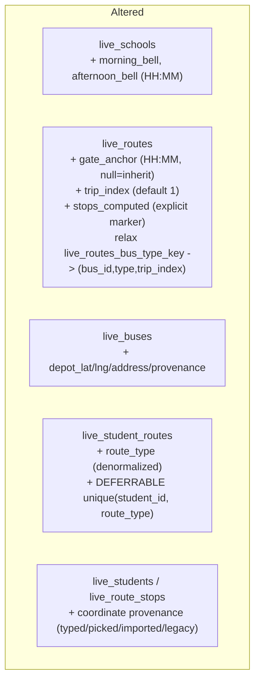
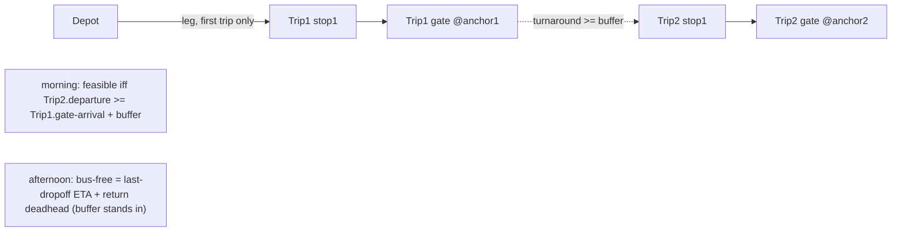

# feat: Route Planner — bell-time scheduling, place-picking, depot, multi-trip, allocation

## Summary

Implement the 7-item route-planner spec (R1–R23): a per-route gate-anchor time with backward scheduling, one unified place-picker for every location field, an overnight bus depot as a geometry leg, CSV import-time address triage with in-place repair, removal of the redundant Home Location field, multiple trips per bus per period, and one-morning-one-afternoon student allocation. One migration (009) carries every schema change; 15 implementation units land in a strict dependency order (prerequisites → backend core → frontend → certification).

---

## Problem Frame

The planner optimizes forward from student pickup times, so the operator cannot anchor a route to a bell time; every location field behaves differently, so addresses and pins drift; CSV failures vanish into a toast; a bus runs one route per period; and nothing stops a student being double-booked onto two morning routes. The requirements doc resolves all product ambiguity; this plan sequences the build around the verified interaction constraints (marker/duration prerequisites first, allocation before multi-trip, depot last).

---

## Requirements

Traceability to origin (docs/brainstorms/2026-07-09-route-planner-requirements.md, authoritative for wording).

- **Scheduling foundation** — R1 explicit previously-computed marker, R2 persist total_duration_s → U3 (schema U2).
- **Bell-time anchoring** — R3–R7 gate_anchor, school-bell default, backward solve, churn re-solve, clock/ordering discipline → U4 (UI U10).
- **Unified place-picking** — R8–R11 one primitive, Add Stop, Home Location removal, provenance → U9, U10, U11.
- **Depot** — R12–R14 bus attribute, geometry legs, no stop row → U7 (UI U13).
- **CSV triage** — R15–R18 import geocode, repair table, gated commit, route_name wiring → U8 (UI U12).
- **Multi-trip** — R19–R20 trip chains, turnaround feasibility → U6 (UI U13).
- **Allocation** — R21–R23 one-per-type, displacement, move-safe constraint → U5.

Acceptance examples AE1–AE7 are enforced in unit test scenarios (tagged `Covers AE<N>`).

---

## Key Technical Decisions

- **Migration 009 carries all schema changes**, ordered additive → backfill → constraints. One transaction on live (`migrate_handler` runs each file atomically) but per-statement-autocommit under `reset-local-db.sh` — carry an 008-style header documenting the reset-to-recover hazard. Rehearsed against seeded data. Next number after `backend/db/migrations/008_ops_refinement.sql`.
  - **Additive:** `live_schools.morning_bell`/`afternoon_bell` (text HH:MM); `live_routes.gate_anchor` (text HH:MM, nullable = inherit school bell), `trip_index` (int not null default 1), `stops_computed` (boolean not null default false — the explicit marker); `live_buses.depot_lat`/`depot_lng`/`depot_address`/`depot_provenance` (nullable); `live_student_routes.route_type` (text, **added nullable** — a non-empty table cannot take `NOT NULL` without a default and the seed re-insert path omits the column; it is backfilled then set not null); `live_students.provenance` (default **NULL**, not `legacy` — a `legacy` default would mislabel a freshly typed/picked home and defeat the picked-preservation rule; existing rows are backfilled to `legacy` explicitly). Each provenance column carries a NULL-permitting `CHECK (… in ('typed','picked','imported','legacy'))` per the 004/008 house style. `live_route_stops.provenance` is **not added** — stops are server-regenerated by `_insert_stop`/`_write_custom_stops`, which have no source provenance to write, so the column would be permanently dead data.
  - **Backfill (strictly before every constraint and `set not null`):** `stops_computed` = true where the route's gate row already carries a `scheduled_time` (preserves today's inferred behavior at the cutover); `route_type` from `live_routes.type` via join, then `set not null`; `trip_index` = 1 (natural default, safe against the existing `(bus,type)` uniqueness); existing coordinate provenance = `legacy`. Then the one-time allocation dedup + post-dedup reconciliation (see the allocation decision and System-Wide Impact).
  - **Constraints last:** `drop index if exists live_routes_bus_type_key` then recreate as `unique(bus_id, type, trip_index) where bus_id is not null` — dropping the old 2-column index is mandatory, since leaving it would silently forbid multi-trip. Add the deferrable allocation backstop (see below); a `DEFERRABLE` unique validates existing rows immediately, so the dedup must precede it.
- **The explicit `stops_computed` marker replaces the gate-row-time inference before any admin gate time is stored (R1).** Today `regenerate_route_stops` infers "geometry-computed" from the gate row carrying a `scheduled_time`. Once an operator types a gate time, that inference is ambiguous — a never-computed route with a typed gate time would take the preservation path and mispair times. Every read of "was this computed" switches to the column, and every gate-writing path sets it — including `_write_custom_stops` (the planner-save branch, a separate function outside `regenerate_route_stops`), so a route saved after 009 reports its true computed state at the next student-assignment handover. Hard prerequisite; lands in U3 before U4.
- **`total_duration_s` is persisted on auto recomputes (R2).** Today it is written only for planner-saved custom routes; the turnaround feasibility check (U6) needs the drive duration of auto routes, so `regenerate_route_stops` persists it on every google recompute. Prerequisite; lands in U3.
- **Gate anchor has one authority: school bell default → route override.** `live_schools` stores the bell (morning arrival, afternoon departure); a route's `gate_anchor` is null (inherit) or an override. Anchor resolution is a single helper — `resolve_gate_anchor(route, school)` for saved routes plus an explicit-anchor entry point for the planner preview — replacing the hardcoded 07:00/15:30 constants everywhere they appear (`fleet_dao` `_MORNING/_AFTERNOON_DEFAULT`, `fleet.py` route-options `default_anchor`). **The planner preview (`fleet.py` route-options) is itself a second, divergent anchor authority today:** it anchors on the earliest student `pickup_time` and forward-solves, so the gate ETA is an output, not the anchor (the exact single-anchor quirk the 2026-07-07 solution doc warns never to copy). Swapping only the default constant would leave the saved route bell-anchored while the preview the operator is looking at is not — two schedules for one route. Unifying it means route-options runs the same backward solve, which requires adding `gate_anchor` to `RouteOptionsPayload` (the unsaved preview has no persisted route to read) and feeding it the explicit-anchor entry point. One solve, no dual authorities.
- **Backward scheduling is forward fixed-point iteration (Google Routes has no arrive-by param — verified).** Compute the drive sequence, measure the gate ETA, shift the departure by the delta, re-measure — bounded at **4 iterations, ±60s tolerance**. The shift and the convergence test operate on the **raw cumulative `duration_s` (seconds)**, never the minute-truncated `HH:MM` strings the stop rows store (coarser than the tolerance). Because `route_geometry` requests `TRAFFIC_AWARE` predictive traffic keyed on `departureTime`, drive time is a function of departure `D(T)`; the fixed point converges when `|dD/dT| < 1` (smooth traffic, 1–2 iterations) but can **oscillate across a rush-hour discontinuity** where departing a few minutes earlier drops a congestion band. The fallback therefore keeps the **argmin-error iterate tracked across all iterations** (`argmin |gate_ETA − anchor|`), not the last iterate (which may be the worst oscillation value). Morning: iterate departure so the gate-arrival ETA hits the anchor; the anchor is resolved to the next **future** gate occurrence and candidate departures are derived as `future_gate − drive` (both future by construction — iterating a raw departure can land it in the past, which the Routes API rejects → failed call → needless degrade on late-day edits). Afternoon: the anchor IS the gate departure (the sequence starts at the gate), so it is a single forward solve from the anchor — no iteration needed. On non-convergence, keep the best (argmin-error) iterate, set `last_recalc_degraded = true`, and log a WARNING (honors the degraded-signal invariant — never silent).
- **Churn re-solves against the unchanged gate anchor (R6).** Adding/removing/moving a student triggers `regenerate_route_stops`, which reads the route's resolved anchor and re-solves; the gate time is an input to the solve, never an output of it. Pickup/drop times move; the promise to the school (gate time) does not.
- **The allocation constraint uses delete-before-insert plus a deferrable non-partial backstop (R23).** Partial unique indexes cannot be `DEFERRABLE` in Postgres (verified), and `_sync_routes` inserts new links before deleting removed ones — so a naive `unique(student_id, route_type)` partial index would 409 the common same-period move. Delete-before-insert is the **primary** guarantee (reorder `_sync_routes`); the `DEFERRABLE INITIALLY DEFERRED` unique on the denormalized `(student_id, route_type)` (non-partial, so it can defer — `route_type` is not-null for every link) is **defense-in-depth** against any surviving insert-first path. **The denormalized `route_type` needs a consistency mechanism** (see System-Wide Impact): a route can flip type (`update_route` writes `type` and already re-derives on a type change), which would leave its links' `route_type` stale and silently double-book a student onto two same-type routes — the exact invariant R21/R23 exist to hold. A trigger keeps `route_type` in sync (populating it on link insert — including seed inserts — and cascading a route type-flip to all its links). The one-time dedup in migration 009 resolves pre-existing double-allocations before the constraint is added; since `live_student_routes` has **no timestamp column**, "earliest" is defined by `live_routes.created_at asc, live_student_routes.id asc` (route-creation order — the closest real proxy), keeping one link per (student, type) and detaching (deleting) the rest. Detaching is a row delete with no application logic, so the dedup must then **re-derive `live_students.bus_id` for affected students and refresh the detached students' stale `live_route_stops`** (mirroring 007's post-dedup reconciliation); `run_stops` immutability keeps in-flight runs safe.
- **Displacement, not rejection (R22).** Assigning a student to a route of a period they already occupy vacates the prior same-period route in the same action (radio semantics). The DAO computes the target link set per type and syncs; the UI presents per-period route selection as single-select.
- **Multi-trip is `trip_index` on the route plus a turnaround feasibility gate (R19–R20).** Relaxing `unique(bus_id, type)` to `unique(bus_id, type, trip_index)` lets a bus hold ordered trips per period. A bus's trips within a period form a chain ordered by `gate_anchor`; feasibility is each later trip's solved departure ≥ the previous trip's **bus-free time** + the **turnaround buffer (global constant, default 15 min)**. Bus-free time is **period-asymmetric**: for a **morning** trip the bus is free at its gate *arrival* (the anchor); for an **afternoon** trip the bus is still out delivering at the anchor (gate *departure*) and is free only at `last-dropoff ETA + return-to-gate deadhead`. U3's persisted `total_duration_s` covers gate→last-stop but **not** the afternoon return leg, so the single global buffer explicitly stands in for that unmodeled, asymmetric deadhead this pass. Infeasible chains surface through the existing durable-warning channel (`last_recalc_degraded` + a route-card badge), never a hard block. **The run-layer cap stays per-(bus,date) and is NOT made trip-aware:** the separate `live_runs_active_bus_date_key` partial index (one non-completed run per bus per date) is what lets trips run at all — strictly complete-then-start, never concurrently — and every driver mid-run action (`write_position`, `toggle_boarding`, `dropoff_student`, `mark_student_absent`) reads `find_active_run_today` `limit 1` assuming ≤1 active run per bus. Making run gating trip-aware would allow two concurrent in-progress runs and make those actions non-deterministic. The only `trip_index` change is to the friendly route conflict pre-check `_check_route_bus_conflict`; `_derive_student_bus` is invariant to `trip_index` (a student has one route per type under R21, and both same-bus trips share `bus_id`) and is left unchanged.
- **Depot is a bus attribute entering only as geometry legs (R12–R14) — never a stop row (rejected design).** The depot prepends an origin leg on the bus's first morning trip (lowest `trip_index`) and appends a destination leg on its last afternoon trip (highest `trip_index`); it is passed to `route_geometry` as an extra waypoint at the sequence boundary, contributing drive time only. It is never inserted into `live_route_stops`, never numbered, never on a roster or parent view. **The morning prepend is not zip-symmetric with the afternoon append and must offset the ETA mapping:** the ETA→stop zip (`dict(zip(seq_keys, etas[:-1]))`) assumes `etas` aligns with the stop prefix. A prepended depot adds a leading element to `etas` (the depot departure) while `seq_keys` is unchanged, so a naive zip would shift every student's pickup by one leg and write the first student's time as the depot departure. The morning path therefore maps stops to `etas[1:-1]` when a depot origin is present. The **afternoon append is zip-safe by construction** (`zip` truncates to the shorter `seq_keys`; the trailing depot ETA falls off the tail) and needs no change. `gate_time = etas[-1]`, stop numbering, and `is_last` are untouched in both cases. A depot stop row was evaluated and rejected: it breaks gate-order arithmetic (`student_base`/`gate_order`), the ETA-to-stop zip, order preservation, and `is_last` run completion (all verified). Recorded in Scope Boundaries so it is not re-attempted.
- **CSV rows are geocoded at import and triaged resolved / ambiguous / failed, with a persistent repair table and gated commit (R15–R17).** Every row geocodes on upload; resolved rows carry a Google-provider tag, ambiguous rows carry the top candidate but **require explicit operator review** (no silent auto-accept — the ambiguous geocode discovered on the road is the failure the table exists to prevent), failed rows must be repaired via the PlacePicker or explicitly accepted-as-is (flagged). The import commits only when the list is cleared. Student-CSV route assignment goes through the existing `route_name` column via the same `_sync_routes` path (and R21 constraint), with **regeneration batched once per affected route** across the import (per-row regeneration = O(rows×routes) Google calls in one Lambda invocation — verified burst risk).
- **One PlacePicker primitive with provenance (R8, R11).** A single React component resolves any location to `{address, lat, lng, provenance}` via autocomplete, map pin, or reverse-geocode, reused by Add Stop, the student home, the depot, and CSV repair. Provenance enum `{typed, picked, imported, legacy}`; a background re-geocode may refine `typed`/`imported`/`legacy` coordinates but must not overwrite `picked` (the operator's deliberate pin). Coordinates remain the sibling-grouping identity (`_group_key`, 6-decimal round) — the field removal in R10 is UI-only; the data is untouched.
- **No new infrastructure or env.** Geometry uses the wired `GOOGLE_MAPS_API_KEY` (SSM `/saferide/google-maps-api-key`, af-south-1). The local container lacks the key, so route-optimization/anchor/feasibility tests use fake geo providers at the DAO/unit level (the pattern the ops-refinement plan established); API-driven integration tests exercise the degraded path. `infra/backend/template.yaml` and `deploy-backend.sh` are untouched; post-release verification is behavioral.

---

## High-Level Technical Design

### Schema delta (migration 009)



### Backward-scheduling solve (morning)

```mermaid
sequenceDiagram
  participant P as planner (regenerate)
  participant A as resolve_gate_anchor
  participant G as geo route_geometry
  A-->>P: anchor = route.gate_anchor or school.morning_bell
  loop up to 4 iterations, tol 60s (raw seconds)
    P->>G: solve future departure = future_gate - drive
    G-->>P: gate ETA (cumulative duration_s)
    P->>P: shift departure by (anchor - gate_ETA); track argmin-error iterate
  end
  P->>P: converged -> write stop times; else argmin-error iterate + last_recalc_degraded=true + WARN
```

### Trip chain + depot (per bus, morning)



---

## System-Wide Impact

Cross-cutting mechanisms the units share; each row names the owning unit(s) and the deepening finding that surfaced it.

- **Denormalization consistency (`route_type`).** `live_student_routes.route_type` is denormalized from `live_routes.type` to make the deferrable cross-period uniqueness expressible (a partial unique can't defer). It goes stale two ways: a route type-flip via `update_route`, and a seed/`_sync_routes` insert that omits the column. A trigger maintains it — `BEFORE INSERT/UPDATE` on `live_student_routes` sets `route_type` from the parent route, and `AFTER UPDATE OF type` on `live_routes` cascades a flip to every link. This one mechanism also lets `route_type` be `NOT NULL` without editing the seed files (which insert links without it). Owners: U2 (trigger DDL), U5 (behavioral coverage). *(data-integrity 1, 2b)*
- **Post-dedup reconciliation.** The one-time allocation dedup deletes surplus links; a pure-SQL migration runs no application logic, so it must then re-derive `live_students.bus_id` for affected students (drives the pre-run driver roster) and refresh the detached students' stale `live_route_stops` rows — mirroring 007's post-dedup sweep. `run_stops` is a frozen per-run snapshot (copied by explicit column list), so in-flight runs are unaffected. Owner: U2. *(data-integrity 5)*
- **Marker forward-write parity.** `stops_computed` is set on every gate-writing path, including `_write_custom_stops` (the planner-save branch outside `regenerate_route_stops`), so a route created after 009 reports its true computed state at the next student-assignment handover. Owner: U3. *(data-integrity 3)*
- **Index lifecycle.** Migration 009 explicitly `drop`s the old `live_routes_bus_type_key` (2-column) before recreating the 3-column `(bus_id, type, trip_index)` version; leaving the old index silently forbids multi-trip with no schema error. Owner: U2. *(data-integrity 4)*
- **Second anchor authority (planner preview).** `fleet.py` route-options anchors on `pickup_time` and forward-solves — a schedule divergent from the bell-anchored saved route. Unifying requires route-options to run the same backward solve, with `gate_anchor` added to `RouteOptionsPayload` and an explicit-anchor entry point on the resolver. Owners: U4 (solve + payload), U10 (UI field). *(architecture F4, F5)*
- **Turnaround bus-free asymmetry.** Feasibility compares against a per-period "bus-free time" — morning gate arrival vs afternoon (last-dropoff ETA + unmodeled return deadhead) — with the global buffer standing in for the afternoon return leg that `total_duration_s` does not capture. Owner: U6. *(architecture F7)*
- **Run-cap invariant preserved.** The per-(bus,date) active-run index stays; trips are strictly sequential (complete-then-start). No `run_dao` change — only `_check_route_bus_conflict` gains `trip_index`. Owner: U6. *(architecture F8, F14)*
- **Enum discipline.** `provenance`/`depot_provenance` carry NULL-permitting CHECK constraints in the four-value enum; `live_students.provenance` defaults NULL (not `legacy`, which would mislabel new picks); `live_route_stops.provenance` is not added (server-regenerated stops have no source provenance — dead column). Owner: U2. *(data-integrity 6)*
- **Migration transactionality.** One transaction on live (`migrate_handler`), per-statement-autocommit under `reset-local-db.sh` — 008-style header, with dedup/backfill strictly before every constraint and `set not null` (a `DEFERRABLE` unique still validates existing rows immediately). Owner: U2. *(data-integrity 7)*

---

## Implementation Units

Phases group units; hot files forcing sequence: `backend/app/dao/fleet_dao.py` (U3 → U4 → U6 → U7), `backend/app/dao/student_live_dao.py` (`_sync_routes`: U5 → U8), `backend/app/services/geo_service.py` (U3/U4), `frontend/src/features/admin/FleetMapPage.tsx` (U10, U12, U13), `frontend/src/features/admin/StudentsPage.tsx` (U11). The PlacePicker (U9) precedes all UI units.

### Phase A — Foundations

### U1. Baseline verification
- **Goal:** Prove suites green on unmodified main before feature work.
- **Requirements:** precondition.
- **Dependencies:** none.
- **Files:** none.
- **Approach:** `scripts/start-local.sh`, hot-patch the API container if the registry is stalled, `scripts/certify.sh` exits 0; record counts.
- **Test scenarios:** none — runs suites.
- **Verification:** certify green.

### U2. Migration 009: schema for the whole feature set
- **Goal:** All schema changes in one ordered migration.
- **Requirements:** R1, R2, R3, R4, R12, R19, R21, R23; R8/R10/R11 (provenance).
- **Dependencies:** U1.
- **Files:** `backend/db/migrations/009_route_planner.sql`.
- **Approach:** 008-style header (one-transaction-on-live / per-statement-local / reset-to-recover). Strict phase ordering, dedup and backfill before every constraint and `set not null`:
  1. **Additive columns** — schools `morning_bell`/`afternoon_bell`; routes `gate_anchor`/`trip_index`(default 1)/`stops_computed`(default false); buses `depot_lat`/`depot_lng`/`depot_address`/`depot_provenance`; `live_student_routes.route_type` (**nullable** at first); `live_students.provenance` (default **NULL**). NULL-permitting `CHECK (… in ('typed','picked','imported','legacy'))` on each provenance column. Do **not** add `live_route_stops.provenance` (dead column — no source provenance to write).
  2. **`route_type` trigger** — `BEFORE INSERT OR UPDATE` on `live_student_routes` sets `route_type` from the parent `live_routes.type`; `AFTER UPDATE OF type` on `live_routes` cascades the new type to all its links. This covers seed inserts and route type-flips without touching seed SQL (see System-Wide Impact).
  3. **Backfill** — `stops_computed` = true where the gate row already carries a `scheduled_time`; `route_type` from the `live_routes` join, then `alter … set not null`; `trip_index` = 1; existing coordinate `provenance` = `legacy`.
  4. **Allocation dedup + reconciliation** — delete surplus same-period links keeping one per (student, type) ordered by `live_routes.created_at asc, live_student_routes.id asc` (no timestamp on the link table); then re-derive `live_students.bus_id` for affected students and refresh their stale `live_route_stops` (mirror 007).
  5. **Constraints last** — `drop index if exists live_routes_bus_type_key`, recreate `unique(bus_id, type, trip_index) where bus_id is not null`; add `DEFERRABLE INITIALLY DEFERRED` `unique(student_id, route_type)` on `live_student_routes`.
- **Patterns to follow:** `backend/db/migrations/007_spec_refinement.sql` (route dedup + partial unique + post-dedup bus re-derivation at ~119-128), `008_ops_refinement.sql` (CHECK recreation + header).
- **Test scenarios:** Rehearsal against seeded data — a route with computed stops backfills `stops_computed=true`, a never-computed route backfills false; every `live_student_route` gets `route_type` matching its route (via trigger + backfill); flipping a route's `type` cascades `route_type` to its links (no stale double-book); a pre-existing student on two morning routes is deduped to one (earliest by route-creation) and the detached student's `bus_id`/stops are reconciled; a same-period move (delete+insert in one deferred transaction) does not violate the deferrable constraint; the old `live_routes_bus_type_key` is dropped so two routes on one bus with `trip_index` 1 and 2 coexist. From-scratch: `scripts/reset-local-db.sh` applies 009 clean **and the three seed re-inserts (which omit `route_type`) succeed** because the trigger populates it before the `not null` check.
- **Verification:** Rehearsal + from-scratch pass (including seed re-insert); backend unit suite green.

### U3. Scheduling prerequisites: explicit marker + persist duration
- **Goal:** Replace the gate-row-time inference with `stops_computed`; persist `total_duration_s` on auto recomputes.
- **Requirements:** R1, R2.
- **Dependencies:** U2.
- **Files:** `backend/app/dao/fleet_dao.py`, `backend/tests/integration/test_route_ordering.py`.
- **Approach:** Set `stops_computed` explicitly on every gate-writing path — the `regenerate_route_stops` branches (google, degraded, manual) **and** `_write_custom_stops` (the planner-save branch, a separate function that also writes a gate `scheduled_time`; without it, a custom route saved after 009 would read `stops_computed=false` and force a wholesale rebuild at the next handover where today it preserves). All preservation logic keys off the column, not the gate row's time. Persist `total_duration_s` from the geometry result on every google recompute (today only custom saves write it). No behavior change beyond the marker source and the duration write.
- **Patterns to follow:** the existing preservation/degraded branches in `regenerate_route_stops`; `_write_custom_stops` gate-write.
- **Test scenarios:** A google recompute sets stops_computed=true and writes total_duration_s; a custom planner-save sets stops_computed=true (via `_write_custom_stops`); a degraded recompute preserves prior order/times and keeps stops_computed as-is; a never-computed route reads stops_computed=false (not inferred from a null gate time); a post-009 custom route then handed to student-assignment preserves (not rebuilds) because the marker is true; existing ordering tests stay green unchanged.
- **Verification:** Route-ordering integration module green; unit suite green.

### Phase B — Backend core

### U4. Bell-time-anchored backward scheduling
- **Goal:** Gate anchor (school default → route override), backward solve via fixed-point iteration, churn re-solve.
- **Requirements:** R3, R4, R5, R6, R7.
- **Dependencies:** U2, U3.
- **Files:** `backend/app/dao/fleet_dao.py`, `backend/app/services/geo_service.py`, `backend/app/api/fleet.py`, `backend/tests/integration/test_route_ordering.py`, `backend/tests/services/test_geo_service.py`.
- **Approach:** New `resolve_gate_anchor(route, school)` (route.gate_anchor or school bell for the type) **plus an explicit-anchor entry point** for the planner preview, replacing the hardcoded defaults in `fleet_dao` `_MORNING/_AFTERNOON_DEFAULT` and `fleet.py` route-options `default_anchor`. **Route-options must run the same backward solve, not just inherit the new default** — today it anchors on the earliest `pickup_time` and forward-solves (a second authority); add `gate_anchor` to `RouteOptionsPayload` and drive the preview through the explicit-anchor entry point so preview and saved route agree. Morning: fixed-point iterate the departure so the gate-arrival ETA hits the anchor (≤4 iterations, ±60s), computing the shift and convergence test on **raw cumulative `duration_s` seconds** (not the minute-truncated HH:MM); resolve the anchor to the next **future** gate occurrence and derive candidate departures as `future_gate − drive` so `departureTime` is never in the past. Afternoon: single forward solve from the anchor (gate leads), no iteration. Non-convergence (including rush-hour oscillation) → keep the **argmin-error iterate across all iterations** + `last_recalc_degraded=true` + WARN. Churn (`_sync_routes` → regenerate) re-solves against the unchanged anchor. Update `set_student_pickup_time`'s docstring/semantics: under bell-anchoring a `pickup_time` edit no longer re-anchors a computed morning route (it only affects fallback ordering) — retire the stale "re-anchors the morning departure" contract. Honor clock-class discipline and ordering authority (custom>manual>auto unchanged).
- **Patterns to follow:** `geo_service.route_geometry`/`next_departure` (future-time guard); the anchor-read-before-delete rule from the ops-refinement plan; degraded-signal persistence; docs/solutions/2026-07-07 (the single-anchor quirk not to copy into the preview).
- **Test scenarios:** Covers AE1. Fake provider with known legs: morning route with gate_anchor 07:45 converges to a 07:45 gate ETA and earlier departure; adding a student re-solves to an earlier departure, gate stays 07:45; **route-options preview and the saved route produce the same bell-anchored gate time** (preview/persist parity — the one authority is unit-verified, not deferred to e2e); afternoon route with a 15:30 anchor produces gate departure at 15:30 (no iteration); a route with null gate_anchor inherits the school bell; an oscillating (non-convergent) solve keeps the argmin-error iterate and sets last_recalc_degraded; a `pickup_time` edit does not move a computed bell-anchored morning schedule; the old hardcoded-default behavior is gone (assert anchor comes from school/route, not a constant).
- **Verification:** Route-ordering + geo-service suites green with fake providers; no live Google calls in tests.

### U5. One-per-type allocation constraint (ships before multi-trip)
- **Goal:** At most one morning + one afternoon route per student, move-safe.
- **Requirements:** R21, R22, R23.
- **Dependencies:** U2.
- **Files:** `backend/app/dao/student_live_dao.py`, `backend/app/api/students_live.py`, `backend/tests/integration/test_students_parents.py`.
- **Approach:** Reorder `_sync_routes` to delete-before-insert — the **primary** guarantee that a same-period move never trips the backstop. `route_type` is maintained by the U2 trigger (not hand-written per insert), so it is correct for API inserts, seed inserts, and route type-flips alike. The DAO enforces at most one link per (student, type): assigning to a new route of a period vacates the prior same-period route in the same transaction (displacement); the deferrable `unique(student_id, route_type)` is defense-in-depth. Add a **friendly server error** for the one representable collision — a single `route_ids` payload naming two routes of the same period (e.g. morning-A and morning-B together) would insert both and raise a raw deferred-unique violation at commit (a 500); catch it and return the dual-layer 409 instead.
- **Patterns to follow:** the dual-layer (friendly pre-check + DB backstop) pattern from migration 007/fleet_dao; `_sync_routes` link handling; the U2 `route_type` trigger.
- **Test scenarios:** Covers AE7. A student on Morning A assigned to Morning B ends on B only, no error, single transaction; assigning to an Afternoon route leaves the Morning link intact; a pre-existing double-allocation (created via direct SQL) is impossible to recreate through the API; delete-before-insert ordering verified (the move does not 409); a single payload naming two same-period routes returns a friendly 409, not a 500; route_type matches the route on every link (trigger-maintained) and stays correct after a route type-flip.
- **Verification:** Students/parents integration module green; existing assignment tests green.

### U6. Multi-trip chains with turnaround feasibility
- **Goal:** A bus runs ordered trips per period; infeasible chains warn.
- **Requirements:** R19, R20.
- **Dependencies:** U2, U4, U5.
- **Files:** `backend/app/dao/fleet_dao.py`, `backend/app/api/fleet.py`, `backend/tests/integration/test_route_ordering.py`, `backend/tests/integration/test_route_conflicts.py`, `backend/tests/integration/test_driver_lifecycle.py` (sequential-trip run test). (`run_dao.py` is **read and verified unchanged**, not edited — see below.)
- **Approach:** Route create/update accepts `trip_index`; the friendly conflict pre-check `_check_route_bus_conflict` keys on (bus_id, type, trip_index) matching the relaxed unique index. A per-bus-per-period chain (ordered by gate_anchor) is feasibility-checked against each prior trip's **period-asymmetric bus-free time**: morning = gate arrival (anchor); afternoon = last-dropoff ETA + return-to-gate deadhead — with the turnaround buffer (global constant, default 15 min, in config) standing in for the unmodeled afternoon return leg (`total_duration_s` from U3 covers gate→last-stop only). Feasible iff later trip's solved departure ≥ prior bus-free time + buffer. Infeasible → `last_recalc_degraded=true` + route-card warning (durable channel), never a hard block. **The run layer is deliberately untouched:** the per-(bus,date) active-run cap (`live_runs_active_bus_date_key` + `_assert_no_active_run_conflict` + `find_active_run_today`) is what makes sequential trips work — making it trip-aware would allow concurrent in-progress runs and break every `limit 1` driver action. `_derive_student_bus` is left unchanged (invariant to trip_index).
- **Patterns to follow:** `_check_route_bus_conflict` (extend the key); the durable-degraded-badge channel; `total_duration_s` from U3; the run-cap invariant in `run_dao.py` (verify, do not change).
- **Test scenarios:** Covers AE6. Two morning routes on one bus (trip_index 1,2, anchors 07:30 & 08:15) coexist and the morning chain is feasible; changing the second anchor to 07:40 makes turnaround infeasible → degraded flag + warning, not a 409; an **afternoon** chain is feasibility-checked against last-dropoff + return deadhead (its own scenario, not only the morning case); a third trip is allowed; the buffer constant is read from config; a bus's trip2 run **starts only after trip1's run completes** (the per-(bus,date) cap still holds — assert the second concurrent start is blocked, the post-completion start succeeds).
- **Verification:** Route-ordering + route-conflicts integration green; run-lifecycle sequential-trip test green (run cap unchanged).

### U7. Depot as geometry legs
- **Goal:** Overnight parking prepends/appends drive legs on first-morning/last-afternoon trips.
- **Requirements:** R12, R13, R14.
- **Dependencies:** U2, U4, U6.
- **Files:** `backend/app/dao/fleet_dao.py`, `backend/app/api/fleet.py`, `backend/tests/integration/test_route_ordering.py`.
- **Approach:** Depot fields on the bus (set via the API from the PlacePicker). In `regenerate_route_stops`, when a route is the bus's lowest-trip_index morning route, prepend the depot as the geometry origin waypoint; when it is the highest-trip_index afternoon route, append the depot as the destination waypoint. The depot contributes drive time to the first/last leg only; it is never inserted into `live_route_stops`, never numbered, never on a roster. **The morning prepend must offset the ETA→stop mapping:** a prepended depot adds a leading element to `etas` (the depot departure) while `seq_keys` is unchanged, so the morning path maps stops to `etas[1:-1]` when a depot origin is present — otherwise every student's pickup shifts by one leg and the first pickup is silently written as the depot departure. The afternoon append is zip-safe (the trailing depot ETA falls off `zip`'s shorter side) and needs no offset. Stop numbering, `gate_time = etas[-1]`, order preservation, and `is_last` completion are untouched in both cases (the depot is outside the stop sequence).
- **Patterns to follow:** the `seq`/`seq_keys` construction, the `dict(zip(seq_keys, etas[:-1]))` mapping, and the `route_geometry` waypoint list in `regenerate_route_stops`; the rejected depot-as-stop-row design (do not add a stop row).
- **Test scenarios:** Covers AE4. A bus with a depot: its first morning trip's geometry starts depot→first-stop, and **each student's ETA equals the no-depot ETA shifted by exactly the depot→first-stop leg — the first pickup is NOT the depot departure** (the F10 off-by-one is unit-gated, not just "extra leg reflected"); its last afternoon trip ends last-stop→depot with unchanged stop times; stop rows, roster, and parent views are byte-unchanged (no depot stop); a bus with no depot behaves exactly as before; a middle trip (not first/last) gets no depot leg.
- **Verification:** Route-ordering integration green with the per-stop alignment assertion; roster/parent snapshots unchanged.

### U8. CSV import-time geocode triage + route_name wiring
- **Goal:** Geocode CSV rows at import, triage, and assign students via route_name with batched regeneration.
- **Requirements:** R15, R16, R17, R18.
- **Dependencies:** U2, U5.
- **Files:** `backend/app/api/fleet.py`, `backend/app/api/students_live.py`, `backend/app/dao/student_live_dao.py`, `backend/app/services/geo_service.py`, `backend/tests/integration/test_planner_routes.py`, `backend/tests/integration/test_students_parents.py`.
- **Approach:** On CSV upload (planner stops + student bulk), geocode each row and tag resolved / ambiguous / failed with the provider. The endpoint returns the triage result; the import is a two-step (upload→review→commit) so unresolved rows can be repaired. Student CSV honors `route_name`: resolve to a route id and assign through `_sync_routes` (U5 constraint applies), but **collect all assignments and regenerate each affected route once** after the batch, not per row (Lambda burst guard). Ambiguous rows require explicit accept (no auto-accept).
- **Patterns to follow:** existing bulk-upload validation in `students_live.py`; `geo_service.geocode` provider tagging; the batched-regeneration guard.
- **Test scenarios:** Covers AE5. A CSV with resolved/ambiguous/failed rows returns each tier tagged; committing before repair is refused; a student CSV with route_name assigns via _sync_routes and regenerates each route exactly once regardless of row count (assert call count); an ambiguous row is not auto-committed; provider tag is present on resolved rows.
- **Verification:** Planner-routes + students integration green; regeneration-call-count assertion holds.

### Phase C — Frontend

### U9. PlacePicker primitive
- **Goal:** One resolved-place control: autocomplete + map pin + reverse-geocode → {address, lat, lng, provenance}.
- **Requirements:** R8, R11.
- **Dependencies:** none (frontend-only; consumes existing geo endpoints).
- **Files:** `frontend/src/features/admin/components/PlacePicker.tsx` (new), `frontend/tests/unit/placePicker.test.ts` (new).
- **Approach:** Compose the existing `AddressAutocomplete` + `MapPicker` into one controlled component whose value is `{address, lat, lng, provenance}`. Typing+selecting a suggestion → provenance `typed`; dropping/dragging a pin → `picked` (and reverse-geocode fills the address); a value loaded from data keeps its stored provenance. Expose a pure `nextProvenance(prevProvenance, changeSource)` helper (picked never downgraded by a later address edit).
- **Patterns to follow:** `AddressAutocomplete.tsx`, `MapPicker.tsx`, the pure-helper test idiom (`frontend/tests/unit/`).
- **Test scenarios:** `nextProvenance` — address edit over a `picked` value stays `picked`; address select sets `typed`; pin drop sets `picked`; loaded `legacy` upgrades to `typed`/`picked` on edit. Component wiring is exercised via the consuming e2e in U14.
- **Verification:** tsc + vitest green.

### U10. Planner Add Stop + gate-anchor input
- **Goal:** Add Stop uses the PlacePicker; the planner exposes the route's gate-anchor time.
- **Requirements:** R3 (UI), R9.
- **Dependencies:** U9, U4.
- **Files:** `frontend/src/features/admin/FleetMapPage.tsx`.
- **Approach:** Add Stop resolves through the PlacePicker (autocomplete or map pin interchangeably). The planner shows the route's gate-anchor time (defaulted from the school bell, editable) and sends it as `gate_anchor` on the route-options request, so the preview runs the same backward solve as the saved route (U4). "Optimize" re-solves against the anchor, surfacing the degraded badge when non-convergent.
- **Test scenarios:** Covers AE2 (via U14 e2e): adding a stop by autocomplete and by map pin both yield a stop with address+coordinates; the gate-anchor field defaults from the school bell and is editable; a degraded solve shows the warning.
- **Verification:** tsc + vitest green; e2e in U14.

### U11. Student form: remove Home Location, fold map-picking into PlacePicker
- **Goal:** One home-address control with map-picking; no standalone coordinate field.
- **Requirements:** R10, R11.
- **Dependencies:** U9.
- **Files:** `frontend/src/features/admin/StudentsPage.tsx`.
- **Approach:** Replace the "Home address" autocomplete + separate "Home location" MapPicker (`StudentsPage.tsx:502-521`) with the single PlacePicker. Coordinates persist as before (home_lat/home_lng); provenance is sent. The standalone coordinate-display field is removed; map-picking survives inside the PlacePicker.
- **Test scenarios:** Covers AE3 (via U14 e2e): the form shows one home control, no separate coordinate field; dropping a pin sets coordinates and provenance `picked`; editing the address text afterward does not move the pin; saving persists home_lat/home_lng.
- **Verification:** tsc + vitest green; e2e in U14.

### U12. CSV repair table UI
- **Goal:** Persistent repair table for unresolved CSV rows, fixable with the PlacePicker.
- **Requirements:** R16, R17.
- **Dependencies:** U9, U8.
- **Files:** `frontend/src/features/admin/components/PlannerCsvDialog.tsx`, `frontend/src/features/admin/FleetMapPage.tsx`.
- **Approach:** After upload, show resolved/ambiguous/failed rows as a table (not a toast); each unresolved row has an inline PlacePicker fix and a confidence/provider indicator; ambiguous rows require explicit accept; commit is disabled until every row is resolved or accepted-as-is (accepted rows flagged).
- **Test scenarios:** Covers AE5 (via U14 e2e): three unresolvable rows appear as a table; two fixed via PlacePicker, one accepted-as-is; commit enables only when the list is cleared; the accepted row is flagged.
- **Verification:** tsc + vitest green; e2e in U14.

### U13. Multi-trip + depot admin UI
- **Goal:** Assign multiple trips per bus/period, set the depot, see feasibility warnings.
- **Requirements:** R12 (UI), R19, R20 (UI).
- **Dependencies:** U6, U7, U9.
- **Files:** `frontend/src/features/admin/FleetMapPage.tsx`, `frontend/src/features/admin/RoutesPage.tsx`.
- **Approach:** Routes can be assigned a bus + trip_index for a period (more than one per period allowed); the bus's depot is set via the PlacePicker; infeasible trip chains show the durable warning badge (from `last_recalc_degraded`). The per-bus rotation-strip visualization is deferred (see Scope Boundaries) — this pass surfaces trips as route cards with the feasibility badge.
- **Test scenarios:** Covers AE6 (via U14 e2e): two morning trips on one bus are assignable; an infeasible chain shows the warning; setting a depot persists it; the depot never appears as a stop.
- **Verification:** tsc + vitest green; e2e in U14.

### Phase D — Surfacing & certification

### U14. Cross-surface e2e journeys
- **Goal:** End-to-end proof of the operator flows.
- **Requirements:** all UI R-ids; AE1–AE7.
- **Dependencies:** U10–U13.
- **Files:** `frontend/tests/e2e/admin-crud.spec.ts`, `frontend/tests/e2e/planner.spec.ts` (new or extend), `frontend/tests/e2e/helpers.ts`.
- **Approach:** Journeys with seeded fixtures: (a) set a route gate anchor, add stops by autocomplete + pin, optimize, see bell-anchored times; (b) student form has one home control, pin survives an address edit; (c) CSV with a bad address → repair table → fix → commit; (d) assign a bus two morning trips, set a depot, see stop numbering unchanged and a feasibility warning on an infeasible chain; (e) move a student between same-period routes with no error.
- **Test scenarios:** the five journeys (AE1–AE7).
- **Verification:** Playwright suite green locally.

### U15. Full certification
- **Goal:** Complete gate proves the branch.
- **Requirements:** all; regression.
- **Dependencies:** U1–U14.
- **Files:** reconciliation only.
- **Approach:** `scripts/certify.sh` (hot-patch the API container first if the registry is stalled); reconcile suite drift from new columns/payloads; record final counts.
- **Test scenarios:** none — runs and reconciles.
- **Verification:** certify exits 0; counts recorded.

---

## Assumptions

- Certification was green at merge `d87fe4d`; U1 verifies.
- The Docker registry stall (session memory) may persist; the compose-cp hot-patch is the workaround.
- Google Routes has no arrive-by parameter (verified); backward scheduling is forward iteration. Tests use fake providers (the container lacks the maps key); no live Google calls in tests.
- Home coordinates are load-bearing (sibling grouping via `_group_key`, 6-decimal round); removing the coordinate field is UI-only.
- The student bulk-upload route-name column exists but is ignored today (verified); wiring is additive.
- Standing invariants honored: ordering authority custom>manual>auto, scheduled_time ownership by mode, degraded-signal persistence (silent degradation banned), run-snapshot immutability, morning-clock pickup_time discipline (docs/solutions/2026-07-07).

---

## Scope Boundaries

Carried from origin: no joint bell-time optimization; no nightly automatic rebuild; stops stay student-home-derived (no first-class shared stop entity); turnaround buffer is a single global value this pass.

**Rejected by design:** depot as a boardable stop row — breaks gate-order arithmetic, the ETA-to-stop zip, order preservation, and `is_last` run completion (verified). The depot is a geometry leg (U7). Recorded so it is not re-attempted.

### Deferred to Follow-Up Work

- Per-bus rotation-strip visualization (all trips + layovers on one timeline). The trip-chain data model (U6) supports it; the Gantt UI is a follow-up surface.
- Per-route or traffic-aware turnaround buffers (global constant this pass).
- Corner/shared named stops with walk-to policies (coordinate coherence is enforced by provenance, not a new entity).

---

## Risks & Dependencies

- **`fleet_dao.regenerate_route_stops` is the hottest file** (U3→U4→U6→U7 all touch it). Mitigation: strict unit sequencing; each unit rides `test_route_ordering.py` as the regression net; the marker/duration prerequisite (U3) lands before the anchor change (U4).
- **Fixed-point iteration cost:** up to 4 `route_geometry` calls per morning solve (vs 1 today) on every roster change. Mitigation: afternoon needs no iteration; convergence is typically ≤2; degraded fallback bounds the worst case. Accepted at fleet scale.
- **Allocation constraint vs the common move:** delete-before-insert (primary) + deferrable non-partial backstop (partial can't defer — verified). Mitigation: U5's move test is the regression net; the dedup migration clears pre-existing violations before the constraint applies.
- **Denormalized `route_type` staleness (P0):** a route type-flip or a `route_type`-omitting insert would silently double-book a student onto two same-type routes. Mitigation: the U2 trigger maintains `route_type` on insert and cascades type-flips; U5's type-flip test is the regression net. Without this the deferrable constraint enforces nothing on a flipped route.
- **Run-cap invariant (P0):** the per-(bus,date) active-run cap must NOT become trip-aware — concurrent in-progress runs would make every `limit 1` driver action non-deterministic. Mitigation: U6 edits only `_check_route_bus_conflict`; `run_dao` is verified unchanged; a sequential-trip run test proves trip2 starts only after trip1 completes.
- **CSV regeneration burst:** batched per-route (verified O(rows×routes) risk). Mitigation: U8 asserts the per-route regeneration call count is independent of row count.
- **Depot morning-prepend off-by-one (High):** a prepended depot shifts the ETA→stop zip so every pickup lands one leg early and the first pickup is written as the depot departure. Mitigation: the morning path maps stops to `etas[1:-1]`; U7's per-stop alignment assertion gates it (a loose "extra leg reflected" check would pass the bug). The afternoon append is zip-safe.
- **Depot arithmetic:** the depot must stay outside the stop sequence. Mitigation: U7 asserts stop numbering, roster, and parent views are byte-unchanged vs no-depot.
- **Fixed-point non-convergence across rush-hour traffic:** `|dD/dT|>1` can oscillate. Mitigation: shift/test on raw seconds, keep the argmin-error iterate, cap at 4 iterations, durable degrade — never silent (U4).
- **Post-release live parity:** no template/deploy change; after release verify on live one bell-anchored optimize (`stops_recalculated: true` with the wired key), one multi-trip assignment with a feasibility warning, one depot round-trip, one CSV repair.

---

## Sources & Research

- Origin requirements: docs/brainstorms/2026-07-09-route-planner-requirements.md; settled ideation + build order + rejected designs: docs/ideation/2026-07-09-route-planner-specs-ideation.md.
- Schemas: `backend/db/migrations/004_live_model.sql` (live_schools/buses/routes/route_stops/student_routes), `007_spec_refinement.sql` (live_routes_bus_type_key, route/student dedup), `008_ops_refinement.sql`.
- Scheduling/anchor/preservation: `backend/app/dao/fleet_dao.py` (`regenerate_route_stops`, `_group_key`, seq construction ~173-216, gate arithmetic ~413-414, previously-computed marker), `backend/app/services/geo_service.py` (route_geometry, next_departure, optimize), `backend/app/api/fleet.py` (route-options, hardcoded defaults ~342), docs/solutions/2026-07-07-pickup-time-is-morning-clock.md.
- Allocation/multi-trip: `backend/app/dao/student_live_dao.py` (`_sync_routes` insert-before-delete), `backend/app/dao/run_dao.py` (active-run gating, `is_last`), `_check_route_bus_conflict` in fleet_dao.
- Student form + place fields: `frontend/src/features/admin/StudentsPage.tsx:502-521`, `frontend/src/features/admin/components/AddressAutocomplete.tsx`, `MapPicker.tsx`, `FleetMapPage.tsx`, `PlannerCsvDialog.tsx`.
- Prior plan patterns: docs/plans/2026-07-06-001-feat-ops-refinement-plan.md.
