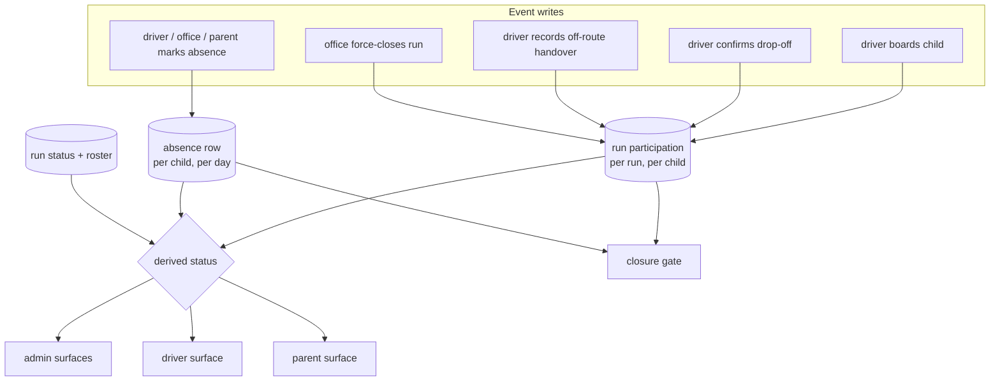
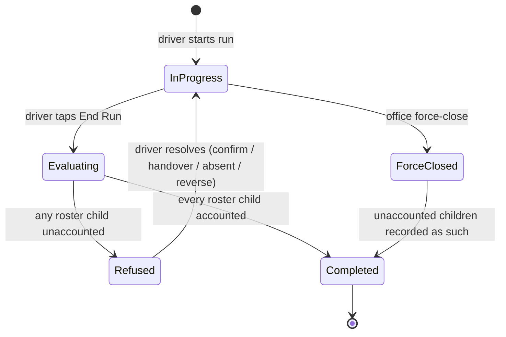

# feat: Status lifecycle consistency across students, buses and runs

## Summary

Make every student, bus and run status event-written and consistent across the admin, driver and parent surfaces. A per-run participation record becomes the source of truth for who boarded and who was dropped off, runs cannot close with unaccounted children, bus state becomes derived, and all three role views read one shared label vocabulary. Delivered in three releases: the schema alone, then the fleet, vocabulary and alert work that needs only the schema, then participation and the closure gate.

---

## Problem Frame

The platform is entering a pilot with a real school. The origin document records four defect classes; two of them produce statements that are not true, and both trace to the same structural fact: participation has no record. Boarding exists only in `live_students.status`, a single mutable column with no history, so a run cannot reconstruct who was actually on it. That is why ending a run sweeps every non-absent roster child to a terminal status, why the run-end path snapshots boarded children into memory before the sweep just to address notifications, and why a read-time staleness derivation exists at all.

Research confirmed the origin drew its staging line in the wrong place. Three of the requirements it put in the first stage are unimplementable without the record it deferred to the second:

- The office force-close records children as **unaccounted**, but no storage carries that value — and `backend/app/dao/status_sql.py:49-56` flips a raw `on-bus` child to `at-home` as soon as no non-completed run today contains them. The instant a force-close marks the run completed, every unaccounted child reads "At home": the exact manufactured claim the force-close exists to avoid.
- The closure gate must know who boarded *on this run*, but status is global. A morning run left open into the afternoon, plus a cross-bus rider auto-boarded by a second bus, closes falsely and sends "reached school safely" while the child rides home on another vehicle.
- Driver reversal is scoped to the driver's own action, but drop-offs and boardings record no actor, no timestamp and no run reference. Only absences carry `marked_by`.

Clean run deletion needs the same record: `RunDao.delete_run` maps only `on-bus` → `at-school`, and pre-run state is recorded nowhere.

So the closure work and the participation record ship together — what the origin staged as a follow-up becomes the foundation that half is built on. The staging still holds for everything else, and in the other direction: the bus derivation, the no-progress flag, the run-lifecycle alerts and the label vocabulary need only the schema, so they reach the pilot school ahead of the participation build rather than behind it.

---

## Requirements

Plan requirements trace to origin R-IDs. The origin document is authoritative on behaviour; this section is the reviewer's checklist for what must be true when the work ships.

### Participation and status derivation

- R1. Each run records per-child participation — boarded or not and when, drop-off confirmed or not and when, and the acting driver — as the single source of truth for what happened on that run. *(origin R48)*
- R2. Student status is derived from participation and absence rather than read from an independently mutable column, and read-time staleness compensation is retired. *(origin R49, R51)*
- R3. The derived student vocabulary is enumerated and closed: at home, at school, on bus, expected on bus, dropped off, absent, unaccounted, unassigned. Every view has a label for every value it can receive. *(origin R7, R41)*
- R4. A child reaches "at school" only through a recorded boarding. Clearing an absence returns them to a pre-boarding state. *(origin R4)*
- R5. Status is scoped to the current service day, including a child whose last recorded state was at school on an earlier day, with no scheduled reset. *(origin R6)*
- R6. No status is assigned by a bulk operation over children the event did not account for. The afternoon presumed board is the single declared exception and reads to parents as expected on the bus, not confirmed riding. *(origin R1, R7)*

### Run closure

- R7. A run cannot complete while any roster child is unaccounted for, in either period. Accounted means boarded on this run, drop-off confirmed, off-route handover recorded, or covered by an absence. *(origin R8, R9)*
- R8. The absent mark is available for any unaccounted roster child regardless of stop progress. *(origin R11)*
- R9. An off-route handover records the child as accounted for with a driver note and no absence row. *(origin R12)*
- R10. A driver can reverse their own drop-off confirmation or absence mark while the run is open, returning the child to the blocking set and notifying the affected parents of the correction. *(origin R13)*
- R11. A refused closure names the blocking children to the driver and raises one office alert per refusal episode. *(origin R14, R15, R16)*
- R12. The office can force-close a run, recording each unaccounted child as unaccounted and assigning no terminal status. *(origin R17)*
- R13. A force-close sends the arrival notification only to children recorded as boarded, and only when the school-gate arrival was itself recorded. *(origin R18)*
- R14. A force-close sends no automated message to an unaccounted child's parents; it raises an office obligation naming each child, and the office records that contact was made. *(origin R19)*
- R15. No run remains in progress across a service-day boundary. *(origin R20)*
- R16. Neither deleting nor editing a run assigns any child a terminal status or bypasses the closure gate. *(origin R21)*
- R31. Gate arrival changes no child's status. The "arrived at school" notification fires once per run at completion, to children recorded as boarded, so the message and the status transition are one event. *(origin R2, R3)*

### Absence model

- R17. A driver absence mark is scoped to the period the driver witnessed — afternoon on afternoon runs, morning on morning runs — with whole-day coverage only on explicit driver confirmation, and a morning-scoped absence never removes the afternoon stop. *(origin R22, R24, R25)*
- R18. A driver-sourced period-scoped absence writes status despite its partial scope, displays the child as at home, and resets status on clear or withdrawal exactly as a whole-day clear does. *(origin R23)*
- R19. Coverage widens on a new mark and never narrows; the row records which period was individually marked and by whom. *(origin R26)*
- R20. Precedence is office, then parent, then driver. A higher-precedence record is not re-attributed by a lower-precedence mark. *(origin R27)*
- R21. Parent-facing absence wording states the period covered and asserts nothing outside it, and the run report and admin absence list distinguish an afternoon non-boarding from a morning no-show. *(origin R28, R29)*

### Fleet state

- R22. Bus status is derived from the bus's current run; the stored column stops being written and its admin control is removed. *(origin R30)*
- R23. Bus availability stays an explicit office-set attribute that overrides the derived status on every fleet surface, carrying the retired column's out-of-service meaning. *(origin R31)*
- R24. Run delay stays office-set and is the only manually maintained status value; the bus inherits it from its active run. *(origin R32, R33)*
- R25. A run is flagged as making no progress after 15 minutes without a stop arrival, only while stops remain unarrived, clearing on the next arrival. *(origin R34)*
- R26. Admin metrics count derived state for children as well as buses and runs, and no two admin surfaces describe the same child, bus or run differently at the same moment. *(origin R35, R36)*

### Vocabulary and alerts

- R27. One shared label vocabulary exists per status domain, consumed by all three role surfaces, with no view defining its own map and no view rendering a raw slug. One source of truth per value, with role-appropriate wording where a value carries different weight for its reader. *(origin R37, R38, R40)*
- R32. The parent-facing label for an unaccounted child states that the school is confirming and will make contact, rather than the bare operational term. The app never alarms a parent ahead of the office call the force-close design exists to enable.
- R28. Status and notification labels within a role's surfaces follow one casing convention, and the user manual matches the shipped labels. *(origin R39, R42)*
- R29. Run start, run completion, refused closure, force-close, off-route handover and driver reversal raise office alerts that are distinguishable from stop-arrival alerts and carry labels. Handover and reversal alerts name the child, the driver's note and the outcome being retracted. *(origin R43, R44, R45, R47)*
- R30. Run-lifecycle alerts never reach the parent feed or parent push, and never inflate the office's incident counters or acknowledgement queue. *(origin R46)*

---

## Key Technical Decisions

**Participation moves to the foundation, not a follow-up.** The origin document staged it for later, but the closure gate, the force-close, driver reversal and clean deletion all require it. Building stopgaps for each — a fifth stored status value, a run-scoped boarding predicate, ownership degraded to the run's driver — means writing three things this work would immediately unwind.

**Participation is the write target; `live_students.status` becomes derived.** This continues the rule established when the admin student edit was found silently resetting a live child's status: no CRUD surface writes status, status is operational-only. Extending that from "no CRUD writes" to "nothing writes; it is computed" is the same principle carried to completion.

**Extend `backend/app/dao/status_sql.py`, do not fork it.** It is already the parity mechanism between admin and parent, and it is a leaf module that imports nothing from `app.dao` by design — the `student_live_dao` ↔ `fleet_dao` pair already needs a lazy import to dodge a cycle. The derived bus status belongs in the same module for the same reason.

**Driver reversal is a new endpoint, never a relaxation of the boarding toggle.** The existing rejection of `on_bus=false` is a stale-client concurrency guard with an independent justification from the finality decision. Relaxing it would regress that protection while appearing to change only UX.

**One migration carries every schema change.** The repo's own spec-implementation workflow mandates it, ordered additive → backfill → constraints. Seven changes land in `backend/db/migrations/010_*.sql`: the participation table, a marked-period column on `live_student_absences`, a period column on `run_absences`, an arrival timestamp on `run_stops`, the widened incident type constraint with a lifecycle marker, the widened notification type constraint for the correction messages, and the bus availability attribute. The participation row also carries the off-route note and the contact-made record, so no later unit needs an unplanned second migration.

**The bus status column stops being written but is not dropped.** No column has ever been dropped across nine migrations and there is no rollback convention. Removing the write path and the admin control delivers the requirement; dropping the column is a separate later migration once the derivation has run in production.

**Three releases, not one.** The migrate Lambda resolves migration files from its own deployed package, so invoking it before a deploy runs the *previous* bundle and silently skips the new migration — the schema must therefore ship as its own release. Beyond that, only the closure-dependent work needs participation: the bus derivation, the no-progress flag, the run-lifecycle alerts and the label vocabulary depend on the migration alone. Holding them behind the participation build would leave the pilot school with hand-maintained bus status, three contradictory vocabularies and no route-ended alert for its whole duration, for no reason. So: release A is schema only, release B is the independent fleet, vocabulary and alert work, release C is participation and the closure gate.

**The office sees every driver action that releases the gate.** Absence marks and refused closures already alert the office. Off-route handover and driver reversal join them, or they become the two cheapest ways past the gate and the only ones leaving no trace — and a completed run stops carrying one consistent meaning.

**Parent wording diverges from the operational term where the term would alarm.** One shared vocabulary module, one source of truth per value, but the parent-facing label for an unaccounted child says the school is confirming and will make contact. Identical wording everywhere would have the app telling a parent their child is unaccounted for before the office phone call the force-close design exists to enable — inverting the disclosure order on purpose-built machinery.

**The migration backfills participation for the cutover day.** Runs already in progress when release A lands would otherwise have no participation rows, which reads as every child unaccounted and every parent surface showing at home. The backfill seeds participation from the current status column for today's runs, and seeds arrival timestamps for stops already recorded as passed, so a run started under the old code stays closable by its driver.

**Run-lifecycle alerts stay in `live_incidents` with a lifecycle marker.** A separate channel duplicates the acknowledgement and feed machinery. The marker excludes them from `today_count`, `unacknowledged_count`, and the parent feed query — which currently filters only on child-stamped rows and therefore shows arrival alerts to parents today.

**Presumed boarding stops blocking Cancel-a-Ride.** `backend/app/api/parent_portal.py:176` refuses cancellation when a child is `on-bus` on a covered active run. Under the presumed-board rule the app must not use an assertion it says it is not making, so the guard keys on confirmed participation instead.

---

## High-Level Technical Design

### Participation as the source of truth

`live_students.status` is not in this picture. It stays in the schema during the transition but is no longer read for display or for the gate.

### Closure evaluation

A refusal writes no run state. A force-close writes participation rows marked unaccounted and never a terminal child outcome.

---

## Implementation Units

## Release A — schema

### U1 lands alone. Deploy it, confirm the migration applied, then proceed.

### U1. Migration 010 — schema-only release

**Goal:** Land every schema change in one ordered migration, shipped as its own release ahead of any code that depends on it.

**Requirements:** R1, R17, R19, R21, R23, R25, R29, R30

**Dependencies:** none

**Files:**
- `backend/db/migrations/010_status_lifecycle.sql` (create)
- `scripts/reset-local-db.sh` (modify — fail the migration loop on the first error)

**Approach:** Additive columns and tables first, then backfills, then constraints — the ordering discipline every migration since 007 states in its header.

Create the run participation table keyed on run and student, carrying: boarding recorded and when, drop-off confirmed and when, off-route handover with its note, unaccounted, the acting driver, and the contact-made record with who recorded it. Both the note and the contact record live on this row so no later unit needs a second migration.

Add a marked-period column to `live_student_absences`, a period column to `run_absences`, an arrival timestamp to `run_stops`, a lifecycle marker to `live_incidents`, and a bus availability attribute defaulting to in-service.

Backfill three things. Availability: out-of-service where the retiring status column reads `offline`, in-service for every other value (`idle`, `active`, `delayed`) — `offline` is the literal stored value, and matching anything else silently returns every out-of-service bus to service. Participation: for every run dated today, whether completed or not, seed a boarded row where the child's status is `on-bus` or `at-school`, a dropped-off row where it is `dropped-off`, and no row otherwise so the gate surfaces the rest honestly. Arrival timestamps: seed stops whose order is at or below the run's completed count, using the run's start time, so the force-close arrival evidence and the no-progress flag both behave on cutover day.

Widen both CHECK constraints last, each as the verbatim union of its current list plus the new values — the lifecycle and force-close types on `live_incidents_type_check`, and the drop-off-corrected and absence-corrected types on `live_notifications_type_check`. Do not drop `live_buses.status`.

**Patterns to follow:** `backend/db/migrations/008_ops_refinement.sql:61-99` for the drop-and-recreate CHECK pattern and its warning against copying a stale value list from an older migration; `009_route_planner.sql:170-176` for replacing a constraint that would otherwise silently forbid the new behaviour; `009:70-76` for schema-qualifying inside functions since the local snapshot seed restores under an empty search path.

**Test scenarios:**
- Applying the migration to a fresh local database succeeds and the marker table records it; applying it twice is a no-op.
- A bus whose stored status is `offline` lands out-of-service; buses at `idle`, `active` and `delayed` all land in-service.
- A morning run in progress at migration time gains a boarded participation row for every child currently on the bus, and its driver can still end it without a force-close.
- A run completed earlier today gains participation rows matching what its children's statuses record, so their derived state does not change when the code release lands.
- Stops already passed on an in-progress run carry seeded arrival timestamps, and the run is not flagged as making no progress on first read.
- Existing absence and run-absence rows carry a null period and every surface reading them renders without error.
- A deliberately failing statement in the migration causes the local reset to exit non-zero rather than reporting success.

**Verification:** Local reset applies 001 through 010 and aborts on any failing statement; seeds load; the API starts unchanged against the migrated schema, since this release ships no code.

**Execution note:** This unit is its own release and its own deploy. Do not bundle it with U2 or later — the migrate Lambda ships the migration files in its own package, so the schema must be live before any code that reads or writes it.

---

## Release B — fleet state, vocabulary and alerts

Everything here depends on the migration alone, not on participation. It ships to the pilot school without waiting for release C.

### U9. Derived bus status and availability

**Goal:** Derive bus state from its current run and keep availability as an explicit office attribute.

**Requirements:** R22, R23, R24

**Dependencies:** U1

**Files:**
- `backend/app/dao/status_sql.py` (modify — bus derivation fragment)
- `backend/app/dao/fleet_dao.py` (modify — stop writing status, expose availability)
- `backend/app/api/fleet.py` (modify — payload)
- `frontend/src/features/admin/BusesPage.tsx` (modify — remove the status control, add availability)
- `frontend/src/features/admin/FleetMapPage.tsx` (modify — depot save must not reset availability)
- `backend/tests/integration/test_fleet_state.py` (create)

**Approach:** Add a bus derivation to the shared SQL module alongside the student one, keyed on the bus's current run: on a run, not on a run, or delayed inherited from the run. Availability overrides the derived value on every surface. The create and update paths stop naming the status column — the same fix applied when the admin student edit was found resetting live status. The column remains in the schema; dropping it is deferred.

Availability is written only when its key is present in the payload, rather than coalesced to a default. The fleet map saves a depot by re-sending the bus's whole field set, so a coalescing write would reset an out-of-service bus to in-service on every depot move — reproducing the exact silent-reset defect this decision cites as its precedent.

**Test scenarios:**
- A bus on an in-progress run derives as on a run with nobody having set anything.
- Ending the run derives the bus back to not on a run without a manual reset.
- Marking the run delayed derives the bus as delayed; ending the run clears it without a manual clear.
- A bus set out of service reads out of service on every fleet surface regardless of its run state, and is distinguishable from a bus with no run.
- Creating or updating a bus through the admin API does not write the retired status column.
- Saving a depot from the fleet map leaves an out-of-service bus out of service.
- The Fleet Map, Buses page and Dashboard describe the same bus identically at the same moment.

**Verification:** No admin action is required to keep bus state true, and availability is the only bus value anyone sets.

---

### U10. No-progress flag

**Goal:** Surface a run that has stopped recording arrivals, without firing on normal runs.

**Requirements:** R25

**Dependencies:** U1

**Files:**
- `backend/app/dao/run_dao.py` (modify — `arrive_next_stop` records the timestamp)
- `backend/app/dao/status_sql.py` (modify — no-progress derivation)
- `backend/tests/integration/test_fleet_state.py` (modify)

**Approach:** Stop arrival records its timestamp against the arrived stop order. Landing that write here rather than in release C also supplies the arrival evidence the force-close depends on, which is live before release C needs it. The flag derives from elapsed time since the most recent recorded arrival, anchored at run start so a run that stalls before its first stop is caught, and suppressed once every stop carries a timestamp so the pre-closure resolution window never trips it.

Arrival tapping itself is left alone. Making repeat taps idempotent would be a monitoring change with its blast radius on the safety path: the arrive action carries no stop identifier, so repeat tapping is currently the only way a driver catches progress up to a child's stop — and reaching that stop is a precondition for confirming their drop-off. Suppressing it would leave a driver who missed a tap unable to confirm, pushing them toward the absence escape this work is trying to make unnecessary.

**Test scenarios:**
- A run with stops remaining and no arrival for twenty minutes is flagged; the next arrival clears it.
- A run whose driver stalls before the first stop is flagged, measured from run start.
- A run whose final stop is recorded and which then spends twenty minutes resolving blocking children is not flagged.
- A driver catching up on missed arrive taps can still reach a child's stop and confirm their drop-off.
- Recording a stop arrival stamps the arrived stop order, and earlier stops keep their timestamps.
- The flag changes no run status and no child status.

**Verification:** The flag fires on stalled runs and on no others, and every arrival is timestamped.

---

### U16. Run start and completion alerts

**Goal:** Give the office the run lifecycle it currently has no signal for, without leaking to parents or distorting counters.

**Requirements:** R29, R30

**Dependencies:** U1

**Files:**
- `backend/app/api/runs_live.py` (modify — alert dispatch on start and completion)
- `backend/app/dao/incident_dao.py` (modify — lifecycle marker, counter exclusion)
- `backend/app/dao/parent_live_dao.py` (modify — feed exclusion)
- `backend/app/services/push_service.py` (modify — push exclusion)
- `frontend/src/features/admin/AlertsPage.tsx` (modify — labels including the currently unmapped arrival type)
- `backend/tests/integration/test_lifecycle_alerts.py` (create)

**Approach:** Alerts are dispatched DAO-direct in local wrapper functions, never through the parent fan-out, following the two existing admin-only exemplars. The lifecycle marker excludes them from the incidents-today count and the acknowledgement queue. The parent feed query gains a lifecycle exclusion — it currently filters only on child-stamped rows, which is why arrival alerts reach parents today. This unit builds the plumbing every later alert type reuses.

**Patterns to follow:** `backend/app/api/runs_live.py:164-180` (`_record_absent_incident`) and `backend/app/api/parent_portal.py:101-128` (`_record_cancellation_incident`) for admin-only alerts dispatched DAO-direct; `backend/app/dao/incident_dao.py` `create_cancellation_incident` for a non-driver-originated alert.

**Test scenarios:**
- Starting and completing a run each raise one office alert naming bus, route and period.
- Neither appears in any parent's alert feed and neither generates a parent push.
- The arrival alert also stops appearing in the parent feed and gains an admin label.
- Lifecycle alerts do not increment the incidents-today tile or the unacknowledged badge.
- Every alert type the admin feed can display renders a label, not a raw slug.

**Verification:** The office sees run start and completion, parents see neither, and the incident counters mean what they did before.

---

### U17. Shared label vocabulary over current values

**Goal:** One label source per status domain across all three role surfaces, covering the values that exist today.

**Requirements:** R26, R27, R28

**Dependencies:** U9

**Files:**
- `frontend/src/lib/statusVocabulary.ts` (create)
- `frontend/src/features/admin/StudentsPage.tsx` (modify — consume rather than define)
- `frontend/src/features/admin/DashboardPage.tsx` (modify — derived counts, shared maps)
- `frontend/src/features/admin/BusesPage.tsx` (modify)
- `frontend/src/features/admin/RunsPage.tsx` (modify)
- `frontend/src/features/parent/ParentHomePage.tsx` (modify)
- `frontend/src/features/parent/ParentAlertsPage.tsx` (modify — notification label map)
- `frontend/src/features/driver/DriverBoardingPage.tsx` (modify)
- `frontend/tests/unit/statusVocabulary.test.ts` (create)
- `frontend/tests/unit/studentStatus.test.ts` (modify)

**Approach:** Hoist the admin students page's exported label map, variant map and filter helpers into a shared module covering four domains — student, bus, run and notification type — and point every view at it. The notification domain is not optional: the parent alerts page owns a Title Case map against the parent home page's sentence case, which is the exact casing inconsistency the requirement targets. The driver gains labels where it currently renders raw slugs. Dashboard tiles count derived values rather than raw columns. The student domain covers today's values; release C extends it as the derivation grows.

**Patterns to follow:** `frontend/src/lib/validation.ts` for a pure, unit-tested shared module; `frontend/tests/unit/studentStatus.test.ts` for exhaustiveness assertions against every value, which is the test shape to extend.

**Test scenarios:**
- The vocabulary covers every value in each of the four domains, asserted exhaustively so a new value fails the test until labelled.
- The same child in the same state renders identical wording in the admin list, the driver board and the parent app.
- No view renders a hyphenated identifier for any status value.
- The Dashboard's children-on-bus tile and the Students page agree for a stale value and for an unassigned child.
- Filtering on the students page keys on the derived value, not the stored one.

**Verification:** Grepping the three feature directories finds no status label map outside the shared module.

---

## Release C — participation and the closure gate

### Phase C1 — Foundation

### U2. Participation record write path

**Goal:** Record participation on every event that determines whether a child was on a run.

**Requirements:** R1, R9

**Dependencies:** U1

**Files:**
- `backend/app/dao/participation_dao.py` (create)
- `backend/app/dao/run_dao.py` (modify — `start_run`, `toggle_boarding`, `dropoff_student`, `mark_student_absent`, `end_run`)
- `backend/tests/integration/test_participation.py` (create)

**Approach:** Boarding writes a participation row with actor and timestamp; drop-off and off-route handover update it; the afternoon presumed board writes rows flagged presumed rather than confirmed. Stop arrival timestamps already land in release B.

The presumed board continues to write the status column during the transition, so the drop-off precondition keeps working, but that precondition is re-keyed onto the presumed participation row — otherwise every afternoon drop-off confirmation refuses and no afternoon run can pass the gate. Counters are recomputed inside the transaction over the run's own roster from participation rather than from the status column, so they do not freeze once boarding stops writing status. Private helpers take the caller's connection and never open their own.

**Execution note:** Write the participation assertions first — this unit's correctness is entirely about what gets recorded, and the existing lifecycle tests assert the behaviour being replaced.

**Patterns to follow:** `backend/app/dao/run_dao.py:763` (`_count_run_students_with_status`) for roster-scoped recounting; `backend/app/dao/absence_dao.py` `set_scope` for returning a `changed` flag so callers fire side effects only on real transitions; the lazy `from app.core.errors import ...` inside function bodies used throughout `run_dao`.

**Test scenarios:**
- Boarding a child on a morning run writes one participation row with the acting driver and a boarding timestamp.
- Repeated boarding taps leave exactly one row and do not drift `students_boarded`.
- Afternoon run start writes presumed rows for the whole roster except children with covering absences.
- Confirming a drop-off updates the child's row to confirmed with a timestamp and leaves other rows untouched.
- A cross-bus rider boarded on bus B's afternoon run has no participation row on bus A's still-open morning run.
- A driver absence mark writes no boarding row and does not mark the child as having ridden.
- Confirming a drop-off for a presumed-boarded afternoon child succeeds rather than refusing on the status precondition.
- The boarded count on a run matches the participation rows, not the status column, after boarding stops writing status.

**Verification:** Every run-lifecycle action produces a participation row whose contents match the action taken, verified by querying the record directly after each step.

---

### U3. Status derivation rebuilt on participation

**Goal:** Derive student status from participation and absence, and retire the staleness compensation.

**Requirements:** R2, R3, R4, R5, R6

**Dependencies:** U2

**Files:**
- `backend/app/dao/status_sql.py` (modify)
- `backend/app/dao/student_live_dao.py` (modify)
- `backend/app/dao/parent_live_dao.py` (modify)
- `backend/app/dao/run_dao.py` (modify — `get_driver_context` roster query)
- `backend/app/dao/push_dao.py` (modify — recipient queries)
- `backend/app/api/parent_portal.py` (modify — Cancel-a-Ride guard)
- `backend/tests/integration/test_students_parents.py` (modify — parity assertions)
- `backend/tests/integration/test_cancel_ride.py` (modify)
- `backend/tests/integration/test_derived_status.py` (create)

**Approach:** Replace the four staleness branches with derivation over today's participation rows and absence rows. Day-scoped absence and driver-sourced period-scoped absence both yield absent. Confirmed boarding on a completed morning run yields at school; presumed boarding yields expected on bus; confirmed drop-off yields dropped off; an unaccounted participation row yields unaccounted. Everything with no participation and no absence today yields at home — which covers the child left at school on an earlier day and the newly created student. The admin-only unassigned wrap stays where it is.

Three read paths outside the display layer move with it, or the surfaces disagree in a new way. The driver context projects the derived value alongside its existing absent flag, so the driver phone stops reading the vestigial column. The notification recipient queries key on participation and today's covering absences rather than the status column — otherwise a child the office recorded as unaccounted survives the "not absent" filter and their parents keep receiving run pushes, contradicting the requirement that they receive nothing until the office calls. The Cancel-a-Ride guard keys on a confirmed rather than presumed participation row, so a parent who collected their child from school can still cancel.

**Patterns to follow:** `backend/app/dao/status_sql.py` module docstring for the leaf-module constraint; `backend/app/dao/student_live_dao.py:249-256` for wrapping the shared CASE with a caller-specific outer case; the existing per-CASE-branch parity assertions rather than per-student ones.

**Test scenarios:**
- A child with no participation and no absence today reads at home, including one whose last recorded state was at school last week.
- A newly created student reads at home rather than at school.
- A presumed-boarded afternoon child reads expected on bus, not on bus.
- A child with an unaccounted participation row reads unaccounted, and does not read at home once the run is completed.
- A child with an afternoon-scoped driver absence reads at home, not on bus.
- Admin and parent derivations agree on every branch of the CASE.
- A child on a route with no assignment reads unassigned to admin and their real derived state to the parent.
- The driver context returns the same derived value the admin list shows for a morning-completed child, rather than the raw column.
- A child recorded as unaccounted by a force-close receives no run-level parent push.
- A presumed-boarded afternoon child can still have their ride cancelled by a parent; a confirmed-boarded one cannot.

**Verification:** The derived value for a given child is identical across the admin list, the parent children payload and the driver context for every branch, and no notification recipient query reads the status column.

---

### Phase C2 — Run closure

### U4. Closure gate and driver releases

**Goal:** Refuse run completion while any roster child is unaccounted, and make both driver releases reachable.

**Requirements:** R7, R8, R9, R11

**Dependencies:** U2

**Files:**
- `backend/app/dao/run_dao.py` (modify — `end_run`, `mark_student_absent`, new handover path)
- `backend/app/api/runs_live.py` (modify)
- `backend/tests/integration/test_driver_lifecycle.py` (modify — sweep assertions replaced)
- `backend/tests/integration/test_closure_gate.py` (create)

**Approach:** `end_run` evaluates the gate over the run's own roster against participation and covering absences, raising a conflict naming the blocking children when any remain. The end-of-run sweep is removed — with the gate in place every child already has a recorded outcome. Row-lock the run for the duration so a concurrent end and force-close cannot both pass their completed check. The off-route handover is a new driver action that records an accounted outcome with a note and no absence row. Marking absent no longer requires the child's stop to have been reached.

A fifth accounted condition covers cross-bus riders: a child holding a confirmed boarding or drop-off on a *different* run of the same service day and period is accounted for here too. Without it the plan fixes the false-close and creates a false-block — a child who demonstrably rode the other bus has no truthful release, so their first bus cannot close and the office force-close then records them unaccounted while another run holds a confirmed boarding. They surface to the driver as riding elsewhere today, not as blocking.

`end_run` also stops selecting arrival-notification recipients from the status column; the recipient list comes from confirmed participation on this run.

**Execution note:** Characterization-first. `backend/tests/integration/test_driver_lifecycle.py` is 991 lines asserting the current sweep behaviour; capture what must still hold before changing it.

**Patterns to follow:** `backend/app/dao/run_dao.py` `ConflictError` messages written as actionable driver-facing copy, surfaced verbatim in a toast; `backend/app/api/_helpers.py` `safe_call` for error mapping.

**Test scenarios:**
- A morning run with seven of eight children boarded refuses completion and names the eighth; the run stays in progress and no arrival notification is sent.
- Marking the eighth child absent releases the gate and completion succeeds.
- The absent action succeeds for a child whose stop was never recorded as arrived.
- An afternoon run with five of six drop-offs confirmed refuses completion and records no child as dropped off.
- An off-route handover accounts for a child, closure succeeds, no absence row is written and no parent is told the child was not aboard.
- A child with a covering absence recorded before run start is not on the roster and never blocks.
- Two rapid end attempts produce one refusal alert, not two.
- A concurrent driver-end and office force-close resolve to one outcome, not both.
- A child confirmed aboard bus B's afternoon run does not block bus A's run from closing, and is shown to bus A's driver as riding elsewhere rather than as blocking.
- Arrival notifications on a completed morning run go to children with confirmed participation, not to whoever the status column happens to list.

**Verification:** Completion is impossible with an unaccounted roster child, and every path that resolves one permits completion.

---

### U5. Driver same-run reversal

**Goal:** Let a driver undo their own drop-off confirmation or absence mark while the run is open, with a parent correction.

**Requirements:** R10

**Dependencies:** U4

**Files:**
- `backend/app/api/runs_live.py` (modify — new reversal endpoint)
- `backend/app/dao/run_dao.py` (modify)
- `backend/app/dao/absence_dao.py` (modify — relax the active-run guard for driver-sourced same-run marks)
- `backend/app/services/push_service.py` (modify — correction notification)
- `backend/tests/integration/test_driver_correction.py` (create)

**Approach:** A dedicated endpoint, not a relaxation of the boarding toggle — the toggle's rejection of un-boarding is a stale-client guard, not a UX choice. Reversal is permitted only against a participation row whose actor is the current run's driver and whose run is still open. It clears the outcome, returns the child to the blocking set, and sends the affected parents an explicit correction. The absence path additionally narrows or removes the row the driver wrote, subject to the precedence rule in U8.

**Patterns to follow:** `backend/app/dao/absence_dao.py` `withdraw_scope` for a guard expressed inside the statement rather than as a read-then-write; `backend/app/services/push_service.py` `_notify` for feed-row-first delivery; the notification dedup index keys on run, student and type, so a correction needs its own type to avoid suppression.

**Test scenarios:**
- A driver reverses a drop-off they confirmed; the child returns to the blocking set and the run can no longer close.
- The affected parents receive a correction message distinct from the original drop-off message.
- A driver reverses an absence they marked; the child returns to the blocking set and their real outcome can then be recorded.
- Reversal is refused once the run is completed.
- Reversal is refused against a participation row written by a different run.
- Reversing does not re-enable un-boarding on the existing toggle endpoint.
- An office-sourced absence is not reversible by the driver.

**Verification:** A mis-tap is fully recoverable while the run is open, and unreachable once it closes.

---

### U6. Office force-close

**Goal:** Let the office close a run no driver can resolve, recording unaccounted children honestly.

**Requirements:** R12, R13, R14, R15

**Dependencies:** U4

**Files:**
- `backend/app/api/runs_live.py` (modify — admin force-close and record-contact endpoints, both admin-only)
- `backend/app/dao/run_dao.py` (modify)
- `backend/app/dao/push_dao.py` (modify — participation-backed confirmed-boarded query)
- `backend/app/services/push_service.py` (modify — conditional arrival, no unaccounted push)
- `backend/tests/integration/test_force_close.py` (create)

**Approach:** An admin-only endpoint that completes the run, writes an unaccounted participation row for every child without an outcome, and records who force-closed it. The arrival notification fires only for children with confirmed boarding and only when the school-gate stop carries an arrival timestamp — evidence, not the office's word. Unaccounted children generate no parent message; the endpoint returns the obligation list, and a second call records that contact was made per child. Service-day rollover is enforced at the write path rather than by a scheduled sweep: a run whose date is not today cannot be extended by any driver action and surfaces to the office as requiring closure.

**Patterns to follow:** `backend/app/api/runs_live.py:164-180` (`_record_absent_incident`) and `backend/app/api/parent_portal.py:101-128` (`_record_cancellation_incident`) for admin-only alerts dispatched DAO-direct rather than through the parent fan-out; `backend/app/dao/incident_dao.py` `create_cancellation_incident` for a non-driver-originated alert.

**Test scenarios:**
- A force-closed afternoon run leaves confirmed drop-offs intact and records the rest as unaccounted, not dropped off.
- No parent of an unaccounted child receives any automated message.
- The office receives the unaccounted children by name and can record contact per child.
- A morning run force-closed after a recorded gate arrival sends the arrival notification to confirmed-boarded children only.
- A morning run force-closed with no recorded gate arrival sends no arrival notification at all.
- The bus is free to start its next route immediately after a force-close.
- A run whose service day has rolled over rejects every driver action and is closable only by the office.
- An unaccounted child does not read as at home on any surface after the run completes.

**Verification:** A stuck run always has an exit, and that exit asserts nothing about where a child is.

---

### U7. Close the closure bypasses

**Goal:** Ensure no path assigns a terminal status or completes a run outside the gate.

**Requirements:** R16

**Dependencies:** U4

**Files:**
- `backend/app/dao/run_dao.py` (modify — `delete_run`, `update_run`)
- `backend/app/api/runs_live.py` (modify — reject status transitions on update)
- `backend/tests/integration/test_driver_lifecycle.py` (modify)

**Approach:** Deleting a non-completed run removes its participation rows and the absence rows its driver created, leaving children with no recorded participation today — which derives to their true pre-run state rather than a guessed one. Deleting a *completed* run dated today is refused outright, in the existing actionable-copy idiom: participation is now the only evidence those children boarded, so cascading it would flip a whole roster from at school to at home mid-day — a new instance of the manufactured claim this work removes. Participation on older completed runs is retained as history. The bulk status update is removed, and the run update endpoint stops accepting a completed status, so the only completion paths are the gated end and the force-close.

**Test scenarios:**
- Deleting an in-progress afternoon run leaves no child recorded as dropped off and none as at school.
- Deleting a run removes the driver-created absence rows it produced and leaves office- and parent-created rows intact.
- The run update endpoint rejects an attempt to set a run completed.
- Deleting a completed run dated today is refused with a message naming why.
- Deleting a completed run from an earlier day leaves its children's derived state for that day untouched.

**Verification:** Every route to a completed run passes through the gate or the force-close, and neither deletion nor update writes a child outcome.

---

### Phase C3 — Absence model

### U8. Period-scoped driver marks and precedence

**Goal:** Scope driver absences to the period witnessed, record which period was marked, and fix precedence.

**Requirements:** R17, R18, R19, R20, R21

**Dependencies:** U1, U3

**Files:**
- `backend/app/dao/absence_dao.py` (modify)
- `backend/app/dao/run_dao.py` (modify — `mark_student_absent`)
- `backend/app/dao/status_sql.py` (modify — absent branch)
- `backend/app/api/students_live.py` (modify — absence list payload)
- `backend/tests/integration/test_absence_scoping.py` (create)
- `backend/tests/integration/test_driver_lifecycle.py` (modify)

**Approach:** A driver mark records the run's period, with whole-day only on explicit confirmation. The absent branch of the derivation stops keying on whole-day scope alone and additionally recognises driver-sourced period rows — this reverses a prior decision with a stated user-facing rationale, so all six scope-aware roster consumers and the day-exit status reset are re-audited as part of this unit. Clear and withdraw stop using whole-day scope as the proxy for "this row wrote the status" and use the recorded marking instead. Precedence inverts the existing ratchet: a driver mark no longer re-attributes an office or parent row, though coverage still widens.

**Patterns to follow:** `backend/app/dao/absence_dao.py` `set_scope` for the provenance ratchet expressed inside a single upsert with a `WHERE` clause on source, returning zero rows for the refusal; `backend/app/dao/status_sql.py` `scope_covers` for the covering predicate shared across consumers.

**Test scenarios:**
- A driver marking a child absent on an afternoon run records an afternoon-scoped absence and the child's afternoon stop only.
- The same child's morning attendance record is unchanged and their morning run still shows them as having ridden.
- A driver missing a boarding tap on a morning run marks a morning-scoped absence, and the child's afternoon stop remains on that afternoon's route.
- A driver explicitly confirming a child is out for the day records whole-day coverage.
- A parent's morning cancellation widened by a driver's afternoon mark yields whole-day coverage, records the afternoon as the driver-marked period, and keeps the parent as the row's source.
- A parent withdrawing their morning cancellation does not clear the status the driver's afternoon mark wrote, and does not narrow coverage below the afternoon.
- Clearing a driver-sourced afternoon absence resets the child's derived state exactly as clearing a whole-day absence does.
- The run report distinguishes an afternoon non-boarding from a morning no-show.
- All six scope-aware roster consumers behave correctly for a period-scoped driver row.

**Verification:** Every combination of actor and period produces a record that is true about the period it claims and no other.

---

### Phase C4 — Surfacing

### U11. Closure, force-close, handover and reversal alerts

**Goal:** Extend the office alert feed to every event that releases or refuses the closure gate.

**Requirements:** R29, R30

**Dependencies:** U16, U4, U5, U6

**Files:**
- `backend/app/api/runs_live.py` (modify — alert dispatch on the closure events)
- `frontend/src/features/admin/AlertsPage.tsx` (modify — labels for the new types)
- `backend/tests/integration/test_lifecycle_alerts.py` (modify)

**Approach:** Refused closure, force-close, off-route handover and driver reversal reuse the office-only plumbing release B established. Handover and reversal alerts name the child, the driver's note and the outcome being retracted — without them a completed run can mean either every drop-off confirmed or a driver self-attesting a handover, and the office cannot tell which.

A refusal episode is keyed on the run plus the composition of its blocking set, so repeated taps against the same unresolved children raise one alert while a run still stuck after partial progress raises a fresh one. Keying on the run alone would tell the office once and never again.

**Test scenarios:**
- Repeated refused closures against the same blocking children raise one alert, not one per attempt.
- A refusal after the driver resolves some but not all blockers raises a new alert naming the remaining children.
- A refused-closure alert naming blocking children does not appear in any parent's feed on that bus.
- An off-route handover raises an alert carrying the child and the driver's note.
- A driver reversal raises an alert naming the outcome that was retracted.
- A force-close raises an alert distinguishable from a driver-completed run.
- None of the new types generates a parent push or feed entry, or increments the incident counters.

**Verification:** Every event that releases or refuses the gate is visible to the office and invisible to parents.

---

### U12. Vocabulary extended to the derived student domain

**Goal:** Label the values the new derivation introduces, with parent wording that does not alarm.

**Requirements:** R3, R27, R32

**Dependencies:** U17, U3

**Files:**
- `frontend/src/lib/statusVocabulary.ts` (modify — new derived values, parent overrides)
- `frontend/src/features/parent/ParentHomePage.tsx` (modify — unaccounted copy and explanation)
- `frontend/tests/unit/statusVocabulary.test.ts` (modify)

**Approach:** Extend the student domain to the full derived vocabulary — adding expected on bus and unaccounted — keeping one source of truth per value while allowing role-appropriate wording. The parent label for an unaccounted child states that the school is confirming and will make contact, paired with a short explanation line, rather than the operational term. Identical wording would have the app telling a parent their child is unaccounted for before the office call the force-close exists to enable.

**Test scenarios:**
- The exhaustiveness assertion covers the full derived student domain, including the two new values.
- A presumed-boarded child reads as expected on the bus, distinct from a confirmed rider, on the parent surface.
- The parent-facing unaccounted label carries reassurance and a call to action, and differs from the admin and driver wording for the same value.
- Admin and driver surfaces still show the operational term.
- No view renders a raw slug for either new value.

**Verification:** Every value the derivation can produce has a label in every view that can receive it, and the parent wording for unaccounted never states the bare term.

---

### U13. Driver surface

**Goal:** Give the driver the closure gate, both releases and the correction path on the phone.

**Requirements:** R8, R9, R10, R11

**Dependencies:** U4, U5, U12

**Files:**
- `frontend/src/features/driver/DriverRunPage.tsx` (modify — blocking list replaces the client-side warning)
- `frontend/src/features/driver/DriverBoardingPage.tsx` (modify — absent always available, off-route action, reversal)
- `frontend/src/components/ui/confirm-dialog.tsx` (modify — optional note field)
- `frontend/tests/e2e/driver-flow.spec.ts` (modify)

**Approach:** The end-run dialog is replaced by a live blocking list that updates as each child is resolved, with the same control re-attempting closure. Each name in the list is tappable and navigates to that child's row on the board screen — without it a driver with several blockers makes a manual multi-screen round trip per child, on a phone, at the end of every route. The absent action is offered for any unaccounted child regardless of stop progress. Server refusal messages surface verbatim in a toast.

The shared confirm dialog gains an optional note field, since it currently renders only a title, description and two buttons and cannot capture the handover note the action requires. The field is auto-focused, multiline, capped for one-handed entry, and blocks confirmation while empty.

Reversal appears as an undo affordance on the child's row, shown only when the participation actor matches the signed-in driver and the run is still open. Without that condition every terminal badge either looks reversible — inviting accidental taps — or the control is undiscoverable.

**Test scenarios:**
- Attempting to end a run with unaccounted children shows their names and does not end the run.
- Tapping a blocking child's name navigates to that child on the board screen.
- Resolving each child updates the list, and closure succeeds once it is empty.
- The absent action is present for a child at a stop not yet arrived.
- The handover action cannot be confirmed until a note is entered.
- The undo affordance appears on rows the signed-in driver acted on and is absent on others and on closed runs.
- A driver can reverse their own drop-off from the board screen and cannot reverse another driver's.
- No status badge on the driver screen renders a raw slug.

**Verification:** A driver can resolve every blocking case from the phone without contacting the office.

---

### U14. Office surface

**Goal:** Give the office force-close, the contact obligation and bus availability.

**Requirements:** R12, R14, R23, R26, R29

**Dependencies:** U6, U9, U11, U12

**Files:**
- `frontend/src/features/admin/RunsPage.tsx` (modify — force-close, unaccounted children)
- `frontend/src/features/admin/AlertsPage.tsx` (modify — lifecycle alerts)
- `frontend/src/features/admin/BusesPage.tsx` (modify — availability control)
- `frontend/src/lib/queries.ts` (modify)
- `frontend/tests/e2e/admin-crud.spec.ts` (modify)

**Approach:** Force-close is a confirmed action on an in-progress run that states plainly what it will and will not record. After closing, the unaccounted children are listed with a per-child control to record that their parents were contacted.

The obligation also persists on the runs list as a contact-pending count on any completed run still owing a call, and a run whose service day has rolled over stays visible there rather than dropping off the active view. A one-shot dialog is not enough: an office user pulled away mid-task would have no way to rediscover which runs still owe a parent a phone call, which is the whole point of recording it. Availability replaces the retired status control on the buses page.

**Test scenarios:**
- Force-closing an in-progress run lists the unaccounted children by name.
- Recording contact for each child clears the obligation and persists.
- A completed run with contact still outstanding shows a pending count on the runs list after the dialog is dismissed.
- A run whose service day has rolled over is visible to the office and force-closable.
- The confirmation copy states that no parent is notified automatically.
- The buses page offers availability and no longer offers a status control.
- A run flagged as making no progress is visibly distinct from one the office marked delayed.

**Verification:** The office can resolve a stuck run and discharge the contact obligation without leaving the app.

---

### U15. Documentation and certification

**Goal:** Move the published vocabulary and operating procedure with the code, and prove the whole change green.

**Requirements:** R28

**Dependencies:** U12, U13, U14

**Files:**
- `docs/user-manual/driver-guide.md` (modify)
- `docs/user-manual/parent-guide.md` (modify)
- `docs/user-manual/admin-guide.md` (modify)
- `frontend/tests/e2e/admin-driver-parent.spec.ts` (modify)

**Approach:** The driver guide gains the closure gate, both releases and the correction path, and loses the "end the run knowing some are unconfirmed" instruction. The parent guide's status vocabulary is corrected to match the shipped labels, including the capitalization it currently codifies wrongly, and gains the presumed-board and correction messages. The admin guide gains force-close, the contact obligation, availability and the lifecycle alerts, and loses the bus status vocabulary.

The updated driver guide and a short briefing reach the pilot school's drivers, and the school confirms it, before the closure gate is enabled. This is a release gate, not a documentation task: the plan's own risk analysis names drivers marking children absent to escape the gate as the likely failure if the change lands mid-pilot unannounced, and a driver discovering on a live afternoon route that End Run no longer works has exactly one obvious escape.

**Test scenarios:** `Test expectation: none — documentation only. Covered by the cross-role e2e spec asserting that shipped labels match the guides' vocabulary table.`

**Verification:** `scripts/certify.sh` passes end to end — backend unit, integration with the live stack, typecheck, frontend unit, build and Playwright — followed by a local database reset.

---

## Scope Boundaries

### Deferred to follow-up work

- Dropping `live_buses.status`. The write path and admin control go in this work; the column drop is a later migration once the derivation has run in production, since no column has ever been dropped here and there is no rollback convention.
- Collapsing the derived bus status and the existing position-derived state into one vocabulary. Both remain, describing a bus along different dimensions.
- The per-bus query loop in the fleet listing. It is an N+1 today and stays one.
- Post-closure correction. Reversal is scoped to an open run; correcting a closed run remains an office phone call.
- A retention and deletion policy for the participation record. It stores precise per-child boarding and drop-off times indefinitely; at pilot scale that is a storage question rather than a latency one, but it needs answering before the data volume becomes real.
- Rewiring the run report to read participation directly. Its counters are recomputed from participation in this work, so the report is already truthful; reading the rows rather than the tally is a later refinement.

### Not in scope

- Automatic delay detection. Delay stays an office judgement.
- General un-boarding for drivers outside the same-run correction.
- Redesigning the parent notification taxonomy beyond the types this work requires.
- Route, school and driver-account status vocabularies.
- Attendance reporting beyond the run report and absence list.

---

## System-Wide Impact

**Data lifecycle.** Participation becomes a per-run, per-child record of precise child movement, growing linearly with runs times roster size. Deleting a non-completed run cascades it; deleting a completed run dated today is refused, and older completed runs keep theirs as history. Retention is deferred but tracked.

**The status column becomes vestigial.** `live_students.status` stops being read for display or for the gate but remains written by some paths during the transition. Anything still reading it after this work is a bug, and the follow-up that drops it is the point at which that becomes enforceable.

**Test suite.** `backend/tests/integration/test_driver_lifecycle.py` asserts the end-of-run sweep this work removes; it is rewritten rather than extended. Playwright runs single-worker against one seeded database with one active run per bus per day, so new e2e coverage must end and delete its runs.

**Deploy.** This ships as two releases. The migrate Lambda resolves migration files from its own deployed package, so the schema cannot be applied ahead of a deploy that has not happened — release A carries migration 010 and no code, release B carries everything else. Release B is safe to deploy normally because every column and constraint it depends on is already live.

---

## Risks & Dependencies

- **The migration is irreversible on success, not on failure.** The migrate handler runs each file as one implicit transaction and records it only after the file returns, so a failed apply rolls back cleanly and is safe to re-invoke. The real exposure is a *successful* apply with no rollback path, and the lock duration while it runs: one transaction holds exclusive locks across seven changes plus three backfills while the old API still serves pilot traffic. Time the migration against a seeded database and schedule release A for a window with no run in progress.
- **Reversing the partial-scope rule has six known consumers.** The decision that partial absence scopes never write status is load-bearing in the roster filter, the afternoon auto-board, the stale-absence heal, the driver flags, the run-absence snapshot and the run report fallback. Missing one produces a child who is absent to some surfaces and not others.
- **The closure gate changes driver behaviour during a pilot.** Drivers who previously ended runs with unconfirmed children now cannot. The likely failure is drivers marking children absent to escape the gate, so the briefing in U15 is a release gate rather than a documentation task, and the rate of driver-created absences is the signal to watch afterwards. No surface reports that rate today — finding it means a manual query.
- **Participation and status coexist during the transition.** Until the follow-up drops the column, two representations of the same fact exist. U3 moves the display, driver-context, notification-recipient and cancellation-guard read paths; anything else still reading the column after that is a defect.
- **Eight new integration modules land in a suite with no shared fixtures.** Every existing module re-declares its own skip guard, HTTP client, throwaway-fleet fixture and run-teardown block. Either budget for that duplication or extract a shared fixture module first.
- **The record identifies an account, not a person.** The driver assistant shares the driver's login, so participation attribution and the reversal ownership check both resolve to the bus's driver account. "Their own action" therefore means "this login's action on this open run", and neither the office nor the record can tell which of the two humans acted. That is acceptable for correcting a mis-tap, which is what reversal is for; it is not an audit trail, and should not be relied on as one.
- **Depends on** the school confirming its drivers have been briefed before the closure gate is enabled.

---

## Open Questions

### Deferred to implementation

- Whether the no-progress threshold is configurable per school or fixed at 15 minutes.
- Whether the shared vocabulary is one module or one per domain.
- Whether the participation table's uniqueness constraint on run and student is enforced in the schema or by the write path.

---

## Sources / Research

- `docs/brainstorms/2026-07-28-status-lifecycle-consistency-requirements.md` — origin requirements, 52 R-IDs, 8 flows, 26 acceptance examples.
- `backend/app/dao/status_sql.py` — the leaf-module constraint and the four staleness branches this work replaces.
- `backend/app/dao/run_dao.py` — run lifecycle write paths, the end-of-run sweep, the deletion sweep, the date-scoped active-run lookup, and roster-scoped recounting.
- `backend/app/dao/absence_dao.py` — the provenance ratchet expressed inside a single upsert, and the active-run guard U5 relaxes.
- `backend/app/services/push_service.py`, `backend/app/dao/parent_live_dao.py` — the split between push suppression and feed filtering that lets arrival alerts reach parents today.
- `backend/db/migrations/008_ops_refinement.sql`, `009_route_planner.sql` — CHECK-widening and constraint-replacement patterns, and the warning against copying a stale value list.
- `infra/scripts/deploy-backend.sh` — migrations invoked after deploy, the window this release must work around.
- `docs/plans/2026-07-01-001-feat-spec-refinement-three-views-plan.md` — why rosters are run-scoped, why counters are recomputed, and why un-boarding was disabled.
- `docs/plans/2026-07-06-001-feat-ops-refinement-plan.md` — why partial absence scopes never write status, and the six consumers that rule touches.
- `frontend/src/features/admin/StudentsPage.tsx`, `frontend/tests/unit/studentStatus.test.ts` — the exported-map-plus-exhaustiveness-test pattern U12 hoists.
- `.claude/skills/implement-specs/SKILL.md` — one numbered migration per change set, unit commit convention, and the certification gate.
