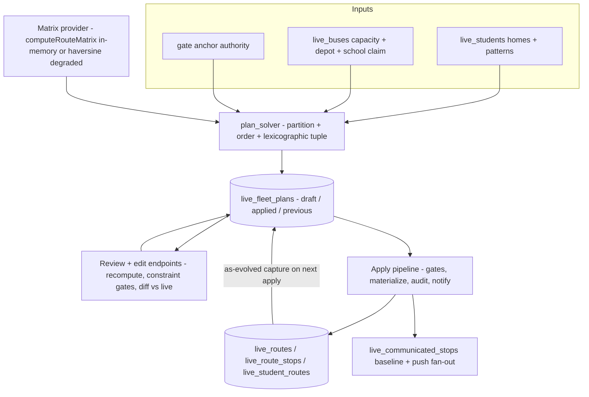
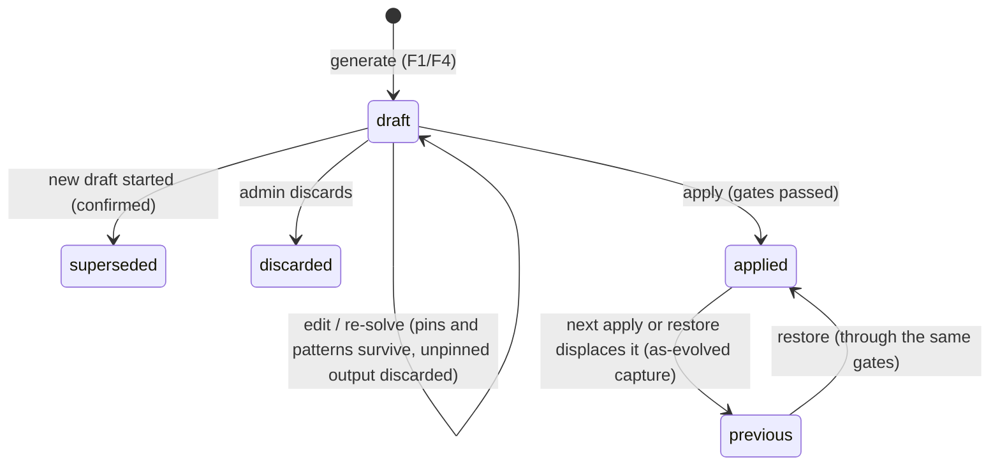
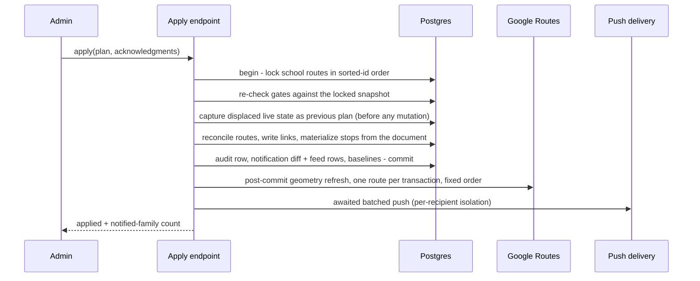

# feat: Students-first fleet plan drafting, review, and apply

## Summary

Build the students-first planner the brainstorm defines: the system drafts a complete fleet plan for a school from its enrolled students' geocoded homes — who rides which bus, stop order, depot-aware times, mirrored AM/PM pairs — and the admin reviews, edits, and applies it as one audit-logged act that replaces the school's live routes, with restore, gated staleness checks, and parent notifications on material changes. Bulk enrolment with geocode triage becomes the front door. The automated slot-in proposal engine ships as the final, cuttable phase; until then mid-year placements are made manually through the review surface.

---

## Problem Frame

Both existing route-creation flows leak manual work and errors: the route-first flow gives the admin no signal about which student belongs on which route, and the planner-first CSV flow loses student identity at the door (see origin: docs/brainstorms/2026-07-30-fleet-route-planning-requirements.md, Problem Frame). The gap beneath both is that deciding who rides which bus is entirely manual. This plan inverts the flow: students are the source, routes are derived, and the admin's job becomes review and exception-handling rather than assembly.

---

## Requirements Traceability

The origin document's requirements are the contract; this table maps each to the units that implement it. Origin flows F1–F5 and acceptance examples AE1–AE8 are carried in per-unit test scenarios.

| Origin R | Summary | Units |
|---|---|---|
| R1 | Draft a complete fleet plan from enrolled students; no address entry in the primary path | U2, U4 |
| R2 | Every stop linked to its students; multi-child stops | U2, U6 |
| R3 | Depot shapes plan: AM starts at depot, PM ends there, order accounts for both | U2, U3 |
| R4 | Hard constraints: fleet, capacity, stop cap, arrive-by | U2, U4, U6, U8 |
| R5 | Lexicographic objectives: worst ride, total ride, total driving | U2 |
| R6 | Mirrored AM/PM pairs with one-way and split exceptions | U2, U5 |
| R7 | Unplaceable surfaced with the binding constraint named, per leg | U2, U5, U9 |
| R8 | Draft never alters live routes; apply is one explicit, audit-logged act | U1, U4, U6 |
| R9 | Review edits: move/reorder/pin/pattern; recompute after each; violations blocked with constraint named | U5, U9 |
| R10 | Review shows ride times, capacity use, total driving | U5, U9 |
| R11 | Apply never alters a run in progress | U6 (regression test; safe by construction via `run_stops` snapshots) |
| R12 | Slot-in proposals with position and effect | U12 (final phase) |
| R13 | Full re-optimisation only on explicit request | U5 (in-draft re-solve), U4 (new draft) |
| R14 | Frozen manual orders; freeze cleared by release or apply; live edits constraint-checked | U6, U8 |
| R15 | Notify on place change, ≥5-min move vs last-communicated, or unplaceable | U1, U6 |
| R16 | Bulk upload is the enrolment front door | U10 |
| R17 | Route membership is a planning output; import route-name column retired to informational | U10 |
| R18 | Triage: confident plannable now; ambiguous one-click confirm; failed placed by hand on a map | U10 |
| R19 | Aggregate pin map, access audit-logged | U1, U11 |
| R20 | Ridership pattern as explicit, seeded, review-editable input | U1, U2, U5 |
| R21 | Apply preserves the displaced plan; restore through the same gates, audit-logged | U1, U6, U7 |
| R22 | Apply surfaces changes since draft generation; explicit confirmation | U6, U7 |
| R23 | Unplaceable students acknowledged by name at apply | U6, U7, U9 |
| R24 | Review shows the diff vs live routes and the notified-family count | U5, U6, U9 |

---

## High-Level Technical Design

Three new pieces sit on top of the shipped route machinery: a plan store (drafts as documents), a solver (pure logic over an in-memory travel-time matrix), and an apply pipeline that materializes a plan into the existing live tables through the existing ordering-authority machinery.

Draft lifecycle (one open draft per school):

Apply is one transaction plus a post-commit push phase:

---

## Key Technical Decisions

- **Plans are JSONB documents, materialized on apply.** `live_fleet_plans` holds one row per plan: a `document` (per-bus AM/PM stop sequences, student ids, times, ride times, unplaceable list, pins, warnings) and a `basis` snapshot (student ids + coords + patterns + fleet config at generation). Drafts are working documents, not queryable facts; the relational surface stays small, following the shipped `custom_stops` JSON precedent. Apply materializes into `live_routes`/`live_route_stops`/`live_student_routes`.
- **Hand-rolled lexicographic solver; no OR-Tools.** Sweep/k-means seeding, cheapest-insertion ordering, 2-opt/or-opt intra-route, relocate/swap inter-route, multi-restart, candidates compared as the exact tuple (worst child ride, total child ride, total driving). OR-Tools models min-max only as a soft weighted term and costs a ~30 MB dependency; at 2-bus/30-student scale pure Python converges in single-digit seconds. Deterministic seed + wall-clock cap make runtime a knob and drafts reproducible. Revisit only past ~10 buses / 500 students.
- **Google durations are never persisted.** The Maps ToS has no caching carve-out for travel times (verified 2026-08-19). The matrix lives in memory for the generation request only; review-edit recomputes use one `computeRoutes` call per affected route — the same call the shipped editor already makes. Raw origin-destination durations are never written anywhere; what persists are the product's own outputs — assignments, order, computed schedules — the same class of value as the shipped `total_duration_s`. The keyless local stack takes the haversine-degraded path deterministically, preserving the integration suite's contract.
- **Apply is one provider-free transaction; geometry refresh is decoupled behind it.** The atomic core: lock the school's routes in sorted-id order; re-check every gate against that locked snapshot; capture the displaced live state as the `previous` plan before any mutation (a single-statement JSONB build, so the capture is one snapshot under READ COMMITTED); reconcile route rows in place to the plan's (bus, type) pairs — creating rows for newly claimed buses, retiring surplus ones (their families get `route-unassigned`; `live_runs.route_id` is `ON DELETE SET NULL`, history survives) — rewrite membership links, materialize each route's stops directly from the plan document (student-linked rows, document order and times), re-derive `bus_id`/`pickup_time`, flip draft→applied, write audit, feed rows, and baselines. That commit is the act; re-applying an applied plan is idempotent by status, so a gateway timeout racing a late commit resolves by reload. `regenerate_route_stops` is deliberately not called: on a `custom_stops` route it no-ops (and run start refuses such routes outright), on an auto route it would hand the reviewed lexicographic order back to Google's single-route optimiser, and inside one transaction its two-phase design inverts — provider calls would run while holding every route lock, against the one-transaction-per-route precedent in `fleet_dao.update_school`. Geometry refresh (polyline, `total_duration_s`) runs after commit, one route per transaction, along the plan's fixed order; it attaches geometry only and never rewrites times — the reviewed, communicated times are frozen at apply, so refresh can never drift a stop against what families were just told. A failed refresh sets that route's `last_recalc_degraded` (per route, never plan-wide); success clears it.
- **Plan order becomes a first-class ordering authority.** Migration 011 adds `live_routes.plan_ordered`; the authority order becomes `custom_stops` > `manual_stop_order` > plan > auto. Regeneration preserves a plan-ordered route's stop order and recomputes times and geometry along the fixed sequence — a new fixed-order recompute in `geo_service`, because nothing shipped refreshes a route without re-ordering it. U8's Recalculate clears the flag behind explicit copy. Without this mode, the first roster edit after apply would silently hand the reviewed order back to Google, eroding the objective promise and the depot tie-break after day one.
- **Restore is an apply whose source is the preserved snapshot.** The preserved plan captures the live state at the moment of replacement (as-evolved: including manual edits and placements made while live), so apply → restore → restore is a clean one-level toggle; a plan two applies back is gone, and the UI says so. Restore passes the same R22/R23 gates re-validated against current enrolment and fleet, and is audit-logged like apply. Displacing a `previous` plan deletes its row outright — deliberate destruction of a document holding every child's coordinates, doubling as retention hygiene. Status flips are ordered demote-before-promote because the one-draft/one-previous partial uniques enforce immediately (partial indexes cannot defer); one `applied` per school is DAO-enforced only, so the restore swap needs no intermediate status.
- **Bus↔school claim is a nullable `school_id` on `live_buses`.** Set during F1's fleet-confirmation step; a bus claimed by one school is unavailable to another's draft or apply for overlapping use. Simplest mechanism that satisfies "a bus never serves two schools within a plan"; per-period claims can come later if a shared fleet ever exists.
- **The R15 baseline is a dedicated table, updated only on send.** `live_communicated_stops` records per (student, leg) the last place/time/bus a family was told. `live_students.pickup_time` cannot serve (morning-clock only, overwritten every regeneration). One shared diff function produces both the R24 preview count and the actual fan-out, so they cannot drift. Null baseline (first apply) notifies — the whole school on first apply is intended. A bus change notifies even with an unchanged time; a still-unplaceable child is not re-notified.
- **Ridership pattern is an explicit column with per-leg placement.** `live_students.ridership_pattern` (both-ways / morning-only / afternoon-only / split), backfilled from existing `live_student_routes` links, both-ways default for new intakes. Placement status is per leg: a child can be placed AM and unplaceable PM; R7 surfacing and R23 acknowledgments name the leg. Moving a both-ways child in review moves both legs; a one-leg move flips the pattern to split, keeping the stored pattern authoritative.
- **Mirroring means roster identity, never stop-order symmetry.** The PM leg is ordered against directed durations (duration A→B ≠ B→A), and the min-max objective is evaluated over both legs; a PM-only reorder does not "break" a mirror. Depot legs follow the shipped boundary-leg convention (never stop rows) and count only toward total driving, which makes the origin's depot tie-break example fall out naturally.
- **Time discipline carries forward.** `resolve_gate_anchor` stays the single arrive-by authority; `solve_morning_departure` stays the AM backward solver; `pickup_time` is written only as a morning student attribute; every date predicate converts both sides to Africa/Nairobi with a regression test staged in the 00:00–03:00 window.
- **Drafts persist server-side, one open draft per school.** Navigation away resumes; starting a new draft supersedes the old after an explicit confirm. Required anyway by the R22 gate (diff needs the generation basis) and R21 (preserved plans).
- **Release sequencing follows the house rule.** Migration `011` ships alone as release one (the migrate Lambda resolves files from its own package); behavior follows in later releases, each certified in isolation; apply-bearing deploys land outside route hours. The full release mapping is in Operational Notes.

### Rejected alternative: Google Route Optimization API

Google's managed VRP solver (`optimizeTours`) would replace both the matrix step and the partition search, and at pilot scale its price and latency are honestly not the objection. Rejected on fit: its objective is a weighted sum, so the lexicographic promise (worst ride strictly first) is expressible only as a per-shipment ride cap plus an outer search over cap values — bespoke optimisation code wrapped around a black box instead of testable code of our own. It replaces only the cheap part: mirrored pairs with split riders, pins, per-leg unplaceable attribution naming the binding constraint, instant review-edit recomputes, and slot-in scoring all still need our own evaluation over a matrix, so we would maintain both stacks. It is also a second Google integration surface (service-account OAuth rather than the Maps key, a new SSM credential, a second product's terms covering children's coordinates), and it is not seed-stable — drafts would stop being reproducible and the keyless CI stack could not exercise the real path. Revisit past ~10 buses / 500 students, or when the U2 benchmark shows heuristic quality measurably lagging.

---

## Implementation Units

Phased: A substrate → B draft/review/apply → C enrolment front door → D slot-ins (cuttable). Dependencies are strict across phases A→B; C is independent of B except where noted; D depends on B.

### Phase A — Substrate

### U1. Migration 011: plans, claims, patterns, baselines, audit

- **Goal:** All schema for the feature, shippable alone as a no-behavior release.
- **Requirements:** R8, R15, R19, R20, R21.
- **Dependencies:** none.
- **Files:** `backend/db/migrations/011_fleet_plans.sql`.
- **Approach:** Additive → backfill → constraints, per the 008–010 conventions. Creates `live_fleet_plans` (school_id FK ON DELETE CASCADE — an orphaned document full of child coordinates must not outlive its school; status CHECK draft/applied/previous/superseded/discarded; `document` and `basis` JSONB, both denormalizing student and bus names alongside ids so later gates can name departed children — the 007/010 name-rot precedent; solver seed + degraded flag; created_by/created_at/applied_at; partial uniques: one `draft` and one `previous` per school — partial indexes cannot defer, so status flips are ordered demote-before-promote, and `applied` uniqueness stays DAO-enforced so the restore swap needs no intermediate status). Creates `live_communicated_stops` (student_id FK CASCADE — SET NULL would multiply orphans under the unique; route_type, stop name/lat/lng, scheduled_time, bus_id FK SET NULL, communicated_at; unique (student_id, route_type)) and `live_admin_audit` (actor FK SET NULL plus denormalized actor name/email, action CHECK plan-applied/plan-restored/pin-map-viewed, school_id, detail JSONB, created_at; append-only by convention — no update/delete code path). Adds `live_buses.school_id` (FK SET NULL, the 004 house style), `live_routes.plan_ordered`, and `live_students.ridership_pattern` (CHECK both_ways/morning_only/afternoon_only/split), backfilled idempotently from `live_student_routes` links — split only when both legs' routes carry non-null buses that differ (plain `<>`, deliberately NOT `IS DISTINCT FROM`, which would mark bus-less pairs split; bus-less routes exist). Widens the `live_notifications` type CHECK by verbatim union with `route-updated` and `route-unassigned`, and ships their dedup arbiter now — a new `live_notifications.plan_audit_id` column (FK to `live_admin_audit`, ON DELETE SET NULL) with a partial unique on (user_id, student_id, type, plan_audit_id) scoped to the two new types; U6's feed-row inserts populate it — because the shipped dedup index excludes run-less rows entirely and later releases carry no migration.
- **Patterns to follow:** migration headers and verbatim-union CHECK discipline in `backend/db/migrations/009_route_planner.sql` and `010_status_lifecycle.sql`; double-apply rehearsal against a database at 010.
- **Test scenarios:** Test expectation: none in-repo — migration verification is the double-apply rehearsal (apply 011 twice to a populated DB at 010; second pass is a no-op) plus pattern-backfill spot checks: a student with AM+PM links on one bus backfills both_ways; AM-only backfills morning_only; AM and PM on different buses backfills split; no links backfills both_ways; AM+PM where one route has no bus backfills both_ways, not split (NULL-safe comparison). On a fresh local stack migrations run before seeds, so every seeded student lands on the default — tests must never rely on seeded patterns.
- **Verification:** local stack migrated and reseeded; `saferide_migrations` shows 011; existing suites green untouched.

### U2. Solver core

- **Goal:** Pure-Python fleet solver: partition students across buses and order each leg under the hard constraints and lexicographic objectives.
- **Requirements:** R1–R7, R20; AE1, AE3, AE4, AE6.
- **Dependencies:** none (matrix injected).
- **Files:** `backend/app/services/plan_solver.py`, `backend/tests/services/test_plan_solver.py`.
- **Execution note:** Implement test-first — the objective semantics are the product promise and are cheap to pin as unit tests before tuning heuristics.
- **Approach:** Inputs: students (id, coords, pattern, pins), buses (capacity, depot, school), directed duration matrix, gate anchors. Route on stops, not students: near-identical geocodes (siblings) collapse to one stop carrying demand; capacity counts children, the 24-stop cap counts stops. Seeds: sweep by angle around the school + capacity-balanced k-means + randomized restarts. Ordering: cheapest insertion, then 2-opt/or-opt; inter-route relocate/swap. Candidates compared as the tuple (worst child ride, total child ride, total driving), evaluated over both legs; ride time is first-pickup→gate (AM) / gate→last-drop (PM); depot legs count only in total driving. Pins and patterns are constraints the search honours; per-leg unplaceable output names the binding constraint (seats vs stop cap). Deterministic seed, wall-clock cap (~5 s), always returns best-found.
- **Technical design (directional):** `solve(students, buses, matrix, anchors, pins, time_cap) -> PlanDocument`; internal `evaluate(partition, orders) -> (worst, total, driving)`; the AM order feeds `solve_morning_departure` downstream for wall-clock times — the solver itself works in durations only.
- **Patterns to follow:** pure-function extraction for testability as in `frontend/src/lib/routeOrdering` and the backend fake-connection unit tests (`backend/app/dao/student_live_dao.py` parent-link tests).
- **Test scenarios:** Covers AE1: 30 students / 2×15-seat buses yields two capacity-legal mirrored pairs, all arrive-by satisfied, every child's ride time present. Covers AE6: a 31st student is unplaceable with "seats" named; no bus over capacity. Covers AE3: a morning-only child appears in AM only; the pair stays mirrored for the rest. Covers AE4: two equal-duration orders tie-break to the one whose first pickup is nearer the depot. Split rider is placed on different buses per leg. Pinned child never moves buses across restarts. Lexicographic dominance: a solution with lower worst-ride wins even at higher total driving; equal worst-ride falls through to total ride time. 25 stops on one route is rejected as over-cap. Multi-child stop consumes one stop slot and N seats. Deterministic: same seed → identical document. Degraded matrix (haversine) still produces a valid plan flagged degraded. Empty edge cases: zero students; one bus; all students unplaceable.
- **Verification:** unit suite green without a stack; a synthetic 300-student benchmark stays under the time cap (records the headroom claim).

### U3. Travel-time matrix provider

- **Goal:** One in-memory directed duration matrix per generation request, with a deterministic offline fallback.
- **Requirements:** R3, R5.
- **Dependencies:** none.
- **Files:** `backend/app/services/geo_service.py`, `backend/tests/services/test_geo_service.py`.
- **Approach:** `compute_duration_matrix(points) -> matrix` using Routes API `computeRouteMatrix`: lat/lng waypoints (exempt from the address cap), chunked to ≤625 elements per request, TRAFFIC_UNAWARE, 8 s timeout per call, best-effort like every other provider call. On any failure or missing key: haversine × circuity factor (~1.4) ÷ urban speed — deterministic, so the keyless integration stack always takes this path. The matrix is returned, never stored (Google ToS: no caching allowance for durations). Result carries a `degraded` flag through to the plan document.
- **Patterns to follow:** provider precedence and exception-swallowing in `backend/app/services/geo_service.py`; degraded observability contract from `backend/app/dao/fleet_dao.py`.
- **Test scenarios:** chunking: 33 points → 1,089 elements split into ≥2 requests, reassembled correctly. Keyless environment returns the haversine matrix and `degraded: true` without any HTTP call. A directed asymmetry in the API response is preserved (A→B ≠ B→A). Provider exception mid-chunk falls back whole (no half-Google, half-haversine matrix — the two-provider-signals rule from regenerate applies).
- **Verification:** unit green keyless; one manual live-stack draft against real Google confirms plausible durations.

### Phase B — Draft, review, apply, restore

### U4. Plan DAO and draft generation

- **Goal:** F1/F4 end-to-end on the backend: fleet confirmation, generation, persisted draft.
- **Requirements:** R1, R4, R8, R13; AE1.
- **Dependencies:** U1, U2, U3.
- **Files:** `backend/app/api/fleet_plans.py` (new router), `backend/app/dao/fleet_plan_dao.py`, `backend/app/main.py`, `backend/tests/integration/test_fleet_plan_draft.py`.
- **Approach:** `POST /api/fleet-plans/confirm-fleet` assigns buses to the school (`live_buses.school_id`), rejecting a bus claimed by another school by name; a multi-trip bus (existing `trip_index` chains) is excluded from drafting with a named notice, a depot-less bus proceeds with a notice. `POST /api/fleet-plans/draft` snapshots the basis (plannable students only — unresolved triage rows appear as unplaceable), fetches the matrix, runs the solver, persists the draft; document and basis denormalize student and bus names alongside ids. One-open-draft rule: an existing draft blocks generation unless `supersede: true`; superseding scrubs the old draft's `document`/`basis` to metadata-only, and a `discard` endpoint does the same for an abandoned draft — the retention rule in Risks, mechanized here. The 24-stop cap moves server-side here (constant shared with `PLANNER_STOPS_CAP`). Admin-only via `Depends(admin_only)`.
- **Patterns to follow:** router/DAO split and lock ordering in `backend/app/api/fleet.py` / `backend/app/dao/fleet_dao.py`; integration tests through the API with "IT "-prefixed fixtures per `backend/tests/integration/conftest.py`.
- **Test scenarios:** Covers F1/AE1: confirm fleet → draft returns two mirrored pairs with ride times. Draft never touches `live_routes` (row-for-row identical after generation). Second draft without supersede → 409 naming the open draft; with supersede → old draft status superseded and its `document`/`basis` payloads emptied (metadata retained); discarding a draft does the same. Bus claimed by school B rejected by name. Multi-trip bus excluded with notice text. Unresolved-triage student listed unplaceable with reason "unresolved address". Depot-less bus draft carries the notice. Keyless stack: draft flagged degraded, otherwise complete.
- **Verification:** integration suite green against the local stack.

### U5. Review and edit endpoints

- **Goal:** The draft is reviewable and editable with live recomputes, constraint gates, and the diff against live routes.
- **Requirements:** R6, R7, R9, R10, R13, R20, R24.
- **Dependencies:** U4.
- **Files:** `backend/app/api/fleet_plans.py`, `backend/app/dao/fleet_plan_dao.py`, `backend/app/services/geo_service.py`, `backend/tests/integration/test_fleet_plan_review.py`.
- **Approach:** `GET` returns the document plus computed review surface: per-child ride times, per-bus capacity use, total driving (R10), per-leg unplaceable list, and the diff vs live (R24) from the shared diff function — implemented here in `fleet_plan_dao.py` and reused unchanged by U6's fan-out, so preview and sends cannot drift: children changing bus, stops moving ≥5 min vs `live_communicated_stops`, newly unplaceable, legs removed, notified-family count. Edits: move (both legs; one-leg move flips pattern to split), reorder, pin/unpin, pattern change — each recomputes the affected route's times through a new fixed-sequence recompute in `geo_service` — times and geometry along a given stop order, no re-ordering; nothing shipped does this today (degraded fallback preserved; U6's post-commit refresh reuses it). A violating edit returns 422 naming the constraint, document unchanged. `POST .../resolve` re-runs the solver in-draft: pins and pattern edits survive as inputs; unpinned manual arrangements are discarded (stated in the response). Pattern edits are draft-scoped until apply. Every route in this unit is admin-only via `Depends(admin_only)`, matching U4.
- **Patterns to follow:** recompute-and-persist flow of `recalculate_route_stops`; 422-with-named-constraint mirrors the closure-gate error shape from the status-lifecycle work.
- **Test scenarios:** move over capacity → 422 naming "capacity", draft unchanged. Reorder past 24 stops → 422 naming "stop cap". Move both-ways child moves both legs; explicit one-leg move sets pattern split. Pattern change to morning-only removes the PM stop in the draft and updates ride times. Re-solve keeps a pinned child in place and discards an unpinned manual reorder, saying so. Diff: against seeded live routes, a child moving buses and one moving +6 min appear; a +3-min drift does not; notified-family count equals the diff rows' distinct families. Edit recompute in keyless mode stays degraded-deterministic. Non-admin request → 403.
- **Verification:** integration green; response shapes reviewed against the U9 UI needs before freezing.

### U6. Apply pipeline

- **Goal:** One gated, transactional, audit-logged act replaces the school's live routes, preserves the displaced plan, and notifies affected families.
- **Requirements:** R2, R4, R8, R11, R14, R15, R21, R22, R23, R24; AE5.
- **Dependencies:** U5.
- **Files:** `backend/app/api/fleet_plans.py`, `backend/app/dao/fleet_plan_dao.py`, `backend/app/services/push_service.py`, `backend/app/dao/push_dao.py`, `backend/tests/integration/test_fleet_plan_apply.py`.
- **Execution note:** Start with a failing integration test for the apply contract (gates, atomicity, notification rows) before the write path.
- **Approach:** One provider-free transaction, then compensable follow-up. In order, inside the transaction: lock the school's routes in sorted-id order; re-check every gate against that locked snapshot — basis diff (enrolments, address changes, departures, each explicitly confirmed, R22), fleet drift (capacity lowered, bus out-of-service or re-claimed → blocked naming the bus), by-name-and-leg unplaceable acknowledgments (R23; the gate copy states the same-day consequence when apply lands between runs); capture the displaced live state as the `previous` plan before any mutation, as a single-statement JSONB build (one statement = one snapshot under READ COMMITTED); reconcile route rows in place to the plan's (bus, type) pairs, creating rows for newly claimed buses and retiring surplus ones (their families get `route-unassigned`) — excluding routes on buses U4 excluded from drafting (multi-trip chains): the plan carries no pairs for them, and retiring an operating chain would destroy service the plan declared out of scope; rewrite links delete-before-insert scoped by student-and-leg, not by school — the deferrable unique is global, and a cross-school stale link would abort the commit; materialize stops directly from the document (student-linked rows, document order and times, `plan_ordered` set, `custom_stops` and `manual_stop_order` cleared per the 008 CHECK); re-derive `live_students.bus_id` and `pickup_time` (AM only — morning-clock rule) and write each student's document pattern to `live_students.ridership_pattern` (draft-scoped edits become live truth here); insert the `plan-applied` audit row (detail carries routes written, families notified, degraded flag, elapsed — the self-contained apply record); compute the notification diff (the U5 function) — categories: place change, ≥5-min move, bus change, newly unplaceable, and leg removed (a baseline exists for a leg the plan no longer serves) — writing `route-updated` for place/time/bus changes and `route-unassigned` only when a family loses a route (surplus retirement, unplaceable transition, leg removal); then delete the stale (student, leg) baseline rows the diff just consumed, so a later re-widening cannot diff against a stale baseline while the removal itself still notified; insert feed rows on a connection threaded through the transaction — `PushDao.insert_notification` opens its own connection per row today and cannot be reused as-is — and upsert baselines for every notified pair. Null baseline notifies; bus change notifies; still-unplaceable does not re-notify. Commit. Re-applying an applied plan is idempotent by status; the baseline diff is the primary notification idempotency, the 011 arbiter the backstop. Post-commit: geometry refresh one route per transaction along the fixed order (attaches geometry only, never rewrites times; failure flags that route degraded, success clears it), then awaited batched push with per-recipient isolation and a one-line fan-out summary log — never a detached thread. Named accepted race: a concurrent student-edit that read its links pre-apply can 500 on the deferred unique at its own commit or stale-re-add a link; apply wins, accepted at pilot scale over a school-scoped advisory lock. Any date-scoped predicate converts both sides to Nairobi; phase timings (gates/transaction/refresh/push) are logged against the 30 s ceiling. All routes admin-only via `Depends(admin_only)`.
- **Patterns to follow:** feed-row-first + BackgroundTasks push in `backend/app/services/push_service.py`; recipients via `live_student_routes` → `live_parent_students`, never `bus_id`; lifecycle-incident wording shape for gate errors; one-transaction-per-route precedent in `fleet_dao.update_school` for the post-commit refresh.
- **Test scenarios:** Covers AE5/R11: apply during an active seeded run leaves `run_stops` untouched; new routes serve the next run. Apply with an unacknowledged unplaceable child → 422 naming them. A student enrolled after generation → apply blocked until confirmed; confirming excludes-or-includes explicitly. Bus capacity lowered below its drafted load after generation → blocked naming the bus. Post-apply: links match the document; `plan_ordered` set with `custom_stops` and `manual_stop_order` clear; freezes cleared; a surplus route retired with its families getting `route-unassigned`; `bus_id`/`pickup_time` re-derived; `pickup_time` never carries a PM time; run start succeeds on an applied route (the `custom_stops` refusal must not fire). Re-applying the applied plan returns the applied state with zero duplicate notifications. A pattern narrowed to morning-only notifies the family of the dropped PM stop, then deletes the PM baseline; re-widening later notifies even when the new PM time coincidentally matches the stale one; post-apply `ridership_pattern` reads morning_only and the next draft's basis reflects it. A school with an existing multi-trip chain applies a plan: the chain's routes survive untouched and its families receive no notification. Non-admin apply → 403 with no side effects. A forced geometry-refresh failure leaves stop times untouched and flags only that route. Displaced state captured as-evolved: a manual stop edit made after the previous apply is present in the preserved plan. Audit row has denormalized actor identity, school, timestamp, and a detail payload with routes written and notified count. Notifications: first apply notifies every family once and seeds baselines; second apply moving one child +6 min notifies only that family; +4 min notifies nobody; a bus swap with identical times notifies; a child unplaceable in both plans is not re-notified; feed rows and baselines are in the same transaction (a forced post-write failure rolls both back). Nairobi window: a date-scoped predicate test staged 00:30 Nairobi passes.
- **Verification:** integration green; manual live-stack apply outside route hours verified against the seeded demo school.

### U7. Restore

- **Goal:** The previous plan can be restored in one act through the same gates.
- **Requirements:** R21, R22, R23.
- **Dependencies:** U6.
- **Files:** `backend/app/api/fleet_plans.py`, `backend/tests/integration/test_fleet_plan_restore.py`.
- **Approach:** Restore loads the `previous` plan and runs it through the U6 pipeline with source = preserved snapshot, re-validated against current enrolment and fleet: departed students dropped with by-name acknowledgment; an unavailable bus blocks with the gap named (no partial restore). The displaced live state becomes the new `previous` (toggle). Route identity is reconciled, not assumed: preserved route ids that still exist are rewritten in place; vanished ones (routes are hard-deletable) get fresh rows — their old run history is already detached by `ON DELETE SET NULL`; live routes the preserved plan does not cover are retired as in apply, with the same multi-trip-chain exclusion. By-name acknowledgments read the document's denormalized names, so a departed child can still be named. Admin-only via `Depends(admin_only)`. Audit action `plan-restored`. Notifications flow from the same diff-vs-baseline function.
- **Test scenarios:** apply A → apply B → restore returns live to A and preserved to B; restore again returns to B (toggle). A student enrolled-and-placed after A was displaced → restore surfaces them as routeless, requiring acknowledgment. Restore with the claimed bus now out-of-service → blocked naming it. Restore notifies exactly the families whose current communicated stop differs materially. Audit row `plan-restored` written. Non-admin restore → 403.
- **Verification:** integration green.

### U8. Live-edit constraint guard and server-side stop cap

- **Goal:** Manual live-route edits obey the same hard constraints as review, with the violated constraint named (origin R14's round-2 extension).
- **Requirements:** R4, R14; AE7.
- **Dependencies:** U1 (none functionally; sequenced in B for release grouping).
- **Files:** `backend/app/api/fleet.py`, `backend/app/dao/fleet_dao.py`, `backend/tests/integration/test_route_ordering.py`, `frontend/src/features/admin/RoutesPage.tsx`.
- **Approach:** Capacity and stop-cap checks on the existing stop-order, stop-CRUD, and assignment endpoints; violations 422 with the constraint named, matching U5's shape. The existing release-of-freeze behavior (clear + immediate reflow via `recalculate_route_stops`) is kept and the control is labeled "Recalculate" so the reflow is expected. The 24-stop cap becomes a shared server-side constant. Recalculate on a plan-ordered route warns that it discards the applied plan's order before clearing `plan_ordered`. This unit also owns the `plan_ordered` branch in `regenerate_route_stops`: a plan-ordered route preserves its stop order — times and geometry recompute along the fixed sequence via U5's helper, new students append without re-ordering — dormant until apply exists, live from Release 3.
- **Test scenarios:** Covers AE7: manual reorder freezes the route; a manually placed new student lands at an explicit position on the frozen route without reflow; recalculate releases and reflows. Assigning a 16th child to a 15-seat bus's route → 422 "capacity". Adding a 25th stop → 422 "stop cap". Adding or removing a student on a plan-ordered route never re-optimises the surviving stops' order. Recalculate labeled correctly in the UI (e2e assertion).
- **Verification:** extended integration + existing e2e green.

### U9. Plan review UI

- **Goal:** The admin-facing surface for F1–F4: fleet confirmation, draft review, edits, gates, apply and restore.
- **Requirements:** R7, R9, R10, R23, R24.
- **Dependencies:** U5, U6, U7.
- **Files:** `frontend/src/features/admin/PlanReviewPage.tsx` (new), `frontend/src/features/admin/components/` (draft map, per-bus roster panels, gates dialogs), `frontend/src/lib/queries.ts`, `frontend/src/lib/apiClient.ts` consumers, `frontend/tests/unit/planReview.test.ts`, `frontend/tests/e2e/admin-plan.spec.ts` (new), `docs/user-manual/admin-guide.md`.
- **Approach:** A dedicated page (the Fleet Map planner stays as-is until the CSV flow's fate is settled): stepper of fleet confirmation → draft → review → apply. Review shows the map (existing `@vis.gl/react-google-maps` primitives, `RoutePolyline`, `FitBounds`) beside per-bus AM/PM rosters with ride times and capacity bars, the unplaceable panel naming the binding constraint per leg, and the diff-vs-live panel with the notified-family count. Edits use the shipped interaction grammar: ArrowUp/Down + drag rows, move-to-bus menu, pin toggle, pattern select. Gates render as explicit dialogs: R22 change list with per-row confirm (with a "discard and re-draft" escape when the list is long), R23 by-name checkboxes. Restore sits behind a confirm stating the one-level rule. The apply confirm warns when a run is currently active (parent live-tracking desynchronizes until that run ends — see System-Wide Impact) and states that changes take effect from the next run, which can be the same afternoon. Degraded drafts carry the existing badge language. Pure decision logic (diff shaping, gate list building) extracted to unit-testable helpers. Admin guide gains the planner section; wording must satisfy the `manualVocabulary` convention if new statuses surface.
- **Patterns to follow:** dialogs/toasts/error shape of `FleetMapPage.tsx` and `RoutesPage.tsx`; react-query reads + invalidate-on-mutate; `requestGeneration` stale-guard for recompute round-trips.
- **Test scenarios:** unit: gate-list builder groups basis-diff rows by kind; diff shaping marks ≥5-min moves only; acknowledgment payload includes every unplaceable (student, leg). e2e (serial, seeded): full happy path — confirm fleet, draft, move a child, apply with zero gate items, routes visible on RoutesPage; apply with an unplaceable child requires ticking their name; starting a second draft warns about superseding; restore returns the prior routes and shows the toggle copy.
- **Verification:** `tsc --noEmit`, vitest, Playwright green; manual browser pass on the local stack per house verification protocol.

### Phase C — Enrolment front door

### U10. Bulk-upload triage UI and route-name retirement

- **Goal:** F5 becomes two-step validate → review: triage surfaced, ambiguous pins confirmed in one click, failed pins placed by hand, duplicates flagged; the route-name column stops assigning.
- **Requirements:** R16, R17, R18; AE8.
- **Dependencies:** U1 (pattern default); independent of Phase B.
- **Files:** `frontend/src/features/admin/components/BulkUploadDialog.tsx`, `backend/app/api/students_live.py`, `backend/app/dao/student_live_dao.py`, `backend/tests/integration/test_students_bulk.py`, `frontend/tests/e2e/admin-crud.spec.ts`, `docs/user-manual/admin-guide.md`.
- **Approach:** The dialog is scoped to a school: the upload payload carries a top-level `school_id`, and `insert_bulk_student` stamps it on every committed row — today it writes none, leaving imported students invisible to the school-scoped draft basis and pin map. The dialog calls the existing `bulk/validate` first and renders the triage table (resolved / ambiguous / failed) — the planner CSV repair table is the visual precedent. Ambiguous rows show the proposed pin with one-click confirm; failed rows open `PlacePicker`; either fix is against the student's name on a map. Validate adds duplicate detection (same name + school → row flagged with skip-or-update choice; update overwrites contacts/address, re-triaging the address). `route_name` still imports the student but assignment is skipped and surfaced informationally per row (R17); the template header drops it. Commit path unchanged (`bulk_upload`), extended to accept per-row resolutions. New students default pattern both_ways.
- **Patterns to follow:** triage tiers in `students_live.py` `_triage_row`; `PlacePicker` provenance contract (a picked pin is never downgraded by a later typed edit); Lambda burst guard — regenerate once per affected route only where links exist.
- **Test scenarios:** Covers AE8/F5: 30 rows triage 27/2/1; 27 commit plannable; two ambiguous confirmed in one action each; one failed placed by hand; all three then plannable. Duplicate row flagged, skip leaves the original untouched, update overwrites and re-triages. A row with `route_name` imports the student, assigns nothing, and surfaces the note. Re-upload of an identical file creates zero new students when every row is skipped. Validate commits nothing (row counts unchanged after validate alone). A bulk-imported student appears in that school's next draft basis.
- **Verification:** integration + e2e green; template file in the dialog matches the new headers.

### U11. Aggregate pin map with audited access

- **Goal:** Every imported pin on one map for eyeball QA, access audit-logged.
- **Requirements:** R19.
- **Dependencies:** U1.
- **Files:** `frontend/src/features/admin/StudentsPage.tsx` (entry point), `frontend/src/features/admin/components/StudentsPinMap.tsx` (new), `backend/app/api/students_live.py`, `backend/tests/integration/test_pin_map_audit.py`, `frontend/tests/e2e/admin-crud.spec.ts`.
- **Approach:** `GET /api/students/pin-map` (admin-only) returns all geocoded pins for a school and writes a `pin-map-viewed` audit row in the same request; the frontend renders markers with name labels and triage state, linking a mis-placed pin to that student's `PlacePicker`. No client-side aggregation of separately fetched records — the audited endpoint is the only source.
- **Test scenarios:** endpoint returns pins and writes exactly one audit row per call with actor and school; non-admin → 403 and no audit row; e2e: opening the map view then fixing one flagged pin via PlacePicker round-trips.
- **Verification:** integration + e2e green.

### Phase D — Slot-in proposals (final, cuttable)

### U12. Slot-in proposal engine

- **Goal:** Mid-year enrolments and address changes produce one-line placement proposals with their effect, accepted or adjusted in review mechanics.
- **Requirements:** R12, R13, R15; AE2, AE7.
- **Dependencies:** U6 (notification pipeline), U5 (edit mechanics), U10 (front door).
- **Files:** `backend/app/services/slot_in_service.py` (new), `backend/app/api/fleet_plans.py`, `backend/app/dao/fleet_plan_dao.py`, `frontend/src/features/admin/PlanReviewPage.tsx` (proposal inbox), `backend/tests/integration/test_slot_in.py`, `frontend/tests/e2e/admin-plan.spec.ts`.
- **Approach:** Trigger: a student becomes plannable (new enrolment resolved, or a confidently re-geocoded address change) with no route for a leg their pattern requires. Cheapest insertion across existing routes: every feasible position scored by the lexicographic effect plus who is delayed; existing children never move; frozen routes accept insertion at an explicit position without reflow (AE7); split riders get one proposal per leg. The proposal is stored on the school's plan state and stated as position + effect ("Bus 2, between stop 3 and 4, +4 minutes for two children"). Accept applies just that insertion through the U6 diff/notify path (only affected families hear); adjust opens the review surface. Aging: a proposal never auto-applies; it expires after a configurable window with the student still visibly unassigned. An address change for a placed child keeps the existing stop until confidently re-resolved (stability rule). All routes admin-only via `Depends(admin_only)`.
- **Patterns to follow:** the solver's insertion scoring (U2 internals reused); notification path from U6.
- **Test scenarios:** Covers AE2: proposal text matches position and +minutes; accepting notifies exactly the new child's and delayed children's families. Covers AE7: insertion into a frozen route keeps the manual order. No feasible insertion → student surfaced unplaceable naming the constraint, no proposal. Expired proposal leaves the student visibly unassigned. Address re-triage to ambiguous does not drop the existing stop. Split rider gets two proposals, independently acceptable. Non-admin → 403.
- **Verification:** integration + e2e green; phase is cuttable — nothing in A–C references it.

---

## Scope Boundaries

Carried from origin (see origin: Scope Boundaries): shared pickup points deferred (multi-child stops keep the door open); continuous auto-assignment rejected; buses shared across schools within one plan out; mid-run rerouting out; absence handling untouched; driver surface unchanged; multi-trip chains out of drafting scope (excluded with a named notice per U4); the import route-name assignment path retired (U10).

### Deferred to Follow-Up Work

- Retiring or re-pointing the Fleet Map CSV planner flow once the plan surface is live (origin leaves the CSV's fate open; nothing here removes it).
- Accessible non-pointer alternatives to map-click pin placement and drag reorder (origin open question; the ArrowUp/Down button precedent partially covers reorder today).
- 202-and-poll draft generation for fleets that outgrow the synchronous budget; OSRM/self-hosted matrix if Google matrix spend ever matters.
- Per-period bus claims (beyond the single `school_id`) if a genuinely shared fleet appears.
- Renormalizing the origin doc's non-sequential requirement numbering in downstream docs.
- School-arrival unloading buffer (arrive-by currently targets the gate anchor exactly, as shipped; adding a buffer is a product tweak).
- Capturing solutions docs for plan-apply, audit, and slot-in patterns once landed (the knowledge base has none yet).
- Teaching the parent track view to prefer an active run's own snapshot, closing the mid-run desynchronization transient named in System-Wide Impact.
- Exposing the communicated stop time in the parent portal (today the feed row is the only parent-visible record of what a family was told).
- Folding plan-document reads into the audited-access surface alongside the pin map.

---

## System-Wide Impact

- Driver run creation snapshots `live_route_stops` into `run_stops` at start, so an active run is untouched by construction. An apply landing between AM and PM takes effect the same day — "next run" can mean this afternoon — and dialog and notification copy say so.
- The driver surface is contractually unchanged: route lists and off-run rosters flip at commit with no in-app signal. Briefing drivers on a replaced plan is out-of-band — the same gap the status-lifecycle rollout managed with an explicit briefing gate (see Operational Notes).
- The parent portal reads live tables, not run snapshots: mid-run, an apply makes the progress marker and "Your stop" walk a stop list the driver is no longer driving, and a child moved buses mid-run resolves tracking through the new bus while riding the old one. Accepted as a transient at pilot scale; the apply dialog warns when a run is active, and teaching the parent track view to prefer the active run's own snapshot is named follow-up work.
- Parent alert history keys on the child's current `bus_id`, so a bus move hides that morning's old-bus incidents from that child's view — accepted oddity, stated here so it isn't rediscovered as a bug.
- Admin RoutesPage badges key on the ordering-authority flags; applied routes read as plan-ordered, and Recalculate is fenced (U8) so one click cannot silently discard a reviewed order.
- Push recipients resolve via `live_student_routes` → `live_parent_students`, never `bus_id` — apply's fan-out follows the shipped rule.
- `live_communicated_stops` is written by apply and read by nothing parent-facing: the feed row is the canonical record of what a family was told; exposing the communicated time in the parent portal is follow-up work.
- Failure propagation: Google down at generation → degraded draft, reviewable and appliable. Google down at apply → impossible in the atomic core (it is provider-free); the post-commit refresh degrades per route with the existing badge, and document times stand. Push failure post-commit → feed rows are the truth, and the notified-family count counts feed rows, not deliveries. Apply timeout → idempotent by plan status; a gateway 504 racing a late commit resolves by reload, not retry-with-side-effects.

---

## Risks & Dependencies

- **Full-school push fan-out inside one invocation.** First apply notifies every family; sends are sequential today and take seconds each. Mitigation: feed rows commit with the transaction (the product truth), push is awaited-batched post-commit, and the pilot school is ~30 families. If apply latency approaches the 30 s gateway ceiling, push moves to a fire-after-response BackgroundTask — still in-invocation per the Lambda rule.
- **Solver headroom is asserted, not proven.** Single-digit-second convergence at pilot scale is well-supported; the low-tens-of-buses claim rests on the U2 synthetic benchmark. If it misses, the anytime cap degrades quality, not availability.
- **Google dependency.** Matrix and per-route calls are best-effort with a deterministic degraded path; a degraded draft is reviewable and appliable, flagged. ToS compliance rests on the stated line — raw origin-destination durations are never written; stored times are the product's own computed schedule, the same class as the shipped `total_duration_s` — a review-discipline rule, not a structural one.
- **Known shipped traps in fleet-wide regeneration.** Depot-sibling geometry is not recomputed on trip-membership change, and `last_recalc_degraded` was set-only. U6 fences both: apply materializes and refreshes every affected route and clears the flag per route on success.
- **Migration 011 is forward-only** and must ship alone first; its backfills are idempotent and rehearsed by double-apply, per house rule.
- **Concurrency.** af-south-1 account Lambda concurrency starts at 10; apply's Google calls are post-commit per-route — within the burst-guard posture. The real concurrency exposures are named in U6: the link-writer race (accepted — apply wins, a stale editor 500s) and the atomic core holding all route locks, kept short by making it provider-free.
- **Plan documents are an aggregate PII target.** `basis` and `document` hold every enrolled child's name and coordinates — the aggregation R19's rationale warns about. Retention: displaced `previous` rows are deleted; superseded and discarded drafts are scrubbed of `document`/`basis` payload on transition, keeping metadata. Plan reads are admin-only; folding them into the audited-access surface is follow-up.
- **The published demo-admin credential is a Release-3 gate.** `admin@test.com` authenticates against production (open item in docs/work/validation/2026-07-30-status-lifecycle-consistency.md). The apply-bearing release must not ship until it is closed and the verification credential replaced — otherwise the riskiest go/no-go rests on a credential that is itself a no-go.

---

## Operational Notes

Release mapping. House rules apply throughout: each release is certified in isolation at its own commit (reset, then full `scripts/certify.sh`, e2e included — the branch-level-certification trap is documented); migration-free releases nullify the code-live-before-migration window documented in `infra/scripts/deploy-backend.sh`.

| Release | Units | Contents | Migration | Surface |
|---|---|---|---|---|
| 1 | U1 | Schema only, inert | `011_fleet_plans.sql` | backend |
| 2 | U2–U5, U8 | Solver, matrix, draft + review endpoints, live-edit guard — provably read-only against live routes | none | backend + frontend |
| 3 | U6, U7, U9 | Apply, restore, review UI | none | backend + frontend, outside route hours |
| 4 | U10, U11 | Enrolment front door, pin map | none | backend + frontend, any time after 1 |
| 5 | U12 | Slot-ins (cuttable) | none | backend + frontend |

Release 2 before 3 is deliberate: real drafts run against production students and geocodes while no endpoint can mutate live routes, so solver and geocode quality certify in production (API-only — the UI ships with apply) before apply exists.

- **Go/No-Go, Release 1:** migrate Lambda output shows ten skips and one apply; post-deploy SQL verifies the new tables empty, no bus claimed, pattern backfill complete with zero mismatches against link truth, the type CHECK a verbatim union of all prior values plus two, and the partial uniques present. RDS sits in private subnets with no bastion — the verification path (operator DB access or a temporary read-only check) must be named before the deploy, or go/no-go degenerates to "the Lambda returned success". Exact queries are drafted with U1 and land in the validation record before the deploy.
- **Go/No-Go, first production apply:** scripted before/after — baseline counts of routes/stops/links/runs first; afterwards exactly one `plan-applied` audit row, plan statuses applied=1 / previous=1 / draft=0, links matching the document, `plan_ordered` set with zero frozen and zero degraded routes, no PM-only child carrying a `pickup_time`, baselines seeded for the whole school, feed-row family count equal to the count the apply response reported, run history unchanged.
- **Rollback per release.** Release 1: nothing reads the schema — a failed live migration leaves the DB cleanly at 010 (one implicit transaction); a failed local rehearsal means reset, not resume. Release 2: redeploy previous code; drafts sit inert. Release 3 carries the asymmetry: rolling code back removes the restore endpoint, so the order is restore first (through the gates), verify, then roll code back; if restore itself is broken, manual repair via RoutesPage — RDS point-in-time restore is named only to be disqualified short of catastrophe, since it rolls back the entire database. Releases 4–5: redeploy previous code; the retired route-name behavior returns with the old code.
- **Monitoring additions:** the audit `detail` payload is the self-contained apply record; one fan-out summary log line per push burst (sent/failed/simulated, elapsed); apply phase timings logged against the 30 s ceiling; solver seed + runtime logged per draft so a disputed draft regenerates bit-identically; a degraded apply stays visible afterwards via the plan row's flag and route badges, not only in the review UI. Today's baseline is CloudWatch logs only — no alarms exist.
- **Windows.** Deploys land outside route hours (they cold-restart the Lambda drivers and parents are actively using; backfills are idle then). The first production apply is its own scheduled act, distinct from any deploy: evening, after the PM run — never the AM–PM gap, where it would silently change afternoon routes families were told about that morning — with the baseline captured, restore rehearsed, the admin present, and drivers and the school briefed first, mirroring the status-lifecycle briefing gate.

---

## Open Questions

Deferred to implementation (not blocking):

- Exact JSONB document schema for `live_fleet_plans.document` (field names, versioning key for forward compatibility).
- Whether the R24 diff panel and the R22 gate share one endpoint or two (decided when U9's data needs are concrete).
- Circuity factor calibration for the degraded matrix (one comparison against real matrix values for the pilot town, at U3).
- Proposal-aging window default (U12; origin defers it to planning — a config value, not schema).

### From the 2026-08-19 review

- **Unplaceable-to-placed assignment interaction unspecified** — U5 / U9 (P1, design-lens, confidence 75)

  The Summary commits to manual mid-year placement "through the review surface" until the slot-in engine ships, but neither U5's edit types nor U9's unplaceable panel describe the interaction that turns an unplaceable student into a placed one — the edit vocabulary reads as reassigning already-placed children. Without a named assign action, the manual-placement path can ship without a way to exercise it.

- **Gate dialog "long list" escape-hatch threshold unspecified** — U9 (P2, design-lens, confidence 75)

  Every other threshold in this plan is an exact number (24 stops, ≥5 minutes, 30 seconds, ~5-second solver cap); the "discard and re-draft" escape appears "when the list is long" with no row count, so an implementer must invent one with no product basis.

---

## Sources & Research

- Origin requirements: docs/brainstorms/2026-07-30-fleet-route-planning-requirements.md (two ce-doc-review rounds applied).
- Predecessor plan and shipped substrate: docs/plans/2026-07-09-001-feat-route-planner-plan.md; `backend/app/dao/fleet_dao.py` (ordering authority, two-phase regenerate, depot boundary leg, `resolve_gate_anchor`), `backend/app/services/geo_service.py` (`solve_morning_departure`, provider precedence).
- Institutional learnings: docs/solutions/2026-07-07-pickup-time-is-morning-clock.md (morning-clock rule); docs/work/validation/2026-07-30-status-lifecycle-consistency.md (release-in-isolation certification, Nairobi date-boundary defect, migrate-Lambda packaging rule).
- Google Maps Platform (verified 2026-08-19): computeRouteMatrix limits and billing — developers.google.com/maps/documentation/routes/reference/rest/v2/TopLevel/computeRouteMatrix and /routes/usage-and-billing; legacy status of Directions/Distance Matrix — developers.google.com/maps/legacy; caching terms (no allowance for durations; lat/lng 30 days) — cloud.google.com/maps-platform/terms/maps-service-terms (modified 2026-06-10).
- Algorithm grounding: min-max VRP heuristics (Journal of the Operational Research Society), consistent-VRP stability literature (Transportation Science; Kovacs et al. 2014), OR-Tools global-span semantics (developers.google.com/optimization/routing/vrp), haversine-vs-road-distance caveats (Nextmv VRP experiments), school-bus routing reviews (2025 SBRP review, ScienceDirect; PNAS Boston study).
