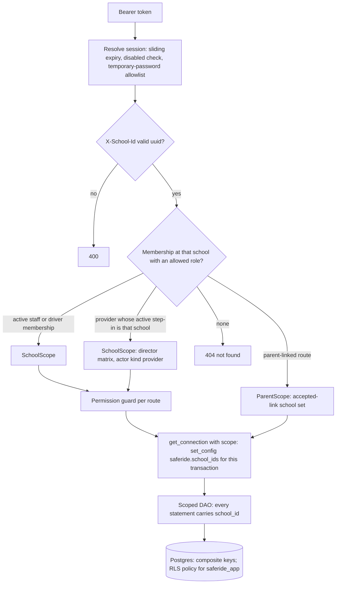
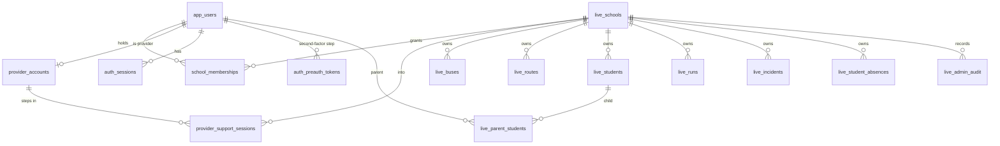
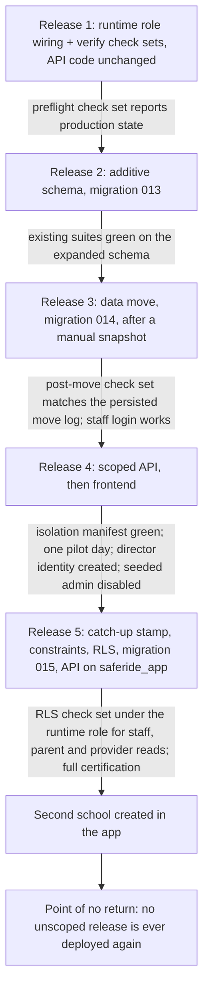

# feat: Multi-tenant schools — per-school isolation, staff roles, provider step-in

## Summary

Every school becomes its own walled space on the one deployment. Per-school memberships (director, transport coordinator, driver) replace the single global role; every school-scoped request names its school in a header and the server checks the caller's access key before any data is touched; a Kuumbai provider role provisions schools and steps in under audit with a second factor; parents follow accepted child links across schools. Isolation is layered — scoped data access, composite keys, then row-level security under a new runtime database role — and ships as five gated releases, with Msingi Bora's production data moved under school #1 before the second school is activated.

---

## Problem Frame

The product problem is in the origin document: one unscoped admin role sees every record, so a second school cannot share the deployment; the pilot's director and coordinator share one login with no record of who did what; Kuumbai has no in-app way to onboard or support a school; and the per-school isolation the original product enforced in the database was lost in the 2026-05 migration (see origin: docs/brainstorms/2026-08-21-multi-tenant-schools-requirements.md).

The engineering situation decides the shape of the work. Authorization is `require_role` only and `get_current_user` carries no school; 101 routes read and write by bare id or whole table, and four list routes are open to every role. `app_user_roles` holds one global role per user. Each DAO call opens its own transaction on a process-global pool with no request context, every endpoint is a sync `def` run in a worker thread, and one service commits mid-connection. The API, the migrate and verify Lambdas, and the local stack all connect as the database owner, which bypasses row-level security. The deploy script ships the API before migrations run, and the migrate handler applies every unmarked seed file to production. Production still holds the empty "Greenfield Academy" demo school and the seed-003 demo identities beside Msingi Bora's real data, and the e2e suite signs in as the seeded `admin@test.com` that the rollout retires.

---

## Requirements Traceability

Origin requirements map to the units below. Flows: F1 (onboarding) → U8, U10, U12, U13; F2 (coordinator's day) → U5, U6, U7, U12; F3 (owner switches) → U5, U12; F4 (provider step-in) → U9, U10, U13; F5 (parent across schools) → U11, U13. Acceptance examples are cited in the units' test scenarios.

| Origin requirement | Units |
|---|---|
| R1 every record belongs to one school | U3, U4, U14 |
| R2 access keys per actor | U5 |
| R3 request names its school; not-found for foreign records | U5, U6, U7, U14 |
| R4 school record is the school's settings | U6, U12 |
| R5 two staff roles | U3, U8 |
| R6 director powers incl. staff accounts | U5, U8 |
| R7 coordinator add/edit incl. deleting a still-open run | U5, U7 |
| R8 coordinator cannot delete or manage staff | U5, U6, U7 |
| R9 server-enforced role limits | U5 |
| R10 at least one director | U8 |
| R11 staff creation; offered role on a known email | U8 |
| R12 password change, forced first change, director reset | U8, U12 |
| R13 removal ends access at once | U5, U8 |
| R14 every staff action attributed | U9 |
| R15 roles at several schools | U3, U5 |
| R16 one active school at a time | U5, U12 |
| R17 switcher only for more than one school | U12 |
| R18 switching clears the screen | U12 |
| R19 provider accounts: lifecycle, floor, two at rollout | U10, U4 |
| R20 school list with health; provider home surface | U10, U13 |
| R21 provider creates school and first director | U10 |
| R22 step-in: reason, banner, exit, own identity | U10, U13 |
| R23 no school deletion this version | U6, U12 |
| R24 no merged cross-school view | U10 |
| R25 provider step-ins and actions in the same audit, identity provider-only | U9, U10 |
| R26 "SafeRide" label on school screens | U9 |
| R27 second factor for providers | U10, U13 |
| R28 driver belongs to the creating school | U3, U6, U7 |
| R29 driver self-signup removed | U8, U13 |
| R30 parent is one account across schools | U11 |
| R31 cross-school links pending; sign-up rule | U11 |
| R32 pending card: school name only, Not my child | U11, U13 |
| R33 school-side powers over a shared parent | U6, U11 |
| R34 PIN unchanged; no cross-school disclosure at creation | U6 |
| R35 rollout: data under school #1, director identity, seeded admin disabled | U4 |
| R36 scoped data access; database rejects cross-school relationships | U5, U6, U7, U14 |
| R37 RLS under a runtime role before the second school; never an unscoped release again | U2, U14 |

---

## High-Level Technical Design

### Request path

Every authenticated request resolves one access key for the named school and carries its school set into the connection before any DAO runs.

The scope dependency is `async def`: FastAPI runs sync dependencies in a copied context, so a ContextVar set in a sync dependency is invisible to the sync endpoint and its background tasks.

### Data model

`school_memberships` carries `(user_id, school_id, role in director/coordinator/driver, state in offered/active, offered_by, accepted_at, removed_at)`. `live_schools` gains a provider-assigned, non-editable `code`. `live_parent_students` gains `status in pending/accepted` and the child's `school_id`. `live_admin_audit` gains `actor_kind in staff/provider`, `support_session_id`, `resource_type`, `resource_id` and a widened `action` list. Every school-owned table — including the child tables `live_student_routes`, `live_route_stops`, `run_stops`, `run_absences`, `run_participation` — ends with `school_id NOT NULL`, `unique (id, school_id)` where it is a foreign-key target, a `(school_id)` index, and composite foreign keys to the rows it references. `live_admin_audit.school_id` stays nullable (provider-global actions have no school).

The school-owned set is canonical, shared as one `SCHOOL_OWNED_TABLES` constant by migration 015, the catalog test, the `tenancy-*` check sets and the post-seed assertion: `live_buses`, `live_routes`, `live_students`, `live_runs`, `live_fleet_plans`, `live_incidents`, `live_student_absences`, `live_communicated_stops`, `live_student_routes`, `live_route_stops`, `run_stops`, `run_absences`, `run_participation`, plus `live_admin_audit` (nullable school, its own split policy). `live_schools` is the catalog — no row policy; offers, the switcher and the banner read names and codes, and the settings route is scoped by the active school's id. `live_parent_students` is user-level (exempt), with `school_id` kept for integrity and school-side filtering.

### Membership and parent-link lifecycles

```mermaid
stateDiagram-v2
  [*] --> offered: director or provider adds an email that already has an account
  offered --> active: holder accepts after seeing school name, code, role and who offered it
  offered --> declined: holder declines
  offered --> cancelled: director cancels the offer
  [*] --> active: new account created with a temporary password
  active --> removed: director removes the role; access ends at the next request
```

```mermaid
stateDiagram-v2
  [*] --> accepted: match at a school where the parent already has a child, or single-school sign-up
  [*] --> pending: match at another school, or sign-up matching several schools
  pending --> accepted: parent accepts the school's card
  pending --> declined: parent taps Not my child; slot blanked, school alerted
  accepted --> [*]: slot removed or student deleted
```

Pending links never receive notifications: every recipient query filters `status = 'accepted'` and a non-disabled account.

### Releases and gates

---

## Key Technical Decisions

- **Memberships replace the global role for staff and drivers; parents stay link-based.** A `school_memberships` row per person per school carries the role; `app_user_roles` is kept through the transition for the old code during the deploy windows and stops being read after Release 4 (never dropped, per house rule). Parents hold no membership: their access key is the set of accepted `live_parent_students` rows. *Rejected:* overloading `app_user_roles.role` — its primary key is `user_id`, which is exactly the one-role-per-person limit being removed.

- **Access keys resolve on (school, allowed roles), never first-match.** `require_school(*roles)` looks up an active membership at the header's school with one of the route's roles; `offered` rows never yield a scope; parent links are consulted only on `parent-linked` routes; a provider gets the director matrix only when the header equals the school of their active support session, read from the database on every request. A person who is coordinator and driver at one school, or parent and staff, therefore gets the scope the route asks for, and nothing falls through between key classes.

- **The school travels as the `X-School-Id` header on every school-scoped request.** Validated as a UUID (400 otherwise), checked against the caller's access key, refused on mismatch; the session row keeps `last_school_id` only to choose the landing school. The frontend keeps the active school per tab (`sessionStorage`), never in the shared `localStorage`, so a stale tab keeps acting on the school it shows (AE13). Scoped responses carry `Cache-Control: no-store` and `Vary: X-School-Id`; the app writes one log line per request with school and actor kind, because API Gateway logs carry the path only. Drivers hold one membership, so their scope is derived server-side and the header is optional for driver routes. Providers are the exception to AE13: stepping into B from one tab makes a tab still on A answer 403, by design. *Rejected:* a `/api/schools/{id}/...` path prefix — it rewrites all 101 routes and every frontend hook for the same guarantee.

- **Release 4 compatibility window.** Old frontend bundles and phones mid-route hit the new API before the frontend deploys. `/api/auth/me` and the login response keep `role` (`admin` for any staff membership); `GET /api/fleet/schools` stays a one-element list (six pickers expect a list) and `GET /api/fleet/school` serves settings; stray `school_id` payload fields are ignored, not rejected; and a `SCOPE_HEADER_REQUIRED` setting (false in Release 4, true from Release 5) lets the server fall back for staff with no header — one membership → that school; several → `last_school_id` if still a member, else 400.

- **Scope is explicit at the connection seam; the context is a tripwire.** The `async def` scope dependency resolves the key and stores it in a `contextvars.ContextVar`; `get_connection(scope)` takes the scope as an argument, runs `select set_config('saferide.school_ids', %s, true)` on the pooled connection at the start of every transaction, and raises if a school-scoped request opens a connection without a scope; `get_global_connection()` serves user-level and provider-global tables and sets the GUC empty. A `scoped_transaction(conn)` helper re-arms the GUC after any commit or rollback on a held connection (the slot-in service commits mid-connection today), and a test forbids raw `commit()`/`rollback()` in DAO and service code. Background callees receive the scope explicitly and open connections through the same seam; plain threads inherit no context, so the geometry thread pool stays geo-only. `SET LOCAL` cannot take a bound parameter and session-level `SET` leaks across pooled connections and warm invocations, so the GUC is always transaction-local. *Rejected:* relying on callees to remember to set the context — every "no row → benign return" path (`regenerate_route_stops`, `_refresh_route_geometry`, push recipient lookups) would turn an RLS denial into silent success.

- **The GUC is a list of school ids.** Staff and driver scopes carry one id; a parent scope carries the set of schools where the parent has an accepted link; provider-global reads carry none and go through master-owned `SECURITY DEFINER` functions that return only the health aggregates and audit rows (a named, reviewable bypass). User-level tables — `app_users`, `auth_sessions`, `auth_preauth_tokens`, `school_memberships`, `provider_*`, `live_parent_students` (guarded by `parent_id`; its `school_id` and composite key stay for integrity and school-side filtering), `live_notifications`, `live_fcm_tokens`, `live_push_subscriptions` — are exempt from the school policy and stay guarded by the application's user-id predicates. The pending accept and decline routes resolve a `ParentScope` whose school set additionally includes that card's school, so the slot-blanking update and the school-stamped incident pass the policy. `ProviderDao` never imports a school DAO (import-lint test). *Rejected:* a per-user GUC with link-based policies — per-row sub-selects in policies are the documented RLS performance trap; the school set is index-backed and the application already filters parents by child id.

- **DAOs take a typed scope, not a bare id.** School-scoped DAO methods take a frozen `SchoolScope` (constructible only through the `core/scope.py` factories) as their first argument and every statement carries `school_id = %(school_id)s`; creates stamp `scope.school_id`; reads by id are `where id = %s and school_id = %s`; `get_connection` checks the type at runtime because no type checker runs in this repo. Connection-threaded helpers on child tables inherit the connection's scope. Provider aggregates live in a separate `ProviderDao`. Parent and driver reads keep their existing ownership keys. The two router-level direct connection uses (`students_live.py` pin map and pin stability) fold into DAOs so the seam covers them. *Rejected:* scope-bound DAO instances per request — `Depends` factories at 101 routes plus per-request construction of the fleet-plan composition, for the same guarantee.

- **Not found, never forbidden, for another school's record.** Scoped predicates make foreign rows absent; composite-key violations already map 23503 → 404; an RLS `WITH CHECK` failure (42501) maps to 404 and logs sqlstate, table, route and scope at error level — never the driver's message text, which can carry emails. 403 is reserved for a member in the wrong role, a provider without an active step-in on a school-scoped route, and a temporary-password holder outside the allowlist.

- **Permission matrix per route family.** Director: everything in the school. Coordinator: every read and every create/edit, including clearing absences, moving students, force-closing runs, deleting a run whose status is not completed, applying/restoring/discarding fleet plans, broadcasting, editing school settings and parent details; refused: deleting routes, alerts, drivers, buses, students, completed runs and parent accounts, and every staff endpoint. Deleting a parent account is account removal and director-only (an R8 clarification). Provider stepped in: director matrix. Driver and parent: their existing routes only. An account with `must_change_password` may call only `/api/auth/me`, `change-password` and `logout`; the dependency enforces this for every other router, including push, offers and provider routes.

- **One audit for staff and provider actions.** `live_admin_audit` is extended rather than paralleled: `actor_kind`, `support_session_id`, `resource_type/id`, and an `action` value per write family (verbatim-union CHECK rewrite). A shared `record_audit(conn, scope, action, resource)` helper is called inside the writing transaction by every staff write, including staff creation, password resets and offer decisions; the provider-side reader returns full rows, school-facing payloads compute `actor_display` server-side ("SafeRide" when `actor_kind = 'provider'`). "Last activity" on the provider list is the latest staff write; provider rows and read actions (`pin-map-viewed`) are excluded.

- **Provider step-in is a recorded, stepped-up support session.** `provider_support_sessions(provider_user_id, school_id, reason ≤ 500 chars, started_at, ended_at, end_cause, auth_session_id, ip, user_agent)`; step-in requires a fresh second-factor code unless `auth_sessions.totp_verified_at` is within 15 minutes; one active per auth session, a new step-in supersedes the previous; sessions end after four hours regardless of sliding expiry, on step-out, logout or expiry (`end_cause` records which; expiry is written lazily when next resolved or at logout). The header school must equal the active support session's school on every request.

- **Second factor on the standard library; no new dependencies.** RFC 6238 with `hmac`/`struct`/`base64`/`secrets` (SHA-1, 30-second step, 6 digits, ±1 step), validated against the RFC test vectors. The secret is derived as `HMAC-SHA256(TOTP_PEPPER, per-account salt)[:20]`; only the salt is stored and it is regenerated on every enrolment and every peer reset (the derivation is deterministic, so a reset that kept the salt would re-reveal the same secret). `TOTP_PEPPER` is a ≥192-bit SSM secret like `PIN_PEPPER`, `NoEcho`, and the deploy fails if it is absent rather than minting a new one (a silent rotation would lock every provider out); each enrolment stores a pepper key id so a mismatch answers "re-enrolment required" and is audited. `totp_last_step` rejects replay; enrolment is refused while enrolled (only a peer reset or a step-up with a current code unenrols); enrolment shows the base32 key and the `otpauth://` URI once with `Cache-Control: no-store` and enables only after a first valid code. No QR image in this version: rendering one needs a frontend package, which is not authorised; the key is entered manually (Open Questions).

- **The password step and the code step are separate, single-use tokens.** Login for a provider account returns a pre-auth token from `auth_preauth_tokens` (modelled on `password_reset_tokens`: hash only, 5-minute TTL, atomic consume, attempt counter), never a session; `POST /api/auth/totp {token, code}` re-checks `disabled_at`, provider removal and enrolment before issuing the session. Pre-auth tokens are voided by `revoke_all_sessions`, password change and provider removal. The frontend keeps the token in memory only. Verification is limited per user id (five failures in five minutes void the token; the sixth is warn-logged as a compromised-password signal) plus a coarse per-IP net; the existing login limiters cover only the password step and their success-clear must not touch the code limiter.

- **Temporary passwords are server-generated, expiring, and replaced under the holder's own authority.** Creating staff (or resetting a password) generates a ≥12-character password returned once and never audited; it expires after 72 hours (login answers the generic failure afterwards) and sets `must_change_password`. `change-password` always requires the current password, so a hijacked first session cannot become a takeover. A director reset writes the new hash, sets the flag, revokes every session, voids pre-auth and reset tokens, and records `staff-password-reset` with the actor. Because the director knows the temporary password, attribution starts at the holder's first change; the Staff page shows "password set on <date>" and the admin guide says so. Bootstrap providers carry the flag but no expiry (the SSM-held bootstrap password is not 72-hour-limited), and the migrate handler re-applies their hashes whenever the bootstrap parameter's `version` field rises — the migration-012 rotation precedent — so a locked-out bootstrap provider is recovered by a redeploy.

- **Offers are explicit and show what is being accepted.** An offer shows the school name, the provider-assigned non-editable school code, the role, the offering person's name and email, and the date; acceptance is an explicit action, never implicit at sign-in; the switcher disambiguates same-named schools by code. Staff creation answers the same silent "offered" response for provider and disabled emails (no account oracle), is rate-limited per director, and audited.

- **Disabling an account is one operation, honoured everywhere.** `disable_user` sets `disabled_at`, revokes sessions, voids reset and pre-auth tokens and unregisters push devices; `disabled_at is null` is a predicate in login, the driver PIN list, reset-token consumption, push recipient queries, membership resolution and parent auto-linking (provider and disabled accounts never auto-link).

- **Composite keys and NOT NULL land in Release 5, after a catch-up stamp.** Release 2 adds nullable `school_id` everywhere (child tables included), `unique (id, school_id)` on foreign-key targets, indexes, and a `tenancy_stamp_school_one()` function plus a `tenancy_move_log` table; Release 3 backfills and persists before/after counts and per-table id digests in the log (psycopg drops `RAISE NOTICE` output without a handler, so notices are not evidence); Release 4 stops every writer from producing a NULL school; Release 5 calls the stamp function once more for rows the old code wrote during the Release 3→4 window, asserts zero NULLs, then adds the composite foreign keys `NOT VALID` and validates them in the same file (the runner holds the lock until commit either way; atomicity matters more because the API is already live), sets `NOT NULL`, and enables row-level security — under `SET LOCAL lock_timeout '5s'` and `SET LOCAL statement_timeout '90s'`. Single-column foreign keys stay; the composite ones use the column-list form `on delete set null (bus_id)` so a parent delete never nulls `school_id`; foreign-key targets are only the plain `unique (id, school_id)` constraints (deferrable and partial uniques cannot be targets). `live_admin_audit.school_id` stays nullable.

- **Row-level security under `saferide_app`; the owner bypasses by design.** Tables stay owned by the master (migration) role, which bypasses RLS because `FORCE ROW LEVEL SECURITY` is not set — no allow-all policy and no hard-coded owner name. Policies `using (school_id = any(string_to_array(nullif(current_setting('saferide.school_ids', true), ''), ',')::uuid[]))` with the same `WITH CHECK` on every school-owned table (the GUC reads back as an empty string after first use, hence `nullif`); the runtime role is `LOGIN NOBYPASSRLS` (RDS cannot create `BYPASSRLS` roles anyway). `live_admin_audit` carries its own split policy — reads stay school-set-bound, writes admit a NULL school only for provider-kind rows — the one named exception, documented in the migration header. A catalog test and the `tenancy-rls` check set assert that the API's `current_user` is not the table owner and that RLS is enabled on every school-owned table; the check set runs `SET ROLE saferide_app` so it proves something. Only `ApiFunction` switches its `DATABASE_URL`; `MigrateFunction` and `VerifyFunction` stay on master; the local compose API switches in the same unit, or local certification proves nothing about RLS.

- **Runtime role and provider bootstrap are handled by the migrate handler, not SQL files.** The role password, the TOTP pepper and the two bootstrap provider accounts come from SSM via environment (`/saferide/db-app-password`, `/saferide/totp-pepper`, `/saferide/provider-bootstrap`); an idempotent Python step after the SQL migrations runs `ALTER ROLE ... PASSWORD` and inserts the provider accounts (PBKDF2 hashes computed by a local script with `app.core.security.hash_password`, as migration 012 did) when `provider_accounts` is empty. Bootstrap providers enrol their second factor at first sign-in, which is the creation-time reveal for accounts no peer created.

- **Five merged releases, each certified at its own commit.** Schema ships one release ahead of the code that needs it (the migrate Lambda resolves files from its own package and the API deploys first), the data move runs against the old code (which ignores the new columns), and the scoped code ships only after every row has a school. The fleet-plan branch showed that SHA cut-points on one long branch do not survive review fixes; each release here is its own branch and PR.

- **The data move has three exits and its own point of no return.** Migration 014 skips on an empty database (fresh local bootstrap), skips when already moved (second apply), acts only on the pinned pre-move state, and raises — rolling the whole file back — on anything else. Its point of no return is the first morning run after the move, not the second school: a manual RDS snapshot is taken before the act, a decision deadline is set, and the restore runbook (new instance, template change) is written before the deploy.

- **Rollout identity sequence keeps a working staff login at every step.** The data move gives `admin@test.com` an interim director membership at school #1 so old and new code both keep working; after Release 4 a provider creates the real director identity in-app; only after that director has signed in and set their password, and after one pilot day on Release 4, is the seeded admin disabled. Old code reads `app_user_roles`, not memberships, so the seeded admin still signs in under old code after its membership is removed — that is the Release 4 rollback; its `disabled_at` and password rotation land in migration 015 with Release 5 (SSM-held value, the 012 pattern). Demo identities from seed 003 are disabled at the data move, not deleted, after asserting none of them drives a live bus; the empty Greenfield row is deleted by the data move after a catalog-driven assertion that nothing references it, with NULL counts re-asserted afterwards (audit rows that pointed at Greenfield are left NULL, not re-stamped).

- **Local seeds: extend, never add.** A new seed file would be applied to production by the migrate handler and its guard would fail the deploy. The second local school, the director/coordinator/provider identities and the disabled-admin parity live in the local-only tail of `003_local_snapshot.sql` (already marked applied in production); the dump's INSERT lists that omit `school_id` are amended in place and the tail calls `tenancy_stamp_school_one()`, so local data has production shape; `reset-local-db.sh` asserts zero NULL scope, zero composite-key orphans and RLS enabled per table after seeding. The test suites move from `admin@test.com` to a seeded director.

- **Driver creation with an existing email is refused with a generic message.** Drivers belong to the school that created them (R28) and the owner's schools do not share drivers; offering a driver membership to an existing account is deferred. The PIN-in-use message stays (R34) but the email message no longer discloses that the address exists elsewhere.

---

## Implementation Units

Units are grouped by release. Within a release they are ordered by dependency; each is one landable commit in the `type(scope): summary (Un)` convention. U-IDs are stable; U9 lands before U6 because the scoped slices call its audit helper.

### Release 1 — verification and infrastructure (API code unchanged)

### U1. Scope manifest, two-school fixtures, shared test identities

- **Goal:** Make isolation testable before anything is scoped: a route inventory that fails on unclassified routes, a second local school with staff and provider identities, shared fixtures, and a post-seed integrity assertion.
- **Requirements:** R36, R37, Success Criteria (every route classified; certification), AE6 setup.
- **Dependencies:** none.
- **Files:** `backend/tests/integration/conftest.py`, `backend/tests/integration/scope_manifest.py` (new), `backend/tests/integration/test_scope_manifest.py` (new), `backend/db/seeds/003_local_snapshot.sql` (local-only tail), `scripts/reset-local-db.sh` (post-seed assertion hook), `frontend/tests/e2e/helpers.ts`, `docker-compose.local.yml` (`AUTH_IP_RATE_MULTIPLIER` only if needed).
- **Approach:** The manifest lists every registered route (method + path) with a class: `public`, `auth`, `provider-global`, `school-scoped`, `driver-scoped`, `parent-linked`. The test enumerates `create_app().routes` and fails on any route missing from the manifest or listed but absent. The local seed tail gains school B ("IT Second School", with a code) and its director, coordinator, a driver with bus and route, one student with a parent who also has a child at school A; a provider identity with a pre-enrolled second factor (salt seeded, pepper from the local env). `conftest.py` grows `login(email, password)`, `director_a/coordinator_a/director_b/provider_headers` fixtures and a `school_headers(school_id)` helper; modules keep their `client`. `reset-local-db.sh` gains a post-seed assertion step (zero NULL scope once 013 exists; later composite-key orphans and RLS flags, extended in U14), and both local scripts create the `saferide_app` role (`LOGIN NOBYPASSRLS`, password from `backend/.env`) before the migration loop so 013's grants succeed from Release 2 onward. e2e helpers gain `DIRECTOR_A`, `COORDINATOR_A`, `DIRECTOR_B`, `PROVIDER` and `signInAs` learns to seed the tab's active school.
- **Patterns to follow:** `backend/tests/integration/test_fleet_plan_draft.py::test_non_admin_refused_on_every_endpoint` (route list as lambdas), `test_confirm_fleet_cross_school_claim_conflicts` (two schools via API), `frontend/tests/e2e/helpers.ts:signInAs`.
- **Execution note:** land the manifest red-then-green: the first run lists every route as unclassified, the commit classifies them.
- **Test scenarios:**
  - Every route in `create_app()` appears in the manifest exactly once; adding a dummy route without a manifest entry fails the test.
  - Seed reset produces two schools, and `login` works for all five seeded identities; the post-seed assertion passes.
  - e2e `signInAs(DIRECTOR_A)` lands on the admin home; the per-account login limiter is not exhausted across the suite (count logins per account; raise `AUTH_IP_RATE_MULTIPLIER` locally only if needed).
- **Verification:** manifest test green; `scripts/reset-local-db.sh` then the existing integration suite still green.

### U2. Runtime database role wiring and tenancy check sets

- **Goal:** Ship the production plumbing the later releases need — the `saferide_app` role, its secret, the TOTP pepper, the provider bootstrap input — and the verify check sets that gate every later release, with the API code byte-identical to main.
- **Requirements:** R37, R19 (bootstrap input), Success Criteria (second school only after certification).
- **Dependencies:** none (ships with U1 in Release 1).
- **Files:** `infra/backend/template.yaml`, `infra/scripts/deploy-backend.sh`, `backend/app/migrate_handler.py`, `backend/app/verify_handler.py`, `backend/tests/integration/test_verify_handler.py`, `backend/tests/core/test_migrate_handler_steps.py` (new), `infra/scripts/verify-db.sh`, `scripts/provider-bootstrap.sh` (new, local: generates passwords, writes SSM, prints nothing secret), `infra/README.md`.
- **Approach:** Template parameters `DbAppPassword` and `TotpPepper` (both `NoEcho`) sourced by `deploy-backend.sh`; `/saferide/db-app-password` keeps the `ssm_secret` create-if-missing pattern, while `/saferide/totp-pepper` and `/saferide/provider-bootstrap` must pre-exist — the deploy fails if either is absent or unparseable. The bootstrap is not a template parameter: the migrate Lambda reads `/saferide/provider-bootstrap` (base64url-encoded JSON with a `version` field, the `_maybe_b64_json` precedent) at runtime by name in the backend region under an `ssm:GetParameter` policy — the `FIREBASE_*_SSM` pattern. `MigrateFunction` receives them as env, and `ApiFunction` receives `TOTP_PEPPER` (unused until Release 4); the setting is required with no default, so a missing env fails at boot rather than deriving secrets from an empty key. The migrate handler gains a post-SQL step: create `saferide_app` if missing (`LOGIN NOBYPASSRLS`), set its password, grant usage and DML on `public`, set default privileges for objects the master role creates, and `GRANT saferide_app TO current_user` with the `SET` option so the verify Lambda can assume the role from Release 1; insert bootstrap providers (with `must_change_password`, no password expiry) when `provider_accounts` is empty, and re-apply their hashes when the bootstrap parameter's `version` rises; an email that already exists fails the deploy naming the address. `ApiFunction` keeps the master `DATABASE_URL` until U14. Verify check sets: `tenancy-preflight` (school rows with id and name; `app_users` by role; per-table NULL `school_id` counts; a catalog-driven per-school reference count for every foreign key to `live_schools`, audit excluded, so Greenfield leftovers surface at Release 1; demo identities and whether any drives a live bus; open runs), `tenancy-post-move` (zero NULL scope on school-owned tables except audit, membership rows, provider count ≥ 2, Greenfield absent, every school row carrying a code, counts equal to `tenancy_move_log`), `tenancy-rls` (role assumed via a one-statement `select set_config('role', 'saferide_app', false)` on the dedicated read-only connection; `current_user` is not the owner; RLS enabled on every school-owned table; no GUC → zero rows; GUC = A → zero rows of B; a parent set of {A, B} sees both; provider aggregate functions return counts without rows).
- **Patterns to follow:** `infra/scripts/deploy-backend.sh:ssm_secret`, `backend/app/verify_handler.py:_CHECK_SETS` and `infra/scripts/verify-db.sh`, migration 012's SSM-held credential precedent, the fleet-plan infra-only release (API identical to main).
- **Test scenarios:**
  - `test_verify_handler.py` pins the allowlist with the three new sets; each set's SQL runs read-only against the local DB and returns the documented keys; `tenancy-rls` before U14 reports "RLS not enabled" per table rather than crashing.
  - Migrate handler step tests: bootstrap is a no-op when the table is missing, inserts two rows when empty, inserts nothing when rows exist; role creation is idempotent; a missing pepper aborts before any SQL runs.
- **Verification:** `sam build` succeeds; a deploy from this branch shows the migrate Lambda output with the role step and zero migrations applied; `verify-db.sh tenancy-preflight` returns production's state — the evidence U4's preflight is written against.

### Release 2 — additive schema

### U3. Migration 013: tenancy schema

- **Goal:** Add every table, column, index and function the later releases read, compatible with the running code.
- **Requirements:** R1, R5, R15, R25, R28, R31, R36 (groundwork).
- **Dependencies:** U2 (role exists so grants can be issued).
- **Files:** `backend/db/migrations/013_tenancy_schema.sql`, `backend/db/seeds/003_local_snapshot.sql` (local tail: memberships and codes for seeded schools and identities), `backend/tests/integration/test_tenancy_schema.py` (new).
- **Approach:** New tables `school_memberships`, `provider_accounts` (`user_id`, `totp_salt`, `totp_pepper_key`, `totp_enrolled_at`, `totp_last_step`, `created_by`, `removed_at`), `provider_support_sessions` (with `end_cause`, `ip`, `user_agent`), `auth_preauth_tokens`, `tenancy_move_log`. New columns: `live_schools.code` (nullable now, unique index; `NOT NULL` in 015); `app_users.disabled_at`, `must_change_password`, `temporary_password_expires_at`; `auth_sessions.last_school_id`, `support_session_id`, `totp_verified_at`; `live_parent_students.status default 'accepted'`, `school_id`, `offered_at`, `decided_at`; nullable `school_id` on `live_incidents`, `live_student_absences`, `live_communicated_stops`, `live_notifications`, `live_student_routes`, `live_route_stops`, `run_stops`, `run_absences`, `run_participation`; `live_admin_audit.actor_kind default 'staff'`, `support_session_id`, `resource_type`, `resource_id`, widened `action` CHECK as the verbatim union of the three current values plus one value per write family, fixed here and in the header: staff create / offer / offer-cancel / offer-decline / role-remove / password-reset; school create / update; bus, driver, student, route and run create / update / delete; run force-close; absence mark / clear; incident acknowledge / delete; plan draft / discard (apply and restore exist); broadcast; parent update / delete; parent-link decline; provider step-in / step-out / account-create / account-remove / totp-reset. All new school foreign keys are `NO ACTION`. `unique (id, school_id)` on `live_buses`, `live_routes`, `live_students`, `live_runs`; `(school_id)` indexes on every school-owned table and `(school_id, created_at desc)` where lists sort by time; partial unique `school_memberships (user_id, school_id, role) where removed_at is null`. Function `tenancy_stamp_school_one(uuid)`: stamps `school_id` on every school-owned row where it is NULL, deriving from bus/run/student/route where possible and otherwise using the argument, and returns per-table counts. Master-owned `SECURITY DEFINER` functions with a fixed `search_path` and `EXECUTE` granted to `saferide_app` — `parent_signup_matches(email)` (student and school ids for slot matches on non-disabled, non-provider accounts), `provider_school_health()` and `provider_audit_rows(school_id, support_session_id)` — are created here so Release 4 stays migration-free; 015 may `create or replace` them. Grants to `saferide_app`. No `NOT NULL`, no composite foreign keys yet.
- **Patterns to follow:** migration 011's header and ordering comments; the verbatim-union CHECK rule (008); `if not exists` idempotency; legacy 001's `unique (id, school_id)` style; `password_reset_tokens` shape for `auth_preauth_tokens`.
- **Test scenarios:**
  - Double-apply against a populated local DB at 012 is a no-op on the second run.
  - Existing integration suite passes unchanged against the expanded schema.
  - Schema test asserts each new table/column/index/function exists, that `live_parent_students.status` defaults existing rows to `accepted`, and that `tenancy_stamp_school_one` on a copy of the snapshot leaves zero NULLs on school-owned tables other than audit.
- **Verification:** Release 2 certification green; `verify-db.sh migrations` lists 013 applied in production; `tenancy-preflight` output unchanged except the new objects.

### Release 3 — data move

### U4. Migration 014: Msingi Bora becomes school #1 (rollout act)

- **Goal:** Put every production record under Msingi Bora, give the old code an interim director membership, bootstrap two provider accounts, disable the demo identities, remove the empty Greenfield row, and persist the evidence — acting only on the pinned pre-move state.
- **Requirements:** R1, R19, R35; AE12.
- **Dependencies:** U2, U3.
- **Files:** `backend/db/migrations/014_tenancy_data_move.sql`, `backend/db/seeds/003_local_snapshot.sql` (dump INSERT lists amended to carry `school_id`; tail calls the stamp function), `backend/tests/integration/test_data_move_rehearsal.py` (new), `infra/README.md` (snapshot and restore runbook), `docs/work/validation/2026-xx-xx-multi-tenant-schools.md` (evidence, written during rollout).
- **Approach:** One `do $$ ... $$` block with three exits: empty database → skip; already moved (move log row present, Greenfield absent) → skip; pinned pre-move state → act; anything else → raise, rolling the file back. The pinned state asserts, by id: `live_schools` is exactly {Msingi Bora, Greenfield}; every non-NULL `school_id` anywhere equals Msingi Bora; a catalog-driven scan of every foreign key to `live_schools` finds zero references to Greenfield (audit excluded — those rows stay NULL); the five seed-003 identities exist and none of the demo drivers is `live_buses.driver_id`; zero non-completed runs — identity and invariants only; live per-table counts are recorded into `tenancy_move_log` as evidence, not asserted, and `tenancy-preflight` is re-run immediately before the act so the post-move comparison uses same-day numbers. Then: `tenancy_stamp_school_one(msingi)` stamps every NULL scope (derivation is a consistency check, the argument is the source — a single real school makes unattributable rows attributable); create memberships — `admin@test.com` active director (interim), every driver user active driver; assign Msingi Bora's `code` (chosen with Kuumbai before the act, recorded in the move log); `disable_user` semantics for the demo identities (set `disabled_at`, revoke sessions); re-assert zero Greenfield references immediately before deleting the row, check one row deleted, re-assert NULL counts; write before/after counts and per-table id digests to `tenancy_move_log`. The act is scheduled in the evening with a manual RDS snapshot taken first and the restore runbook at hand.
- **Patterns to follow:** migration 012 (production-only data change with local parity), the house rule "rehearse by double-applying to a populated DB at the previous migration", the fleet-plan apply gate.
- **Execution note:** write the rehearsal test first: it transforms the local snapshot to production shape (two school rows, demo identities, NULL scopes), applies 014 twice, and pins the expected log numbers.
- **Test scenarios:**
  - Rehearsal: after the first apply, zero NULL scope on every school-owned table other than audit; memberships present; Greenfield gone; demo identities disabled with no live sessions; `tenancy_move_log` has one row with matching counts; the second apply is a no-op.
  - Empty database (fresh `reset-local-db.sh`): the file skips cleanly and the local tail produces the same end state.
  - Raise paths: a third school row, a bus still claimed by Greenfield, a demo driver on a live bus, or an open run each roll the whole file back with nothing changed.
  - Covers AE12: after the move the interim director signs in and every pre-existing bus, route, student, run and alert is still listed (old code path).
- **Verification:** `verify-db.sh tenancy-post-move` matches the move log; the pilot's admin login and a driver PIN login work; no parent notification was sent by the move; the snapshot id and decision deadline are recorded.

### Release 4 — scoped application

### U5. Request context, access keys and permission guard

- **Goal:** Replace `require_role` with a scope-resolving dependency: the header school, the caller's access key, the permission matrix, immediate revocation, the explicit connection seam with a transaction-local GUC, the compatibility window, and the not-found contract.
- **Requirements:** R2, R3, R6, R7, R8, R9, R13, R15, R16; AE1, AE2, AE5, AE13, AE20, AE25 (guard half).
- **Dependencies:** U3, U4.
- **Files:** `backend/app/core/scope.py` (new: frozen `SchoolScope`, `ParentScope`, `ProviderScope`, factories, the context var), `backend/app/core/auth.py`, `backend/app/core/permissions.py` (new), `backend/app/core/db.py` (`get_connection(scope)`, `get_global_connection()`, `scoped_transaction`), `backend/app/core/config.py` (`SCOPE_HEADER_REQUIRED`), `backend/app/api/_helpers.py`, `backend/app/dao/auth_dao.py`, `backend/app/services/auth_service.py`, `backend/app/schemas/auth.py`, `backend/app/api/auth.py`, `backend/app/main.py` (response headers, request log line), `backend/tests/core/test_scope.py` (new), `backend/tests/core/test_db_seam.py` (new), `backend/tests/integration/test_scope_enforcement.py` (new).
- **Approach:** `get_session_user` returns the user plus active memberships, provider state, the active support session, `must_change_password`, `disabled_at` (disabled → 401). `require_school(*roles)` is `async def`: validate the header as a UUID, resolve an active membership at that school with an allowed role (or the provider's matching step-in, or — on parent-linked routes only — the accepted-link school set), set the context var, return the frozen scope; `require_director`, `require_staff`, `require_driver_scope`, `require_parent` wrap it. `get_connection(scope)` sets `saferide.school_ids` from the argument inside the transaction and raises when a school-scoped request (context var set) opens a connection without a scope; `get_global_connection()` sets it empty; `scoped_transaction(conn)` re-arms after commit/rollback. A grep test forbids raw `commit()`/`rollback()` in `backend/app/dao` and `backend/app/services`. `/api/auth/me` returns memberships, `active_school`, pending offers, provider state, `must_change_password`, and keeps `role` (`admin` for staff); the login response keeps `role` too. Header fallback behind `SCOPE_HEADER_REQUIRED`; driver scope derived server-side. The temporary-password allowlist is enforced in the dependency. Scoped responses get `Cache-Control: no-store` and `Vary: X-School-Id`; one log line per request carries route, school, actor kind and outcome. Map SQLSTATE 42501 to 404 with a structured error log.
- **Patterns to follow:** `backend/app/core/auth.py:get_current_user` dict shape (keep `id`, `email`, `full_name` for audit writers), `parent_portal.py` 404-before-guard ownership shape, `accept_slot_in`'s cross-school consistency check, `_helpers.py:map_error`.
- **Execution note:** test-first on the core: `test_scope.py` (key resolution, header mismatch, offered rows never yield a scope) and `test_db_seam.py` (GUC visible inside a sync endpoint and inside a BackgroundTask; raise without scope; re-arm after commit) before touching routers.
- **Test scenarios:**
  - Covers AE1 / AE20: director of A with header B → 404; parent requesting an unlinked student → 404; no header on a school-scoped route → 400 once `SCOPE_HEADER_REQUIRED` is true, fallback to the only membership while false; a malformed header → 400.
  - Covers AE2: coordinator calling a delete route → 403; the same call by the director → 200.
  - Covers AE5: membership removed, then the next request from the existing session → 404 for that school while another school's membership keeps working; when it was the only membership, `/me` shows none and the client signs out.
  - Covers AE13: two requests on one token with headers A then B act on A then B; the GUC read inside a DAO equals the header each time.
  - A coordinator who is also a driver at the same school gets 403 on a driver route with the staff header set and succeeds on the driver route without it (driver scope derived); a pending offer never yields a scope.
  - Provider without step-in on a school-scoped route → 403; with an active step-in for A and header B → 403.
  - `must_change_password` user calling any route other than the three allowed — including `/api/push/*` and an offer accept — → 409 with a stable code.
  - Seam: a DAO call from a BackgroundTask sees the same GUC as the request; a service that commits mid-connection keeps the GUC after the commit; opening a school connection without a scope in a scoped request raises; 50 alternating A/B requests show no leak.
- **Verification:** `test_scope_enforcement.py`, `test_scope.py`, `test_db_seam.py` green; manifest still green; `/api/auth/me` shape documented in `backend/app/schemas/auth.py`.

### U9. Attribution: one audit for staff and provider actions

- **Goal:** Record every staff write with its actor and school in the existing audit, show who did what on the result screens, and mask provider identity as "SafeRide" on school-facing payloads — landing before the scoped slices that call it.
- **Requirements:** R14, R25, R26; AE8 (label half), AE14, AE26 (row half).
- **Dependencies:** U5 (scope, actor kind).
- **Files:** `backend/app/dao/audit_dao.py` (new shared `record_audit`), `backend/app/dao/fleet_plan/apply_restore.py`, `backend/app/api/students_live.py` (`_pin_map` via the helper and the DAO), `backend/app/dao/run_dao.py` (`force_closed_by`), `backend/app/dao/absence_dao.py` (`marked_by` name in payloads), `backend/app/dao/incident_dao.py` (`acknowledged_by` name), `backend/app/api/fleet_plans.py`, `backend/app/api/runs_live.py`, `backend/app/api/incidents.py`, `backend/tests/integration/test_attribution.py` (new), `test_pin_map_audit.py`.
- **Approach:** `record_audit(conn, scope, action, resource_type, resource_id, detail)` writes `actor_id/name/email` from the scope's actor, `actor_kind` from the scope, `support_session_id` when stepped in, `school_id` from scope; every write endpoint in U6–U8, U10 and U11 calls it inside its transaction (one action value per family, listed in migration 013's header); `detail` never carries passwords, temporary passwords, tokens or child details. Result payloads gain `*_by_display`: the staff name, or "SafeRide" when the audit row's `actor_kind` is provider — computed in the DAO, never client-side. `force_close_run` stores the actor.
- **Patterns to follow:** `apply_restore.py` in-transaction audit insert; `_pin_map`'s same-transaction write; `status_sql.py` for a shared display CASE if needed.
- **Test scenarios:**
  - Covers AE14: coordinator force-closes a run → the run report shows `force_closed_by_display` = coordinator name; the audit row has `actor_kind = staff`, the school, the run id.
  - Covers AE8 label: a stepped-in provider applies a plan → plan payload says "SafeRide"; the audit row carries the provider's name and `support_session_id`.
  - A `record_audit` call with a value outside migration 013's list fails a unit test.
  - Every write route in the manifest produces exactly one audit row per call (parametrised over the manifest's write routes as director of A); no `detail` field contains an email, a password or a student name.
  - A B-school write never produces an A-school audit row; the provider-only reader (U10) is 403 for directors.
- **Verification:** attribution suite green; `live_admin_audit.action` values all within the CHECK.

### U6. Scoped data access, slice 1: schools, buses, drivers, students, absences, parents

- **Goal:** Convert the first route families to scoped DAOs, stamp the school on creation, remove client-supplied school ids and the bus claim path, and apply the school-side parent rules.
- **Requirements:** R1, R3, R4, R8, R23, R28, R33, R34, R36; AE3 (absences), AE18.
- **Dependencies:** U5, U9 (audit helper).
- **Files:** `backend/app/dao/fleet_dao.py` (schools, buses), `backend/app/dao/account_dao.py`, `backend/app/dao/student_live_dao.py`, `backend/app/dao/absence_dao.py`, `backend/app/services/account_service.py`, `backend/app/api/fleet.py` (schools, buses), `backend/app/api/accounts.py`, `backend/app/api/students_live.py`, `backend/app/dao/fleet_plan/draft.py`, `backend/app/dao/fleet_plan/_shared.py`, `backend/tests/integration/test_isolation_fleet.py` (new), `test_isolation_students.py` (new), `test_fleet_plan_draft.py` (claim tests rewritten), `test_students_parents.py`.
- **Approach:** `GET /api/fleet/schools` stays a one-element list (the active school) for the compatibility window and `GET /api/fleet/school` serves settings; `POST /api/fleet/schools` and `DELETE /api/fleet/schools/{id}` are removed (creation moves to the provider in U10; deletion is out, R23). Buses: list/create/update/delete scoped; `create_bus` stamps the school; driver assignment checks the driver's membership school equals the bus school with both rows locked. `confirm_fleet` no longer claims or releases — it lists only the school's buses; the "claimed by" conflict, the `kept-applied-routes` release notice and the `_fleet_drift_problems` re-claim check go away. Drivers: created with an active driver membership at the scope school; listing joins memberships; `delete_driver` removes the membership and bus assignment and deletes the identity only when it holds nothing else; an existing email is refused with "That email is already in use" and no school name. Students: list/create/update/delete scoped, `school_id` ignored in payloads, `_sync_routes` refuses routes of another school (404), bulk upload takes the school from scope. Absences scoped through the student. Parents: `list_parents` shows only parents linked to the school's students and only those children, and a pending-link parent by slot email only; `update_parent` and `delete_parent` refuse when any linked child (accepted or pending) belongs to another school; delete is director-only. Pin-map and pin-stability router-level connections move into the student DAO.
- **Patterns to follow:** `student_live_dao.py` bulk paths (already school-stamped), `accept_slot_in` consistency check, `apply_restore.py` lock ordering.
- **Execution note:** test-first per family — write the two-school isolation test for a family, then scope it.
- **Test scenarios:**
  - For each route in the families: as director of A, a B record id → 404 and the row is unchanged (checked by SQL); list routes never include B ids, names, coordinates or counts.
  - Creating a bus/student/driver as A stamps A's `school_id` even if the payload carries B's.
  - Covers AE18 / R33: a parent with children at A and B appears on A's Parents page with only A's child; A's director deleting the parent → 409; after B's link is removed the delete succeeds; an edit of the shared parent is refused with 409 too; a pending-link parent shows as the slot email with no account name or phone.
  - Bus with a driver from B → 409; `confirm_fleet` with B's bus id → 404; no `claimed by` text and no release on deselect.
  - Covers R34: creating a driver with a PIN in use at B → "That PIN is already in use by another driver" (unchanged); with an email in use at B → generic message, no school named.
  - Absence marked by coordinator of A on B's student → 404 (Covers AE3 happy path for A's student).
- **Verification:** slice suites green; the manifest marks these routes tested; no bare `where id = %s` on a school-owned table remains in the slice's DAOs.

### U7. Scoped data access, slice 2: routes, fleet plans, runs, incidents, notifications, background tasks

- **Goal:** Finish the scoped conversion for the remaining families, including the coordinator's open-run delete, school-stamped incidents, accepted-only notification recipients, and scope propagation into background work.
- **Requirements:** R1, R3, R7, R8, R28, R36; AE3 (force-close, plan apply), AE25, AE27.
- **Dependencies:** U5, U6, U9.
- **Files:** `backend/app/dao/fleet_dao.py` (routes), `backend/app/dao/fleet_plan/*.py`, `backend/app/dao/run_dao.py`, `backend/app/dao/incident_dao.py`, `backend/app/dao/push_dao.py`, `backend/app/services/push_service.py`, `backend/app/services/slot_in_service.py` (uses `scoped_transaction`), `backend/app/api/fleet.py` (routes), `backend/app/api/fleet_plans.py`, `backend/app/api/runs_live.py`, `backend/app/api/incidents.py`, `backend/app/api/push.py`, `backend/tests/integration/test_isolation_routes_plans.py` (new), `test_isolation_runs_incidents.py` (new), `test_cross_bus_roster.py`, `test_driver_lifecycle.py`, `test_route_broadcast.py`.
- **Approach:** Routes scoped with `bus_id` validated in-school (AE25); `school_id` ignored in route payloads; the route-options preview takes the school from scope. Fleet plans: `school_id` query/body parameters replaced by scope; plan ids resolved `where id and school_id`. Runs: `GET /api/runs` scoped (the dashboard's Active Runs card reads the active school only); `create_run` stamps from scope and validates bus/route in-school; `DELETE /api/runs/{id}` allowed for the coordinator only while status is not completed, director for any run the server already permits. Driver routes resolve the bus through the driver's membership school. Incidents: `school_id` stamped at insert from bus/run/student; lists scoped; the signup auto-link incident is written per matched school (U11 supplies the rows). Notifications stamp `school_id` where derivable; reads stay user-scoped; every recipient query (`parents_of_students`, `parents_of_bus`, `parents_of_route`) filters `status = 'accepted'` and `disabled_at is null`. Background callees (`notify_route_changes`, `propose_slot_ins`, `PushService.notify_*`) take an explicit scope and open connections through `get_connection(scope)`; the slot-in service's mid-connection commits go through `scoped_transaction`.
- **Patterns to follow:** `run_dao.start_run` (route must belong to the driver's bus and carry a school), `slot_in_service` school grouping, `push_dao.insert_plan_notification` (conn-threaded write).
- **Execution note:** test-first per family, as U6; add a no-GUC negative test for each early-return path (`regenerate_route_stops`, `_refresh_route_geometry`, recipient lookups) proving they raise rather than silently succeed.
- **Test scenarios:**
  - Covers AE25: route of A updated with B's bus → 404, no change; run created for A with B's route → 404.
  - Covers AE27: driver starts a run on the wrong route (no child recorded); coordinator deletes it → 204 and the route is startable again; coordinator deleting yesterday's completed run → 403; director deleting a run with recorded participation → the existing refusal.
  - Covers AE3: coordinator force-closes a stale run and applies a draft plan for A → both succeed; the same on B's ids → 404.
  - `GET /api/runs?active=1` as director of A lists only A's runs; as a driver, only their bus's run.
  - Background: a route broadcast for A triggered while a request for B is in flight sends only to A's accepted parents; a pending-link parent and a disabled parent receive nothing; notification rows carry A's `school_id`.
  - Slot-in proposals for A still appear after the service's mid-connection commit (GUC re-armed).
  - Incident created by B's driver never appears on A's Alerts; unread counts are per school.
- **Verification:** both slice suites green; the manifest has no route left in the untested class; `scripts/certify.sh` integration stage green with the seeded director.

### U8. Staff accounts, offers, passwords, disabling, driver self-signup removal

- **Goal:** Give directors a staff surface — create staff with a server-generated temporary password, offer a role to a known email, cancel offers, remove roles with the last-director lock, reset passwords — and give every staff member password change with forced first change; one disable operation honoured everywhere.
- **Requirements:** R5, R6, R10, R11, R12, R13, R29; AE4, AE15, AE16, AE23.
- **Dependencies:** U5, U9.
- **Files:** `backend/app/api/staff.py` (new router `/api/staff`), `backend/app/dao/membership_dao.py` (new), `backend/app/services/staff_service.py` (new), `backend/app/api/auth.py` (`change-password`, `offers`, `offers/{id}/accept|decline`), `backend/app/services/auth_service.py`, `backend/app/dao/auth_dao.py` (`disable_user`, `disabled_at` predicates), `backend/app/dao/student_live_dao.py` (auto-link excludes provider and disabled accounts), `backend/app/core/rate_limit.py`, `backend/app/schemas/auth.py`, `backend/app/main.py` (mount), `backend/tests/integration/test_staff_accounts.py` (new), `backend/tests/services/test_auth_service.py`, `backend/tests/api/test_auth_rate_limit.py`.
- **Approach:** `POST /api/staff` (director; rate-limited per director; audited): new email → create the user with a server-generated ≥12-character temporary password (returned once), `must_change_password`, `temporary_password_expires_at` 72 hours, active membership; existing email → membership `offered` carrying `offered_by`; provider and disabled emails answer the same "offered" response without creating anything. `GET /api/staff` lists members and offers with "password set on" dates. `DELETE /api/staff/{user_id}` removes the membership (row `removed_at`), locking the school's director rows `FOR UPDATE` and refusing when it would remove the last active director (offers do not count); `DELETE /api/staff/offers/{id}` cancels an offer. `POST /api/staff/{user_id}/reset-password` (director or stepped-in provider): new temporary password, flag, expiry, `revoke_all_sessions`, void pre-auth and reset tokens, audit. `POST /api/auth/change-password` (always requires the current password; limited per account) updates the hash, clears the flag and expiry, revokes every other session. Offers: `/me` lists them with school name, code, role, offering person and date; accept activates, decline removes. Login refuses an expired temporary password with the generic failure. `disable_user` is the single disable path and `disabled_at is null` is added to login, the PIN user list, reset-token consumption and push recipients. `SIGNUP_ROLES` becomes `{"parent"}`.
- **Patterns to follow:** `AuthService.reset_password` (`update_password` + `revoke_all_sessions`), `password_reset_tokens` consumption, `apply_restore.py` `FOR UPDATE` ordering, `rate_limit.py` limiters.
- **Test scenarios:**
  - Covers AE16: new coordinator signs in with the temporary password → every route except `me/change-password/logout` is 409; `change-password` without the current password → 400; with it → the console loads and the temporary password fails for everyone.
  - Covers AE15: director enters an email with an existing account → `offered`, no password changed; `/me` for that account lists the offer with school name, code, role and offerer; accept → membership active; decline → gone; director cancels → gone.
  - Covers AE4: sole director removing themselves → 409; with a second active director → 204; two concurrent removals leave at least one (serialised by the lock); a pending director offer does not count.
  - Covers AE23: director resets a coordinator's password → the coordinator's open session is rejected; they sign in with the temporary password and must change it; the reset is audited with the actor.
  - Temporary password older than 72 hours → login fails with the generic message; staff creation for a provider email and for a disabled email both return "offered" and create nothing.
  - Disabled driver's PIN no longer signs in; a reset token for a disabled account cannot be consumed; a disabled parent receives no push.
  - Signup with role driver → 400; role parent still works; provider emails never auto-link to students.
- **Verification:** suite green; `AuthPage` still allows parent signup (frontend change in U13).

### U10. Provider surface: accounts, second factor, school list, provisioning, step-in, audit reader

- **Goal:** Everything Kuumbai does: provider account lifecycle with a two-step TOTP login, the school list with health, creating a school with its code and first director, stepped-up and audited step-in and step-out, and the provider-only audit view.
- **Requirements:** R19, R20, R21, R22, R24, R25, R27; AE9, AE17, AE19, AE24, AE26, AE29, AE15 (provider branch).
- **Dependencies:** U5, U8 (staff creation reused), U9.
- **Files:** `backend/app/api/provider.py` (new `/api/provider`), `backend/app/dao/provider_dao.py` (new; aggregate functions only), `backend/app/services/provider_service.py` (new), `backend/app/core/totp.py` (new, stdlib), `backend/app/core/config.py` (`TOTP_PEPPER`), `backend/app/core/security.py`, `backend/app/api/auth.py` (login returns a pre-auth token for providers; `POST /api/auth/totp`), `backend/app/dao/auth_dao.py` (pre-auth tokens), `backend/app/core/rate_limit.py` (TOTP limiters), `backend/app/core/scope.py`, `backend/tests/core/test_totp.py` (new), `backend/tests/integration/test_provider.py` (new), `backend/tests/integration/test_provider_dao_imports.py` (new).
- **Approach:** Provider login: password step → pre-auth token (5-minute, single-use, attempt counter) and `totp_required` or `totp_enrolment_required`; `POST /api/auth/totp {token, code}` verifies (±1 step, `totp_last_step` replay guard, five failures void the token, per-IP net), re-checks `disabled_at`, `removed_at` and enrolment, sets `totp_verified_at`, then issues the session; a voided token answers a distinct code so the client can tell it from a wrong code. When enrolment is required, the token is accepted without a code and issues a session restricted — through the same allowlist mechanism as `must_change_password` — to `me`, `change-password`, `logout`, `totp/enrol` and `totp/confirm`; `confirm` lifts the restriction. Enrolment (`POST /api/provider/totp/enrol` → key and `otpauth://` URI once; `POST .../confirm` enables after a valid code) regenerates the salt and stores the pepper key id; it is refused while enrolled. `/api/provider/schools` lists every school with health through the `SECURITY DEFINER` aggregate functions created in migration 013 (setup state, students, buses, drivers, runs today, latest staff write). `POST /api/provider/schools` creates the school with a generated non-editable code and its first director through the U8 service. `POST /api/provider/step-in {school_id, reason, code?}` requires `totp_verified_at` within 15 minutes, else the `code` field — `/me` exposes the freshness so the dialog shows the input up front — and creates the support session with IP and user agent, supersedes any active one; `POST /api/provider/step-out` ends it; four-hour hard lifetime; `/me` reports the active step-in. `GET /api/provider/audit` reads the audit with provider identities, filterable by school and support session. Provider accounts: `GET/POST /api/provider/accounts` and `DELETE .../{id}` (refused for the last one; revokes sessions and pre-auth tokens) require the same fresh-code step-up as step-in; `POST .../{id}/reset-totp` (peer step-up; clears enrolment and regenerates the salt). All provider routes require a provider account and no school header; `ProviderDao` never imports school DAOs.
- **Patterns to follow:** `backend/app/core/security.py` hashing and `PIN_PEPPER` config, `password_reset_tokens` shape, `rate_limit.py` limiters, `AuthService._issue_session`, the DriversPage reveal-once pattern (frontend, U13).
- **Test scenarios:**
  - `test_totp.py`: RFC 6238 Appendix B vectors pass; a code from the previous step is accepted once and rejected on reuse; regenerated salts produce a different secret; a pepper key id mismatch reports re-enrolment required.
  - Covers AE19: correct password without a code → no session, a pre-auth token; wrong code → 401; five wrong codes → the token is void and the next login needs the password again; correct code → session with `totp_verified_at`.
  - Pre-auth token: expired after five minutes; single-use; voided by a password change; not accepted as a bearer session anywhere.
  - Enrolment: unenrolled bootstrap provider → enrolment-restricted session refused on every provider and school route until confirmed; confirm with a valid code → enrolled; enrol again while enrolled → 409; peer reset → enrolment required with a new salt.
  - Creating or removing a provider account 20 minutes after the last code → a fresh code is required.
  - Covers AE24 / AE17: removing the last provider → 409; removing another provider ends their signed-in session on the next request.
  - Covers AE29: step-in without a reason → 400; a reason of 600 characters → 400; step-in 20 minutes after the code → a fresh code is required; with a reason → `/me` shows the step-in; a second step-in supersedes the first (`end_cause = superseded`); step-out and logout write `end_cause`; a four-hour-old step-in is ended on the next request.
  - Covers AE26: step-in then no writes → an audit row with action `provider-step-in`, the provider, the school and the time.
  - Covers AE9 / R24: `GET /api/students` as a provider without step-in → 403; the school list carries counts but no student names; `test_provider_dao_imports.py` fails if `provider_dao` imports a school DAO.
  - Covers AE15 provider branch: creating a school with the owner's existing email → offer, no password; with a new email → temporary password returned once; the school gets a unique code.
  - Health: "latest staff write" ignores `pin-map-viewed` and provider-kind rows.
- **Verification:** provider suite green; `/api/provider/*` routes classified `provider-global` in the manifest; no provider route returns a roster.

### U11. Parent links: pending acceptance, sign-up rule, decline, shared-parent reads

- **Goal:** Make cross-school links wait for the parent, apply the sign-up rule, let a parent decline with the school alerted, and keep every parent read keyed on accepted links.
- **Requirements:** R30, R31, R32, R33; AE10, AE21, AE22.
- **Dependencies:** U5, U6, U7 (school-stamped incidents), U9.
- **Files:** `backend/app/dao/student_live_dao.py` (`sync_parent_links`, `link_account_to_matching_students`), `backend/app/dao/account_dao.py` (`link_parent_to_matching_students`), `backend/app/dao/parent_live_dao.py` (`_child_ids` accepted-only; `list_pending`), `backend/app/api/parent_portal.py` (`GET /pending`, `POST /pending/{school_id}/accept|decline`), `backend/app/services/auth_service.py` (signup), `backend/tests/services/test_parent_links.py`, `backend/tests/integration/test_parent_pending_links.py` (new).
- **Approach:** On student create/update/bulk: for each slot email with a non-provider, non-disabled account, link `accepted` when the parent already has an accepted child at this school, else `pending`; the link row carries the child's `school_id`. Sign-up matching reads through `parent_signup_matches` (the platform-wide scan has no scope of its own) and then creates links and the per-school incidents under a `ParentScope` of the matched schools. Grouped by school: exactly one school → all `accepted`; more → all `pending`; zero → nothing. Pending links are returned to the parent grouped by school (one card per school, school name only, no child details); accept activates every pending link at that school; decline deletes those links, blanks the matching email slot on each student, and writes a school-stamped incident `parent-link-declined` with the email; both routes run under a `ParentScope` that includes the pending school, so their writes pass the database backstop. Two-parent cap counts accepted and pending. Every parent read goes through `_child_ids` filtered to accepted; `list_children` keeps `school_name`. The signup auto-link incident is written per matched school.
- **Patterns to follow:** `_ConnParentLinks` fake-store unit tests, `ParentLiveDao._child_ids` single choke point, `IncidentDao.create_cancellation_incident` shape.
- **Test scenarios:**
  - Covers AE10: parent with an accepted child at A; B enters a student with the email → one pending card naming B; accept → both children listed, no other student visible; B's Parents page shows only its own child.
  - Covers AE21: signup matching students at A and B → two pending cards, nothing accepted; accept A then B one by one.
  - Single-school signup still auto-links; zero matches → empty state; a provider email in a parent slot never links.
  - Under the local `saferide_app` role, a sign-up matching A and B creates pending links at both and one incident per school; the match path raises rather than returning empty when its function is bypassed.
  - Covers AE22: decline B's card → links gone, the student's slot blanked, B's Alerts shows "mismatched email" with the email; the pending payload never contained student fields.
  - Cap: one accepted and one pending parent on a student → a third email is refused.
  - Re-entering the declined email on the same student creates a new pending card.
- **Verification:** both suites green; `parent-portal` routes classified `parent-linked` with their isolation tests.

### U12. Frontend: memberships, active school, switcher, staff and settings pages, password and choose-school screens

- **Goal:** The admin console works inside one active school carried per tab, shows a switcher only when needed, hides coordinator-forbidden controls, and gains the Staff and School Settings pages plus the forced-password and choose-school interstitials.
- **Requirements:** R4, R8 (UI half), R12, R16, R17, R18, R23; AE6, AE7, AE16 (UI), AE18 (UI).
- **Dependencies:** U5, U6, U7, U8 (APIs).
- **Files:** `frontend/src/lib/auth.tsx`, `frontend/src/lib/apiClient.ts` (school header, `signal`), `frontend/src/lib/school.ts` (new: per-tab active school store), `frontend/src/lib/queries.ts` (school-prefixed keys, `useSchoolKey`), `frontend/src/app/routes.tsx`, `frontend/src/features/auth/ProtectedRoute.tsx`, `frontend/src/features/auth/ChangePasswordPage.tsx` (new), `frontend/src/features/auth/ChooseSchoolPage.tsx` (new), `frontend/src/features/auth/OffersPage.tsx` (new), `frontend/src/app/layouts/AdminLayout.tsx`, `frontend/src/features/admin/StaffPage.tsx` (new), `frontend/src/features/admin/SchoolSettingsPage.tsx` (replaces `SchoolsPage.tsx`), `frontend/src/features/admin/StudentsPage.tsx`, `RoutesPage.tsx`, `FleetMapPage.tsx`, `PlanReviewPage.tsx`, `components/StudentsPinMap.tsx`, `components/BulkUploadDialog.tsx`, `components/PlanFleetStep.tsx`, `DriversPage.tsx`, `ParentsPage.tsx`, `RunsPage.tsx`, `AlertsPage.tsx`, `frontend/tests/unit/school.test.ts` (new), `frontend/tests/unit/apiClient.test.ts`, `frontend/tests/e2e/role-access.spec.ts`, `frontend/tests/e2e/school-switcher.spec.ts` (new), `frontend/tests/e2e/staff.spec.ts` (new), `frontend/tests/e2e/admin-plan.spec.ts` (teardown without school delete).
- **Approach:** `AuthUser` carries `memberships`, `activeSchool`, `offers`, `mustChangePassword`, `provider`. The active school lives in `sessionStorage`; `apiClient` attaches `X-School-Id` from it and passes an `AbortSignal`; every admin query key is prefixed `["school", schoolId, ...]`; switching awaits `cancelQueries` then `removeQueries` on the old prefix, sets the store, and navigates to the dashboard; `keepPreviousData` is not used across schools. `ProtectedRoute` routes: `mustChangePassword` → change-password page; pending offers → offers page (school name, code, role, offerer, date; Accept / Decline); staff with no active school and several memberships → choose-school page, preserving the deep-link destination; one membership → auto-select; a 404 on a school-scoped call for a removed membership → re-choose when other memberships remain, sign out to `/auth` when none do — never a toast storm. The sidebar card shows the active school (name and code) with the switcher when `memberships.length > 1`; nav shows Staff (director only) and Settings; the Schools page and every school picker disappear. Coordinator capability hiding: delete buttons and the Staff entry render only for directors — an active provider step-in on the current school counts as director for this check — and the server refusal toast is the backstop. Staff page shows "password set on" per member. Parents with a child at another school are marked shared on the Parents page, with Edit disabled and a tooltip explaining why (the server refuses the write). A "Parent view" entry appears for staff who also have children.
- **Patterns to follow:** `signOut` cache clearing precedent (replaced by prefix removal), `PlanReviewPage` school-keyed queries, `DriversPage` `pinReveal` dialog, `useConfirm` note variant, `PageHeader`/`StatCard`.
- **Test scenarios:**
  - Unit: `school.ts` store is per tab (two `sessionStorage` mocks); `apiClient` sends the header only when a school is active and passes the signal.
  - Covers AE6 (e2e): coordinator A sees no switcher; director at A and B sees two entries with codes; provider sees the list (U13).
  - Covers AE7 (e2e): on A's fleet map with buses visible, switch to B → no A bus, student or alert rendered at any point; a delayed A response (mocked slow route) does not repopulate B.
  - Covers AE16 (e2e): temporary-password sign-in lands on the change-password page, which requires the temporary password; after the change the console loads.
  - Offers e2e: an account with an offer sees the offer page with school, code and offerer before anything else; accept → the switcher gains the school.
  - Coordinator e2e: delete controls absent on Buses/Routes/Students/Drivers/Alerts/Parents; open-run delete present on the Active Runs card; Staff not in nav; direct navigation to `/staff` redirects.
  - Staff page e2e: create a coordinator (temporary password shown once), offer a role to an existing email ("role offered"), cancel it, remove the coordinator, last-director removal blocked with the server message.
  - `role-access.spec.ts` matrix updated for director/coordinator/provider/driver/parent.
- **Verification:** `tsc`, vitest, build and the e2e suite green with the seeded identities; no `Greenfield Academy` string in `frontend/src`.

### U13. Frontend: provider console, second-factor screens, parent pending cards, sign-up change

- **Goal:** The provider's home surface and tools, the TOTP challenge and enrolment, the parent's pending-link cards, and the parent-only sign-up form.
- **Requirements:** R20, R22, R27, R29, R32; AE19 (UI), AE22 (UI), AE29 (UI).
- **Dependencies:** U10, U11, U12.
- **Files:** `frontend/src/features/provider/ProviderLayout.tsx`, `SchoolsListPage.tsx`, `CreateSchoolPage.tsx`, `StepInDialog.tsx`, `ProviderAuditPage.tsx`, `ProviderAccountsPage.tsx`, `TotpEnrolPage.tsx` (all new), `frontend/src/features/auth/TotpChallengePage.tsx` (new), `frontend/src/features/auth/AuthPage.tsx`, `frontend/src/features/parent/ParentHomePage.tsx`, `frontend/src/features/parent/parentHooks.ts`, `frontend/src/app/routes.tsx`, `frontend/src/app/layouts/AdminLayout.tsx` (support banner), `frontend/tests/e2e/provider.spec.ts` (new), `frontend/tests/e2e/parent-pending-link.spec.ts` (new), `frontend/tests/e2e/auth.spec.ts`.
- **Approach:** Provider routes under `/provider`: list with health as the home (always reachable from the support banner), create school (code shown; temporary password or offer result shown once), step-in via the `useConfirm` note variant for the reason, with the code input shown up front when the last code is stale, audit page with school/session filters, accounts page with create/remove/reset-2FA. While stepped in, the admin console renders with a persistent banner (school name and code, reason, time left, Exit) and the "SafeRide" label appears wherever an actor is shown; a 403 on a school-scoped call while the banner shows routes back to the provider school list with a toast naming the end cause — the provider mirror of the staff re-choose rule. TOTP: the pre-auth token is held in component state only; challenge screen after the password, with a distinct "Too many attempts — sign in again" state that returns to the password step when the token is voided; enrolment screen shows the key and `otpauth://` URI once with a copy button and a first-code confirmation. Parent home: a pending card per school with Accept and Not my child, no child details, above the children list; Not my child goes through the confirm dialog, noting the school will be alerted. Sign-up form offers Parent only.
- **Patterns to follow:** `DriversPage` reveal-once dialog, `RoleMobileLayout` for the parent app, `AdminLayout` header slot, sonner toasts.
- **Test scenarios:**
  - Covers AE19 (e2e): provider password then wrong code → error; five wrong codes → "Too many attempts" and back to the password step; right code → list page; a reload during the challenge returns to the password step (token not persisted).
  - Enrolment e2e: bootstrap provider → password → enrolment page → key shown once → confirm → change password → list.
  - Covers AE29 (e2e): step-in requires a reason and, after 15 minutes, a code; banner visible on every admin page; Exit returns to the list; the school list is reachable from the banner; working past the four-hour limit lands on the school list with the "step-in ended" toast.
  - Create school e2e: new director email → temporary password dialog; existing email → "role offered" message; the school appears with its code.
  - Covers AE22 (e2e): parent sees a card naming school B only; Not my child asks for confirmation, then clears it and the children list is unchanged.
  - Sign-up e2e: the role select offers Parent only; driver option absent.
- **Verification:** e2e green; provider pages render nothing from a school roster (assert no student names on the list page).

### Release 5 — constraints, row-level security, runtime role

### U14. Migration 015: catch-up stamp, composite keys, NOT NULL, RLS, API on the runtime role

- **Goal:** Make cross-school relationships unrepresentable and turn on the database backstop before the second school exists.
- **Requirements:** R1, R3, R36, R37; AE30.
- **Dependencies:** U2, U4, U5–U11 (no writer produces NULL scope).
- **Files:** `backend/db/migrations/015_tenancy_constraints_rls.sql`, `infra/backend/template.yaml` (`ApiFunction` `DATABASE_URL` on `saferide_app`; `SCOPE_HEADER_REQUIRED` true), `docker-compose.local.yml` and `backend/.env.example` (local API on `saferide_app`; migrations and seeds stay on `saferide`), `scripts/start-local.sh` / `scripts/reset-local-db.sh` (post-seed assertions extended with orphan counts, `relrowsecurity` per table, grants), `backend/app/verify_handler.py` (`tenancy-rls` final form), `backend/tests/integration/test_rls.py` (new), `backend/tests/integration/test_scope_enforcement.py`.
- **Approach:** `SET LOCAL lock_timeout '5s'` and `SET LOCAL statement_timeout '90s'` (never plain `SET`; the runner's autocommit session continues into the seed loop); call `tenancy_stamp_school_one(msingi)` for rows written during the Release 3→4 window, assert zero NULLs on every school-owned table except audit; set `disabled_at` and rotate the password hash for the seeded `admin@test.com` (SSM-held value, the 012 pattern); `NOT NULL` on those tables and on `live_schools.code`; composite foreign keys `(bus_id, school_id)`, `(route_id, school_id)`, `(student_id, school_id)`, `(run_id, school_id)` on routes, students, student routes, route stops, run stops/absences/participation, incidents, absences, communicated stops, parent links — added `NOT VALID` then `VALIDATE CONSTRAINT` in the same file, using `on delete set null (<single column>)` where the existing single-column key does; `ENABLE ROW LEVEL SECURITY` (not `FORCE`) on every school-owned table with the `saferide_app` policy, `live_admin_audit` getting the split policy (NULL-school writes for provider-kind rows only); the role membership grant for `SET ROLE` having shipped with U2. Template and compose switch the API's connection to `saferide_app` in the same release, so the API runs under the role from the first request after deploy.
- **Patterns to follow:** migration 009's nullable → backfill → `set not null` sequence, legacy 001 composite-key style with the column-list `SET NULL` form, the policy shape with `nullif` and `any`.
- **Execution note:** write `test_rls.py` first, connecting as `saferide_app`, so the policies are written against failing assertions.
- **Test scenarios:**
  - Covers AE30: as `saferide_app` with no GUC, every school-owned table returns zero rows; with GUC = A, inserting a route for A with B's bus id fails (composite key); a direct SQL insert of a B-scoped row while the GUC is A fails with 42501; the API maps that to 404 and logs a structured error.
  - Parent and provider reads under RLS: a parent set {A, B} reads children at both; a parent with accepted {A} declines a pending card at B and the link removal, the slot blank and B's incident all land; the provider health function returns counts for A and B without rows; a driver membership scope sees only its school.
  - A provider-account creation as `saferide_app` writes its NULL-school audit row; a NULL-school staff audit row fails with 42501.
  - Catalog test: every school-owned table has `relrowsecurity`; the API's `current_user` is not the owner; user-level tables have no school policy; the master role still reads all rows.
  - Deleting a bus nulls `bus_id` on its routes but never `school_id` (column-list form); double-apply of 015 is a no-op; `VALIDATE` finds zero violations on the local snapshot.
  - Full `scripts/certify.sh` green with the local API on `saferide_app`.
- **Verification:** `verify-db.sh tenancy-rls` under `SET ROLE` passes every check including parent and provider reads; `tenancy-post-move` counts unchanged plus zero NULL rows created after the move; production API health and a full pilot day's flows work under the runtime role; only then is the second school created.

### Release-independent

### U15. Documentation and operational record

- **Goal:** Ship the user-facing and operator-facing documentation with the behaviour, and the validation record with every gate's evidence.
- **Requirements:** Success Criteria (shared login retired; onboarding without SQL), R22 (provider guide), R31/R32 (parent guide).
- **Dependencies:** U12, U13 for final wording.
- **Files:** `docs/user-manual/admin-guide.md` (Staff, School Settings, switcher, offers, attribution and "password set on", coordinator limits), `docs/user-manual/parent-guide.md` (pending cards), `docs/user-manual/driver-guide.md` (sign-in unchanged note), `docs/user-manual/provider-guide.md` (new: bootstrap, second factor and re-enrolment, create school, step-in and step-up, audit, account lifecycle), `README.md` (security notes rewritten for memberships, second factor, runtime role; demo logins), `infra/README.md` (runtime role, secrets, pepper rotation consequence, snapshot and restore runbook), `docs/work/validation/2026-xx-xx-multi-tenant-schools.md`.
- **Test expectation:** none — documentation; the validation record is checked against the Operational Notes gates.
- **Verification:** each guide describes the shipped screens; the validation record lists every release's gate output.

---

## Scope Boundaries

- **Email invitations** (owner or staff) — deferred; production has no email transport (see origin).
- **PIN school-safety mechanism** — the non-disclosing email message lands here; the PIN-space redesign stays a gate before the first unrelated school (origin R34).
- **QR image at second-factor enrolment** — needs a frontend package; the key and URI are shown for manual entry until a dependency is authorised.
- **Organization layer, multi-campus schools, merged cross-school views, custom roles, school deletion and retention rules, suspension, billing, branding, self-serve sign-up** — deferred per origin Scope Boundaries.
- **Driver membership offers** (moving a driver between an owner's schools) — deferred; creation with a known email is refused generically.
- **Email-address squatting at parent sign-up** (an unverified sign-up claiming an email a school later enters) — pre-existing and out of scope; the pending gate and the per-school incident limit the blast radius.

### Deferred to Follow-Up Work

- Request-scoped single transaction (one `conn.transaction()` per request via `Depends(scope="function")`) instead of one transaction per DAO call — worth doing once the scoped DAOs exist; not required for isolation.
- A per-user GUC with link-based policies for parent reads, if the school-set backstop proves too coarse.
- Pending-link and offer expiry.
- A provider-side export of the audit (retention stays "life of the school").
- CI running `scripts/certify.sh`.
- Retiring `app_user_roles` reads, the `role` field on `/api/auth/me`, and the `SCOPE_HEADER_REQUIRED` fallback after the Release 4 window.

---

## System-Wide Impact

- **Auth boundary:** every one of the 101 routes changes its guard; the scope manifest is the new contract. Four routes open to all roles become scoped; two admin routes disappear (create/delete school), one settings route and one provider router appear; the login flow gains a second step for providers and an allowlist for temporary-password holders.
- **Data lifecycle:** `school_id` becomes part of every school-owned row's identity, child tables included; parent links gain a status; audit rows gain an actor kind; new tables for pre-auth tokens, support sessions and the move log. Deleting a school is no longer possible from the app.
- **Database access:** the API stops connecting as the owner; a second role, three SSM parameters and a bootstrap input enter the deploy, and the deploy fails when the pepper is missing. Local development mirrors the split (API on the runtime role, migrations on the owner).
- **Request handling:** the scope dependency is async; `get_connection` takes a scope; background callees and the slot-in service's mid-connection commits go through the same seam; one log line per request carries school and actor kind; scoped responses are uncacheable.
- **Performance:** one extra `set_config` round trip per DAO transaction; new `(school_id)` indexes keep scoped lists and RLS predicates index-backed; policies compare the bare indexed column against a short uuid array.
- **Push and notifications:** recipient queries filter accepted links and enabled accounts; feeds stay user-scoped; provider step-ins register no device.
- **Sessions and rate limits:** sessions carry a last school, a support session and `totp_verified_at`; limiters are added for the code step, `change-password`, staff creation and password resets; certification logs in as five identities (budget the per-account limiter).
- **Tests and local stack:** integration fixtures gain shared identities; e2e moves off `admin@test.com`; seeds change only in the already-applied local tail, whose dump INSERT lists are amended; `reset-local-db.sh` asserts integrity after seeding; `admin-plan.spec.ts` teardown switches to SQL.
- **Docs:** admin, parent and new provider guides; README security notes rewritten; infra README with the restore runbook.

---

## Risks & Dependencies

| Risk | Mitigation |
|---|---|
| One forgotten predicate leaks a school | Typed scope on every DAO method, manifest test per route, composite keys, RLS under a non-owner role (U1, U6, U7, U14) |
| A sync dependency sets the context in a copied context and the GUC is empty everywhere — silent in Release 4, fail-closed outage in Release 5 | `async def` scope dependency; seam test asserts the GUC inside a sync endpoint and a background task (U5) |
| A mid-connection commit drops the transaction-local GUC and RLS turns later reads into silent empties | `scoped_transaction` re-arms after commit/rollback; grep test forbids raw commits in DAO/service code; no-GUC negative tests on early-return paths (U5, U7) |
| A single-valued GUC breaks parent and provider reads only at Release 5 | uuid-list GUC, parent school set, `SECURITY DEFINER` aggregates, parent and provider cases in `test_rls.py` and the verify set (U10, U14) |
| Pooled connection carries a previous request's school | GUC set transaction-locally only; alternating-scope pool test (U5) |
| RLS passes locally but proves nothing (superuser / owner) | Local API on `saferide_app`; catalog test that `current_user` is not the owner; verify check set runs `SET ROLE` |
| Deploy window: new code before migration | Schema one release ahead; data move runs under old code; Release 4 has no migration |
| Data move assigns rows wrongly, or production differs from assumptions | Three-exit preflight with catalog-driven assertions; rehearsal on a production-shaped snapshot; manual RDS snapshot and restore runbook; persisted move log compared by the verify set |
| Rows written by old code between Release 3 and 4 stay unscoped | Catch-up stamp in 015 before NOT NULL; Release 5 gate counts NULL rows created after the move |
| No working staff login during rollout | Interim director membership for the seeded admin; director created in-app and a pilot day before the seeded admin is disabled; old code ignores `disabled_at` |
| e2e and integration suites lose their admin identity | Seeded director/coordinator/provider in the local tail; helpers updated in U1 before any scoping lands |
| Stale frontend cache shows the previous school | School-prefixed keys, cancel then remove on switch, `signal` threaded, no `keepPreviousData` across schools (U12) |
| RLS violation surfaces as 500 or logs secrets | 42501 mapped to 404 with a structured log (sqlstate, table, route, scope), never the driver message (U5) |
| A new seed file breaks a production deploy | Rule: extend the local tail of 003 only (U1, U4) |
| Pepper missing or silently re-minted locks every provider out | Deploy fails if `/saferide/totp-pepper` is absent; pepper key id per enrolment; peer reset path; rotation documented as "re-enrol every provider" |
| A phished director offers a role under a spoofed school name | Offer shows the non-editable school code and the offerer; explicit accept; switcher shows codes (U8, U12) |
| Pending or squatted links receive child notifications | Recipient queries filter accepted links and enabled accounts; pending cards show the school only; per-school incident on every cross-school match (U7, U11) |
| A pending card discloses that a child attends school B to a wrong recipient | Accepted residual: the card carries no child detail; the school is alerted on decline |
| Certification account churn trips the login limiter | Count logins per identity; raise `AUTH_IP_RATE_MULTIPLIER` locally only |
| Release 5 locks (`ACCESS EXCLUSIVE`) during route hours | `SET LOCAL lock_timeout`/`statement_timeout` in the migration; deploy outside route hours |

Dependencies: SSM parameters `/saferide/db-app-password`, `/saferide/totp-pepper` (must pre-exist), `/saferide/provider-bootstrap` before Release 1; the pilot director's email and availability for the rollout act; Kuumbai staff emails for the bootstrap accounts; a manual RDS snapshot before Release 3.

---

## Operational Notes

### Releases

| Release | Units | Contents | Migration | Surface |
|---|---|---|---|---|
| 1 | U1, U2 | Role wiring, secrets, bootstrap input, verify check sets, test harness | none (role step in handler) | backend infra; API code unchanged |
| 2 | U3 | Additive tenancy schema, stamp function, move log | 013 | backend |
| 3 | U4 | Data move to school #1; demo identities disabled; Greenfield removed | 014 | backend |
| 4 | U5, U9, U6, U7, U8, U10, U11, U12, U13 | Scoped API, staff/provider/parent features, frontend | none | backend, then frontend |
| 5 | U14, U15 | Catch-up stamp, composite keys, NOT NULL, RLS, API on `saferide_app`, header required, docs | 015 | backend infra + migration |

### Go/No-Go per release

- **Release 1:** migrate Lambda output shows the role step and no migrations; `verify-db.sh tenancy-preflight` returns school rows, identity inventory, demo-driver bus assignments and NULL-scope counts — recorded in the validation record as the data-move contract; the deploy fails fast if the pepper is missing.
- **Release 2:** full certification green on the expanded schema; `verify-db.sh migrations` lists 013; preflight counts unchanged.
- **Release 3 (the rollout act, evening, pilot admin reachable):** manual RDS snapshot taken and its id recorded; rehearsal numbers match `tenancy-post-move` and the move log; the interim director and a driver PIN sign in; no NULL scope outside audit; Greenfield absent; provider count = 2; decision deadline for restore is the next morning's first run.
- **Release 4:** isolation manifest green; full certification with the seeded identities; after deploy: provider signs in, changes password, enrols the second factor, creates the real director; director signs in and sets a password; coordinator account created; one full pilot day on the scoped code; then the seeded admin's membership is removed in-app from the Staff page — the only production write path in a migration-free release — and `SCOPE_HEADER_REQUIRED` is confirmed false until Release 5.
- **Release 5:** `tenancy-rls` under `SET ROLE` passes staff, parent and provider checks and confirms the API's user is not the owner; `VALIDATE CONSTRAINT` reported zero violations; zero NULL-scope rows created after the move; API health under the runtime role; full certification; header fallback off; the seeded admin no longer signs in; only then is the second school created in the app.

### Rollback

- Releases 1–2: redeploy the previous code; additive schema stays.
- Release 3: before the first morning run, restore the manual snapshot per the runbook (new instance, template change); after it, the move is the new baseline (old code keeps working against it).
- Release 4: redeploy Release 3 code and frontend; the seeded admin still signs in under old code (it reads `app_user_roles`); its disable and rotation only arrive with 015.
- Release 5: redeploy Release 4 code with the template still pointing the API at the runtime role (Release 4 code sets the GUC, so it runs under RLS — rehearsed locally before the release); constraints stay.
- Point of no return: once the second school holds data, no release before Release 4 is deployed again; the certified Release 5 artifact is kept.

### Windows and monitoring

Deploy outside route hours; the data move is its own scheduled act. Watch after each release: 404 rate on school-scoped routes (a spike means a frontend still sends stale ids), error-level 42501 logs, 400s for missing headers after Release 5, login failures for the seeded identities, code-step failures per provider account, provider step-in rows and end causes.

---

## Open Questions

- Deferred to implementation: exact GUC name, the `resource_type` vocabulary, the school-code format, and whether `force_close_run` stores the actor on the run row or only in the audit.
- Needs an authorisation before it is built: a QR-rendering frontend package for second-factor enrolment.
- Confirm with the pilot during Release 4 review: deleting a parent account is director-only (the origin lists drivers and staff; this plan treats a parent account the same way).
- First landing for a person with several schools and no last-used school: the chooser page (this plan); a lowest-named default is the alternative.
- Whether driver email-and-password sign-in should also require a forced password change (this plan: no; drivers sign in by PIN).

---

## Sources & Research

- Origin: `docs/brainstorms/2026-08-21-multi-tenant-schools-requirements.md`; architecture proposal whose mechanics this plan adopts: `docs/ideation/2026-08-22-multi-tenant-schools-architecture-proposal.html`.
- Auth and session: `backend/app/core/auth.py`, `backend/app/services/auth_service.py`, `backend/app/dao/auth_dao.py`, `backend/app/api/auth.py`, `backend/app/core/rate_limit.py`, `backend/app/core/security.py`.
- Connection seam: `backend/app/core/db.py` (`get_connection`, process-global pool, one transaction per DAO call); the mid-connection commits in `backend/app/services/slot_in_service.py`; Lambda entrypoints `backend/app/lambda_handler.py`, `backend/app/migrate_handler.py`, `backend/app/verify_handler.py`. FastAPI runs sync dependencies and endpoints through anyio's threadpool in a copied context (verified with a probe against fastapi 0.136 / starlette 1.3 / anyio 4.13): a ContextVar set in a sync dependency is not visible to the endpoint; an async dependency's value is.
- Route surface and bare-id DAOs: `backend/app/api/*.py`, `backend/app/dao/*.py`; the one existing cross-school check `backend/app/dao/fleet_plan/slot_ins.py:accept_slot_in`; bus claim path `backend/app/dao/fleet_plan/draft.py:confirm_fleet` and `_shared.py:_fleet_drift_problems`; early-return paths `backend/app/dao/fleet_dao.py:regenerate_route_stops`, `backend/app/dao/fleet_plan/apply_restore.py:_refresh_route_geometry`, `backend/app/services/push_service.py`.
- Schema: `backend/db/migrations/004_live_model.sql`, `009_route_planner.sql`, `011_fleet_plans.sql`, `012_rotate_demo_admin.sql`; legacy composite-key and RLS precedent `backend/db/migrations/001_initial_schema.sql` (column-list `on delete set null`), `backend/supabase-legacy/migrations/0001_initial_schema.sql`.
- Seeds and runner: `backend/db/seeds/002_live_demo_seed.sql`, `003_local_snapshot.sql` (local-only tail; dump under `session_replication_role = replica`), `scripts/reset-local-db.sh`, `scripts/start-local.sh`.
- Infra: `infra/backend/template.yaml` (master user on every Lambda, `DbEngineVersion` 16.14), `infra/scripts/deploy-backend.sh` (`ssm_secret`, code-before-migrate), `infra/scripts/verify-db.sh`, `docker-compose.local.yml`.
- Tests: `backend/tests/integration/conftest.py`, `test_live_api.py`, `test_fleet_plan_draft.py`, `test_pin_map_audit.py`, `test_verify_handler.py`; `frontend/tests/e2e/helpers.ts`, `role-access.spec.ts`, `admin-plan.spec.ts`; `scripts/certify.sh`.
- Prior plans and records: `docs/plans/2026-08-19-001-feat-fleet-plan-drafting-plan.md` (release table, gates), `docs/work/validation/2026-08-20-fleet-plan-drafting.md`, `docs/work/validation/2026-07-30-status-lifecycle-consistency.md` (certify each release in isolation), `docs/plans/2026-07-28-001-feat-status-lifecycle-consistency-plan.md`.
- PostgreSQL 16: row-level security (`ddl-rowsecurity`, `sql-createpolicy`, `sql-altertable` — `ENABLE`/`FORCE` and policy creation take `ACCESS EXCLUSIVE`), `set_config`/`current_setting` (`functions-admin`; the placeholder reads back as `''` after first use), `SET ROLE`, constraints (`ddl-constraints`, `NOT VALID`/`VALIDATE`, column-list `SET NULL`), error codes (42501, 23503); RDS master-user and `rds_superuser` limits (no `BYPASSRLS` roles); AWS multi-tenant RLS guidance.
- psycopg 3.3 / psycopg_pool 3.3: pool connection lifecycle and reset (no `RESET ALL`; session state persists), `Connection.transaction()`, server-side binding limits (`SET` cannot be parameterised), notices dropped without a handler.
- FastAPI 0.136: dependencies with yield and `scope="function"`, sync dependencies in the threadpool, router-level dependencies, header parameters.
- RFC 6238 / RFC 4226, NIST SP 800-63B, OWASP MFA cheat sheet (TOTP construction, replay, rate limiting, re-authentication before factor changes).
- TanStack Query 5: query keys and filters, `cancelQueries`/`removeQueries`, cancellation with `signal`, `keepPreviousData` caveat.
