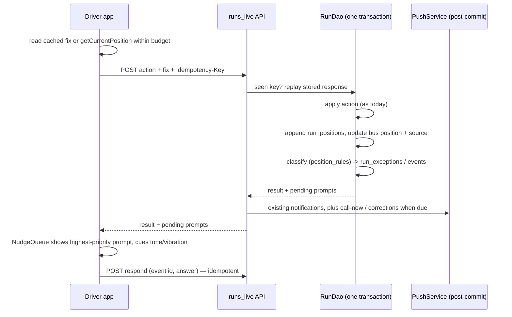
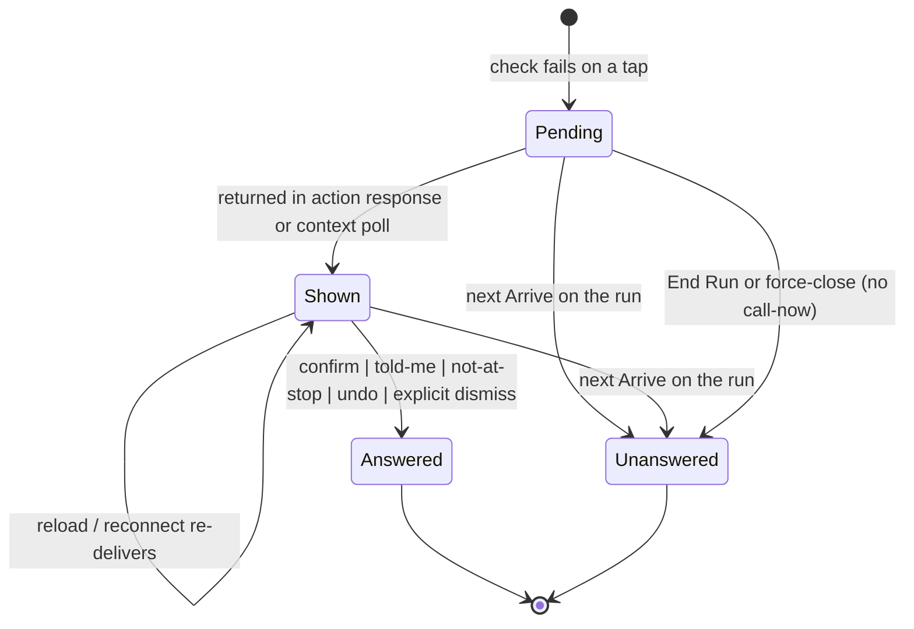
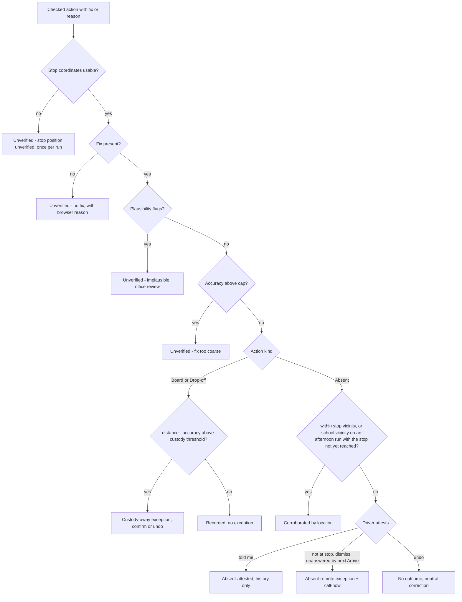
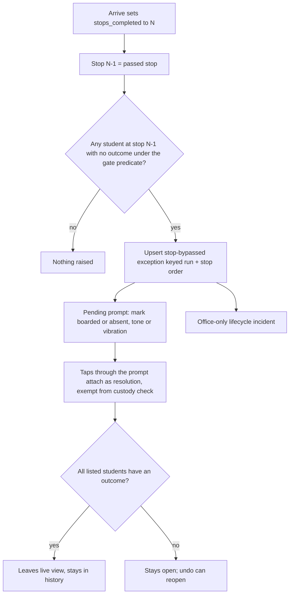
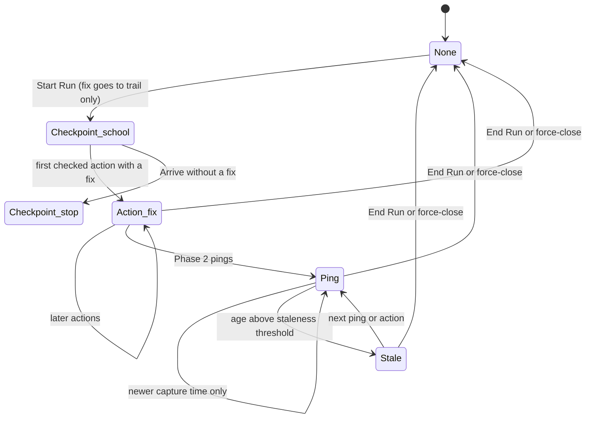

# feat: Phone GPS bus tracking with stop exceptions

## Summary

Attach a browser GPS fix to every driver run action, keep a per-run position trail and one source-stamped latest position per bus, and raise office-facing stop exceptions — custody taps away from the stop, stops bypassed on Arrive, remote absents classified by the driver's attestation, unverified checks — with server-owned prompts that never block a tap. Phase 2 adds interval pings, wake lock and trail-driven arrival/departure nudges, conditional on the hardware-tracker timeline. Delivery is four isolated releases: schema only, GPS-free checks and surfaces, fix capture and classification, then streaming.

---

## Problem Frame

The bus dot moves only when the driver taps, and the taps are self-reported: a child can be marked boarded from anywhere, a stop can be passed with nothing tapped, and a remote absent mark reaches the parent with no way to tell "sick, the parent phoned" from "skipped the stop". A regulation now requires GPS tracking on school buses; hardware trackers will meet it later, and the pilot schools need something now. The full frame, actors, flows and acceptance examples are in the origin document (see origin: `docs/brainstorms/2026-09-18-gps-bus-tracking-requirements.md`).

Research corrected four assumptions the origin made about the code, and this plan is built on the corrected picture: the fleet map already polls every five seconds; the parent Track page shows a "bus is live" badge but does not plot the bus; reversing a morning absent today writes a confirmed boarding and tells the family "they are on the bus"; and the standard absent notification already fires at tap time.

---

## Requirements

Origin requirements are carried by ID; wording amended during planning is marked. Plan-added requirements continue the numbering from R33.

**Position capture (Phase 1)**

| ID | What must be true after the work ships | Units |
|---|---|---|
| R1 | Every run action — Start Run, Arrive, Board, Drop-off, Absent, Hand-over, End Run — sends the phone's GPS fix taken at the tap. | U6, U7 |
| R2 | A fix carries coordinates, accuracy, capture time and the browser's error reason when absent; a tap waits at most the fix-wait budget (default 5 s) and completes regardless. | U6, U7 |
| R3 | Taps do not queue offline; the fix and its capture time are frozen at the first attempt and re-sent unchanged on retry. | U6, U7 |
| R4 | The first location prompt of a run is preceded by an in-app explainer; a real denial leaves a persistent, non-blocking indicator with unblock steps. | U6 |
| R5 | No position is requested or recorded outside a run in progress. | U6, U7 |
| R6 | Driver, admin and parent guides describe the active-run promise, the nudges and the new corrections before Release 3 reaches a driver. | U13 |

**Unified position (Phase 1)**

| ID | What must be true after the work ships | Units |
|---|---|---|
| R7 | One latest known position per bus with source (checkpoint, action, ping) and time; a new source joins without consumer changes. | U1, U7, U8 |
| R8 | An action's fix becomes the position; without a fix the planned-stop checkpoint is used as today. | U7 |
| R9 | Fleet map, provider view and parent Track page show the unified position with freshness; staff views show the source; the parent map plots the bus for the first time. | U8 |
| R10 | The fleet map refreshes while open. Already true at 5 s; the stale "never polls" comment is removed. | U5 |
| R11 | The current position clears at End Run or office close; nothing is current outside a run. | U7 |
| R12 | Every position is retained in the run's trail; rows older than the configurable retention (default 90 days, bounded 7–365) are purged by server receipt time in bounded batches after the next Start Run in that school and never served; coordinates copied onto exceptions older than retention are nulled in the same pass while kind, distance, responses and review state are kept; idempotency keys are purged after seven days. | U1, U7 |

**Stop exceptions (Phase 1)**

| ID | What must be true after the work ships | Units |
|---|---|---|
| R13 | A stop exception records run, stop, students, kind, the fix (denormalised), the driver's responses and its review state; kinds: custody-away, stop-bypassed, absent-remote, absent-attested (history only), unverified (with reason), no-gps (derived). Custody exceptions carry "bus seen at stop". One prompt is shown at a time, safety prompts first; a prompt is identified by its per-tap event, so two children at one stop are answered independently. | U1, U2, U3, U9, U10 |
| R14 | Custody-away: a Board or Drop-off whose distance less accuracy exceeds the threshold; confirm or undo; one exception per stop per run with later taps attached; resolution taps exempt. | U9 |
| R15 | Stop-bypassed: raised when an Arrive moves progress past a stop whose students have no outcome under the closure gate's own predicate; prompt with tone or vibration; resolution taps recorded on the exception; never triggered by Absent or Hand-over; GPS-free and shipped in Release 2. | U2, U3 |
| R16 | Absent classification, in this order: coarse or missing fix or stop without usable coordinates → unverified; within the stop's vicinity → corroborated; *amended:* on an afternoon run, within the school's vicinity while the child's stop is not yet reached → corroborated; otherwise remote, classified by attestation. | U10 |
| R17 | A remote absent is recorded immediately; the prompt offers told-me, not-at-stop, undo; told-me is attested (history, no live exception); not-at-stop, explicit dismiss, or a *shown* prompt left unanswered until the driver's next Arrive is uncorroborated (live exception); an unshown prompt stays pending; a prompt still pending at End Run or office close is recorded unanswered without call-now. | U3, U10 |
| R18 | *Amended:* today's absent notice still goes out at tap time; the call-now notice is an additional message, its own type, sent only for the uncorroborated class and at most once per child per run, recorded on the exception's event ledger; undo retracts the standard absent notice and sends the neutral correction, never call-now. | U10 |
| R19 | Off-route hand-over is never an exception. | U9 |
| R20 | Unverified applies to checked actions only (Board, Drop-off, Absent) with reason precedence stop-unverified > implausible > no-fix > too-coarse; "stop position unverified" is listed once per run; "no GPS for this run" and the GPS-off marker are derived from a run with actions and no fixes. | U8, U9, U10 |
| R21 | Exceptions appear on the live run view as they happen, stay with the run, can be marked reviewed by director or coordinator (audit row), and follow school scoping. | U1, U2, U4 |
| R22 | Parents never see exceptions. | U2, U8 |
| R23 | The tap completes before any prompt; every prompt outcome, including dismissal and unanswered, is a recorded value. | U3 |
| R31 | Vicinity radius and thresholds are configurable and tolerate accuracy and geocoding error. | U11 |
| R32 | A fix with anomalous accuracy or an implausible jump is flagged for office review and never clears a check. | U12 |

**Interval pings and real-time nudges (Phase 2, conditional)**

| ID | What must be true after the work ships | Units |
|---|---|---|
| R24 | Pings flow only while a run is in progress and the app is foregrounded; a ping never notifies a parent; the legacy proximity push is gone (removed in Release 2). | U5, U14 |
| R25 | Screen stays awake during an active run while the app is in the foreground, re-acquired on return. | U14 |
| R26 | Ping cadence and accuracy keep the pings themselves immaterial; the screen cost is measured in the field check; the interval is adjustable per school. | U11, U14 |
| R27 | A position older than the staleness threshold renders stale with "last seen" wording; never hidden during a run. | U8, U14 |
| R28 | Pings are accepted only for a run in progress, from its driver and from the auth session that started the run (server-stamped; a tapped action from a new session re-binds it); a client device id is diagnostic only; batches are capped and paced server-side. | U14 |
| R29 | Entering the vicinity of any not-yet-arrived stop with no Arrive offers a one-tap Arrive naming the stop. *Amended:* conditional on an interval trail source — ships with Release 4, or rides the tracker feed if Release 4 is skipped. | U15 |
| R30 | Leaving a stop's vicinity with outcomes missing prompts the driver; on the first exterior ping without resolution the bypassed-stop exception is raised. *Amended:* same condition as R29. | U15 |

**Plan-added**

| ID | What must be true after the work ships | Units |
|---|---|---|
| R33 | Every driver action carries a client-minted UUID key persisted on the device and scoped to (school, driver); a replayed key returns the original result with prompts re-derived; a mismatched payload or an in-flight duplicate answers a machine-readable conflict; a retried Arrive is a no-op when its expected stop order has passed. | U6, U7 |
| R34 | Prompts are server-owned: pending prompts are re-delivered through the driver context after reload or reconnect and auto-resolve as unanswered on the next Arrive, End Run or office close. | U3 |
| R35 | Undo of a morning absent or a boarding returns the child to no outcome; an afternoon undo restores the presumed boarding; the family receives one neutral correction. | U9, U10 |
| R36 | The Start Run fix is written to the trail but the served position stays at the school checkpoint until the first later fix. | U7 |
| R37 | Every parent reader — Track, the children list and the profile — resolves the bus through the run the child is on today and serves only lat, lng, time and staleness; never source, accuracy, speed or driver fix details. | U8 |
| R38 | Per-school thresholds — custody distance, vicinity radius, accuracy cap, retention days, ping interval — override system defaults within stated bounds, are editable in School Settings by staff, and every change is audited with old and new values. | U11 |
| R39 | The dormant driver position endpoint, its DAO writer, proximity push and settings are removed; the two distance helpers become one. | U5 |
| R40 | A subordinate failure — invalid fix, classification or exception write error — never fails a tap: the outcome, trail row, position and key commit, and the action is recorded unverified with the reason. | U7, U9, U10 |

---

## Key Technical Decisions

- **Fixes ride the existing action transaction, in two tiers.** Each driver action payload gains an optional fix and an `Idempotency-Key` header. The atomic core — the outcome write, the trail row, the five position columns and the key row — commits or rolls back together on the caller's scoped connection. Classification and every exception, event and lifecycle-incident write run in a nested transaction (a savepoint) on the same connection: a failure there rolls back to the savepoint, is logged with the action key, marks the trail row `classification-failed`, and the tap still commits with no prompt. Fix validation is lenient at the API boundary; an out-of-range or malformed fix becomes reason `invalid`, never a 422. Notifications fan out post-commit as today. *Why:* R23 and R40 make "the tap completes" a safety invariant; the pool's commit-on-exit is the only shape in which a crash at any instant leaves key and action consistent, and a prompt-side bug must never block a boarding.

- **Position and freshness are read-time derivations with one authority.** `live_buses` gains `position_source`, `position_at`, `position_accuracy_m` beside the existing `current_lat/lng`. A bus has a served position only when the pair is non-null; the three qualifiers describe the pair and are never read when it is null. Every writer of the pair writes all five columns in one statement — checkpoint writers set source `checkpoint`, time now, accuracy null; the fix writer sets source `action`, the capture time and the accuracy; End Run and force-close null all five. A non-null pair with a null source reads as a checkpoint of unknown age and is never rendered stale (the legacy-writer and rollback shape). Freshness, staleness, the GPS-off marker and "no GPS for this run" are one SQL fragment in `backend/app/dao/status_sql.py` consumed by every reader. *Why:* the platform has no scheduler; three readers with two resolution rules and a hand-written label would drift the moment the position stops being a stop.

- **Three new school-owned tables; exceptions carry their own fix for as long as retention allows.** `run_positions` (trail), `run_exceptions` with a child `run_exception_events` table for per-tap attachments, prompts and responses, and `driver_action_keys` for idempotency. Exceptions denormalise lat, lng, accuracy and capture time; the retention pass nulls those coordinates on exceptions older than the school's retention while keeping kind, distance, seen-at-stop, responses and review state. Open/closed status is derived at read time by one fragment used by the run report; list badges use the stored `reviewed_at` ("needs the office's eyes") so a runs list never recomputes outcomes across history. All run-child rows cascade with the run; the key table's run reference is set null so a replay after a run delete still short-circuits. *Why:* the trail is append-only and purgeable; exceptions are the decision record and must not become a permanent copy of an employee's location; undo reopens a bypassed stop without a second write path.

- **Prompts are server-owned and keyed by the tap.** The prompt is the `run_exception_events` row: it carries `prompt_state` (pending, answered, unanswered), `delivered_at` and the response; the exception derives "any pending". Pending prompts are returned, priority-ordered, in `GET /api/runs/driver/context`, which the app polls every 5 s, so a reload, reconnect or second device re-shows them; answers go to a respond endpoint keyed by event id that requires the caller's own open run (403 otherwise; 404 across schools via RLS), replays the same answer idempotently, and answers a different answer after answering, or any answer after auto-resolution, with a machine-readable conflict the client treats as "remove card, refresh". The client acknowledges display when a card mounts (a shown-at stamp on the event); a still-pending remote-absent prompt auto-resolves as unanswered on the next Arrive only if it was shown — an unshown prompt stays pending — and on End Run or force-close regardless; Board and Absent never auto-resolve anything. Bypassed-stop prompts are not auto-resolved by Arrive at all: a Board or Absent for a student listed on an open bypassed-stop exception of this run is recorded as its resolution and exempt from the custody check whether or not the card is still on screen, so a catch-up sequence never turns the late Boards into false custody prompts. The client renders one non-modal card at a time, in the shared driver layout so it is visible on every driver tab, from a queue keyed by event id; only the card's own dismiss dismisses. *Why:* the existing confirm dialog is a single-slot Promise that drops a prompt on reload and overwrites a second one; two children at one stop need independent answers; the safety-critical outcome cannot hinge on a lost client state or on poll lag.

- **Check ordering and geometry.** Every check runs the accuracy cap first (default 200 m; accuracy of 1000 m or more is treated as an approximate-location grant and also raises the driver banner), then `distance − accuracy` against the threshold (custody 150 m; vicinity 100 m to enter, 150 m to leave in Phase 2), else "within". Android reports accuracy at roughly the 68th percentile, not 95th, so the radii are generous by design and tunable per school. Anomalously good accuracy (zero, non-finite, identical across fixes) is the plausibility path, not "too coarse". *Why:* subtracting accuracy before capping lets a 900 m fix fake "within vicinity"; the field study for Nairobi shows reported accuracy poorly predicts real error.

- **Bypassed-stop reuses the closure gate's predicate.** The "no outcome" test is the per-stop factoring of `unaccounted_on_run` in `backend/app/dao/participation_dao.py` (participation rows, covering absences, cross-bus riders), keyed on (run, stop order). "Passed" is stop N−1 when an Arrive sets `stops_completed` to N; the last stop is covered by the End Run gate, not by an exception. *Why:* a bypass check that disagrees with the gate would flag cross-bus riders every day; catch-up Arrives and shared stops fall out naturally when the key is the stop order.

- **Remote-absent notifications are additive, decided in-transaction, delivered post-commit, at most once.** The standard absent notice fires at tap time as today; the call-now notice is a new type `absent-call-now` sent only for not-at-stop, explicit dismiss, or a prompt left unanswered until the next Arrive — never at End Run or force-close, where the closure gate already handles the child — and at most once per child per run, recorded on the exception's event ledger rather than relying on the notification row. The transaction that decides call-now stamps it due; the post-commit task stamps it sent; any later driver action or context poll on the run re-attempts due-but-unsent rows, so a Lambda timeout between commit and fan-out cannot lose it. Undo retracts the standard absent notice only and sends the existing correction, reworded neutrally; call-now is never retracted, so mark/undo cycles cannot re-arm it. Every action DAO returns the prompts it auto-resolved and the notifications now due, and routers fan out from that return value. *Why:* holding the standard notice until the prompt resolves needs a timer the platform does not have and would leave the parent uninformed when a phone dies mid-prompt; the loudest parent-facing message must be neither losable nor repeatable by the person whose tap it questions.

- **Undo is one path, defined per run type.** `reverse_own_action` gains a boarding arm (own confirmed boarding on this open run, no later drop-off or hand-over) and its morning absent arm changes from "write a confirmed boarding" to "clear to no outcome"; the afternoon arm keeps restoring the presumed boarding. The correction copy becomes neutral ("the mark was withdrawn; the driver will record what happens at the stop") and a `boarding-corrected` type retracts `student-boarded`. Both the prompt's undo and the boarding page's Undo button call this path. *Why:* the current morning behaviour manufactures an "on the bus" claim from a tap made kilometres away — the exact class of claim the status-lifecycle work removed — and the custody prompt's undo has no server path today.

- **Start Run fix is recorded, not served; parents read the run, not the home bus.** Start Run writes its fix to the trail but leaves the served position at the school checkpoint until the first later fix. The parent Track query resolves the bus through today's run that contains the child (run stop membership) rather than `live_students.bus_id`. *Why:* a run started from the driver's home must not put their home on every parent's map; cross-bus afternoon riders otherwise see the wrong bus.

- **Fix capture pattern.** While a run is in progress the app keeps one `watchPosition` (high accuracy) alive and reads the freshest cached fix at tap time when it is under 15 s old; otherwise it calls `getCurrentPosition` with the fix-wait budget and posts the action when the budget expires. The watch restarts on `visibilitychange`; nothing is sent to the server from the watch in Phase 1. Permission is requested inside the Start Run tap after the explainer, re-checked every run; the denied indicator keys off a real `PERMISSION_DENIED` error, not the Permissions API, which Safari and one-time grants make unreliable. *Why:* a cold fix at tap time is often hundreds of metres wide; the warm watch is the only way to make Phase 1 fixes usable without blocking the tap.

- **Idempotency.** The client mints one UUID per tap, persists it with the frozen fix in local storage, and re-sends it unchanged on retry. `driver_action_keys` is keyed (school, driver, key): the key row is inserted inside the action transaction right after the ownership checks with `on conflict do nothing` under a short lock timeout — no row returned means read the stored row, check the fingerprint and replay; a lock timeout answers `idempotency-in-flight` — and the response — the action result only; prompts are re-derived on replay — is written as the last statement before commit, so the key is never committed ahead of the action nor the response after it; a failed action rolls its key back and retries re-execute against the action's own guards. The request fingerprint covers driver, run, action, student and fix; a mismatch answers 409 `idempotency-mismatch` without the stored response, an in-flight duplicate 409 `idempotency-in-flight`, a malformed or missing header is treated as no key. Arrive carries `expected_stop_order` so a duplicate tap is a no-op while catch-up taps without it keep today's behaviour. Trail rows are unique on (run, action key) for action fixes and on (run, capture time) for pings — two Boards within the 15 s cache window legitimately share a capture time. Capture times in the future are stored with a clock-skew flag and excluded from the served position, never rejected. *Why:* every retry today is a re-tap, and Arrive is deliberately non-idempotent — without a key a slow network would double trail rows and re-fire nudges; scoping keys wider than the driver would make the table a per-school cache of children's data.

- **Legacy position path removed in Release 2; a ping is one insert.** The dormant position route, `write_position`, `notify_bus_position`, `remaining_student_stops` and the approaching-radius setting go in Release 2; `notify_bus_approaching` (stop-based, fired on Arrive) stays. The Phase 2 ping endpoint is a single trail insert with no background fan-out, bound to the auth session that started the run (`live_runs.started_session_id`, server-stamped; a tapped action from a new session re-binds it), capped per batch, paced server-side (a batch arriving while the run's newest trail row is younger than half the school's ping interval answers 429) and throttled per route in the API stage. *Why:* on this Lambda setup background tasks complete before the response returns and count against the 30 s ceiling; the account's concurrency floor is 10, so one looping phone could take every school's console down; a client-supplied device id travels with a shared PIN, the session does not.

- **Exceptions have their own table and view; the two loud kinds also raise office alerts.** A run-level exceptions panel on the run report, an `exception_count` badge (unreviewed, stored) on the Runs and Dashboard lists, and — for stop-bypassed and uncorroborated remote absents only — an office-only lifecycle incident written post-commit through the existing swallowing alert helper with dedup on run and stop, so a catch-up Arrive or a reopen does not re-alert. Staff list and review routes use `require_staff` (provider step-in passes as director); review writes an `exception-reviewed` audit row through the scoped audit helper with the exception id only. Drivers never receive `exception_count`. *Why:* the parent alerts filter excludes student-stamped incidents by convention only; a dedicated read path cannot leak to parents, while the two safety-critical kinds still reach the office's existing attention path.

- **Bounded purge after Start Run, keyed on server time.** Retention keys on `received_at` (server-stamped), never on the client's capture time. After the Start Run response is built, a background task wrapped like the lifecycle-alert helper takes `pg_try_advisory_xact_lock` for the school — try, never wait — and deletes one small batch (row cap and a two-second statement timeout stated in U7) on its own scoped connection so RLS confines it; the same pass nulls coordinates on exceptions and events older than retention and deletes idempotency keys older than seven days; locked, timed-out or failed means skipped and logged, never an error to the driver, and reads always filter by retention so a lagging purge is invisible. A school with no Start Run inside the retention window is purged on demand through a named action on the migrate Lambda (the verify Lambda is server-enforced read-only); the verify set reports trail rows past retention per school so the operator knows when to invoke it. *Why:* on this runtime "not in the transaction" still means "in the driver's wait"; only a per-invocation bound protects the tap, and a client clock must never decide deletion.

- **Four isolated releases, schema one ahead.** Release 1 is migration 016 alone; Release 2 the GPS-free bypassed-stop check, the nudge surface, exception surfaces and legacy removal; Release 3 fix capture, classification, maps and guides; Release 4 (Phase 2, conditional) pings and real-time nudges. Each release is its own branch and PR, certified at its own commit, deployed outside route hours, with the driver briefing as a named go/no-go on Release 3. *Why:* the API deploys before migrations run, so schema must land one release ahead; the status-lifecycle and fleet-plan rollouts established per-release certification and the briefing gate.

- **Phase 2 ping semantics.** Latest position is chosen by capture time, so a late older ping never overwrites a newer one; pings are bound to the auth session that started the run; vicinity uses enter and exit radii with two-fix hysteresis; the arrival offer fires on entering any not-yet-arrived stop and names it; the departure exception fires on the first exterior ping without resolution and otherwise falls back to the next Arrive. *Why:* one login is sometimes shared with an assistant; boundary flapping and out-of-order delivery are the documented failure modes of sparse trails.

---

## High-Level Technical Design

Directional guidance for review, not implementation specification.

**A tapped action with a fix (Phase 1).** One request, one transaction, prompts delivered by response and by the existing context poll.

**Prompt lifecycle.** Server-owned; the client only renders and answers.

**Classification of a checked action.** Runs inside the action transaction for Board, Drop-off and Absent; Start Run, Arrive, Hand-over and End Run only append to the trail.

**Bypassed-stop check on Arrive (GPS-free).**

**Bus position lifecycle.** States are derived from stored rows; the GPS-off marker and "no GPS for this run" are predicates over the trail, not stored states.

---

## Implementation Units

Units are grouped by release. Every release is its own branch and PR and is certified at its own commit with `scripts/certify.sh` before the next begins.

### Release 1 — schema only

### U1. Migration 016: trail, exceptions, idempotency, position source, school thresholds

- **Goal:** Land every schema change this feature needs, additive and idempotent, one release ahead of the code that writes to it.
- **Requirements:** R7, R12, R13, R21, R38 (schema half); enables R14–R20, R32–R37.
- **Dependencies:** Multi-tenant Release 5 deployed (migration 015 in production).
- **Files:** `backend/db/migrations/016_gps_tracking.sql`, `backend/app/core/tenancy.py`, `backend/tests/integration/test_rls.py`, `backend/tests/integration/conftest.py`, `frontend/tests/e2e/helpers.ts`, `backend/app/verify_handler.py`, `infra/scripts/verify-db.sh`, `backend/db/seeds/003_local_snapshot.sql`.
- **Approach:** File shape — lock and statement timeouts at the top (015's values); new-table DDL, indexes, composite FKs and policies first; every ALTER on an existing table last, one ALTER per hot table; no empty-database guard (016 has no data dependency — the FK target exists from 013), the `saferide_app`-missing raise kept; every statement idempotent because the Lambda applies the file as one transaction while local psql autocommits per statement. New tables — `run_positions` (school, run, bus, source in checkpoint/action/ping, action kind, action key, session id, device id, lat, lng, accuracy, captured_at, received_at, flags array for clock-skew, implausible and classification-failed; unique on run + action key for action rows and run + captured_at for pings; indexes run + received_at desc and school + received_at), `run_exceptions` (school, run, stop order, student, kind, reason, denormalised fix, distance, seen-at-stop, created, reviewed_at, reviewed_by; indexes run + kind and a partial school + run where unreviewed; partial unique per kind fixed in the DAO unit), `run_exception_events` (exception, school, run, student, action key, fix, distance, prompt_state, delivered_at, response, call_now_due_at, call_now_sent_at, created_at; partial index on run where pending; index exception + created_at), `driver_action_keys` (school + driver + key primary, run set null on delete, action, request fingerprint, response, created_at). Columns — `live_buses.position_source`, `position_at`, `position_accuracy_m`; `live_runs.started_session_id`; `live_schools.custody_threshold_m`, `vicinity_radius_m`, `fix_accuracy_cap_m`, `position_retention_days` (check 7–365), `ping_interval_s`, all nullable, no defaults, no constraint relating the position qualifiers to `current_lat/lng`. Constraints — widen `live_notifications` type by verbatim union with `absent-call-now`, `boarding-corrected`; `live_incidents` type with `stop-bypassed`, `absent-remote`; `live_admin_audit` action with `exception-reviewed`. Tenancy — `school_id NOT NULL`, composite FK to `live_runs (id, school_id)` `on delete cascade` for the three run-child tables (added `NOT VALID` then validated), `(school_id)` index, `school_isolation` policy under `saferide_app` on all four tables, registration in `SCHOOL_OWNED_TABLES`, the RLS test list, both hand-written teardown lists (run children before `live_runs`, keys before `live_schools`) and the e2e school-drop helper. Verify — a `gps` check set: trail rows per run today and per run per minute, fix coverage ratio, exceptions by kind, pending prompts older than one run, actions flagged classification-failed, call-now due-but-unsent older than ten minutes, trail rows past retention per school; the on-demand purge is a named event action on the migrate Lambda (`backend/app/migrate_handler.py`), which holds the writable connection. Seeds — extend the local snapshot tail with a few trail rows and one exception per kind.
- **Patterns to follow:** `backend/db/migrations/015_tenancy_constraints_rls.sql` (policy loop, NOT VALID FK), `010_status_lifecycle.sql` (CHECK widening as verbatim union), `SET LOCAL lock_timeout` / `statement_timeout` from 013–015, `_CHECK_SETS` in `backend/app/verify_handler.py`.
- **Test scenarios:**
  - Applying 016 twice on a database at 015 through psql is a no-op the second time (the Lambda never re-runs a marked file, so this rehearsal is the only double-apply exercise).
  - Applying 016 on an empty database before seeds leaves RLS enabled with the `school_isolation` policy on all four tables.
  - The tenancy catalog test passes with the four new tables listed everywhere it checks; sandbox teardown succeeds after a run that produced trail rows, exceptions, events and keys.
  - As `saferide_app` with the GUC armed for school A, rows for school B in each new table are invisible and un-insertable; with no GUC, every read is empty and every write fails.
  - `INSERT … RETURNING` on `run_exceptions` inside a scoped connection returns the row (policy covers freshly inserted rows).
  - The `gps` verify check set returns zero counts on a fresh database without error.
- **Verification:** Local reset applies 001–016 cleanly; `RUN_INTEGRATION=1 pytest tests/integration/test_rls.py` green; production go/no-go runs the `gps` check set through the verify Lambda.

### Release 2 — GPS-free checks and surfaces

### U2. Per-stop outcome predicate and the bypassed-stop exception

- **Goal:** Raise, resolve and expose stop-bypassed exceptions from the existing Arrive path, using the closure gate's definition of "no outcome".
- **Requirements:** R13, R15, R21, R22, R23 (server half); F3.
- **Dependencies:** U1.
- **Files:** `backend/app/dao/participation_dao.py`, `backend/app/dao/run_dao.py`, `backend/app/dao/exception_dao.py` (new), `backend/app/dao/incident_dao.py`, `backend/app/api/runs_live.py`, `backend/tests/scope_manifest.py`, `backend/tests/integration/test_run_exceptions.py` (new), `backend/tests/integration/test_driver_lifecycle.py`.
- **Approach:** Factor `unaccounted_on_run` into a per-stop helper that returns the unaccounted students for one stop order (participation rows, covering absences, cross-bus riders — the same arms as the gate). In `arrive_next_stop`, after progress moves to N, evaluate stop N−1 inside the savepoint tier; upsert one `run_exceptions` row keyed (run, stop order, kind) listing the students and insert one pending prompt event for this evaluation; the DAO returns the new prompt so the router raises the office-only `stop-bypassed` lifecycle incident post-commit through the swallowing alert helper, deduplicated on run and stop order so a catch-up Arrive or a reopen does not re-alert. Exception open/closed is derived at read time from current outcomes; prompts and responses live in `run_exception_events`. Staff endpoints: list exceptions for a run (joins derived status), mark reviewed (`require_staff`, writes `exception-reviewed` audit). The last stop is not checked (End Run gate owns it). Catch-up Arrives re-evaluate the same passed stop idempotently because the key is the stop order.
- **Execution note:** Implement the per-stop predicate test-first against the gate's existing cases so the two can never disagree.
- **Patterns to follow:** `end_run`'s use of `unaccounted_on_run`; refusal-episode keying from the status-lifecycle plan (one alert per composition); `IncidentDao.create_lifecycle_incident`; `record_audit` for the reviewed action.
- **Test scenarios:**
  - Covers AE5. Stop 4 has two students with no outcome; Arrive to stop 5 creates one exception listing both; marking one boarded and one absent closes it; the run report shows it resolved.
  - A student confirmed aboard a different run of the same period today is not listed (cross-bus rider).
  - Two rapid Arrives to the same last stop evaluate the same passed stop once (single exception row).
  - A stop with zero students raises nothing; the last stop raises nothing on End Run's path.
  - Undoing one of the resolving outcomes reopens the exception on read.
  - A coordinator at school A cannot list or review school B's exceptions (Covers AE10); the provider stepped into A can review.
  - Parents' track and alerts endpoints never include exception rows.
  - Route classification: the new staff routes are present in the scope manifest.
- **Verification:** Integration suite green; the run report for a seeded run lists the exception with derived status; `exception-reviewed` appears in the audit log.

### U3. Server-owned prompts and the driver nudge surface

- **Goal:** Deliver prompts that survive reload and reconnect, one at a time, with an explicit answer path and an attention cue.
- **Requirements:** R13 (one prompt at a time), R15 (prompt), R23, R34; F3, F4 (prompt halves).
- **Dependencies:** U2.
- **Files:** `backend/app/dao/run_dao.py` (`get_driver_context`), `backend/app/dao/exception_dao.py`, `backend/app/api/runs_live.py`, `frontend/src/features/driver/driverHooks.ts`, `frontend/src/features/driver/components/NudgeQueue.tsx` (new), `frontend/src/features/driver/components/useAttentionCue.ts` (new), `frontend/src/features/driver/DriverRunPage.tsx`, `frontend/src/features/driver/DriverBoardingPage.tsx`, `frontend/tests/unit/nudgeQueue.test.ts` (new), `frontend/tests/e2e/driver-nudges.spec.ts` (new), `backend/tests/integration/test_run_exceptions.py`.
- **Approach:** Driver context returns `pending_prompts` ordered by priority (bypassed stop and remote absent first, custody confirms after) with the event id, kind, copy inputs and allowed answers, stamps `delivered_at` on first return, and carries the block in the no-bus early-return shape too. A `respond` endpoint (driver scope; the event's run must be the caller's own open run — 403 otherwise, 404 across schools via RLS) records the answer on the event and flips its `prompt_state`; the same answer replays idempotently, a different answer after answering returns 409 `prompt-already-answered` with the recorded state, any answer after auto-resolution returns 409 `prompt-resolved`, and the client treats both as remove-card-and-refresh. The card mount posts a shown-at acknowledgement; Arrive marks shown remote-absent prompts unanswered (unshown ones stay pending), End Run and force-close mark every pending prompt unanswered, bypassed-stop prompts are never auto-resolved by Arrive, and Board, Drop-off and Absent auto-resolve nothing. The client keeps a queue keyed by event id fed from both the action response and the context poll, renders one non-modal card above the page content in the shared driver mobile layout (visible from Home, Run, Board and Incident), and only the card's own dismiss control dismisses. The attention cue plays a short tone through an audio element unlocked on the Start Run tap and vibrates where the API exists; the custody confirm is silent. Resolution shortcuts on the bypassed-stop card call the normal boarding and absent endpoints with the event id so the server records them as resolution taps.
- **Patterns to follow:** `useDriverContext` polling at `POLL_LIVE`; the existing `useConfirm` copy style for wording; `toast` for transient errors only.
- **Test scenarios:**
  - A pending prompt survives a page reload and reappears from the context poll.
  - Two prompts raised by one action show one at a time, safety prompt first.
  - Tapping outside the card does not dismiss it; the card's dismiss records `dismissed`.
  - Answering twice (double tap, retry) records one event.
  - A prompt left pending when the driver taps Arrive elsewhere is recorded as `unanswered`; a Board while it is pending leaves it pending.
  - Two browser contexts on one driver token: an answer on the first makes the second's stale-card tap a silent refresh, not an error.
  - The bypassed-stop card's "Mark boarded" resolves the exception and does not raise a custody exception (exemption asserted when U9 lands; placeholder assertion here).
  - Vibration and audio are spied via `addInitScript`; the safety prompt triggers both, the custody confirm neither.
- **Verification:** Playwright driver-nudges spec green on the seeded stack; the unit queue tests cover ordering and dedup by id.

### U4. Staff exception surfaces

- **Goal:** Show exceptions where the office already looks.
- **Requirements:** R21, R22, R6 (admin guide half).
- **Dependencies:** U2.
- **Files:** `backend/app/dao/run_dao.py` (`list_runs` flags), `frontend/src/features/admin/components/RunExceptionsPanel.tsx` (new), `frontend/src/features/admin/RunsPage.tsx`, `frontend/src/features/admin/DashboardPage.tsx`, `frontend/src/features/admin/components/RunFlagBadges.tsx`, `frontend/src/features/admin/AlertsPage.tsx`, `frontend/src/lib/statusVocabulary.ts`, `frontend/src/lib/queries.ts`, `frontend/tests/unit/statusVocabulary.test.ts`, `docs/user-manual/admin-guide.md`.
- **Approach:** Add `exception_count` (unreviewed exceptions, from the stored `reviewed_at`, omitted for driver callers) to the runs list SQL beside `no_progress` and `stale`; a new flag badge on Runs and Dashboard rows; an exceptions panel in the run report dialog listing kind, stop, students, fix, distance, responses, derived open/closed status and a Reviewed control (director and coordinator). Extend the incident vocabulary with the two office-only lifecycle types and assert they are absent from the parent labels. Admin guide gains a "Stop exceptions" section.
- **Patterns to follow:** `RunFlagBadges` and the list SQL derived flags; `ADMIN_INCIDENT_LABEL` exhaustiveness test; `useSchoolKey` for all new queries.
- **Test scenarios:**
  - A run with one open exception shows the badge; reviewing it clears the open count but keeps the row in the panel.
  - The vocabulary exhaustiveness test fails until both new incident types have labels, and the parent-label test forbids them.
  - Dashboard and Runs rows agree on the count for the same run.
- **Verification:** `npm test` green; browser check of the run report on the seeded run.

### U5. Retire the dormant position path and unify the distance helper

- **Goal:** Remove the only unsourced writer of the bus position and its legacy parent push before any new source lands.
- **Requirements:** R10, R24 (removal half), R39.
- **Dependencies:** U1.
- **Files:** `backend/app/api/runs_live.py`, `backend/app/dao/run_dao.py` (`write_position`), `backend/app/services/push_service.py`, `backend/app/dao/push_dao.py`, `backend/app/core/config.py`, `backend/app/services/geo_service.py`, `backend/tests/scope_manifest.py`, `backend/tests/services/test_push_service.py`, `frontend/src/lib/queries.ts`, `frontend/src/features/driver/DriverRunPage.tsx`.
- **Approach:** Delete the route, its manifest entry, `write_position`, `notify_bus_position`, `remaining_student_stops`, the `FakePushDao` mirror and the approaching-radius setting; keep `notify_bus_approaching` and fix its neighbour's stale docstring. Replace the four-float haversine in the push service with `geo_service.haversine_m`. Remove the "never polls" comment in the query hooks and the "device location must never become the bus position" comment on the run page.
- **Test scenarios:**
  - The scope manifest test passes with the route gone.
  - Push service unit tests still cover `notify_bus_approaching` end to end with the shared helper.
  - Test expectation for the comment removals: none — no behaviour change.
- **Verification:** Backend unit suite green; grep finds no `notify_bus_position` or second haversine.

### Release 3 — fix capture, classification, maps

### U6. Client fix capture, permission flow and the idempotent action envelope

- **Goal:** Give every tap a fix, a reason when there is none, and a key that makes retries safe.
- **Requirements:** R1, R2, R3, R4, R5, R33 (client half); F1, F5.
- **Dependencies:** U3.
- **Files:** `frontend/src/lib/geo/fixCapture.ts` (new), `frontend/src/lib/actionEnvelope.ts` (new), `frontend/src/lib/apiClient.ts`, `frontend/src/features/driver/DriverRunPage.tsx`, `frontend/src/features/driver/DriverBoardingPage.tsx`, `frontend/src/features/driver/components/LocationStatusBanner.tsx` (new), `frontend/tests/unit/fixCapture.test.ts` (new), `frontend/tests/unit/actionEnvelope.test.ts` (new), `frontend/tests/e2e/driver-gps.spec.ts` (new).
- **Approach:** `fixCapture` owns the run-scoped `watchPosition` (high accuracy, restarted on `visibilitychange`, tolerant of spurious unavailable errors), the cached-fix read with a 15 s freshness window, the bounded `getCurrentPosition` fallback using the fix-wait budget served by the driver context, and a normalised fix or reason (denied, unavailable, timeout, coarse). Start Run shows the explainer when permission state is unknown or prompt, then requests inside the tap. The banner shows after a real denial or after several fixes at 1000 m or more ("turn on precise location"), with unblock steps per platform. `actionEnvelope` mints a UUID per tap, freezes the fix and capture time, persists the envelope locally until acknowledged, adds `Idempotency-Key`, and re-sends unchanged on retry; on `idempotency-in-flight` it retries the same envelope after a short delay, on `idempotency-mismatch` it drops the envelope and surfaces the error, and it never re-mints on either; Arrive includes `expected_stop_order`. Nothing runs when no run is in progress.
- **Patterns to follow:** `apiClient` error shape; `useDriverContext` for config values; e2e helpers for driver sign-in and run purge.
- **Test scenarios:**
  - Covers AE1. With permission granted and an emulated fix, Arrive sends the fix with capture time and accuracy.
  - Covers AE2. With permission denied, Arrive sends reason `denied`, completes, and the banner appears; a later successful fix clears it.
  - With position unavailable, the action sends reason `unavailable` within the budget.
  - A cached fix older than 15 s is not used; a fresh one is.
  - A retried envelope carries the same key and the same fix; a new tap mints a new key; an in-flight conflict retries the same envelope and a mismatch drops it without re-minting.
  - The watch is not started before Start Run and is stopped at End Run (Covers AE12).
  - Reloading mid-run resumes the watch without a new permission prompt.
- **Verification:** Unit tests green; Playwright driver-gps spec green with per-spec geolocation overrides (denied via empty permissions, unavailable via null geolocation).

### U7. Server action envelope, trail append, unified position and bounded purge

- **Goal:** Accept the fix on every action, keep the trail, write the source-stamped position, and honour retention.
- **Requirements:** R1, R2, R3, R5, R7, R8, R11, R12, R33, R36; F1.
- **Dependencies:** U1, U6.
- **Files:** `backend/app/api/runs_live.py`, `backend/app/dao/run_dao.py`, `backend/app/dao/position_dao.py` (new), `backend/app/dao/idempotency_dao.py` (new), `backend/app/core/scope.py`, `backend/app/core/permissions.py`, `backend/app/core/config.py`, `backend/tests/core/test_scope.py`, `backend/tests/integration/test_gps_actions.py` (new), `backend/tests/services/test_position_rules.py` (new, validation cases).
- **Approach:** `SchoolScope` gains `session_id`, populated by the driver and staff scope resolvers from the authenticated user's session, so every action DAO keeps its `(scope, ...)` signature and can stamp `started_session_id` and the trail row's session. A shared fix model accepted leniently at the API boundary — an optional object whose malformed or out-of-range values become reason `invalid` inside `position_rules`, never a 422; an aware capture time in the future is stored with a clock-skew flag and excluded from the served position. Every action route reads the key header. Inside the action transaction the DAO runs the ownership checks, inserts the `(school, driver, key)` row with `on conflict do nothing` under a short lock timeout (no row returned → read the stored row, check the fingerprint, replay or answer 409 `idempotency-mismatch`; lock timeout → 409 `idempotency-in-flight`), executes the action, appends the trail row (source `action`, action kind, action key, session and device ids, flags), writes all five position columns in one statement — except Start Run, which writes the trail row, stamps `live_runs.started_session_id` and leaves the served position at the school checkpoint — runs the savepoint tier (U9, U10), and writes the response onto the key row as the last statement. Arrive with a stale `expected_stop_order` is a recorded no-op; Arrive without it keeps today's behaviour. End Run and force-close null the five position columns and mark pending prompts unanswered. After the Start Run response is built, a background task wrapped like the lifecycle-alert helper tries the per-school advisory lock and, if it gets it, deletes one batch of trail rows older than retention by `received_at` (batch cap 2,000 rows, two-second statement timeout, own scoped connection), nulls coordinates on exceptions and events older than retention, and deletes idempotency keys older than seven days; locked, timed-out or failed means skipped and logged. Reads filter by the retention period regardless.
- **Patterns to follow:** `require_driver_scope` + `safe_call`; one `get_connection(scope)` per DAO method with a nested transaction for the savepoint tier; the swallowing lifecycle-alert helper for the purge task; `SET LOCAL statement_timeout` per batch; Nairobi-safe predicates.
- **Test scenarios:**
  - Each of the seven actions with a fix appends exactly one trail row and writes the five position columns together; Start Run leaves the served position at the school and stamps the session.
  - An action without a fix leaves the checkpoint behaviour unchanged and writes source `checkpoint` (Covers AE2).
  - Two Boards within the 15 s cache window carry the same capture time and both commit.
  - Replaying the same key returns the original response and writes nothing new; a different payload under the same key answers `idempotency-mismatch`; two simultaneous requests with one key execute once and return identical responses; a key from another driver at the same school does not replay.
  - A duplicate Arrive with a passed `expected_stop_order` does not advance progress; catch-up Arrives without it still do.
  - A capture time in the future is stored flagged and never becomes the served position; a capture time minutes before receipt is kept as captured; a malformed fix records reason `invalid` and the tap completes.
  - End Run nulls all five position columns and marks pending prompts unanswered.
  - Purge deletes only that school's rows older than retention by receipt time, one batch per Start Run, nulls old exception coordinates and deletes week-old keys; a second Start Run during the purge skips without error; a slow purge does not delay the Start Run response beyond the task budget.
  - Date and retention predicates behave at 00:30 Nairobi (staged clock).
- **Verification:** Integration suite green; the `gps` verify check set reports trail rows and fix coverage for a seeded run.

### U8. Position read model: freshness derivation, fleet map, parent Track

- **Goal:** Every audience reads the same position with honest freshness; the parent map plots the bus for the first time.
- **Requirements:** R7, R9, R20 (derived no-GPS marker), R22, R27 (derivation half), R37; F5 (GPS-off marker).
- **Dependencies:** U7.
- **Files:** `backend/app/dao/status_sql.py`, `backend/app/dao/fleet_dao.py` (`list_buses`), `backend/app/dao/parent_live_dao.py` (`get_track`, `list_children`), `frontend/src/features/admin/FleetMapPage.tsx`, `frontend/src/features/parent/ParentTrackPage.tsx`, `frontend/src/features/parent/parentHooks.ts`, `frontend/src/components/map/MapPrimitives.tsx`, `frontend/tests/unit/positionFreshness.test.ts` (new), `backend/tests/integration/test_parent_track_position.py` (new), `frontend/tests/e2e/parent-track-position.spec.ts` (new).
- **Approach:** One position fragment in the shared status SQL — lat, lng, source, time, accuracy, age, `stale` (past the school's staleness threshold, default 90 s; never for a null source), `gps_off` and `no_gps_for_run` (a run inside retention with actions and no fix-bearing trail rows) — consumed by the staff bus list, the parent track query and the parent children and profile queries; the Python position-label loop is retired in favour of one label derived from source and stop. Fleet map: source and "updated X ago" in the info window, stale styling as a class toggle on the single marker glyph (never a conditional child), an accuracy circle capped at 300 m, GPS-off marker style. Parent surfaces: resolve the bus via today's in-progress run containing the child for Track, the children list and the profile; serve the allowlist lat, lng, time, stale only; plot one marker on Track with a persistent "updated X ago" label beside the badge, and give it the same stale dimming and "last seen X ago" wording as the fleet map glyph. Nairobi-safe date predicates for "today".
- **Patterns to follow:** bus-status derivation in `status_sql.py`; `AdvancedMarker` with stable `key`; `FitBounds` keyed on the bus-id set; `ParentScope` reads.
- **Test scenarios:**
  - Covers AE11. Fleet map reflects an Arrive fix within one poll with the tap time as freshness.
  - Covers AE13 (Phase 1 half). A position older than the threshold renders stale; a new fix clears it.
  - A run with three actions and no fixes derives `no_gps_for_run` and the GPS-off marker; the first fix clears both without a write.
  - A cross-bus afternoon rider's parent sees the bus of the run the child is on, not the home bus.
  - A parent with children at two schools sees each child's bus; a parent with no link to a run's school sees nothing (Covers AE10 spirit).
  - Parity: one seeded bus read through the staff list, parent track and parent children endpoints returns identical coordinates and time; source appears only on the staff payload; both parent payloads' key sets are asserted exactly, with no exception or accuracy fields.
  - Marker count stays stable across polls (no re-creation) when only positions change.
- **Verification:** Integration and e2e green; browser check of both maps on the seeded stack at mobile width for the parent page.

### U9. Custody check, board undo and the unverified class

- **Goal:** Flag Board and Drop-off taps made away from the stop, let the driver undo, and record every check that could not run.
- **Requirements:** R13, R14, R19, R20, R23, R35 (boarding half); F2, F5.
- **Dependencies:** U7, U3.
- **Files:** `backend/app/services/position_rules.py` (new), `backend/app/dao/run_dao.py` (`toggle_boarding`, `dropoff_student`, `reverse_own_action`), `backend/app/dao/exception_dao.py`, `backend/app/services/push_service.py`, `backend/tests/services/test_position_rules.py`, `backend/tests/services/test_push_service.py`, `backend/tests/integration/test_gps_actions.py`, `frontend/src/features/driver/DriverBoardingPage.tsx`, `frontend/tests/e2e/driver-gps.spec.ts`.
- **Approach:** `position_rules` is a pure module: accuracy cap → plausibility flags → distance less accuracy against the school's custody threshold, returning a classification and reason with precedence stop-unverified > implausible > no-fix > too-coarse. Board and Drop-off call it in the savepoint tier after the outcome is written; a far tap upserts the per-stop custody exception (or attaches an event to it) with a pending prompt event; stop coordinates come from `run_stops` for the child's assigned stop order; "bus seen at stop" is computed on read from any fix on the run within the vicinity radius, labelled "phone reported within N m of the stop" beside capture and receipt times in staff views, and is informational — it never clears or downgrades an exception. Any Board or Absent for a student listed on an open bypassed-stop exception of this run is recorded as that exception's resolution and skips the check — membership, not a card-supplied id, is the test — so catch-up sequences never produce false custody prompts; students not listed are checked normally. Hand-over never enters the check. Undo through the prompt calls `reverse_own_action`, which gains a boarding arm (own confirmed boarding, this open run, no later drop-off or hand-over) that clears the participation row, restores no outcome, records the exception event `retracted`, and sends `boarding-corrected` retracting `student-boarded`. Exception status is derived: open while any tap is unanswered, confirmed if any confirmed, retracted only if all retracted.
- **Execution note:** Write `position_rules` test-first; it is the core of the safety logic and has no I/O.
- **Patterns to follow:** `test_geo_service.py` style pure tests; `notify_correction` for the retraction shape; `toggle_boarding`'s stop-reached guard.
- **Test scenarios:**
  - Covers AE3. Board 1.8 km away after Arrive at the stop: one exception, confirm recorded, "fix within N m: yes".
  - Covers AE4. Board 60 m away: no exception.
  - Covers AE17. Accuracy 900 m: unverified too-coarse, no prompt.
  - Accuracy 900 m and distance 800 m does not classify as within (cap runs first).
  - Five children boarded far from one stop: one exception with five events, five prompts answered independently.
  - Undo on a far Board returns the child to no outcome, sends `boarding-corrected`, and the exception reads retracted when it was the only tap.
  - A resolution tap from a bypassed-stop prompt raises no custody exception; a tap referencing an exception that does not list this student is checked normally.
  - A forced classification error leaves the boarding committed, flags the trail row `classification-failed`, and shows no prompt.
  - Covers AE9. Hand-over 500 m away raises nothing.
  - A coordinate-less stop yields one "stop position unverified" per run, no per-tap prompts.
  - Un-boarding remains refused outside the undo path (stale-client guard intact).
- **Verification:** Unit and integration suites green; e2e custody flow green with emulated coordinates.

### U10. Absent classification, attestation prompt, call-now and neutral corrections

- **Goal:** Classify every absent mark, ask the driver the right question when it is remote, and send the right messages.
- **Requirements:** R13, R16, R17, R18, R20, R23, R35 (absent half); F4.
- **Dependencies:** U9.
- **Files:** `backend/app/services/position_rules.py`, `backend/app/dao/run_dao.py` (`mark_student_absent`, `reverse_own_action`), `backend/app/dao/exception_dao.py`, `backend/app/services/push_service.py`, `backend/app/dao/incident_dao.py`, `frontend/src/features/driver/components/NudgeQueue.tsx`, `frontend/src/lib/statusVocabulary.ts`, `backend/tests/services/test_position_rules.py`, `backend/tests/services/test_push_service.py`, `backend/tests/integration/test_gps_actions.py`, `frontend/tests/e2e/driver-gps.spec.ts`.
- **Approach:** After the absence is written and the standard notice queued as today, classify: unverified reasons first; corroborated when a parent or office absence already exists for the trip, when within the child's stop vicinity, or on an afternoon run within the school's vicinity while the child's stop order is beyond current progress; otherwise create an `absent-remote` exception with a pending three-way prompt. Told-me flips the kind to `absent-attested` (history only, no live row, no incident). Not-at-stop, explicit dismiss, or unanswered on the next Arrive keeps it uncorroborated: the deciding transaction stamps call-now due on the event (at most once per child per run), the post-commit task sends `absent-call-now` (own type, parent copy: marked absent away from the stop, call the office now if the child should be on the bus) and stamps it sent, any later action or context poll re-attempts due-but-unsent rows, and the router raises an office-only `absent-remote` lifecycle incident deduplicated on run and student. Unanswered at End Run or force-close records the state without call-now. Undo calls the reverse path: morning clears to no outcome, afternoon restores presumed boarding; the correction body becomes neutral, the retraction covers `student-absent` only, and call-now is never retracted; repeated remote absents on the same child attach to the same exception. Every action DAO returns the prompts it auto-resolved and the notifications now due.
- **Patterns to follow:** absence upsert precedence in `mark_student_absent`; `_notify` with run-scoped dedup; `notify_correction` retraction; `NOTIFICATION_LABEL` exhaustiveness.
- **Test scenarios:**
  - Covers AE6. Phoned-in absence marked from the road, told-me: attested, no live exception, standard notice only.
  - Covers AE7. Absent 3 km before the stop, not-at-stop: live exception, standard notice plus call-now, office incident.
  - Covers AE8. Absent within the stop's vicinity: corroborated, no prompt.
  - Covers AE16 (amended). Afternoon run, Arrive at the gate (stop 1), absent marked at the school for a child at stop 6: corroborated.
  - Explicit dismiss and unanswered-on-next-Arrive both send call-now once; a Board while the prompt is pending leaves it pending; End Run with a pending prompt sends nothing more.
  - Undo of a morning remote absent leaves no outcome and sends one neutral correction; the afternoon undo restores the presumed boarding.
  - Mark, not-at-stop, undo, mark again on the same child sends call-now once and attaches to one exception.
  - A forced failure between commit and fan-out leaves call-now due-but-unsent; the next context poll sends it exactly once.
  - An absent with a coarse fix at a coordinate-less stop records the stop-unverified reason once, not two prompts.
- **Verification:** Suites green; push service fake records the exact message types per scenario.

### U11. Per-school thresholds and School Settings

- **Goal:** Make every geometry and cadence knob adjustable per school without a release.
- **Requirements:** R26 (interval half), R31, R38.
- **Dependencies:** U1, U9.
- **Files:** `backend/app/core/config.py`, `backend/app/dao/fleet_dao.py` (`update_school`, resolver), `backend/app/api/fleet.py` (`SchoolPayload`), `backend/app/dao/run_dao.py` (`get_driver_context` config block), `frontend/src/features/admin/SchoolSettingsPage.tsx`, `backend/tests/integration/test_school_settings_thresholds.py` (new), `infra/backend/template.yaml`, `infra/scripts/deploy-backend.sh`.
- **Approach:** System defaults in `Settings` (custody 150 m, vicinity 100 m, accuracy cap 200 m, retention 90 days, staleness 90 s, ping interval 10 s, fix-wait budget 5 s), each env-overridable and threaded through the template and deploy script per the live-parity rule. A resolver returns the school's value or the default. Fields are bounded (retention 7–365 days, radii and thresholds 25–2,000 m, interval 5–60 s); a field omitted from the payload leaves the stored value and an explicit null clears it to the default, so an older Settings page cannot wipe them; every change is audited with old and new values. Settings page gains a "Tracking" card with the five per-school fields and their defaults shown; the driver context serves the resolved fix-wait budget, accuracy cap and ping interval so the client never hard-codes them.
- **Patterns to follow:** `resolve_gate_anchor` override-then-default; `SchoolPayload` explicit column list; `useSchoolSettings` invalidation.
- **Test scenarios:**
  - A school with a 300 m custody threshold does not flag a 250 m tap that a default school flags.
  - Clearing a field returns the school to the default.
  - The driver context reflects a changed fix-wait budget on the next poll.
  - Only staff can edit; the payload rejects values outside the bounds; an update without the tracking fields leaves them unchanged; the audit row for a threshold change carries old and new values.
- **Verification:** Integration green; browser check of the Settings card.

### U12. Plausibility safeguard

- **Goal:** Stop an implausible fix from clearing a check and give the office a second opinion.
- **Requirements:** R32, R20 (implausible reason).
- **Dependencies:** U9.
- **Files:** `backend/app/services/position_rules.py`, `backend/app/dao/position_dao.py`, `backend/app/dao/exception_dao.py`, `backend/tests/services/test_position_rules.py`, `backend/tests/integration/test_gps_actions.py`.
- **Approach:** Flags computed against the run's previous trail row and the run's planned stops: implied speed above 40 m/s or a jump over 1 km in under 30 s, accuracy of zero or non-finite, identical accuracy or identical coordinates across consecutive fixes, a fix within two metres of a planned stop coordinate, capture time skew beyond tolerance. Flags are stored on the trail row; a flagged fix classifies the action as unverified (implausible) so it neither raises nor clears a custody or vicinity check, and one "implausible movement" exception per run lists the flagged fixes for review. Flags never block the action.
- **Test scenarios:**
  - Two fixes 5 km apart 20 s apart flag the second; the custody check on that tap records unverified, not within.
  - Accuracy 0 flags; accuracy 25 m does not; a fix exactly at the planned stop coordinate flags, a fix 30 m away does not.
  - A single flagged fix creates one review exception; a second flagged fix attaches to it.
  - Flags are stored on the trail row and visible in the run's exception panel.
- **Verification:** Unit and integration green.

### U13. Guides, notification docs and the driver briefing gate

- **Goal:** Change every written promise the feature breaks, before a driver meets the feature.
- **Requirements:** R6, and the vocabulary convention that guides match shipped labels.
- **Dependencies:** U3, U9, U10 (final copy).
- **Files:** `docs/user-manual/driver-guide.md`, `docs/user-manual/admin-guide.md`, `docs/user-manual/parent-guide.md`, `docs/push-notifications.md`, `README.md`, `agent-implementation-instructions.md`, `frontend/tests/unit/manualVocabulary.test.ts`.
- **Approach:** Driver guide: replace "the app does not use your phone's GPS" and "never asks for location permission" with the active-run promise and the permission steps per platform; describe the three prompts and their answers; replace "there is still no un-board button" with the undo-within-prompt behaviour; keep "Absent is available whether or not you have arrived" and add the attestation question. Admin guide: exceptions panel, reviewed, thresholds card. Parent guide: bus marker and freshness, the call-now notice, the neutral correction. Push docs: the two new types. README: remove the stale offline-queue claim. Parent guide also says a deleted driver's past runs keep their trail until retention. Admin guide states that a fix corroborates and does not prove, and explains the "phone reported within N m" wording. Briefing: a one-page driver briefing checklist attached to the Release 3 go/no-go, delivered to the drivers by Kuumbai as the party that manages them and confirmed by Kuumbai with the school informed, before deploy, stating what is collected, when (runs only), who reads it, how long it is kept (the school's retention) and whom to ask — this text is the data-protection notice.
- **Test scenarios:** Test expectation: the manual-vocabulary test asserts the new labels appear in the guides; no other behaviour.
- **Verification:** Vocabulary test green; briefing checklist signed off in the Release 3 validation record.

### Release 4 — Phase 2 streaming (conditional on the tracker timeline)

### U14. Interval pings, wake lock and staleness

- **Goal:** Move the dot between stops while a run is active, honestly.
- **Requirements:** R24, R25, R26, R27, R28; F6.
- **Dependencies:** U8, U11; go/no-go against the hardware-tracker timeline.
- **Files:** `backend/app/api/runs_live.py`, `backend/app/dao/position_dao.py`, `frontend/src/features/driver/useRunPings.ts` (new), `frontend/src/features/driver/useWakeLock.ts` (new), `frontend/src/lib/geo/fixCapture.ts`, `frontend/src/features/driver/DriverRunPage.tsx`, `infra/backend/template.yaml`, `backend/tests/integration/test_pings.py` (new), `frontend/tests/unit/runPings.test.ts` (new), `frontend/tests/e2e/driver-pings.spec.ts` (new).
- **Approach:** A ping endpoint (driver scope, own in-progress run, `started_session_id` match — a mismatched session answers 409 and flags the run) accepts at most six fixes per batch with capture times inside the run's window plus skew, inserts them under the (run, capture time) key (duplicates dropped; the served position only moves forward in capture time), answers 429 when the run's newest trail row is younger than half the school's ping interval, caps the body size, and does nothing else — no background task. Route throttling and a stage default are added to the API template per the live-parity rule. The client posts the watch's fixes every ping interval while moving and every third interval while stationary, stops within one interval of End Run, close or backgrounding, and requests the wake lock on Start Run, re-acquiring on `visibilitychange`. Staleness rendering from U8 becomes prominent: dimmed marker and "last seen X ago" on every surface.
- **Patterns to follow:** U7's fix model; `refetchInterval` function form on the staff and parent polls; `require_driver_scope`.
- **Test scenarios:**
  - Covers AE13. Pings stop when the page is hidden (faked visibility) and resume on return; the label ages past the threshold and refreshes.
  - Covers AE15. A ping for an ended run is rejected; nothing changes.
  - Out-of-order pings never move the served position backwards; duplicates insert nothing.
  - A ping from a second session for the same run is rejected and flagged; a tapped action from the new session re-binds the run.
  - A batch over the cap, or arriving faster than half the interval, is rejected without inserting.
  - The endpoint schedules no background task (asserted via the push fake staying silent).
  - Wake lock request and release are observed through the init-script stub; `NotAllowedError` degrades to the on-screen hint.
- **Verification:** Suites green; field check records battery drain and screen-on willingness before the release go/no-go.

### U15. Arrival and departure nudges from the trail

- **Goal:** Catch a missed stop while the bus is still nearby.
- **Requirements:** R29, R30, R31; F7.
- **Dependencies:** U14, U2, U3.
- **Files:** `backend/app/dao/position_dao.py`, `backend/app/dao/exception_dao.py`, `backend/app/services/position_rules.py`, `backend/app/api/runs_live.py`, `backend/tests/services/test_position_rules.py`, `backend/tests/integration/test_pings.py`, `frontend/tests/e2e/driver-pings.spec.ts`.
- **Approach:** On each accepted ping batch, evaluate vicinity per not-yet-arrived stop order with enter and exit radii and two consecutive usable fixes: entering with no Arrive raises a pending arrival offer naming the stop (answer = Arrive with that stop order); leaving a stop whose students lack outcomes raises the departure prompt, and the first exterior ping without resolution upserts the same stop-bypassed exception U2 owns. Unusable fixes never change vicinity state. When pings stop, the next Arrive falls back to U2's check.
- **Test scenarios:**
  - Covers AE14. Enter stop 6, leave without an outcome for one child: prompt on the first exterior ping, exception before stop 7.
  - A single fix inside the radius does not enter; two do; a flapping fix at the boundary does not toggle.
  - Entering stop k+2 while stop k+1 is not arrived offers Arrive for k+2 by name.
  - A coarse or flagged ping does not change vicinity state.
  - Screen locked right after leaving: no exception until the next ping or Arrive, then exactly one.
- **Verification:** Suites green; the seeded route replayed through emulated pings produces the expected prompts.

---

## System-Wide Impact

- **Run-action contract.** Every driver action gains an optional fix and the key header; old clients without them keep working (fix null, no key, Arrive without `expected_stop_order` keeps its non-idempotent catch-up behaviour), so a partially rolled-out PWA and the e2e helpers never fail a tap. The response gains `pending_prompts`; the context poll gains `pending_prompts` and a `tracking` config block, present in the no-bus early-return shape too. Machine-readable conflict codes are added for idempotency mismatch, in-flight duplicate, prompt already answered and prompt resolved; the client branches on them and never shows them as error toasts.
- **Failure propagation on the new write path.** Outcome write: primary, fails only on its own guards. Trail row, five position columns, key row: atomic with the outcome. Classification, exception, event and incident writes: under a savepoint; on failure the tap commits, the trail row is flagged `classification-failed`, no prompt is shown, and the verify set counts it. Invalid fix: reason `invalid`, unverified, tap commits. Push fan-out: best-effort per parent as today; the call-now *decision* is durable and re-attempted. Purge: skipped and logged on lock, timeout or error. Respond on a foreign or missing exception: 403/404; late or conflicting answers: machine-readable 409, never an error to the driver.
- **DAO return contract.** Every action DAO (start, arrive, board, drop-off, absent, hand-over, reverse, end, force-close) returns the prompts it auto-resolved and the notifications now due; routers fan out from that value and never re-derive.
- **Parity.** Three readers expose position — the staff bus list, the parent track query and the parent children/profile queries — and all consume one position fragment in the shared status SQL; the hand-written Python position label is retired in favour of one label derived from the source; a parity test reads one seeded bus through all three and asserts identical coordinates and time, with source present only on the staff payload. Parent payloads are an allowlist: lat, lng, time, stale.
- **Prompt delivery coupling.** One login on two phones shows the same card on both until the next poll; an answer on one makes the other's tap a silent refresh. Auto-resolution happens only on Arrive, End Run and force-close, so poll lag cannot turn a phoned-in absence into a call-now during a boarding burst.
- **Four signals about one bus.** The office now sees `no_progress` (15 minutes without an Arrive), office-set `delayed`, stop-bypassed exceptions (a specific passed stop) and, in Phase 2, departure prompts. They are different facts and stay separate; surfaces render them side by side and never collapse one into another.
- **Notifications.** Two new types and one reworded correction; dedup remains per (parent, run, student, type); call-now is additionally capped once per child per run on the exception ledger. `notify_bus_approaching` is unchanged; `notify_bus_position` is gone.
- **Reverse semantics change.** Morning undo of an absent no longer produces a confirmed boarding; any code or copy assuming that ("They are on the bus") must be found and updated in U10.
- **Tenancy and deletion.** Three run-child tables and one key table join the RLS catalog; all reads go through scoped connections; the parent read spans a school set; provider access follows the director matrix while stepped in. Run-child rows cascade with the run, so `delete_run`, the e2e run purge and the conftest purge keep working; the key table's run reference is set null; both hand-written school-teardown lists gain the four tables in dependency order.
- **Lambda budget per action.** Response time is DAO plus every background task the action dispatches (push fan-out, lifecycle incident, purge batch) and must stay well inside the 30 s ceiling; today's baseline is parents polling three endpoints at 5 s, the fleet map and driver context at 5 s and admin lists at 15 s; Phase 2 pings add a per-driver stream against a concurrency floor of 10, so Release 4 states interval, batch cap and route throttling with that baseline in view. Trail volume at 10 buses is under half a gigabyte a year; retention keeps it bounded.
- **Nairobi clock.** New "today" and retention predicates convert both sides and ship with a staged 00:00–03:00 test, as the house rule requires; the GPS-off and no-GPS derivations apply only to runs inside retention so a run does not flip to "no GPS" the day its trail ages out.

---

## Risks and Dependencies

- **Driver location is personal data.** The trail links a fix to an identifiable employee through the run's driver. *Mitigation:* no endpoint in this feature returns raw trail rows — the only exposures are the served bus position and the fix on an exception (staff and stepped-in provider only); coordinates are nulled on exceptions past retention and the trail is purged by server time, with an on-demand purge for schools that stop running; no log line, audit detail, incident description or push body carries coordinates or accuracy, asserted in tests; the driver briefing and guide state what is collected, when (runs only), who reads it, how long it is kept and whom to ask — that text is the Data Protection Act notice and its sign-off sits on the Release 3 go/no-go; a deleted driver's runs keep their trail until retention with the driver reference nulled, and the guide says so.
- **New endpoints inherit no guard by default.** *Mitigation, pinned per route:* respond and pings use the driver scope plus the run's own-driver check; a Board or Absent tap is exempt from the custody check only when the referenced exception is open, belongs to this run and lists this student; staff list and review use the staff guard with a scoped audit row; threshold edits stay with staff but the audit detail carries old and new values and the fields are bounded; all new routes are classified in the scope manifest.
- **Migration 016 lock model.** The migrate Lambda applies the file as one transaction, so every ACCESS EXCLUSIVE lock (the CHECK widenings, the column additions on hot tables) is held to commit. *Mitigation:* lock and statement timeouts at the top of the file, new-table DDL first and hot-table ALTERs last, one ALTER per hot table, no empty-database guard copied from 015, the role-missing raise kept, deploy outside route hours; a failure on the Lambda rolls the whole file back with no marker and is resumed by re-invoking; a failed local psql rehearsal is half-applied and already marked — reset, never resume.
- **Multi-tenant sequencing.** Production is at migration 012; 013–015 exist only on the in-flight branch. Migration 016 depends on 015's scoping, so Release 1 cannot ship before tenancy Release 5, and after the second school exists no unscoped release may be deployed. *Mitigation:* state the dependency on the Release 1 go/no-go row.
- **Call-now re-arming and fabricated corroboration.** Mark/undo cycles could re-send the loudest parent message; fixes posted at the planned stop coordinates could read "seen at stop: yes". *Mitigation:* call-now once per child per run on the event ledger and never retracted; plausibility flags for a fix within two metres of a planned stop coordinate and for identical consecutive coordinates; the panel says "phone reported within N m" beside capture and receipt times, and the admin guide says a fix corroborates and does not prove.
- **Two parent readers expose position.** The children list and profile join the child's home bus today. *Mitigation:* both gated by run membership like Track, both served from the allowlist, both asserted in the parity test.
- **One looping client can exhaust the shared concurrency pool.** *Mitigation:* per-route throttling in the API stage (Release 4, live-parity rule), batch cap, capture-time window bound to the run, server-side pacing, request body cap, trail rows per run per minute in the verify set, and a synthetic ten-bus load run on the Release 4 go/no-go.
- **Accuracy semantics.** Android forwards a ~68th-percentile radius; approximate-location grants return kilometre-scale fixes with a successful callback. *Mitigation:* cap first, generous radii, per-school tuning, driver banner for approximate grants, thresholds reviewed after two weeks of pilot data.
- **Foreground-only tracking.** No browser tracks in the background; iOS suspends on screen lock; wake lock on iOS home-screen installs needs 18.4+. *Mitigation:* Phase 1 needs no background; Phase 2's success metric is measured over the whole run; the field check measures willingness to keep the screen on before Release 4.
- **Permission state is unreliable.** Safari reports blocked as prompt; Chrome one-time grants revert. *Mitigation:* the indicator keys off real denial errors; permission is re-checked each run; guides carry platform steps.
- **Catch-up Arrives.** Drivers catch progress up with rapid taps; each catch-up Arrive stamps the phone's position at catch-up time, so "fix within N m" reads no for stops passed that way. *Mitigation:* the label says what it measures; time-to-resolution on bypass exceptions distinguishes habit from misses.
- **Backend dependencies are unpinned** and the local and deployed FastAPI versions already differ. *Mitigation:* pin `backend/requirements.txt` to the versions the last SAM build resolved as part of Release 1's PR, and run the suites against them.
- **Demo Map ID.** The frontend uses a Google demo map id; advanced markers need a Cloud map id in production. Pre-existing; the parent marker makes it more visible. *Mitigation:* tracked under follow-up work, confirmed before Release 3.
- **RLS write pitfalls.** `INSERT … RETURNING` and background work without a scope fail closed. *Mitigation:* all writes on the caller's scoped connection; a no-GUC negative test per new table; no exception evaluation in background tasks.
- **Driver acceptance.** Every requirement adds prompts or permission asks for drivers on personal phones. *Mitigation:* the briefing gate, silent routine confirms, and the nine-in-ten fix-coverage criterion as the early-warning metric.

---

## Scope Boundaries

**Deferred for later** (carried from origin)

- Route-corridor deviation alerts — stop-level exceptions are in; corridor monitoring is not.
- Trail playback or a route-history view on the map.
- Pre-run staging visibility.
- Parent-facing arrival estimates.
- Speed monitoring.
- Hardware tracker integration — the feed is ready for it; the arrival and departure nudges (R29, R30) ride the tracker feed if Release 4 is skipped.

**Outside this feature's identity** (carried from origin)

- Compliance artefacts for the regulation: retention rules for inspectors, reports, device certification.
- The out-of-run position lifecycle a tracker brings.
- Disciplinary workflow.
- Tracking drivers outside a run.
- A native app.

### Deferred to Follow-Up Work

- Replace the demo Google map id with a Cloud map id (pre-existing gap surfaced by the parent marker).
- Teach the parent Track page to prefer the active run's stop snapshot for the route line (the fleet-plan follow-up); this plan fixes only the bus lookup.
- Collapse the derived bus state and the position-derived state into one vocabulary (deferred by the status-lifecycle work; this plan adds position fields beside it without merging).
- Re-centre planned stop coordinates from observed taps once a term of fixes exists.
- Capture "position is a read-time derivation over run-scoped facts" and the notification-timing decision in `docs/solutions/` after Release 3 ships.

---

## Open Questions

**Resolved during planning**

- Thresholds: custody 150 m, vicinity 100 m enter / 150 m exit, accuracy cap 200 m, approximate-grant banner at 1000 m, staleness 90 s, ping 10 s moving, retention 90 days — system defaults, per-school overrides (U11).
- Exceptions live in their own table with a run-level view; the two safety-critical kinds also raise office-only lifecycle incidents (U2, U4).
- Nudges are delivered by a dedicated non-modal queue fed from the action response and the context poll; explicit dismiss only (U3).
- The location explainer lives at Start Run, re-checked every run (U6).
- Offline: taps do not queue; the fix is frozen at first attempt and replayed under an idempotency key (U6, U7).
- Indexes: trail (run, received_at desc), (school, received_at) for the purge, unique (run, action key) for action rows and (run, capture time) for pings; exceptions (run, kind), partial (school, run) where unreviewed for the badge; events partial (run) where pending for the context poll and the auto-resolve update, plus (exception, created_at) (U1).
- Threshold edits stay with staff (director and coordinator) because both edit school settings today; the audit row carries old and new values so a silenced check is always visible (U11).

**Deferred to implementation**

- Partial-unique shapes per exception kind once the DAO is written.
- The precise prompt copy per platform for the unblock steps, and the tone asset.
- Whether the accuracy circle on the staff map earns its place after the first field check.
- Ping batch size once Release 4's measured request rates are known.
- The audio unlock element versus Web Audio on iOS after the field check.

---

## Documentation and Operational Notes

- **Releases and gates.** Release 1: 016 only; go/no-go = tenancy Release 5 live, double-apply rehearsal, `gps` verify set clean, requirements pinned. Release 2: bypassed-stop check, prompts, surfaces, legacy removal; go/no-go = certify green at the release commit, seeded run walk-through in the browser. Release 3: fix capture and classification; go/no-go = driver briefing delivered and confirmed by Kuumbai (school informed), guides updated, field check on two representative Android phones (permission flow, fix quality on a real route, fix-wait budget, battery), deploy outside route hours. Release 4: pings; go/no-go = tracker timeline says more than the stated months away or not full coverage, measured battery drain and screen-on willingness, request-rate estimate against Lambda concurrency.
- **Post-deploy verification.** The `gps` verify check set through the verify Lambda after each release: trail rows per run, fix coverage ratio (nine in ten target after two weeks), exceptions by kind, pending prompts older than one run (should be zero).
- **Rollback.** Each release is code-only except Release 1; rolling back Release 2 or 3 leaves the tables in place and unused. 016 is rollback-neutral for older code by construction, and the Release 1 PR review checks four properties: every CHECK is a verbatim union; every new column on an existing table is nullable with no default; no constraint relates the new position qualifiers to `current_lat/lng`; RLS and composite FKs touch new tables only. Rolling Release 3 back to Release 2 leaves qualifiers set on buses whose pair the old writer nulls; the read rule tolerates it and the next Release 3 deploy needs no repair. The `gps` verify set runs after the migrate Lambda, not with the API deploy.
- **Validation records.** One per release under `docs/validation/`, in the house shape, with the briefing checklist attached to Release 3.
- **Monitoring the first weeks.** Exceptions per completed run by kind, call-now count per week, unanswered-prompt count, and the fix-coverage ratio — reviewed before any threshold change.

---

## Sources and Research

- Origin: `docs/brainstorms/2026-09-18-gps-bus-tracking-requirements.md` — requirements, decisions, flows, acceptance examples; reviewed 2026-09-18.
- `backend/app/dao/run_dao.py` — action DAOs, position stamping and clearing, `reverse_own_action` (reverse-absent writes a boarding on morning runs), non-idempotent Arrive; `backend/app/dao/participation_dao.py` — `unaccounted_on_run` arms; `backend/app/dao/status_sql.py` — read-time derivation home; `backend/app/dao/parent_live_dao.py` — track joins the home bus.
- `backend/app/api/runs_live.py` — driver routes, dormant position route and its proximity push; `backend/app/services/push_service.py` — `_notify` dedup, correction shape, second haversine; `backend/db/migrations/015_tenancy_constraints_rls.sql` — policy loop and FK pattern; `backend/app/core/tenancy.py` — table catalog; `backend/app/verify_handler.py` — check sets.
- `frontend/src/features/driver/*`, `frontend/src/components/ui/confirm-dialog.tsx` — single-slot confirm; `frontend/src/lib/apiClient.ts` — driver routes exclude the school header; `frontend/src/features/admin/FleetMapPage.tsx` — already polls at 5 s; `frontend/src/features/parent/ParentTrackPage.tsx` — badge only; `frontend/playwright.config.ts` — geolocation granted globally.
- Prior plans and records: `docs/plans/2026-07-28-001-feat-status-lifecycle-consistency-plan.md` (releases, briefing gate, read-time derivation), `docs/plans/2026-08-23-001-feat-multi-tenant-schools-plan.md` (new-table tenancy kit), `docs/validation/2026-08-28-multi-tenant-local-implementation.md` (RETURNING under RLS), `docs/work/validation/2026-07-30-status-lifecycle-consistency.md` (Nairobi date defect), `docs/solutions/2026-07-07-pickup-time-is-morning-clock.md`.
- Web platform: W3C Geolocation (updates dropped while hidden; timeout excludes permission wait), MDN Geolocation / Permissions / Screen Wake Lock / Vibration / Page Visibility; Chromium Android location providers (high accuracy maps to GPS priority); Chrome approximate-location prompt (May 2026); Android geofencing guidance (100–150 m minimum radius, dwell); Nairobi geotracking field study (reported accuracy poorly predicts error); IETF Idempotency-Key draft and Stripe's idempotency semantics; Playwright emulation (geolocation, permissions, `setGeolocation(null)`, init-script stubs for wake lock and vibration).
- Detected versions: React 18.3, @tanstack/react-query 5.100, @vis.gl/react-google-maps 1.8 (marker re-created on child-count change; `Circle` available), Playwright 1.60, FastAPI 0.136 local vs 0.141 deployed, pydantic 2.13, psycopg 3.3, Postgres 16 without PostGIS, Mangum 0.21 (background tasks complete before the response returns).
